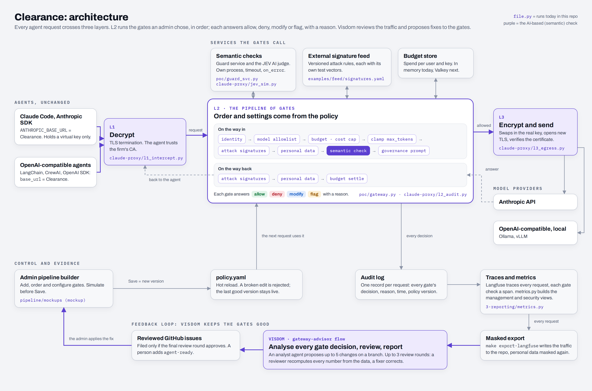

# 2 · Architecture and performance

*Source: [`architecture.html`](architecture.html). After editing it, re-render with `node 2-architecture/render.js` (needs Playwright).
Detailed flows: [request flow](../pipeline/diagrams/request-flow.png) ·
[restart traps after a rewrite](../pipeline/diagrams/restart-traps.png) ·
[parallel gate stages](../pipeline/diagrams/parallel-stages.png) · [both TLS sessions](../claude-proxy/README.md#2-two-tls-sessions-two-trust-chains).*

## Components

| Part | Process (port) | What it does | Code |
|---|---|---|---|
| **L1 · Decrypt** | `l1_intercept.py` (8443, HTTPS) | Terminates the agent's TLS with a certificate from the firm's CA. Records the TLS version and cipher, then gives L2 the plaintext with a fresh trace id | [`claude-proxy/l1_intercept.py`](../claude-proxy/l1_intercept.py) |
| **L2 · Gates, Claude traffic** | `l2_audit.py` (8601) | identity → model allowlist → worst-case cost and budget → AI judge → allow / flag / block. Settles the real cost after the answer. Writes one audit record | [`claude-proxy/l2_audit.py`](../claude-proxy/l2_audit.py) |
| **L2 · Gates, OpenAI-compatible traffic** | `gateway.py` (8080) | 8 request gates and 3 response gates, in the order the policy gives. Has a control plane (`/control/*`) and an audit log | [`poc/gateway.py`](../poc/gateway.py) |
| Semantic checks | `guard_svc.py` (9100), `jev_sim.py` (8602) | Risk score (0–1) and harm score (0–100 %) over HTTP. Both stand in for a model | [`poc/guard_svc.py`](../poc/guard_svc.py), [`claude-proxy/jev_sim.py`](../claude-proxy/jev_sim.py) |
| **L3 · Encrypt and send** | `l3_egress.py` (8603) | Swaps the virtual key for the real one (only L3 holds it). Opens a new TLS connection and verifies the provider's certificate | [`claude-proxy/l3_egress.py`](../claude-proxy/l3_egress.py) |
| Model providers | `mock_anthropic.py` (9443, HTTPS), `mock_llm.py` (9000), or the real API / Ollama | Offline stand-ins with the real API shapes, including streaming and `usage` | |
| Signature feed | file, outside the gateway | 21 versioned rules (serial 42, with an expiry date), each with positive and negative test vectors. The gateway compiles the 10 it can evaluate on chat traffic | [`examples/feed/signatures.yaml`](../examples/feed/signatures.yaml) |
| Policy | one YAML file per gateway | Re-read on the next request. A broken edit is rejected | [`poc/policy.yaml`](../poc/policy.yaml), [`claude-proxy/policy.yaml`](../claude-proxy/policy.yaml) |
| Admin builder | browser | Add, order and configure gates; Simulate; audit trail with Verify | [`pipeline/mockups/`](../pipeline/mockups/) (mockup) |
| Tracing | Langfuse (live build) | Every request, blocked ones included. Each gate check is a span next to the model call, with cost and tokens | live demo build |
| Masked export | `make export-langfuse` (live build) | Writes the traffic to `analytics/langfuse-export.json` in the repository, with personal data masked again | live demo build |
| **Visdom `gateway-advisor`** | a flow in the Visdom Orchestrator | An analyst agent proposes gate fixes; up to 3 review rounds check them; GitHub issues are filed only after approval. Runs outside the request path | [Visdom](https://visdom.virtuslab.com/) |

## One request, step by step

1. The agent sends its normal API call to Clearance with a virtual key. Nothing else changes in the agent.
2. **L1** decrypts the request and tags it with a trace id.
3. **L2** runs the request gates in order. A **deny** stops the line, and the agent gets an error in its own API's format that names the gate and the reason.
   A **modify** hands the rewritten request to the next gate. A **flag** lets it through and marks it for review.
4. **L3** swaps in the real key, re-encrypts, and checks the provider's certificate.
5. The answer runs through the **response gates**: exfiltration links stripped, personal data redacted, real cost charged. It then goes back through L1.
6. **One audit record** is written per request: every gate's decision and reason, the time taken, and the policy version.

Over many requests, the traces feed the loop in the diagram's bottom lane. Langfuse traces are exported with personal data
masked. Visdom's `gateway-advisor` flow analyses every gate decision and files reviewed GitHub issues, and the admin changes
the pipeline. The next request uses the new version. Details and the first run's findings are in
[`1-solution`](../1-solution/README.md#keeping-the-gates-good-the-visdom-feedback-loop).

## Design choices

| Choice | Why |
|---|---|
| Gates are separate services behind one small contract | Each scales on its own (the AI judge on GPU nodes, filters stay tiny). A crashing gate can't take the pipeline down. Any vendor's detector plugs in as a gate. Cheap gates can also run in-process under the same contract |
| Cheap deterministic gates first, the AI check last | A request a rule can deny never pays for a model call. Measured below: microseconds against model inference |
| Gate config travels in a JSON body, not HTTP headers | Tested: Polish characters in a header crash `httpx`, or arrive garbled. Proxies reject header lines over 8 KB ([`pipeline/contract.md`](../pipeline/contract.md)) |
| Fail closed by default, chosen per gate | A gate that is down or slow means deny. An admin can opt one gate into fail-open. Both prototypes and all three profiles are tested on this |
| Policy is data, re-read on the next request | Admins change behaviour in seconds without a restart. The last good version stays live if an edit is broken |
| Response gates as well as request gates | The model can leak too: personal data, exfiltration links, risky tool calls |
| The audit record is written by the runner, not by a gate | An admin cannot remove the log by editing the pipeline |
| A second system checks the gates | Rules drift as traffic changes. Visdom reviews real traffic outside the request path, so improving the gates never slows a request |

## Performance

Measured on an Intel Xeon @ 2.10 GHz with 4 vCPU, Python 3.11, and FastAPI + uvicorn (1 worker per service), all on localhost.
Script: [`perf/perf_enforcement.py`](perf/perf_enforcement.py) (~5 minutes). Raw output: [`perf/RESULTS.md`](perf/RESULTS.md).
**Re-run on the demo machine before quoting the numbers elsewhere.**

### Deterministic enforcement: microseconds

Each `poc/gateway.py` gate called in-process, 2,000 samples. Short prompt ≈ 90 characters; long prompt ≈ 4 KB.

| Gate | short p50 | short p95 | 4 KB p50 | 4 KB p95 |
|---|---|---|---|---|
| identity (`auth`) | <1 µs | <1 µs | <1 µs | <1 µs |
| model allowlist | 1 µs | 2 µs | 1 µs | 2 µs |
| budget | 1 µs | 1 µs | 1 µs | 1 µs |
| clamp `max_tokens` | 1 µs | 1 µs | 1 µs | 1 µs |
| attack signatures (10 feed rules) | 43 µs | 62 µs | 1.3 ms | 1.4 ms |
| personal data (4 entity types, checksums) | 22 µs | 31 µs | 549 µs | 580 µs |
| governance prompt | <1 µs | <1 µs | <1 µs | <1 µs |
| **all request gates except the semantic check** | **78 µs** | **105 µs** | **1.8 ms** | **1.9 ms** |
| response gates (strip exfil link + redact PII) | 35 µs | 50 µs | | |

Over HTTP, a request that a deterministic gate blocks costs **1.8 ms p50** through `poc/` and **1.5 ms p50** through `claude-proxy/` L2,
measured end to end as the client sees it, including the audit write (1,000 samples each).

### Non-deterministic (AI-based) enforcement: the model's time, plus one hop

| Measurement | p50 | p95 |
|---|---|---|
| Semantic check service over HTTP, one shared client | **1.6 ms** | 2.2 ms |
| The same, with a new HTTP client for each call (what both prototypes do today) | 39.7 ms | 53.7 ms |
| `claude-proxy/` L2, request allowed, AI judge **off** | 52.8 ms | 67.7 ms |
| `claude-proxy/` L2, request allowed, AI judge **on** (simulated 40–130 ms inference) | 222.4 ms | 245.7 ms |
| Full path: L1 → L2 → judge → L3 → provider (two TLS sessions) | 268.0 ms | 300.0 ms |

What this means:
- The AI-based check costs its **model inference time plus about 1.6 ms** for the hop. The judge here is simulated, so we don't quote a model latency.
  A real classifier or LLM judge will dominate the budget. That is why it runs **last**, and only on requests the cheap gates have already passed.
- In the prototypes, about **40 ms per hop is HTTP client set-up**, not enforcement. Each call opens a new `httpx` client, and that builds a TLS context.
  The same overhead appears in `poc/` end to end: allowed in 43.7 ms with deterministic gates only, 88.1 ms with the semantic service.
  Of that, the gates themselves take 78 µs. The fix is the first row below.

### On real traffic

Visdom's advisor measured the live demo build's gates on 59 real requests. The two AI-based checks took **99.4 % of all gate time**
(`classifier` 82.8 %, `jev_checker` 16.6 %); the three rule-based gates (`access`, `pii_filter`, `word_filter`) took the remaining 0.6 %.
That matches the measurements above, and it is why the AI checks run last. The advisor also proposed caching repeated prompts,
because 57 % of the classifier's time went to duplicates.

### Optimisations, with measured gains

| Change | Measured effect | Effort | Status |
|---|---|---|---|
| One shared HTTP client per process | per hop 39.7 → 1.6 ms (table above); 49.6 → 1.7 ms in [`pipeline/bench`](../pipeline/bench/RESULTS.md) | 15 min | next |
| Run read-only gates in parallel within a stage | 10 gates over HTTP: 26.3 → 13.2 ms ([`pipeline/bench`](../pipeline/bench/RESULTS.md)) | 1 h | designed |
| Run cheap gates in-process under the same contract | 0.02 ms vs 1.7 ms per gate ([`pipeline/bench`](../pipeline/bench/RESULTS.md)) | 1 h | designed |
| AI judge after the cheap gates | requests a rule blocks never pay for inference | | done |

## Scaling

- **Stateless layers.** L1, L2 and L3 hold no request state, so they scale out behind a load balancer. Each gate service scales on its own: the judge on GPU nodes, the filters as small CPU pods.
- **Shared state** sits outside the layers. Budgets and rate limits move from process memory to Valkey or Redis, with an atomic reservation per request (designed: [`pipeline/README.md`](../pipeline/README.md) §2, hole 6).
  The policy is a versioned file (or ConfigMap), and every audit record carries the version that decided it.
- **Overhead per request:** about 2 ms for the deterministic gates end to end, plus the AI check's inference time when it runs.
