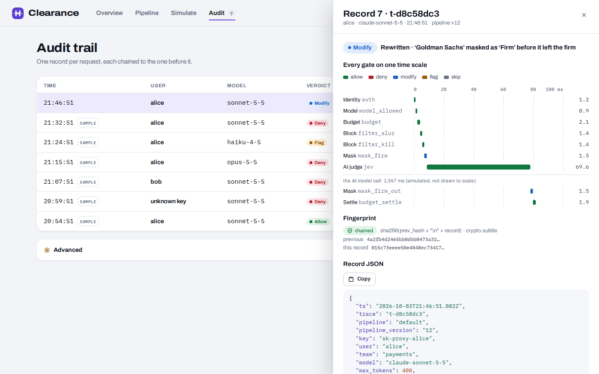
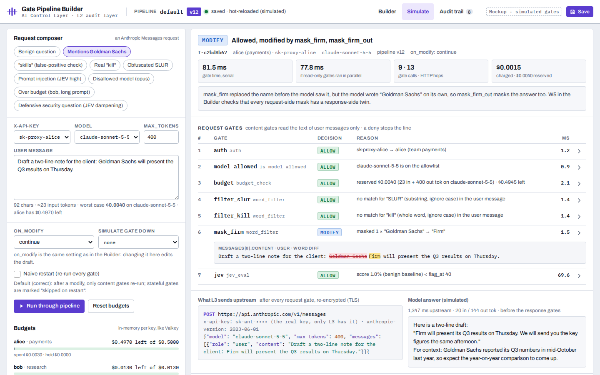
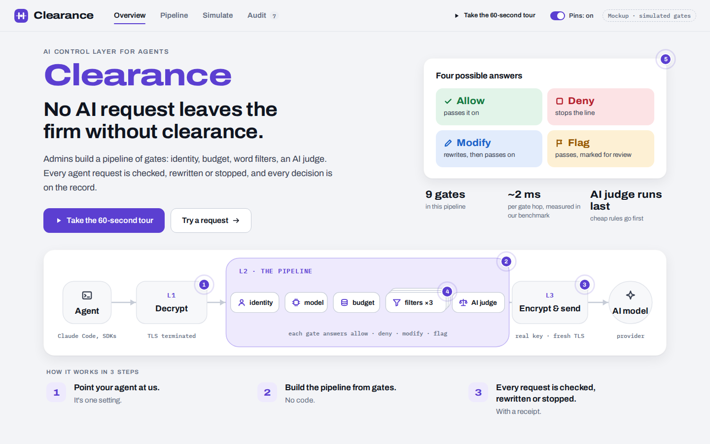
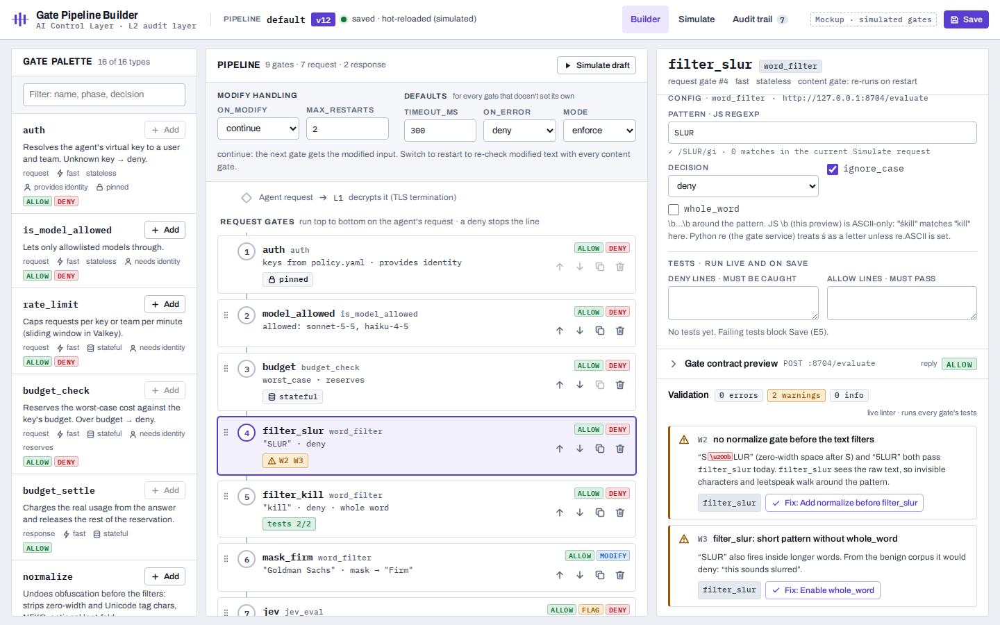

# 3 · Security reporting

Every request leaves **one audit record** with every gate's decision and reason. The records serve two audiences.
- **Management** sees volume, spend, block rate and latency.
- **Security** sees what was stopped and by which gate: attack-signature hits, personal data, flags to review, outages, and which policy version decided.

The admin dashboard (a mockup) shows both. The two prototypes write the records as JSON Lines, and
[`metrics.py`](metrics.py) turns real logs into both views.

## The dashboard

Interactive mockup, with gates simulated in the browser: [GitHub Pages](https://damianlech.github.io/HackYeah26/) (branch `page`), or open
[`pipeline/mockups/pipeline-builder.html`](../pipeline/mockups/pipeline-builder.html). Pins on every module explain what it does,
and **Take the 60-second tour** walks through it.

| Audit trail: one record open | Simulate: one request through the gates |
|---|---|
|  |  |
| Every gate's decision on one time scale. The record's SHA-256 fingerprint is chained to the one before; **Verify** re-checks the chain. The JSON names the pipeline version | The path lights up gate by gate, then the verdict, then what changed ("Goldman Sachs" → "Firm"). Budgets update |

| Overview | Pipeline builder |
|---|---|
|  |  |

## Metrics from real logs

```bash
python3 3-reporting/sample_traffic.py      # runs both prototypes with mixed traffic, writes sample/ and the report
python3 3-reporting/metrics.py --poc poc/audit.jsonl --proxy claude-proxy/.runtime/audit.jsonl   # your own logs
python3 3-reporting/metrics.py --json      # normalised records for a dashboard or a SIEM
```

Excerpt from [`sample/metrics-report.md`](sample/metrics-report.md). It was generated from the real logs in [`sample/`](sample/):
28 requests, 15 through `poc/` and 13 through `claude-proxy/`.

| For management | |
|---|---|
| Requests | 28 |
| Let through | 11 (39%), of which 6 rewritten and 2 flagged for review |
| Blocked | 17 (61%) |
| Spend, Claude traffic | $0.008276 |
| Tokens charged | 3,757 |

| For security: blocks by gate | Blocks | Example reason |
|---|---|---|
| AI judge (JEV) | 3 | `JEV 78.8% >= 70%` |
| semantic check (guard) | 2 | `score 0.90 vs threshold 0.7 ['ignore previous instructions', 'system prompt']` |
| model allowlist | 2 | `model 'ollama/qwen3:8b' not allowed for alice` |
| signatures SIG-0001 / SIG-0012 / SIG-0018 | 1 each | `SIG-0001 Invisible Unicode tag-character smuggling (prompt)` |
| a checker down, fail closed | 2 | `guard service unavailable (ConnectError), on_error=closed` |
| identity (unknown key) | 2 | `unknown or missing API key` |
| cost cap · budget · personal data | 1 each | `budget: $0.0068 + $0.0081 > $0.0130` |

The full report also has per-user activity, signature hits by rule and action, personal data by entity, the flagged-for-review list, and requests per policy version.

## Implemented metrics

| Metric | For | Comes from | Prototypes | Mockup |
|---|---|---|---|---|
| Requests by outcome: let through, rewritten, flagged, blocked, error | both | `decision` in each audit record | yes (`metrics.py`) | Audit tab |
| Block rate, and blocks per gate with the reason | both | `poc` findings, `claude-proxy` reason | yes | "Deciding gate" column |
| Spend per user and key (USD), from the provider's real usage, streams included | management | `claude-proxy` `cost_usd`, `/status` | yes | Budgets panel |
| Worst-case cost estimated before each call | management | `claude-proxy` `worst_case_usd` | yes | Simulate |
| Tokens charged per user, budget used | management | `poc` `budget_charge`, `/control/status` | yes | Budgets panel |
| Time in the proxy, p50 and p95; per-gate time | both | `ms` in each record | yes (per request) | per gate |
| Attack-signature hits by rule and action | security | `poc` `signatures` findings | yes | |
| Personal data by entity: redacted, blocked, seen | security | `poc` `pii` findings | yes | |
| Flags for review: AI-judge score and categories, monitor-mode gates | security | `jev`, `jev_categories`, `monitor` findings | yes | Audit tab |
| Requests refused because a checker was down (fail closed) | security | reasons and findings | yes | Simulate "break things" |
| Policy version behind every decision | security | `poc` `policy_sha` | yes (not yet in `claude-proxy`) | `pipeline_version` |
| Feed health: rules loaded, skipped, failed self-test; feed serial and expiry | security | `poc` `GET /control/status` | yes | |
| Last rejected policy edit | security | `poc` `GET /control/status` | yes | Health check |
| TLS version and cipher of the agent's connection | security | `claude-proxy` `l1_tls` | yes | |
| Trace across L1, L2, judge, L3 | security | `claude-proxy/.runtime/trace.jsonl` | yes | |
| Tamper evidence: hash chain and Verify | security | SHA-256 of previous hash + record | mockup only | Audit tab |
| Exports | security | JSONL (both prototypes), `metrics.py --json` | yes | JSONL, CSV |

In real time, every response also carries its decision in headers:
- `poc`: `X-Mandate-Decision`, `X-Mandate-Policy`, `X-Mandate-Event` (the audit id).
- `claude-proxy`: `x-proxy-decision`, `x-proxy-jev`, `x-proxy-cost-usd`.

## Two real audit records

From `poc/`: the model's answer leaked personal data and an exfiltration link, and both were removed on the way back:

```json
{"id": "evt_ec94f26791", "policy_sha": "487d974af7b2", "model": "mock/echo", "user": "alice",
 "decision": "modify", "status": 200, "ms": 88.1, "findings": [
  {"control": "auth", "action": "allow", "detail": "alice"},
  {"control": "clamp_max_tokens", "action": "modify", "detail": "max_tokens 4000 -> 256"},
  {"control": "guard", "action": "allow", "detail": "score 0.00 vs threshold 0.7 []"},
  {"control": "system_prompt", "action": "modify", "detail": "prepended governance system message"},
  {"control": "signatures", "action": "modify", "detail": "SIG-0002 Auto-fetched image or link exfiltration to a non-allowlisted host (response: evil.example)"},
  {"control": "pii", "action": "modify", "detail": "redacted 1x EMAIL in response"},
  {"control": "pii", "action": "modify", "detail": "redacted 1x PL_PESEL in response"},
  {"control": "pii", "action": "modify", "detail": "redacted 1x IBAN in response"},
  {"control": "budget_charge", "action": "allow", "detail": "+45 tokens, alice total 271"}]}
```

From `claude-proxy/`: a security-training question about ransomware was allowed but flagged for review:

```json
{"trace": "t-c2568ff4", "path": "/v1/messages", "l1_tls": "TLSv1.3 TLS_AES_256_GCM_SHA384", "user": "alice",
 "team": "payments", "model": "claude-sonnet-5-5", "max_tokens": 1024, "worst_case_usd": 0.010286,
 "jev": 43.2, "jev_categories": ["malware"], "decision": "flag", "cost_usd": 0.000594,
 "usage": {"input_tokens": 32, "output_tokens": 53}, "status": 200, "ms": 203}
```

Records hold decisions, reasons and counts. They never hold the prompt or the personal data itself.

## Endpoints

| Prototype | Endpoint | Returns |
|---|---|---|
| `poc` (8080) | `GET /control/status` | policy version, last rejected edit, pipeline, gate settings, feed report, budget used |
| | `GET /control/audit?n=20` | the latest audit records |
| | `PATCH /control/controls/{gate}`, `POST /control/budget/reset` | live changes, written back to `policy.yaml` |
| `claude-proxy` (8601) | `GET /status` | spend per key, judge thresholds, allowed models |

**Not done yet:** the mockup dashboard shows simulated data. Its record shape is close to the prototypes', and wiring
`metrics.py --json` into it is the next step. `claude-proxy` records don't carry a policy version yet. The hash chain exists only in the mockup.
