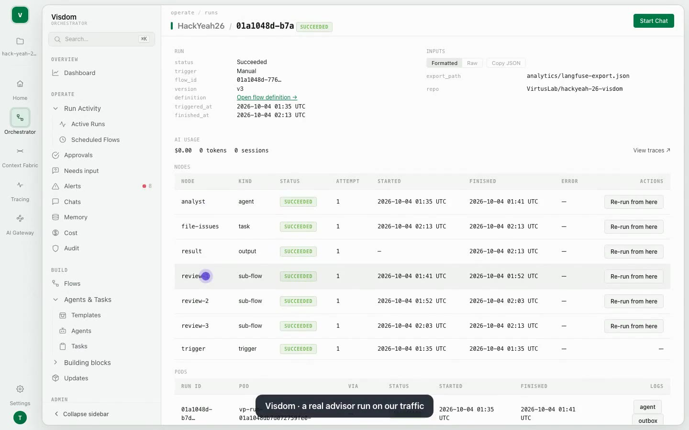

# 5 · Implementation

## The code

| Path | Language | Lines | What it is |
|---|---|---|---|
| [`claude-proxy/`](../claude-proxy/) | Python (FastAPI, stdlib `ssl`) | ~920 | **The 3-layer proxy for Claude traffic.** `l1_intercept.py` decrypts, `l2_audit.py` runs the gates, `l3_egress.py` swaps the key and re-encrypts. `jev_sim.py` is the simulated AI judge, `mock_anthropic.py` an offline API with real TLS. `demo.py` plays 13 scenarios with the official SDK. [README](../claude-proxy/README.md) |
| [`poc/`](../poc/) | Python (FastAPI) | ~530 | **The L2 gate pipeline for OpenAI-compatible traffic.** `gateway.py` runs 8 request and 3 response gates in policy order, with hot reload, a control plane and an audit log. `guard_svc.py` is the separate semantic-check service, `mock_llm.py` an echoing model. [README](../poc/README.md) · [walkthrough](../poc/WALKTHROUGH.md) |
| [`examples/feed/signatures.yaml`](../examples/feed/signatures.yaml) | YAML | 21 rules | The external attack-signature feed: serial, expiry, and test vectors per rule |
| [`1-solution/profiles/`](../1-solution/profiles/) | YAML | 3 files | Permissive, balanced and strict policies for the gateway |
| [`pipeline/contract.md`](../pipeline/contract.md), [`pipeline.example.yaml`](../pipeline/pipeline.example.yaml) | Markdown, YAML | | The target gate contract (JSON envelope in; allow / deny / modify / flag plus a reason out) and the target pipeline format |
| [`pipeline/mockups/pipeline-builder.html`](../pipeline/mockups/pipeline-builder.html) | HTML, CSS, JS | 3,900 | The admin pipeline builder and dashboard (mockup). It simulates 16 gate types in the browser with the same logic as the prototypes |
| [`pipeline/bench/`](../pipeline/bench/) | Python | ~100 | Gate-hop latency micro-benchmark |
| [`2-architecture/perf/`](../2-architecture/perf/) | Python | ~250 | Deterministic vs AI-based enforcement latency on the prototypes |
| [`3-reporting/`](../3-reporting/) | Python | ~220 | `metrics.py` (management and security metrics from audit logs) and `sample_traffic.py` |
| [`4-testing/`](../4-testing/), [`pipeline/mockups/tests/`](../pipeline/mockups/tests/) | Python (pytest), JS (Playwright) | ~1,100 | 76 + 120 automated checks |
| Live demo build | | | Demo chat, gateway with five gates, admin panel, Langfuse tracing, the masked export and the Visdom flow. It lives in the team's working repository, not in this one, and the demo video shows it end to end |

## Run it

Needs Python 3.11+ only. No API key and no network: every model is mocked unless you ask for the real API.

```bash
python3 -m venv .venv && . .venv/bin/activate
pip install -r 5-implementation/requirements.txt

python3 claude-proxy/demo.py               # 3-layer proxy: 13 scenarios, a trace through every layer
python3 claude-proxy/demo.py --live        # same, with L3 talking to the real api.anthropic.com (ANTHROPIC_API_KEY)
./poc/run.sh                               # gate pipeline on :8080 (terminal 1)
./poc/demo.sh                              # ten requests and live policy changes (terminal 2)
./4-testing/run_all.sh                     # every automated check
python3 3-reporting/sample_traffic.py      # real audit logs from both prototypes, then the metrics report
python3 2-architecture/perf/perf_enforcement.py   # latency, deterministic vs AI-based (~5 min)
```

Point a real agent at the 3-layer proxy: `python3 claude-proxy/demo.py --keep`, then in another terminal:

```bash
ANTHROPIC_BASE_URL=https://localhost:8443 NODE_EXTRA_CA_CERTS=claude-proxy/.runtime/certs/interception-ca.pem \
ANTHROPIC_API_KEY=sk-proxy-alice claude
```

## Built with Visdom

The live demo build closes its feedback loop with [Visdom](https://visdom.virtuslab.com/), VirtusLab's AI-native SDLC platform.
The loop works on exported traffic, outside the request path, so it adds no latency to any request.

| Piece | What it is |
|---|---|
| Tracing | The gateway sends every request to Langfuse: each gate check is a span next to the model call, with cost and tokens |
| Export | `make export-langfuse` writes `analytics/langfuse-export.json` and commits it to the repository, with personal data masked again |
| Flow | `gateway-advisor` (version 3) in the Visdom Orchestrator. Its inputs are the repository and the export path |
| Steps | trigger → `analyst` agent (Opus, at most 5 proposals, written to a branch) → up to three review sub-flows (a reviewer recomputes every number, a fixer on Sonnet corrects, and an approving round stops early) → `file-issues` task (`gh`, label `gateway-advisor`) |
| People | Nothing is filed without an approved review round. A person adds the `agent-ready` label before anyone acts on an issue |



## Deploying into existing agent ecosystems

The agent's code stays as it is. It gets a new base URL and a virtual key, and the network makes Clearance the only way out.

| Ecosystem | What changes | Notes |
|---|---|---|
| **Claude Code** | A managed `managed-settings.json` (below) sets `ANTHROPIC_BASE_URL` and a key helper. The firm's CA is trusted through `NODE_EXTRA_CA_CERTS` or the OS store | Rolled out by MDM. Users can't override managed settings |
| **Claude Agent SDK and Anthropic SDK apps** | `base_url` (or `ANTHROPIC_BASE_URL`) = Clearance, `api_key` = the virtual key | `claude-proxy/demo.py` does exactly this |
| **OpenAI-compatible frameworks**: OpenAI SDK, LangChain, LlamaIndex, CrewAI, AutoGen, OpenAI Agents SDK | the OpenAI-compatible base URL = Clearance `/v1`, the API key = the virtual key | `poc/` serves `/v1/chat/completions` and `/v1/models`, filtered to what the key may use |
| **Local models** (Ollama, vLLM) | add an upstream prefix in the policy, e.g. `ollama: http://ollama:11434/v1` | the same gates and budgets as commercial APIs |
| **Chat front-ends** (Open WebUI) | `OPENAI_API_BASE_URL` = Clearance | [`examples/agent-config/open-webui`](../examples/agent-config/open-webui/open-webui.env) |
| **MCP tool servers** | next: MCP servers behind Clearance; Claude Code's `allowManagedMcpServersOnly` keeps agents on them | designed ([`examples/agent-config/claude-code`](../examples/agent-config/claude-code/)), not built |

Claude Code, managed for every user. The file goes in `/Library/Application Support/ClaudeCode/` (macOS), `/etc/claude-code/` (Linux)
or `C:\Program Files\ClaudeCode\` (Windows). Keys were checked against the Claude Code docs on 2026-10-03; see [`examples/agent-config/claude-code/README.md`](../examples/agent-config/claude-code/README.md).

```json
{
  "env": { "ANTHROPIC_BASE_URL": "https://clearance.firm.internal" },
  "apiKeyHelper": "/usr/local/bin/clearance-token",
  "allowedProviders": ["customEndpoint"],
  "permissions": { "disableBypassPermissionsMode": "disable" }
}
```

- `apiKeyHelper` prints the user's virtual key (later, a short-lived token from the firm's SSO). Claude Code sends it as `X-Api-Key`, which L2 reads.
- `allowedProviders: ["customEndpoint"]` (Claude Code ≥ 2.1.285) refuses sessions pointed anywhere else.
- **Managed settings are convenience, not the security boundary**: a local admin can edit them. The boundary is the network.
  Agent hosts may reach only Clearance, and only L3 may reach model providers.

On **Kubernetes**:
- L1, L2 and L3 run as Deployments behind one Service, and each gate service is its own Deployment with its own autoscaling. The AI judge goes on a GPU node pool.
- The real provider keys are a Secret mounted only into L3.
- Budgets live in Valkey.
- The policy is a ConfigMap kept in Git: the gateways re-read it on change and keep the last good version.
- An egress NetworkPolicy lets agent namespaces reach only Clearance.
- Audit JSON Lines go to the SIEM through the cluster's log shipper.

## Implementation considerations

**Security of Clearance itself**
- *TLS.* L1 presents a certificate from the firm's CA, which the agent must trust. Clients that pin certificates can't be decrypted, and must be pointed at Clearance's own URL instead (they usually are).
- *Credentials.* Only L3 holds provider keys, and a test proves they never reach a log. Agents' virtual keys are plaintext in the policy today; next come hashed keys or SSO-issued tokens, with groups from LDAP or AD.
- *Gates.* Gates sit on an internal network with a bearer token per call (as specified in [`pipeline/contract.md`](../pipeline/contract.md)). Each gate gets only the fields it needs, and gates never log request bodies.
- *Logs.* Logs hold decisions, reasons and counts, not prompts or the personal data itself.

**Known limits of the prototypes, and the fix for each**

| Limit | Where | Fix |
|---|---|---|
| A new HTTP client per call: about 40 ms per hop, measured | both | one shared client per process (15 min): 1.6 ms per hop |
| Budgets live in process memory and are checked before being charged, so parallel requests can overspend and a restart forgets the spend | both | atomic reservation in Valkey; settle in `finally` so a deny never leaks a reservation |
| No streaming in `poc/` (it forces `stream: false`) | `poc` | stream, with the response gates run on the buffered answer (`claude-proxy` already handles SSE) |
| The semantic checks are stand-ins | `guard_svc.py`, `jev_sim.py` | a prompt-injection classifier and an LLM judge behind the same HTTP contract |
| Gates run in-process in `poc/`; only the semantic check is a service | `poc` | the gate runner over the JSON-envelope contract, one service per heavy gate |
| The hash-chained audit exists only in the mockup | | chain the records in the runner (SHA-256 of previous hash + record) |
| Writing the policy through the control plane drops YAML comments | `poc` | edit through the builder and keep the policy in Git |
| `claude-proxy/demo.py` needs `anthropic<1` (the 1.x SDK moved to `httpx2`) | demo only | pinned in `requirements.txt` |
| Tool calls (MCP) and agent-to-agent traffic are not governed yet | | an MCP entry point that runs the same gates; `tool_guard` on answers |

**Next, in order:**
1. Act on the advisor's first findings in the live build:
   - ID card and NIP numbers in `pii_filter`;
   - whole-word matching in `word_filter`;
   - an `output_guard` for answers, ported from `poc/`'s response gates;
   - caching in `classifier`.
2. Shared HTTP clients.
3. The gate runner over the contract, with the response phase and the restart guard.
4. Atomic budgets in Valkey.
5. Real semantic models in the prototypes (the live build already runs them).
6. The hash-chained audit, with the dashboard fed by `metrics.py --json`.
7. MCP and `tool_guard`.
