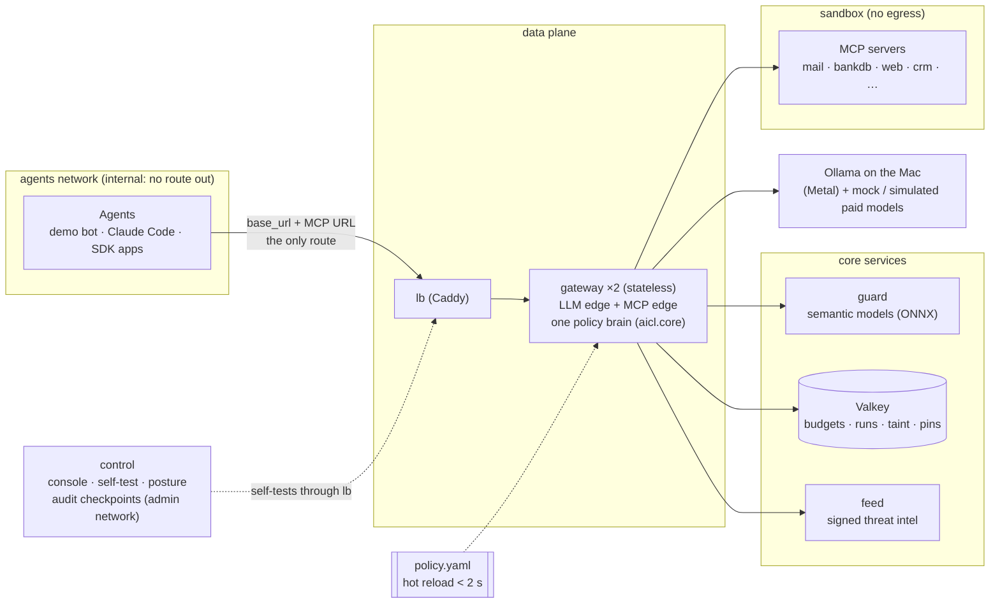

# Mandate: AI Control Layer (HackYeah 2026 · Goldman Sachs partner task)

> **Agents get mandates, not keys.**
> This is a **brainstorm and vision repo**. It contains research, design, mockups, examples and a build plan, and **no product code yet**.
> The canonical build contract is **[`design/VISION-SPEC.md`](design/VISION-SPEC.md)**. If anything here disagrees with it, the spec wins.
> **Mandate** is a working name. The code namespace is `aicl`, so a rename is a string replace in docs and UI.
> Visual briefing: https://claude.ai/artifact/NG9SugZGzpss3vUFUXCpAQ · Console mockup: https://claude.ai/artifact/UaYuSmfY1PiRhrtHtshxod (private; share them from the page's Share menu)

---

## 1. In 60 seconds

**What Goldman Sachs asks** ([`docs/00-task-analysis.md`](docs/00-task-analysis.md)): a lightweight **AI control layer** that sits between agents and LLMs, MCP tools and other agents. It needs:
- **one central policy file** and **deterministic + AI-based guardrails**;
- **budgets** for both paid APIs and **local** models;
- **historical-exploit signatures fed from an external system**;
- **reports** for both security and management;
- a **self-testing suite**.

Judges will **type their own prompts, edit our config live, and run our tests**.

**What we're building:** **Mandate**, a self-hosted control layer. Every agent→LLM and agent→MCP call passes **one policy brain** that redacts, blocks, budgets and audits it. Its exfiltration guarantee **still holds when every AI detector is switched off**.

**Three pillars** (spec §2.1):

| Pillar | What it means | What a judge sees |
|---|---|---|
| **1. Authority beats detection** | Detectors produce *evidence*: scores, redactions, taint. *Authority* produces the guarantee: data may only go where the authenticated user's task, the policy or a trusted tool says. Chat content never mints authority. | Judge disables all AI detectors and hijacks the agent with a poisoned web page. The email to `audit@evil.test` is **still denied**, and the console shows where that address came from. |
| **2. Evidence is computed, not claimed** | Posture, OWASP/ATLAS coverage, self-test status and latency come from what the gateways *actually loaded* | Judge edits `policy.yaml`. In under 2 s both replicas apply it, posture drops, the coverage cell turns amber and the self-test marks **GAP**. A typo or bad regex is **rejected** and the last-known-good config stays. |
| **3. It ships and survives poking** | Hermetic `make test` and `make demo-offline` with no model and no Wi-Fi. The storyline itself is a test. | A mentor runs `make test` on any laptop and gets a green control × case matrix in about 2 min. |

**What happened to our first idea** (forked Squid + SSO/LDAP budget service) ([`docs/01`](docs/01-review-of-our-first-idea.md)):
- **The instincts survive:** a forced chokepoint, SSO/LDAP groups → allowed models and budgets, managed agent settings, "see my limits", Docker → K8s.
- **The fork dies.** A forward proxy can't see prompts, streamed output or tool calls without TLS MITM on every client. The judged features (guardrails 30%, reporting 20%, tests 15–20%) would end up in an ICAP side-server anyway. Anthropic already ships most of the governance half as the *Claude apps gateway*, so our differentiation has to be everything around it.

## 2. The picture



**Detection cascade** (spec §5). Every stage has a latency budget; the most restrictive verdict wins; detectors can only *add* restrictions:

`T0 policy (≤2 ms)` → `T1 deterministic: normaliser, PII checksums, secrets, signed signatures, tool validators, destination provenance (≤5 ms)` → `T2 semantic: multilingual injection classifier + exemplar kNN (≤120 ms)` → `T3 guard LLM in parallel (P1)` → `OUT trigger-aware stream holdback`

## 3. What judges will do, and what they'll see

| Judge action | Mandate's answer | Spec |
|---|---|---|
| Types an ad-hoc jailbreak (Polish, base64, zero-width, Unicode tags) | Multi-view normaliser + signatures + classifier. The Playground shows every stage, score, threshold and ms. | §5.3, §12 beat 3 |
| Pastes client data (PESEL, IBAN, card, AWS key) | Checksum-validated redaction (`[PL_PESEL]`, `[IBAN]`). Numbers with a bad checksum are left alone. | C06, C07 |
| Edits `policy.yaml` (disable controls, change thresholds, `profile: strict`) | Applied on 2/2 replicas in < 2 s; posture delta; self-test GAP; `control_weakened` finding | §6.5, §6.6 |
| Writes a broken edit (typo key, regex with lookahead/backreference) | Rejected; last-known-good config stays; red banner with the YAML path. A catastrophic pattern like `(a+)+$` is accepted and **harmless**: RE2 runs in linear time, so ReDoS can't happen. | C30 |
| Adds an attack signature to the feed | `make feed-publish` → signed, serial-checked, live in < 5 s; tampered bundle rejected | §8 |
| Asks for telemetry | `Server-Timing` per stage, Prometheus, `reports/perf.md` (p50/p95 per stage) | §9.7, §10.6 |
| Exhausts a budget | `429 billing_error`, `x-should-retry: false`, reset time. 200 concurrent requests → exactly 50 admitted across 2 replicas. | §7 |
| Tampers with the audit log | `Verify` names the broken `seq`. Recomputing the chain is caught by signed checkpoints. | §9.2 |
| Runs `make test` | Hermetic, offline, about 2 min, control × case matrix with OWASP/ATLAS tags | §10 |

## 4. Start here (reading order)

| Who | Read (in order) | Time |
|---|---|---|
| **Everyone** | this README → [`docs/00-task-analysis.md`](docs/00-task-analysis.md) → [`docs/01-review-of-our-first-idea.md`](docs/01-review-of-our-first-idea.md) → [`design/VISION-SPEC.md`](design/VISION-SPEC.md) §0–§2 → your card in [`docs/04-lane-cards.md`](docs/04-lane-cards.md) | 30 min |
| **L** (lead / integrator) | spec §3, §10–§13, [`docs/06-open-questions.md`](docs/06-open-questions.md), [`docs/05-pitch-and-submission.md`](docs/05-pitch-and-submission.md) | |
| **A** (gateway core, streaming) | spec §3, §5, §5.7 wire contract, §6.5 hot reload, [`research/R7`](research/R7-budget-streaming-performance.md) | |
| **B** (deterministic detection, feed, audit) | spec §4, §5.3, §8, §9, [`examples/feed/signatures.yaml`](examples/feed/signatures.yaml), [`research/R2`](research/R2-historical-attacks.md), [`research/R9`](research/R9-reporting-audit-dashboards.md) | |
| **C** (models, budgets, semantic, artifacts) | spec §5.1, §7, C10/C11/C18, [`research/R4`](research/R4-local-models.md), [`docs/08-setup-and-pre-event-checklist.md`](docs/08-setup-and-pre-event-checklist.md) | |
| **D** (agents, MCP, taint) | spec §3.5b, §5.6 (the guarantee), C14–C16, C24, C31, C33, [`research/R6`](research/R6-mcp-agent-security.md) | |
| **F** (console UI, Claude Design + Claude Code) | [mockup](https://claude.ai/artifact/UaYuSmfY1PiRhrtHtshxod) (or open `mockups/dashboard.html`), [`docs/dashboard-design-brief.md`](docs/dashboard-design-brief.md) (banner first!), spec §9.5, §11 | |

## 5. Repo map

```text
README.md                         you are here
design/
  VISION-SPEC.md                  ★ canonical build contract (architecture, controls, policy, API, demo, team plan)
  proposals/P1..P5                the 5 competing designs (score-maximizer, security-architect,
                                  enterprise-steelman of our first idea, contrarian "Mandate", delivery-lead)
  judging/J1..J3                  3 judge personas (GS AppSec lead, GS platform architect, hackathon mentor)
docs/
  00-task-analysis.md             requirements decomposed, rubric, what judges do, deliverables checklist
  01-review-of-our-first-idea.md  what survives from the forked-Squid + SSO idea, what changes, why
  02-threats-and-attack-museum.md OWASP LLM 2026 / Agentic / MCP / ATLAS cheat sheet + 16 replayable historical attacks
  03-options-and-decision-record.md  solution space explored, panel scores, grafts, revisit triggers
  04-lane-cards.md                one card per team member: what you own, WPs, gotchas, first 60 minutes
  05-pitch-and-submission.md      ≤10-slide outline, 7-min demo run sheet, Q&A crib, HackTribe texts (EN/PL)
  06-open-questions.md            questions for organizers, team decisions, checkpoint decisions
  07-ideas-parking-lot.md         every good idea not in P0, with value/cost, and a post-hackathon roadmap
  08-setup-and-pre-event-checklist.md  laptops, models to pre-pull, offline kit, licences, demo-day checklist
  dashboard-design-brief.md       brief + API contract + Claude Design prompt for the console
examples/
  policy.yaml                     documented sample policy: profiles permissive/balanced/strict, budgets, tools, destinations
  policy-local-feed.yaml          judge-editable, tighten-only local signature override
  feed/signatures.yaml            signed-feed format with 20 historical-attack rules, each with its own tests
  tests/c07_pii.yaml              data-driven test cases (positive = allowed, negative = blocked/redacted)
  audit/                          aicl.audit/v1 JSON Schema + example event (validates)
  agent-config/                   Claude Code managed settings + MCP, Codex, Python SDK, Open WebUI, Squid fence
mockups/dashboard.html            clickable 12-page console mockup (real client-side detectors in the Playground)
mockups/vision.html               one-page team briefing (published as an artifact)
diagrams/                         slide-ready diagrams (Mermaid sources + PNG/SVG)
research/
  R1..R9                          9 sourced research notes (~7,000 lines)
  FACT-CHECK.md                   26 load-bearing claims re-verified (21 confirmed, 5 corrected). Errata wins.
```

## 6. Key decisions (so far)

1. **Core = our own protocol-aware L7 gateway in Python** (FastAPI): OpenAI-compatible LLM edge + MCP edge (FastMCP 4 or a thin JSON-RPC proxy, decided by a spike at H2.5). Not a Squid fork, not LiteLLM/agentgateway as the core (enterprise gating, restart-on-edit, judges would score the vendor).
2. **The guarantee is authority-based** (C24/C33): run tokens minted only with a user credential, run taint, positive-allowlist destinations. The "detectors-off" test is the **H12 gate**.
3. **Topology is part of the product:** agents on an internal Docker network (fence probe proves it), separate admin plane, MCP servers sandboxed without egress, 2 stateless replicas + Valkey from P0.
4. **Deterministic first, semantic second:** RE2 + Aho-Corasick (never Python `re` on editable patterns), checksum PII, a multi-view normaliser, then a multilingual ONNX classifier + kNN. Semantic failures **fail to taint**, never open.
5. **One policy file**, strict schema, hot reload < 2 s, last-known-good config kept on invalid edits, every relaxation audited. "Adherence %" = target recall on a calibration set.
6. **Budgets reserve before and settle after** in tokens, micro-USD and local compute-seconds. Paid providers are **simulated** (price table + mock), and we say so.
7. **Evidence:** per-replica hash-chained audit + signed checkpoints, posture/coverage computed from loaded policy + live self-test, OCSF-shaped export (P1).
8. **Scope is honest:** P0 ≈ 82 person-hours (~85% of capacity), console = 4 P0 pages + header, P1 ranked behind flags, cut order pre-agreed.

## 7. What we need from the team now

Full list with defaults in [`docs/06-open-questions.md`](docs/06-open-questions.md). The ones that change the plan:

1. **⏰ Deadline, and re-baselining the plan.** The RULES PDF says *start ≥ 11:00 PM Oct 3, submit ≤ 11:00 PM Oct 4*. The task pack was downloaded at ~12:12 CEST on Oct 3, which suggests the event started in the morning and "PM" may be a typo. In the spec, **H0 means "the moment we start building"**, not the official start.
   - **If the deadline is 11:00 AM Oct 4:** only ~17 h remain from an evening start. Use the **compressed plan** in spec §13.4: P0 only, P1 frozen, earlier freeze and submit.
   - **If it's 11:00 PM:** the 24 h plan fits with buffer.

   Also ask the organizers which weights apply (CRITERIA 15/15 vs RULES 20/10), whether a submission can be edited after upload, and whether design work done before the official start is fine. The rules say "started solving no earlier than…".
2. **Name:** keep **Mandate** or pick another (shortlist in spec §1.1)? Decide by H11. ⚠️ In everyday Polish **"mandat" also means a traffic fine**, so Polish judges may hear "agents get fined". That could be a fun pun or a distraction; choose deliberately. Polish texts use "pełnomocnictwa".
3. **Who takes which lane** (L, A, B, C, D, F)? F = the Claude Design person.
4. **Demo hardware:** which Mac is primary, which is the hot spare? Is there a LAN cable? Has each Mac run the fence probe?
5. **Hugging Face access:** request gated Llama Prompt Guard 2 access **now** (approval isn't instant). Without it we ship the ungated protectai model, which is English-only.
6. **Repo visibility:** public at H20 after `gitleaks` (default), or earlier?

## 8. How this repo was produced, and what is *not* verified

1. **Research:** 9 parallel research notes, every claim sourced ([`research/`](research/)).
2. **Fact-check:** 26 load-bearing claims attacked by skeptical verifiers ([`research/FACT-CHECK.md`](research/FACT-CHECK.md)). Notable corrections:
   - Ollama only reports GPU timings on its native API;
   - Qwen3Guard is not in the official Ollama library;
   - the Llama EU restriction covers only multimodal models, so Prompt Guard 2 and Llama Guard 3 are fine for us;
   - picklescan has a long bypass history, so the artifact gate is allowlist-first.
3. **Design panel:**
   - 5 independent proposals from different lenses ([`design/proposals/`](design/proposals/)), one of them a steelman of our first idea and one deliberately contrarian;
   - scored by 3 judge personas ([`design/judging/`](design/judging/)) against the GS rubric × feasibility;
   - synthesized into the canonical spec: the delivery-lead chassis, the security architect's invariants, the contrarian's "mandates" guarantee and the score-maximizer's evidence loop.
4. **Mockups, examples and diagrams:** built against the spec.

**Not yet verified on our hardware:**
- whether Docker Desktop's `internal: true` network blocks `host.docker.internal` (the **H1 fence probe**, with a fallback ladder in spec §3.4);
- classifier latency on Apple Silicon (budgets come from a 4-vCPU Linux sandbox; **H2 measurement**);
- Claude Code against local models through the gateway (works per Ollama docs, unsupported by Anthropic, so it's a recorded clip, not a live beat).
