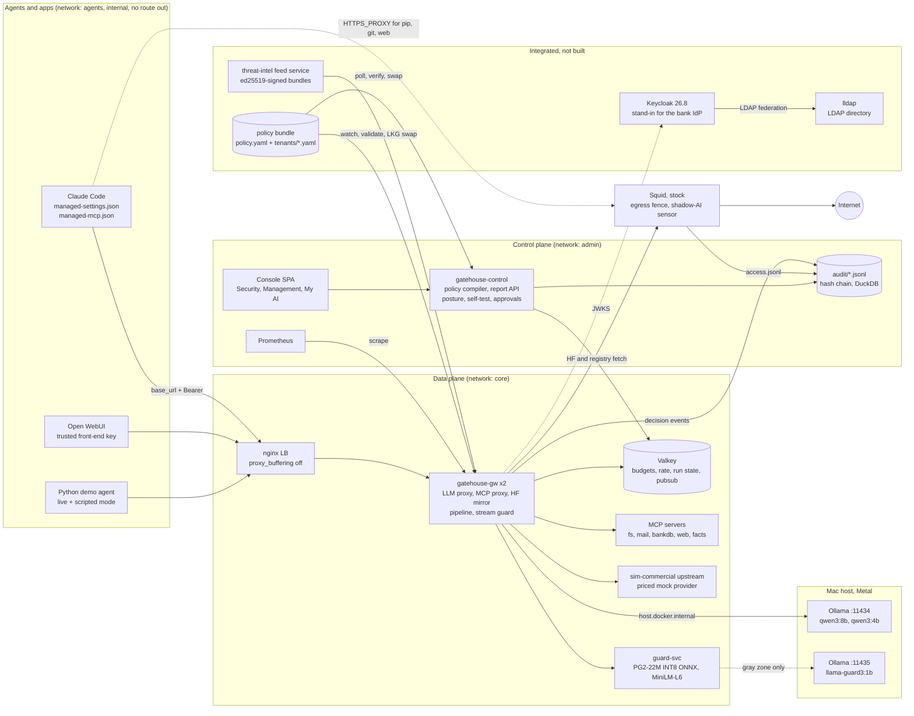
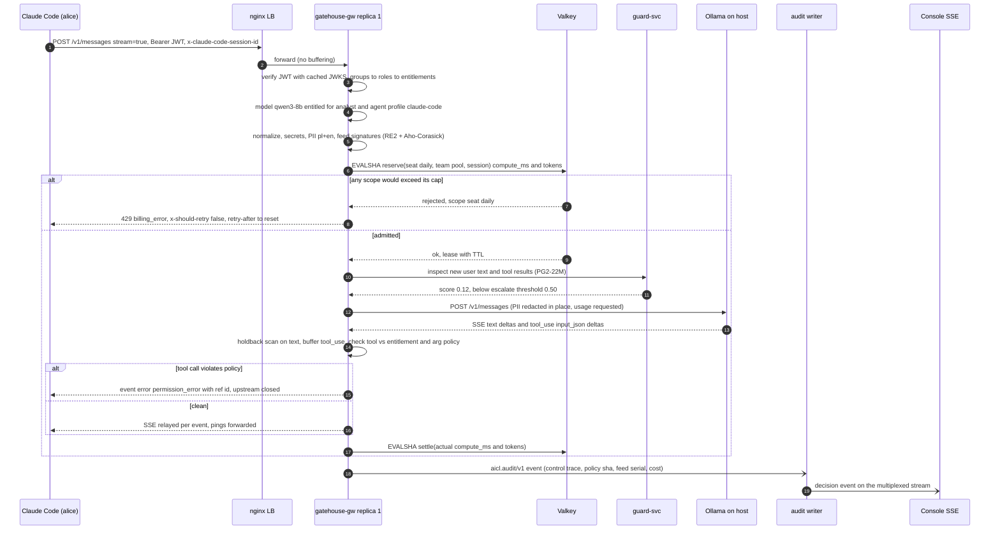
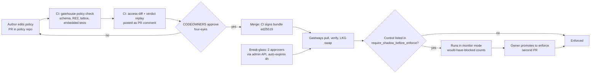

# P3: Enterprise steelman of the original idea. "Gatehouse": one door for every agent, opened by the directory

> **Lens:** build the strongest version of the team's original idea, the way a bank platform team would actually ship it. The idea: a forced chokepoint, SSO/LDAP-group-driven model allowlists and budgets, managed agent settings, a self-service view and Docker scaling to Kubernetes. This proposal decides what survives of the Squid plan, adds what the task requires on top, and covers operability: fail modes, upgrades, multi-team policy ownership and change management.
> **Status:** an independent, opinionated proposal for the design panel. It makes one choice at each decision point.
> **Sources:** research notes are cited by file name: `research/R1-threat-frameworks.md` (R1) through `research/R9-reporting-audit-dashboards.md` (R9), plus `docs/00-task-analysis.md` and `docs/01-review-of-our-first-idea.md`. Framework ids use **OWASP LLM Top 10 2026** numbering (R1 §2.1), the OWASP Agentic Top 10 (ASI01-10), the OWASP MCP Top 10 beta, and ATLAS ids verified against v2026.09 (R1 §6.2).

---

## 0. TL;DR

- **Keep the instincts and replace the engine.** A chokepoint, directory-driven entitlements, managed settings, a "my quota" view and Docker-to-K8s all stay. **The Squid fork goes.** A forward proxy sees `CONNECT host:443` and SNI, not prompts, tool calls or SSE streams (R5 §2, R1 §11). The brain becomes **Gatehouse**, a protocol-aware gateway in Python 3.12/FastAPI. **Stock, unmodified Squid stays** as the egress fence and shadow-AI sensor, and its lists and decisions come from the same policy.
- **Entitlements are the product's spine.** An LDAP/IdP group maps to a role, and the role carries the allowed models, MCP servers and tools, data classes, budgets, egress domains and the agents a user may run. Every guardrail runs on that resolved principal, so each block, redaction and dollar has a name, a group, a cost centre and an agent attached.
- **Enforcement comes in layers, and the network is the real control.** Managed settings (Claude Code `managed-settings.json` with `allowedProviders: ["customEndpoint"]`, `managed-mcp.json`) are the UX layer. Credential custody is the second layer: no provider keys on endpoints, and Ollama is reachable only from the gateway. The third is a Docker `internal: true` network, which becomes NetworkPolicy plus Cilium `toFQDNs` on K8s. A test proves the bypass fails (R5 §5.1, §5.13).
- **One policy bundle feeds many enforcement points:** the gateway, the MCP proxy, the Squid lists and helper, Claude Code managed settings, and the K8s NetworkPolicy. Policy is owned by several teams. A baseline file is owned by the CISO office, overlays are owned by business units and **may only tighten**, and the signature feed is owned by threat intel. Changes go through **access-diff review, shadow-before-enforce and a break-glass path**.
- **The rubric-critical controls ride on the chokepoint.** These are deterministic and semantic guardrails, tool-call mediation, MCP pinning, an allowlist-first artifact gate, a signed external signature feed, hard reserve/settle budgets (tokens, micro-USD and local compute-ms), a hash-chained audit log, and a hermetic `make test` with entitlement-matrix and fence tests.
- **Competitive wedge:** Anthropic's Claude apps gateway already does SSO, group model allowlists and spend caps, **for Claude only**, OIDC only, and it fails open by default (`docs/01`, R5, R7 §1.4). Gatehouse is the bank's **vendor-neutral** control plane on top of that. It covers every model including local ones, MCP tools and agents, adds guardrails and an exploit feed, enforces hard budgets including GPU/CPU seconds, makes failure posture explicit, and produces evidence.

---

## 1. Thesis

**The central bet:** a bank's judges will reward a control layer they could **roll out on Monday**. That means the corporate directory decides who gets which AI. The network makes the gateway unavoidable. Budgets are hard caps rather than reports. Policy has owners, reviews and a rollback. Every decision is attributable evidence. The team's original idea already had this shape. Its weakness was the engine, a fork of a 30-year-old HTTP proxy. Its strength was the **operating model**: identity, entitlements, enforcement and self-service.

So we keep the operating model and put the intelligence where it can see what matters. Every rubric line then inherits identity, budget and audit at no extra cost:

| Original idea element | Steelman form in Gatehouse | Why a bank platform team would sign it off |
|---|---|---|
| Forked Squid analyses requests, blocks sites and tools | **Gatehouse gateway** (LLM + MCP + artifact proxy) does content and tool governance. **Stock Squid** fences non-LLM egress and logs shadow AI | Inspection happens where protocols are understood. Squid runs unmodified, so there is no GPL fork, no C++ and no TLS MITM |
| SSO + LDAP groups → allowed models, token budgets | Directory groups → roles → **entitlements** across models, tools, agents, data classes, egress and budgets, with an "explain effective access" view | One entitlement model that the access-recertification process can audit |
| Managed agent settings force the proxy | A rendered **managed-settings bundle** for Claude Code, Codex, Open WebUI and SDKs, **backed by a network fence** | Vendors themselves say managed config is not a security boundary (R5 §5.1) |
| User logs in, sees limit and allowed models | **"My AI" portal**, `GET /v1/models` filtered per user, and a Claude Code `statusLine` budget. A **request-access** flow routes to the group owner | Fewer tickets, and the portal shows the developer that the policy exists |
| Over-budget or non-allowed requests blocked | Hard **reserve/settle** budgets across replicas. Vendor-compatible error contract (`429 billing_error`, `x-should-retry: false`) | No overshoot under concurrency (R7 §1.6, R8 §3.4) |
| Docker for the hackathon, K8s for scale | Compose with **2 gateway replicas sharing one ledger** today. Kustomize manifests (HPA, PDB, NetworkPolicy, Cilium FQDN) validated in CI | "Stateless pods + Valkey" is the shape every bank's platform team already runs |

**What we add because the task demands it** (and the original idea lacked it): deterministic and semantic guardrails, tool-call mediation, MCP tool pinning and description scanning, an allowlist-first model artifact gate, an externally managed signed signature feed, a hash-chained audit log with exports and a posture score, and a self-testing suite. They sit inside the chokepoint rather than beside it.

**What we refuse to claim:** that detection is a guarantee. Classifiers are a cheap first filter. The guarantees come from entitlements, tool mediation, the fence, budgets and fail-closed defaults. This follows OWASP LLM 2026: "build the system around [the model]" (R1 §2.2).

---

## 2. The Squid plan: what survives, and in what form

| Part of the plan | Verdict | Form it survives in | Evidence |
|---|---|---|---|
| **Fork Squid** (C++ changes for AI analysis) | **Dies** | none | GPLv2+ derivative, autotools and C++ async core. No HTTP/2. Bodies need SslBump plus a CA on every runtime. Even then the logic lives in ICAP, which buffers or passes SSE blind. A 2021 audit left 35 flaws unpatched at disclosure (R3 key findings, R5 §2.2-2.7) |
| **Squid as the place that reads prompts** (SslBump + ICAP) | **Dies** | none | ICAP RESPMOD is whole-message. It either stalls Claude Code or leaves output uninspected (R5 §2.3). Output Block/Redact is a hard requirement (`docs/00` R1) |
| **Squid blocks unwanted sites** | **Survives, stock** | `ubuntu/squid` image, unmodified. `dstdomain` lists are **rendered from `policy.yaml` + the signature feed** (shadow-AI domains, dev allowlist). A 10-line inotify loop runs `squid -k reconfigure` | CONNECT/SNI decisions need no decryption (R5 key findings) |
| **Squid blocks unwanted tools** | **Moves** | Tools live in LLM `tool_calls`, MCP `tools/call` and stdio. Squid never sees them. Gatehouse mediates them at the LLM edge and in the MCP proxy (C14, C15) | R1 §11 interception table |
| **Per-user decisions at the proxy** | **Survives, P1** | `external_acl_type` helper → `POST /internal/egress/decide` on Gatehouse with `ttl=5`. The same principal and groups as the LLM path | Default ttl 3600 s would silently defeat live edits (R5 risks) |
| **Proxy as the only way out** | **Survives, strengthened** | Agents sit on an `internal: true` network. Only the gateway and Squid are reachable. Gatehouse's own outbound traffic (HF mirror, registries, sim-commercial) also goes through Squid, so the **gateway is fenced too** | R5 §5.13 |
| **Shadow-AI visibility** | **Survives, promoted** | Squid JSON access log → audit events `egress.denied` → a management tile "shadow-AI attempts by team" | DSGAI03 / MCP09 / AML.T0096 (R1) |
| **Kubernetes** | **Survives, translated** | `agents` namespace: default-deny egress NetworkPolicy plus allow to the gateway Service. The gateway's egress uses CiliumNetworkPolicy `toFQDNs`. A Squid Deployment stays as the logging egress proxy | Vanilla NetworkPolicy cannot do FQDNs or force a path (R5 §5.13, R7 §4.9) |

**One sentence for the pitch:** *we kept your chokepoint and your directory-driven entitlements. We moved inspection to the one place that understands prompts, tool calls and streams. Squid stays as the network backstop, driven by the same policy file.*

---

## 3. Architecture

### 3.1 Components



| Component | Responsibility | Tech (licence) |
|---|---|---|
| **gatehouse-gw** (data plane, 2 replicas) | `/v1/chat/completions`, `/v1/messages`, `/v1/models` (per principal), `/v1/messages/count_tokens` (local estimate), `/mcp/{server}`, `/hf/{repo}/resolve/{rev}/{file}` (P1), `/ollama/api/pull` facade (P1), `/v1/guard` standalone check (P1). Runs the decision pipeline, the stream holdback guard, tool-call mediation and the budget reserve/settle. Emits audit events | Python 3.12, FastAPI 0.142 (native SSE), httpx, uvicorn, google-re2, pyahocorasick, Presidio analyzer (MIT) with `pl`+`en`, sqlglot, jsonschema, FastMCP 4.0.x (Apache-2.0) for the MCP proxy |
| **guard-svc** | `POST /v1/inspect`: tier-1 prompt-injection classifier and semantic-signature kNN. Calls the tier-2 guard LLM only in the gray zone | onnxruntime, tokenizers. Llama Prompt Guard 2 22M INT8 (Llama 4 Community Licence, accepted before the event), all-MiniLM-L6-v2 (Apache-2.0). llama-guard3:1b via host Ollama `:11435` (R4) |
| **gatehouse-control** (control plane) | Compiles the policy bundle and serves the "effective policy with provenance". Hosts the report API (DuckDB over audit JSONL), the multiplexed SSE stream, the posture calculator, the self-test runner, the approvals queue, exports (JSONL/CSV/OCSF 1.9.0), access diff and recertification, and the replica-consistency view | FastAPI, DuckDB (MIT), rfc8785, cryptography (ed25519) |
| **Valkey** | Atomic reserve/settle counters, GCRA rate limits, run state (steps, taint), verdict cache, `policy.reloaded` pub/sub | Valkey 8 (BSD-3). Not Redis 8, which is tri-licensed (R7) |
| **Keycloak** | OIDC issuer, `groups` claim, device flow for CLIs (`ai-cli`), PKCE for the portal (`ai-portal`). **The demo stand-in for the bank's IdP.** Gatehouse is an OIDC relying party and trusts any issuer with JWKS plus a groups claim | Keycloak 26.8 (Apache-2.0), `--import-realm` (R5 §6.2) |
| **lldap** (P1) | A real LDAP directory federated into Keycloak, so "move Ivan to `quant-analysts` in LDAP" is a live beat | lldap (GPL-3.0, run unmodified) |
| **Squid** | Egress fence for agents' non-LLM traffic and for the gateway's own outbound traffic. Shadow-AI deny list. JSON access log | Squid 7.x stock (GPLv2+, unmodified, run only) |
| **feed** (external system) | The threat-intel team's signature service. `GET /v1/bundle` returns a signed envelope with a monotonic serial and an expiry. `feedctl publish` / `feedctl tamper` for the demo | FastAPI, cryptography ed25519, rfc8785 |
| **mock-upstream / sim-commercial** | A deterministic OpenAI/Anthropic/Ollama-dialect mock driven by magic directives for tests. A **simulated commercial provider** with list prices for $ budgets. We say openly that no paid keys are used | FastAPI (R8 §4) |
| **MCP demo servers** | `filesystem`, `mail` (outbox only), `bankdb` (SQLite with a honeypot table), `web` (serves local poisoned pages), `facts` (admin-triggered rug pull) | FastMCP 4 (R6 §4) |
| **Console** | React SPA with a Security view (Threats, Incident trace, Policy, Feed, Audit), a Management view (Posture, Spend & Chargeback, Adoption, Shadow AI, Access recertification) and the **My AI** portal | Vite 8, React 19, Tailwind 4, shadcn `dashboard-01`, Recharts 3, TanStack Query (all MIT) (R9 §4) |
| **Agents** | Claude Code (managed settings baked into the image), Open WebUI, the Python agent (OpenAI and Anthropic SDKs, `base_url` only) | As in `examples/agent-config/` |
| **Ollama** (native on the host) | Business models on `:11434`. A **separate instance** on `:11435` for the guard LLM so guards never queue behind agent generations (R7 §1.11, R4) | Ollama (MIT), Metal |

### 3.2 Trust zones (compose networks = the fence)

| Network | Members | Rule |
|---|---|---|
| `agents` (`internal: true`) | Claude Code, Open WebUI, Python agent, LB, Squid | Agents can reach **only** the LB (gateway) and Squid. No default route |
| `core` (`internal: true`) | gateway replicas, guard-svc, Valkey, MCP servers, sim-commercial, feed | Nothing here is reachable from `agents` except through the gateway |
| `admin` | gatehouse-control, console, Prometheus, Keycloak admin | Policy, approvals and audit APIs are never on the agent network |
| `egress` | Squid, gateway | The only path to the internet. Gateway outbound traffic is proxied through Squid |
| host | Ollama `:11434` / `:11435` bound to `127.0.0.1` | Reached by the gateway and guard-svc via `host.docker.internal`. **UNVERIFIED:** that Docker Desktop's host alias is unreachable from an `internal: true` network. `tests/fence/test_bypass.py` checks it at H1, and the fallback is in §15 |

### 3.3 The decision pipeline (one function per edge, cheap first)

`authn → principal resolve (groups→roles→entitlements ∩ agent profile) → entitlement checks (model / MCP server / tool / egress) → normalizer (C08) → deterministic scans (secrets, PII, feed signatures, code guard) → budget reserve → semantic tier-1 (guard-svc, parallel, per-control timeout) → gray-zone tier-2 → upstream → stream guard (holdback k=128 on text, full buffering of tool-call args, tool mediation) → settle → audit (async writer)`

- The pipeline short-circuits on the first `block`. A disabled tier costs 0 ms (R4 recommendations).
- Verdicts use the Agent Control Standard vocabulary: `allow | deny | modify | ask | defer`, plus `redact` and `monitor` (R1 §5).
- Judge-editable regex is **RE2-only**. Patterns are compiled at load, and a ReDoS pattern is rejected before the swap. Python `re` stalled for 380-740 ms on one bad pattern (R7 §3.5).
- **Every response carries** `x-gatehouse-decision`, `x-gatehouse-ref` (audit event id), `x-gatehouse-policy` (version + sha prefix), `x-gatehouse-budget-remaining`, and `Server-Timing` with per-stage timings (R7 §3.9).

### 3.4 A request end to end (Claude Code, alice, streaming, with a tool call)



### 3.5 Docker today, Kubernetes tomorrow (what we ship vs what we pitch)

| Concern | Compose (shipped, demoed) | Kubernetes (`deploy/k8s/`, kustomize, validated with `kubeconform` in CI) |
|---|---|---|
| Gateway scale | `gatehouse-gw` ×2 behind nginx. **Cross-replica budget race test** | Deployment (replicas 3), HPA on CPU, PDB `minAvailable: 2`. KEDA on `aicl_inflight_streams` is a pitch item (R7 §4.4) |
| Shared state | one Valkey | Valkey with a replica and Sentinel. Keys carry `{tenant}` hash tags (R7 §4.8) |
| Fence | `internal: true` networks | `agents` namespace default-deny egress, allowing only the gateway Service and DNS. Gateway egress via `CiliumNetworkPolicy toFQDNs` plus a Squid Deployment for logging (R5 §5.13) |
| Policy distribution | bind-mounted `policy/`, watched (inotify plus 1 s hash poll) | ConfigMap **volume** (never `subPath`, never env) for dev clusters. **Signed bundles** pulled from the policy repo pipeline for prod (OPA-style activate-only-if-verified) (R7 §4.6) |
| Identity | Keycloak container | The bank's IdP (Entra ID / Ping / ADFS) over OIDC. No IdP is shipped |
| Guard models | host Ollama `:11435` | Separate GPU node pool (vLLM) so agent load can't starve guards (R7 §4.5) |
| Audit to SIEM | JSONL + OCSF export | OTel Collector → Kafka → Splunk/Sentinel (R9 §2.9) |

---

## 4. Identity, entitlements and self-service (the spine)

### 4.1 Principal resolution

Every credential resolves to one internal principal:

```json
{ "sub": "alice@bank.example", "type": "user", "issuer": "corp-sso",
  "groups": ["cn=quant-analysts,ou=groups,dc=bank"], "roles": ["analyst"],
  "cost_center": "CC-4410-MARKETS", "agent": {"id": "claude-code", "session": "7f3c", "parent": null},
  "client": "claude-code/2.1.288", "credential": "jwt:kid=bank-2026" }
```

| Credential | Who | Build | Prio |
|---|---|---|---|
| **Keycloak JWT** (RS256, `groups` claim, `aud=gatehouse`) via device flow (`aictl login` → `aictl token` as Claude Code `apiKeyHelper`) or PKCE (portal) | humans in CLIs and the portal | realm JSON import, JWKS cache, `aictl` | **P0** |
| **Service virtual key** (sha256 in policy, hot reload) | CI bots, scheduled agents, the test suite, judges' quick-start | | **P0** |
| **Trusted front-end key** + `X-OpenWebUI-User-Email` | Open WebUI. The header is honoured **only** with that key (R5 §6.9) | | **P0** |
| **Static test issuer** (`tests/keys/`) | the hermetic `make test` (no Keycloak needed) | | **P0** |
| LDAP federation (lldap → Keycloak, group mapper) | live "HR moves Ivan" beat | +1-2 h | P1 |
| **Directory sync** (Keycloak admin API every 30 s → Valkey) | leaver revocation faster than token TTL. *Tokens say who you are; the directory says what you may do* | | P1 |
| Downstream tokens with `act` claim (gateway as mini-STS for MCP upstreams) | agent-on-behalf-of-user evidence, no token passthrough (R5 §6.4-6.5) | | P2 (pitch) |

**Effective permission = user entitlements ∩ agent profile.** Agents are first-class non-human principals in `policy.yaml → agents:`, each with an owner group, a cost centre, a tool risk ceiling, a budget and an `enabled` kill switch. This answers ASI03 (identity and privilege abuse) and ASI10 (rogue agents). Agent ids come from `X-Gatehouse-Agent` or Claude Code's `x-claude-code-agent-id`. They are **attribution hints honoured only on authenticated requests**, never authorisation by themselves (R5 §6.9).

### 4.2 Self-service ("My AI")

- **Portal page `/my`:** groups and roles, allowed models and MCP tools, budgets per period and unit (tokens / USD / compute-seconds) with reset time, recent blocks with rule id and a plain-language reason, **Request access** (P1: creates an approval item for the owner group of the overlay that would grant it), and **mint a personal key valid 8 h** (P1).
- **In the agent:** `GET /v1/models` returns only entitled models, so Claude Code's `/model` picker uses gateway model discovery (`CLAUDE_CODE_ENABLE_GATEWAY_MODEL_DISCOVERY=1`). `statusLine` runs `aictl status --short` and shows `budget 41% · 3 models`. Budget warnings at 75% and 95% go out as headers (R7 §1.4).
- **Error messages carry the explanation.** An ungranted model gets `400 invalid_request_error` "model `frontier-sim` is not in your entitlements (roles: intern). Request access: http://localhost:3000/my/access". This copies the Claude apps gateway contract (`docs/01` §6).

### 4.3 Managed-settings bundle (rendered, not hand-written)

`gatehouse render managed-settings --profile developer-laptop` writes `/etc/claude-code/managed-settings.json` and `managed-mcp.json` from the policy. It sets `ANTHROPIC_BASE_URL`, `apiKeyHelper`, `allowedProviders: ["customEndpoint"]`, `availableModels` (fleet-wide union for that device profile; per-user narrowing happens in `/v1/models`), `allowManagedMcpServersOnly`, `disableBypassPermissionsMode`, `CLAUDE_CODE_MAX_CONTEXT_TOKENS`, and `skipWebFetchPreflight`. It **never** sets `forceLoginMethod`, which blocks `apiKeyHelper` (R5 key findings). Distribution: baked into the agent image for the demo. In production, MDM: Jamf profile domain `com.anthropic.claudecode`, or Intune `HKLM\SOFTWARE\Policies\ClaudeCode` (R5 key findings). The same command renders Codex `/etc/codex/config.toml` + `requirements.toml` (P1), the Open WebUI env, and the Squid lists. Ready-made examples: `examples/agent-config/`. Note that `availableModels` with non-Claude ids is **UNVERIFIED** (R5 §10), so `/v1/models` filtering is the authoritative control.

---

## 5. Controls

Type: **DET** deterministic, **SEM** semantic/ML, **POL** policy/identity, **BUD** budget/resource, **TAINT** information flow, **AUD** evidence. Surfaces: `llm.in`, `llm.out`, `llm.tool_call`, `mcp.list`, `mcp.call`, `mcp.result`, `art` (artifacts), `egr` (egress), `cp` (control plane). Control ids follow R1 §9 (C01-C32). `E1`-`E3` are enterprise additions.

| Id | Control | Type | Surface | Prio | How implemented | OWASP / ATLAS |
|---|---|---|---|---|---|---|
| C01 | Identity & authN for users, services and agents | POL | all | **P0** | PyJWT + cached JWKS (Keycloak or any OIDC), hashed service keys, trusted front-end key, static test issuer. Missing or invalid credential → 401 | ASI03, MCP07, AML.T0012, AML.M0019 |
| C02 | **Model entitlements** from directory groups | POL | llm.in | **P0** | Groups → roles → `models[]`, intersected with the agent profile. `/v1/models` is filtered. An ungranted model → 400 with a request-access link. Unknown model ids are default-deny | LLM04:2026, ASI03, AML.M0019 |
| E1 | **Agent registry & kill switch** (agent ∩ user, owner, cost centre, `enabled`) | POL | all | **P0** | `agents:` section. A disabled agent → 403 on every surface within one reload | ASI10, ASI03, AML.M0026 |
| C14a | **MCP server/tool entitlements** + L0-L5 exposure ceiling | POL | mcp.list, mcp.call | **P0** | FastMCP middleware `on_list_tools` filters by role ∩ agent ceiling. `on_call_tool` re-checks. Annotations may only *raise* risk | LLM03:2026, ASI02, MCP02, MCP07, AML.T0053, AML.M0028 |
| C03 | **Budgets** in tokens, micro-USD and local compute-ms; seat caps from groups plus shared pools plus session caps | BUD | llm.in, mcp.call | **P0** | Valkey Lua all-or-nothing reserve, then settle from real usage (§7) | LLM06:2026, AML.T0034, AML.T0034.002, AML.M0036 |
| C04 | Rate, size and concurrency limits; `max_tokens` clamp | BUD | llm.in | **P0** | GCRA in Valkey, per-principal concurrency lease, clamp to `min(max_tokens, model max, affordable)` | LLM06:2026, AML.T0029, AML.M0004 |
| C05 | **Agent circuit breakers**: steps per run, identical-call hash ×5, wall clock, tool calls per run | BUD | llm, mcp | **P0** | Run id from `X-Gatehouse-Run` or `x-claude-code-session-id`, state in Valkey | ASI08, AML.T0034.002 |
| C08 | Normalizer: NFKC; strip Unicode tags U+E0000-E007F, zero-width and bidi; decode base64/hex blobs for a re-scan | DET | llm.in, mcp.result, llm.out | **P0** | Pure Python plus RE2. Hidden decoded text is itself a signal | LLM01:2026, AML.T0068, AML.T0123 |
| C06 | Secrets: provider keys, private keys, JWTs, high entropy | DET | llm.in/out, mcp args/results | **P0** | gitleaks-derived patterns (MIT) on RE2 plus an entropy check. Mode block/redact | LLM02:2026, MCP01, AML.T0055, AML.T0098 |
| C07 | **PII with checksums**: PESEL, IBAN mod-97, PAN Luhn, email, phone. Block / redact / mask per strictness profile | DET (+NER) | llm.in/out, mcp.result | **P0** | Presidio analyzer with **both `pl` and `en`** configured (PESEL only loads for `pl`, R8 key findings). In-place JSON mutation so unknown fields survive (R7 risks) | LLM02:2026, MCP10, AML.T0057 |
| C09/C19 | Injection & jailbreak signatures from the **external signed feed** | DET | llm.in, mcp.result | **P0** | Aho-Corasick keywords plus RE2 regex, compiled at feed swap (§8) | LLM01:2026, ASI01, AML.T0051, AML.T0054 |
| C10 | Semantic prompt-injection classifier | SEM | llm.in, mcp.result | **P0** | PG2-22M INT8 ONNX in guard-svc (~13-40 ms on CPU, R4). `threshold.block` / `threshold.escalate` per profile. `on_error: taint` | LLM01:2026, ASI01, MCP06, AML.T0051.001 |
| C11 | Gray-zone guard LLM (content-safety categories) | SEM | llm.in, llm.out | P1 | llama-guard3:1b on host Ollama `:11435`. Called only when tier-1 lands between escalate and block. Timeout 1.5 s, then `on_error` | LLM01:2026, AML.T0054 |
| C10b | Semantic signatures (kNN over feed exemplars) | SEM | llm.in | P1 | MiniLM-L6 embeddings, cosine threshold, exemplars ship in the feed with `type: semantic` | LLM01:2026, AML.T0054 |
| C12 | **Output sanitizer**: markdown image/link to non-allowlisted hosts, invisible characters, HTML/script | DET | llm.out, mcp.result | **P0** | Streaming holdback (k=128 chars). Redact in place or terminate with a protocol-correct error, never a TCP reset (R7 §2.3-2.5) | LLM10:2026, LLM02:2026, AML.T0077, AML.T0057 |
| C14b | **Tool-call mediation at the LLM edge** (also covers stdio MCP the proxy never sees) | POL+DET | llm.tool_call, mcp.call | **P0** | Buffer tool-call deltas. Tool ∈ entitlements. Validate args with jsonschema. Path: realpath + commonpath. SSRF: `ipaddress` over resolved IPs. SQL: sqlglot verb/table allowlist, `modify` adds `LIMIT` | LLM03:2026, ASI02, ASI05, MCP05, AML.T0053, AML.T0086 |
| C17 | Command/code guard (`curl \| sh`, reverse-shell idioms, `pickle.loads`, `eval`, `os.system`) | DET | tool args | **P0** | Feed rules (`applies_to: tool_args`) | ASI05, MCP05, AML.T0050, AML.T0102 |
| C15 | **MCP tool pinning + description scan** (rug pull, poisoning, shadowing) | DET | mcp.list, mcp.call | **P0** | sha256 over JCS-canonical tool definitions in `pins.yaml`. A change → quarantine + diff in the console + approve-to-repin. Description scan from the feed. Re-list on `list_changed` and re-check pins at call time (FastMCP caches for 300 s, R6 risks) | MCP03, ASI04, AML.T0110, AML.T0109 |
| C16 | Tool-result injection scan (C08 + C09 + C10 on `role: tool` / MCP results) | DET+SEM | mcp.result, llm.in | **P0** | Quarantine replaces the result with a notice and taints the run | LLM01:2026, ASI01, MCP06, AML.T0051.001, AML.T0110.002 |
| C24 | Run taint / Rule of Two: an external sink after untrusted input plus a private read → deny; an internal sink → ask | TAINT | llm.tool_call, mcp.call | P1 | Tool labels in policy (`private`, `untrusted_source`, `sink_external`, `destructive`). Monotonic taint in Valkey | ASI01, ASI02, AML.M0030 |
| C23 | Approval (`ask`) queue with four-eyes, bound to the exact args hash, one-time, TTL | POL | mcp.call | P1 | Retry-token mode (R6 §2.8). Console Approvals page | ASI09, AML.M0029 |
| C18 | **Artifact gate**: pickle opcode **allowlist**, fail-closed on parse error, safetensors preferred, sha256/revision pin, GGUF chat-template scan | DET | art | **P0** scan API + fixtures; P1 inline HF mirror | Our own `pickletools` walker plus the feed's `pickle_globals` rule. `/hf/...` mirror via `HF_ENDPOINT` with `HF_HUB_DISABLE_XET=1` and `huggingface.co` blocked at Squid (R5 §5.14) | LLM04:2026, ASI04, AML.T0010.003, AML.T0011.000, AML.T0018.002, AML.T0018.003 |
| C20 | AI-infra endpoint guard (Ray `POST /api/jobs/`, Langflow `/api/v1/validate/code`, Ollama `/api/pull` bad digest, `/api/create`) | DET | mcp.call (http tools), Ollama facade, egr | **P0** | Feed `http_request` rules applied to HTTP-capable tool args and to the `/ollama/api/*` facade | ASI05, AML.T0132, AML.T0049 |
| C13 | **Egress fence + shadow-AI sensor** | POL | egr | **P0** | `internal: true` networks. Stock Squid `dstdomain` lists rendered from policy and feed. Access log → audit. P1: per-user `external_acl_type` (`ttl=5`) | MCP09, AML.T0096 |
| C25 | **Audit**: hash-chained, redacted, HMAC pseudonyms, one event per decision | AUD | all | **P0** | Async writer, JCS + SHA-256 chain, `gatehouse audit verify` (R9 §2.7) | MCP08, AML.M0024 |
| C30 | **Policy engine**: single bundle, JSON Schema, RE2 compile, embedded self-tests before swap, last-known-good, tighten-only overlays, provenance, replica-sha consistency | POL | cp | **P0** | §6 and §11 | AML.M0020 (supports all) |
| C32 | **Failure posture** per control and per upstream class, shown live | POL | cp | **P0** | `on_error: open \| closed \| taint`, `budgets.on_ledger_unavailable` (§11.1) | (supports all) |
| E2 | **Access recertification & unused entitlements** | AUD+POL | cp | P1 | Entitlement matrix × last use from audit. CSV for quarterly review. "Granted, unused for 30 days" list | ASI03 (least privilege) |
| E3 | **Policy change review**: access diff + verdict replay + shadow-before-enforce | POL | cp | P1 | `gatehouse policy diff --access`, `monitor` mode with "would have blocked" counts (§11.4) | (supports all) |
| C27 | Hidden-context canary leak detector | DET | llm.out | P1 | Per-route canary token in system prompts plus an n-gram overlap check | LLM08:2026, AML.T0056 |
| C31 | Honeypot tool `get_admin_credentials` | DET | mcp.call | P2 (cheap) | Any call → quarantine the agent (E1 kill switch) | ASI10, AML.M0039, AML.T0084 |
| C21 | A2A: signed Agent Cards, peer graph, replay cache | DET+POL | a2a | P2 | Slide plus one test only | ASI07, AML.T0073 |

**Coverage if P0+P1 ship:** LLM01, 02, 03, 04, 06, 08, 10 (7/10 of the 2026 list); ASI01, 02, 03, 04, 05, 08, 09, 10 (8/10); MCP01-03, 05-10 (9/10). This is consistent with R1 §10.5. The console computes the live coverage grid. A cell is green only if the control is enabled **and** its positive and negative tests pass (R1 §12).

---

## 6. Policy file shape

One **policy bundle** is the single source of truth: `policy/policy.yaml` (baseline) plus `policy/tenants/*.yaml` (overlays). It compiles to **one effective policy with one version and one sha256**. Judges edit `policy/policy.yaml`. The overlay shows multi-team ownership.

```yaml
# policy/policy.yaml  (owner: CISO office; CODEOWNERS: @sec-architecture)
apiVersion: gatehouse.ai/v1
kind: Policy
metadata: { name: bank-baseline, version: 12 }
mode: dev                          # dev: file edits hot-apply (flagged "unsigned local change"); prod: signed bundles only
profile: balanced                  # strict | balanced | permissive: default strictness for every control

directory:
  issuers:
    - { name: corp-sso, issuer: "http://keycloak:8080/realms/bank", audience: gatehouse, groups_claim: groups }
  group_roles:                     # LDAP / IdP group  ->  roles
    "cn=quant-analysts,ou=groups,dc=bank": [analyst]
    "cn=engineering,ou=groups,dc=bank":    [developer]
    "cn=interns,ou=groups,dc=bank":        [intern]
  service_keys:
    - { id: vk-openwebui, sha256: "9f2c…", trusted_frontend: { user_header: X-OpenWebUI-User-Email } }
    - { id: vk-ci-bot,    sha256: "1ab4…", principal: "svc:ci-bot", roles: [ci] }

models:                            # catalog owned by the AI platform team (route + price + class)
  qwen3-8b:     { upstream: ollama, target: "qwen3:8b", class: local, chargeback_usd_per_compute_s: 0.0005 }
  qwen3-4b:     { upstream: ollama, target: "qwen3:4b", class: local, chargeback_usd_per_compute_s: 0.0002 }
  frontier-sim: { upstream: sim-commercial, class: external, price: { in_usd_per_mtok: 3.00, out_usd_per_mtok: 15.00 } }

roles:
  analyst:   { models: [qwen3-8b, qwen3-4b, frontier-sim], mcp: { bankdb: [query_readonly], web: [fetch] }, tool_ceiling: L3 }
  developer: { models: [qwen3-8b, qwen3-4b], mcp: { filesystem: ["*"], web: [fetch] }, tool_ceiling: L4 }
  intern:    { models: [qwen3-4b], mcp: { web: [fetch] }, tool_ceiling: L1 }

agents:
  claude-code: { owner: "cn=engineering,ou=groups,dc=bank", enabled: true }
  invoice-bot: { owner: "cn=finance-ops,ou=groups,dc=bank", cost_center: CC-2210, tool_ceiling: L3,
                 enabled: true, budget: { daily_usd: 5 } }

budgets:
  enforcement: enforce             # enforce | shadow | off
  on_ledger_unavailable: { external: fail_closed, local: fail_open_capped }
  periods: { timezone: UTC, week_starts: monday }
  warn_at: [0.75, 0.95]
  seats:                           # per-seat caps inherited from groups; most restrictive wins
    resolve: most_restrictive
    roles:
      analyst: { daily_usd: 20, daily_compute_s: 1800, daily_tokens: 400000 }
      intern:  { daily_usd: 0,  daily_compute_s: 120,  daily_tokens: 20000 }
  pools:  [ { org: bank, monthly_usd: 100000 } ]
  session: { max_usd: 2.0, max_llm_calls: 50, max_tool_calls: 100, max_wall_s: 1800 }
  on_breach:
    - { when: seat_cap_external, action: downgrade, to: qwen3-4b }   # P1
    - { when: seat_cap,          action: block }

controls:
  pii:
    owner: data-protection-office
    enabled: true
    mode: redact                   # block | redact | ask | monitor | off
    by_profile: { strict: block, permissive: monitor }
    entities: { PL_PESEL: redact, IBAN_CODE: redact, CREDIT_CARD: block, EMAIL_ADDRESS: mask }
    surfaces: [llm.in, llm.out, mcp.result]
    on_error: closed
    frameworks: [LLM02:2026, MCP10, AML.T0057]
  prompt_injection:
    owner: sec-architecture
    enabled: true
    mode: block
    detector: pg2-22m-int8
    threshold: { block: 0.90, escalate: 0.50 }       # "adherence": higher block threshold = more permissive
    by_profile: { strict: { block: 0.75 }, permissive: { block: 0.97, mode: monitor } }
    on_error: taint                                  # open | closed | taint
    frameworks: [LLM01:2026, ASI01, AML.T0051]
  tool_mediation:
    enabled: true
    sql: { allow_verbs: [SELECT], force_limit: 100 }
    paths: { root: /workspace }
    deny_hosts_cidr: [169.254.0.0/16, 10.0.0.0/8, 127.0.0.0/8]

feeds:
  - { name: threat-intel, url: "http://feed:8090/v1/bundle", pubkey: keys/feed-ed25519.pub, poll_s: 5, max_stale_h: 168 }
  local_override: { path: feeds/local.yaml, allowed_in: [dev] }

egress:
  fence: squid
  shadow_ai_from_feed: true
  allow_domains: [".pypi.org", ".files.pythonhosted.org", ".github.com"]

change_management:
  overlays: { dir: tenants/, rule: tighten_only, grantable_models: { markets: [frontier-sim, qwen3-8b] } }
  require_shadow_before_enforce: [prompt_injection, pii]     # enforced in prod mode
  break_glass: { approvers: 2, max_duration: 4h }

reporting:
  capture_level: { allow: L0, redact: L1, block: L1 }
  posture: { weights: { critical: 4, high: 3, medium: 2, low: 1 }, critical_gate: 70 }
```

```yaml
# policy/tenants/markets.yaml  (owner: Markets AI owners; CODEOWNERS: @markets-ai)
apiVersion: gatehouse.ai/v1
kind: TenantOverlay
metadata: { name: markets }
applies_to_groups: ["cn=quant-analysts,ou=groups,dc=bank"]
budgets:
  pools: [ { team: quant, monthly_usd: 1000 } ]
  seats: { roles: { analyst: { daily_usd: 15 } } }   # OK: lower than baseline 20
controls:
  pii: { mode: block }                               # OK: stricter than baseline redact
# prompt_injection: { enabled: false }               # REJECTED at compile: overlays may only tighten
```

**Merge rules (the lattice).** Mode strictness is ordered `off < monitor < redact < ask < block`. A lower block threshold is stricter. Model and tool sets may only shrink, except for grants from `grantable_models`. Budgets may only go down. `on_error` is ordered `open < taint < closed`. A violation rejects **that overlay only**, keeps the rest, and raises a red console banner with the file and line. The console's **Effective policy** view shows every field's value and the file that set it ("why can alice use frontier-sim? → role analyst ← group quant-analysts ← policy.yaml:31").

---

## 7. Budget model

**Units.** These are the units the task asks for: "resource access, compute time, token spend… external commercial APIs and local models".

| Unit | Applies to | Source of truth | Pre-flight reservation |
|---|---|---|---|
| `tokens` | all models | provider usage (OpenAI `usage`, Anthropic `message_delta` cumulative, Ollama `prompt_eval_count`/`eval_count`) | `ceil(chars/2)` input (chars/4 under-counts Polish/JSON/PESEL by 22-66%, R7 key findings) + `min(max_tokens, model max)` |
| `usd_micros` (integer) | `class: external` | tokens × price table | reserve the worst case |
| `compute_ms` | `class: local` | Ollama `prompt_eval_duration + eval_duration` (ns). `load_duration` is charged to the platform, not the user (R4) | measured tok/s per model × tokens |
| chargeback `usd_micros` | `class: local` | compute_ms × `chargeback_usd_per_compute_s` | reported only, never enforced. Management sees one currency |
| requests, concurrency, tool calls, steps, wall-clock | all | gateway | n/a |

**Hierarchy.** Two semantics, both supported, both in the policy (R7 §1.2):
- **Per-seat caps inherited from directory groups.** This is the Claude apps gateway semantics: user override, else the most restrictive role cap, else the org default.
- **Shared pools** (org → dept → team). This is the LiteLLM semantics: hierarchical AND.
- **Session and agent caps** from the run id and the agent registry.
A request is admitted **only if every applicable counter has room**. That check is one Valkey Lua script, all-or-nothing, at about 0.30 ms per request. In R7's test, 200 racers against a $50 cap at $1 each produced exactly 50 admissions (R7 §1.7).

**Algorithm.**
1. **Reserve** before the upstream call.
2. **Settle** from real usage. The gateway injects `stream_options.include_usage=true` upstream and strips that chunk if the client did not ask for it.
3. **On a block or client abort**, settle input plus `ceil(emitted_chars/3)`, never zero. Settlement runs under `asyncio.shield` in `finally`, because Starlette cancels the generator on disconnect.
4. **Leases** with TTL equal to the max stream duration, plus a sweeper (R7 §1.6).

Counter keys: `{t:bank}:usd:seat:alice:2026-10-04`, `{t:bank}:usd:pool:team:quant:2026-10`, `{t:bank}:cms:seat:alice:2026-10-04`. A reset is a new key, so no reset job is needed.

**Wire contract.** This copies the vendor contract so clients behave.
- Over cap: `429` with `{"type":"error","error":{"type":"billing_error","message":"spend limit reached (daily; resets 2026-10-05 00:00 UTC)"}}`, plus `x-should-retry: false` and `retry-after: <s>`. Claude Code then shows the message without retrying. The OpenAI and Anthropic SDKs honour `x-should-retry` (R7 key findings).
- Warnings at 75% and 95% go into `x-gatehouse-budget-remaining`, into the `statusLine`, and into an audit `budget.warning` event.
- Ledger unavailable: external models fail closed with "spend limit unavailable". Local models fail open with a **per-replica conservative cap** (10% of the seat cap) and `degraded=true` in the audit.

**Downgrade (P1).** When the external seat cap is reached, the request is rewritten to the local `qwen3-4b` with `x-gatehouse-downgraded-from: frontier-sim`. The bank keeps the developer productive and stops paying (R7 §1.4).

**What management sees:** a burn-down per cost centre with a linear/EWMA forecast and the exhaustion date, a chargeback table (external $ plus local shadow price), "spend prevented (est., upper bound)", and the top consumers by group. User ids are never Prometheus labels; per-user numbers come from Valkey and the ledger (R7 risks).

---

## 8. Attack-signature feed (the "externally managed system")

- **A separate service run by the threat-intel team**, `feed` at `http://feed:8090/v1/bundle`. It has its own key, its own CLI (`feedctl publish | revoke | tamper`) and its own release cadence. This is literally "signatures fed from an externally managed system" (`docs/00` R4).
- **Envelope:** the R2 §2.4 format, already in `examples/feed/signatures.yaml`, with `serial` (monotonic), `expires` and `rules_sha256`, signed with **ed25519 over the RFC 8785 canonical `feed` block**.
- **Client behaviour** in each gateway replica. Poll every 5 s with `ETag`. Verify the signature, require `serial > last_seen` (anti-rollback) and `expires > now`. Then compile (RE2, Aho-Corasick, pickle globals, HTTP matchers) and **run every rule's embedded positive and negative vectors**. Only then does the atomic swap happen. A rule whose own tests fail is dropped with a `feed.rule_rejected` event while the rest activate. A tampered or rolled-back bundle is rejected whole and the last good bundle stays.
- **Rule types.**
  - P0: `regex`, `keyword`, `url_ioc` (also rendered to Squid's shadow-AI list), `http_request` (Ray / Langflow / Ollama), `pickle_globals` (allowlist mode, `on_parse_error: block`), `package_ioc` (postmark-mcp, bad nx versions).
  - P1: `semantic` (MiniLM exemplars), `yara` (YARA-X, BSD-3), `tool_sequence`.
- **Seed content:** the 15 example rules from R2 §2.6, mapped to the root-cause classes (artifact deserialisation, unauthenticated infra APIs, lethal trifecta, leaky output channels, supply chain, denial of wallet). Test vectors are **benign markers only** (R2 risks).
- **Judges' local override:** `feeds/local.yaml`, unsigned and allowed only in `mode: dev`. Precedence is local > signed > built-in. Edits apply in under 2 s. The console labels these rules **"local, unsigned"**, and the posture health factor drops to 0.9 while any are active. That is honest about provenance.
- **Freshness:** a feed past `expires` stays active as **stale** (amber, health 0.7) and is never unloaded, so the bank does not lose protection because the threat-intel server is down.

---

## 9. Reporting & dashboard

### 9.1 Evidence model

- **One event per decision**, in the `aicl.audit/v1` schema frozen by the team (`examples/audit/aicl-audit-v1.schema.json`). It carries the principal (HMAC refs), groups, roles, **cost centre**, agent, surface, every control's verdict with score, threshold, rule id and duration, framework ids, tokens, micro-USD and compute-ms, policy version and sha, feed serial, trace and run id, and the **hash-chain link** (R9 §2).
- **Additional event types:** `policy.applied | policy.rejected | overlay.rejected`, `feed.applied | feed.rejected`, `entitlement.denied`, `egress.denied` (Squid), `budget.warning | budget.exceeded`, `approval.*`, `breakglass.*`, `export`, `selftest.run`.
- **Capture levels:** L0 metadata for allows, an L1 redacted snippet for blocks and redactions. Pseudonyms use keyed HMAC, because plain hashes of PESELs can be brute-forced (R9 §2.6).
- **Integrity:** JCS + SHA-256 chain per replica (`chain_id = aicl/gw-1/2026-10-04`). `gatehouse audit verify` reports the first broken `seq`, and the console header shows an integrity badge. Ed25519 Merkle checkpoints are P1 (R9 §2.7). We say "tamper-evident", never "tamper-proof".
- **Exports:** JSONL, CSV and **OCSF 1.9.0** (API Activity 6003 + `security_control` + `ai_operation` + `record_integrity`, Detection Finding 2004 for blocks, Entity Management 3004 for policy changes). We claim "OCSF-shaped" until it passes a validator (R9 risks).
- **Metrics:** Prometheus `aicl_*` with low cardinality (R9 §6): `aicl_decisions_total{surface,verdict,control}`, `aicl_stage_seconds{stage}`, `aicl_budget_rejections_total{scope_kind}`, `aicl_fail_open_total{control}`, `aicl_policy_info{version,sha}`, `aicl_feed_serial`, `aicl_inflight_streams`, `aicl_egress_denied_total{category}`.

### 9.2 Console information architecture

The **global header on every page** reads: `policy v13 · sha 3f2a… · applied 4 s ago (unsigned local change) · replicas 2/2 same sha ✓ · feed #43 ✓ exp 6d · audit chain ✓ seq 18452 · profile balanced`.

| Page | Audience | Content | Prio |
|---|---|---|---|
| **Overview / Posture** | mgmt + sec | Posture score with sub-scores (coverage, enforcement, verification, health) using the R9 §1.5 formula with weights from the policy. Blocked today, spend MTD vs budget, active users and adoption, **shadow-AI attempts**, gateway overhead p95, fail-open count. A toast on each policy change shows the posture delta and the newly uncovered OWASP/ATLAS ids | **P0** |
| **Threats** + incident drawer | sec | Live feed with filters (verdict, control, framework, group, agent). The drawer shows the full decision trace: every control, score vs threshold, rule id and version, policy sha, related events by run id | **P0** |
| **Spend & Chargeback** | mgmt | Burn-down per cost centre and group, forecast, chargeback table (external $ + local shadow $), top consumers, budget rejections, downgrades | **P0** |
| **Access** | sec / risk / IAM | Entitlement matrix (group × model/tool), "explain access for user X", **unused entitlements (30 d)**, access diff between policy versions, recertification CSV export | **P0** matrix and explain; P1 unused and diff |
| **Policy & Controls** | sec / risk | Controls with enabled, mode, threshold, owner, tests pass/fail, last hit and "would have blocked" counts for `monitor`. Version history with diff, source (file edit / signed bundle / break-glass) and author. Replica sha consistency | **P0** |
| **Signatures** | sec | Feed serial, key id, verified, expiry, rules by type, hits over 7 days, rejected rules, local overrides | P1 |
| **Playground** | judges | Pick a principal (alice / ivan / judge) and a profile, type a prompt, see the verdict trace live. Calls the real gateway with the selected service identity | **P0** |
| **Audit & Export** | audit | Search, export JSONL/CSV/OCSF, **Verify chain** button | **P0** |
| **Self-test** | judges / QA | Run button. Results per control (PASS, GAP when disabled, FAIL), coverage grid | **P0** |
| **Approvals** | approvers | Pending `ask` items with the exact args JSON and taint chain | P1 |
| **My AI** (portal) | every user | §4.2 | **P0** read-only; P1 request access and key mint |

### 9.3 Brief for the one-person console build (Claude Design + Claude Code)

- **Contracts first, frozen at H1:** `contracts/openapi.yaml` and `contracts/fixtures/*.json` (posture, threats page, event detail, spend burn-down, chargeback, access matrix, explain-access, me, policy history and diff, feed, integrity, self-test run) plus `contracts/fixtures/stream.ndjson`, a recorded SSE session for replay. The UI is built **entirely against fixtures** until H14, then flips `VITE_API=live`.
- **API surface (control plane, `:9090`):**
  - Posture and threats: `GET /api/posture`, `/api/kpis`, `/api/threats`, `/api/events/{id}`, `/api/events/{id}/related`.
  - Spend: `/api/spend/burndown?scope=`, `/api/spend/chargeback?period=&by=cost_center|group|model`.
  - Access: `/api/access/matrix`, `/api/access/explain?user=`, `/api/access/unused?days=30`, `/api/access/diff?from=&to=`.
  - Egress and controls: `/api/egress/shadow`, `/api/controls`.
  - Policy, feed and fleet: `/api/policy/history`, `/api/policy/diff`, `/api/feed`, `/api/replicas`.
  - Audit: `/api/integrity`, `POST /api/integrity/verify`, `/api/export?format=jsonl|csv|ocsf`.
  - Self-test and playground: `POST /api/selftest/runs`, `POST /api/playground`.
  - Portal: `GET /api/me`, `POST /api/me/access-requests` (P1).
  - Live: `GET /api/stream?topics=decisions,policy,feed,budget,selftest` (one multiplexed SSE stream, `id=seq`, drop-oldest) (R9 §4.3-4.5).
- **Visual language:** dense, bank-grade and calm. Verdict colours are allow (neutral), redact (amber), ask (blue), block (red) and monitor (grey outline). Every number links to the events behind it. Light and dark themes. A **seeded synthetic week**, clearly labelled, means charts aren't empty on demo day (R9 risks).
- **Page priority if time runs out:** Overview → Threats + drawer → Playground → Policy & Controls → Spend → Access matrix → Audit → Self-test → My AI.

---

## 10. Self-testing

**Two modes, one case library** (R8 §2):

- **`make test`** is hermetic and should finish in under 90 s. It needs no Ollama, no Keycloak and no internet. The compose profile `test` runs the gateway ×2, Valkey, mock-upstream, MCP fixtures, the feed service and a static test issuer. Output: JUnit, `reports/selftest.html`, `results.jsonl` and a coverage matrix. The README opens with this command for phase-1 mentors.
- **`make test-live`**, plus the console **Run self-test** button, runs the same cases (marked `canary: true`) against the running system as the `svc-selftest` principal, routed to the mock upstream. The runner is **policy-aware**. A control a judge disabled shows **GAP** (amber), not FAIL. It runs on startup and after every policy or feed swap.

| Suite | What it proves | Examples |
|---|---|---|
| `tests/cases/*.yaml` | ≥ 2 negative + 1 positive case per P0/P1 control, including false-positive guards | Format from `examples/tests/c07_pii.yaml`: valid PESEL redacted, invalid checksum allowed, IBAN in output redacted, tag smuggling blocked, security-education prompt allowed |
| `tests/entitlements/` | **Generated from the policy**: every role × model × MCP tool → expected allow/deny, plus agent ∩ user intersections | `intern × frontier-sim → 400`, `analyst × bankdb.query_readonly → allow`, `invoice-bot disabled → 403` |
| `tests/budget/` | Pre-flight block with **zero upstream calls**, `max_tokens` clamp, window reset, **50-request race across both replicas → exactly N admitted, overshoot 0%**, settle on abort is never zero, compute-ms for local, Valkey stopped → external 429 "unavailable", local degraded | |
| `tests/reload/` | Edit → verdict flips in < 2 s (hash polled at `/api/policy`). Invalid YAML / ReDoS regex → LKG kept + banner. **A loosening overlay is rejected while the baseline stays active.** Both replicas converge on the same sha | |
| `tests/feed/` | Signed bundle applied. **Tampered → rejected. Rolled-back serial → rejected. Expired → stale but active.** A new rule blocks within 5 s. A rule with failing embedded tests is dropped alone | |
| `tests/fence/` | From inside the agent container: `curl https://api.openai.com` fails (no route), `curl host.docker.internal:11434` fails, `curl valkey:6379` and `feed:8090` fail, `curl -x squid:3128 https://api.openai.com` → 403 and an `egress.denied` audit event | |
| `tests/exploits/` | Pickle with `posix.system` (built at session start, never loaded) → quarantine; benign twin → allow; unparseable pickle → block. GGUF SSTI template, MCP `<IMPORTANT>` poisoning, rug pull v1→v2, markdown-image exfil, Ray/Langflow/Ollama request shapes | R8 §3.7 |
| `tests/mcp/` | `tools/list` filtered per role, `tools/call` re-checked, header/body mismatch rejected, batch arrays rejected (R6 risks) | |
| `tests/audit/` | Schema-valid events. **Exactly one decision event per request** (completeness). Chain verifies, and a one-byte tamper is detected at the right seq. OCSF export shape | |
| `tests/mutation/` (P1) | Disable each control in turn → at least one case must fail. Reports the **kill rate** | R8 §3.9 |
| `make bench` | Overhead = via gateway minus direct to mock, p50/p95/p99 per stage at 0 and 200 ms mock latency. TTFT vs holdback k. Cross-replica throughput | oha / Locust (MIT) |
| `make eval` (P1) | PG2-22M and signatures on jailbreak_llms, NotInject, XSTest, CyberSecEval PI, InjecAgent (GitHub-hosted, MIT/CC-BY). TPR/FPR with Wilson CIs. "Adherence %" = target recall on the calibration split | R8 §10-11 |

**Block response formats** are decided at H1 because every tool depends on them (R8 §9.3):
- OpenAI surface: HTTP 200 with `finish_reason: content_filter` and a refusal text containing the ref id. This works for Open WebUI, garak and promptfoo.
- Anthropic surface: `403 permission_error` before the stream starts, or `event: error` with `permission_error` mid-stream. Never `stop_reason: refusal`, which blames Anthropic's usage policy (R7 risks).
- Budgets: 429 as in §7.
- Tests assert on headers and audit events, never on model prose.

---

## 11. Operability (what makes this deployable at a bank)

### 11.1 Fail modes

| Failure | Detection | Default behaviour (bank profile) | Knob | Console |
|---|---|---|---|---|
| One gateway replica dies | LB health check `/healthz` | The other replica serves. In-flight streams on the dead pod drop, and Claude Code retries dropped connections before content. Reservations expire via lease TTL | replicas, PDB | Replicas panel 1/2 |
| All gateways down | — | **AI is unavailable, with no bypass.** Fail-closed by topology, which is deliberate | — | — |
| Valkey down | ping and timeouts | External models **fail closed** (`429 spend limit unavailable`). Local models fail open with a per-replica cap of 10% of the seat cap. `degraded=true` in the audit | `budgets.on_ledger_unavailable` | Red banner |
| guard-svc down or slow | per-call timeout (80 ms tier-1) | `on_error` per control: `taint` for prompt injection (the run is treated as untrusted and sinks tighten), `closed` under the strict profile | `controls.*.on_error` | "fail-open / taint seen" counter, posture health 0.5 |
| Guard LLM slow (`:11435`) | 1.5 s timeout | The gray-zone result is unknown, so `on_error` applies | timeout | Escalation latency panel |
| Feed unreachable | poll errors | Keep the last verified bundle. After `expires` the feed is stale (amber) and is never unloaded | `max_stale_h` | Feed tile |
| Feed tampered or rolled back | signature or serial check | Rejected whole, last good kept, `feed.rejected` audited | — | Red |
| Policy invalid / overlay loosens | schema, compile, lattice or embedded tests | Keep LKG, or reject only the offending overlay. Banner shows the file and line | — | Red banner |
| Replicas on different policy sha | `policy.reloaded` pub/sub plus `/api/replicas` | Alert after 10 s of divergence. Each replica audits its own sha, so evidence stays correct | — | Amber |
| IdP down | JWKS fetch fails | Cached JWKS (1 h). Existing tokens stay valid until `exp`. New logins fail. Service keys keep working | `jwks_cache_ttl` | Amber |
| Directory sync stale (P1) | sync age > 15 min | Roles fall back to the least-privileged mapping | `directory.max_sync_age` | Amber |
| Audit backpressure | `aicl_audit_queue_depth` | Strict profile: **503, "no audit, no AI"**. Balanced: drop L1 snippets but always keep L0 metadata | `audit.on_backpressure` | Red under strict |
| Squid down | — | Agents lose non-LLM egress (fail-closed). The LLM path is unaffected | — | Egress tile |
| Upstream model 5xx / Ollama queue full | upstream status | Pass through 503 with `x-should-retry: true`. Optional fallback route | `models.*.fallback` | Upstream errors |

### 11.2 Upgrades

- **Gateway and control plane:** stateless, so rolling updates are safe (`maxUnavailable: 0`, PDB). Compose: `docker compose up -d --no-deps --scale gatehouse-gw=2`.
- **Policy schema:** `apiVersion: gatehouse.ai/v1`. Each gateway release accepts the current version and N-1 through built-in converters. `gatehouse policy migrate` rewrites files. Unknown fields fail validation (`additionalProperties: false`), so typos can't silently disable controls.
- **Feed:** `spec_version` is checked. **Unknown rule types are skipped with a warning, never fatal**, which keeps old gateways forward-compatible with a newer feed.
- **Audit schema:** `aicl.audit/v1` is frozen and only additive changes are allowed. A v2 starts a new chain and the verifier handles both.
- **Detector models:** a new classifier version runs alongside the old one in `monitor` (shadow). We compare `make eval` P/R with live "would have blocked" counts and promote through a policy change. Model catalog entries can pin digests (`qwen3:8b@sha256:…`, P1).
- **IdP migration:** `directory.issuers` accepts two issuers during a cutover.

### 11.3 Multi-team policy ownership

| Owner | Owns | Mechanism |
|---|---|---|
| CISO office / security architecture | baseline controls, floors, failure posture, profiles, feed trust anchors | `policy/policy.yaml` + CODEOWNERS |
| AI platform team | model catalog, routes, prices, MCP server registry, gateways | `models:` / MCP registry sections (P1: split into `platform.yaml`) |
| Data protection office | PII and secrets controls | `controls.pii`, `controls.secrets` (field-level `owner:`) |
| Threat intel | the signature feed | a separate service, separate signing key |
| Business-unit AI owners | their groups' budgets, their pools, model grants from `grantable_models`, stricter controls | `policy/tenants/<bu>.yaml`, **tighten-only lattice** |
| Finance | org and department pools | `budgets.pools` |
| IAM | group membership (not policy) | LDAP / IdP. Gatehouse reads it, never writes it |

### 11.4 Change management



- **Hackathon reality (`mode: dev`):** a file edit applies within 2 s, the change is labelled **"unsigned local change"** in the header and audit, and the posture and access diff toasts appear. This is the judge path.
- **P0:** `gatehouse policy check`, the same validator as hot reload, runnable in CI.
- **P1:** `gatehouse policy diff --access` ("+1 model for 3 users in `interns`; −`frontier-sim` for 12 users") and a GitHub Action that posts it to the PR, plus monitor-mode "would have blocked" counts.
- **P2 (pitch):** signed policy bundles in `mode: prod`, reusing the feed's signing code. Verdict replay over the last 24 h of audit metadata.

### 11.5 SLOs we commit to (measured by `make bench` on the team's M-series laptops)

| SLO | Target |
|---|---|
| Gateway overhead p95, deterministic path | ≤ 25 ms |
| Gateway overhead p95, with tier-1 classifier | ≤ 60 ms |
| Tier-2 escalation rate | < 5% of requests |
| Policy/feed edit → enforced on all replicas | < 2 s (file) / < 6 s (feed poll) |
| Budget overshoot under a 50-way race | 0% |
| Audit completeness (decisions = requests) | 100% |

R4/R7 numbers come from a 4-vCPU sandbox. We re-measure before quoting them (R7 risks).

---

## 12. Competitive position

| Capability | Anthropic Claude apps gateway | LiteLLM proxy (OSS) | Portkey / Prisma AIRS, Kong, Bifrost | Cloudflare AI Gateway | **Gatehouse** |
|---|---|---|---|---|---|
| Vendor-neutral (Anthropic, OpenAI dialects, local Ollama) | Claude only | yes | yes | yes (SaaS) | **yes, local-first** |
| Self-hosted | yes (needs PostgreSQL) | yes | partly | no | **yes, offline** |
| SSO groups → model allowlist | OIDC only, no LDAP/SAML | JWT/OIDC + SSO > 5 users is Enterprise | guardrails/SSO/RBAC often Enterprise; Kong ≥ 3.10 has no free mode | IdP-based | **OIDC + LDAP federation, service principals, agents as principals** |
| Hard budgets under concurrency | post-hoc metering, fails open by default | reserve + settle (prior art) | post-hoc (Kong charges on next request) | eventually consistent | **reserve/settle, 0% overshoot, local compute-ms** |
| Deterministic + semantic guardrails | — | some, partly Enterprise | plugins / SaaS guards | SaaS | **in-house cascade, local models** |
| MCP tool governance (pinning, rug pull, arg policy) | — | basic | Bifrost per-key MCP allowlists | — | **yes** |
| Exploit-signature feed (signed, external) | — | — | — | — | **yes** |
| Evidence-grade audit (hash chain, OCSF) | OTLP telemetry | logs | analytics | logs | **yes** |
| Self-test suite inside the product | — | — | — | — | **yes** |
| Live config edits | — | config.yaml needs a restart | varies | UI | **hot reload < 2 s + LKG** |

Sources: `docs/01` §6, R3 key findings, R5, R7 §1.13, R9 §1.4. Vendor feature sets change fast, so we read this as "per the research notes, 2026-10-03".

**The pitch line:** *vendor gateways govern their own models; a bank needs one policy across all of them, including the ones running on its own GPUs.* Gatehouse does not fight the Claude apps gateway. It **owns the network egress**, so any vendor gateway or client sits behind the same fence, budgets and audit. (Whether the Claude apps gateway's upstream URL can be pointed at Gatehouse is **UNVERIFIED**, and we don't depend on it.) Against Microsoft's Agent Governance Toolkit, the closest OSS competitor (R3), we differentiate on budgets, the exploit feed, the evidence chain and the directory-driven operating model.

---

## 13. Demo storyline ("Monday at the bank", 7 minutes; the 3-minute cut is marked ★)

Cast: **Alice** (quant analyst, Claude Code), **Ivan** (intern, Open WebUI), **Kasia** (security, console), **Marek** (head of desk, management view), and **the judge**. Every agentic beat has a scripted-agent fallback (`pyagent --scripted s3`) and a recorded video.

1. ★ **(0:00) The door.** One architecture slide. Console header: policy v12, replicas 2/2, feed #42, chain ✓. "Every AI call in this bank goes through here, and the network makes sure of it."
2. ★ **(0:30) Directory-driven access.** Alice's Claude Code `statusLine` shows `budget 12% · 3 models`. `/model` lists only her entitlements. She asks the agent to query `bankdb`. The Threats page shows the event live, with cost, compute-ms, cost centre and agent.
3. **(1:15) Least privilege.** Ivan's Open WebUI model list has no `frontier-sim`. Forcing it via the API returns `400` "not in your entitlements… request access". The **My AI** page shows his roles and budget.
4. ★ **(1:45) The judge edits policy live.** Add `qwen3-8b` to `roles.intern.models`. Within 2 s Ivan's list updates. The header shows "v13, unsigned local change", the **access diff** toast reads "+1 model for 3 users", and the effective-policy view explains why. Then the judge sets `prompt_injection.enabled: false`. Posture drops, the coverage cells for LLM01 and ASI01 turn red, and the self-test shows **GAP**.
5. ★ **(2:30) Data protection.** Ivan pastes a complaint with a PESEL and an IBAN. Both are redacted, and the mock or Ollama only received placeholders. The judge flips `profile: strict` and the same prompt is blocked.
6. **(3:15) Agentic attacks.** Alice's agent fetches a poisoned web page. The tool result is quarantined and the run is tainted. Then `facts` MCP rug-pulls: the tool is quarantined and the console shows the definition diff with an "approve re-pin" button.
7. ★ **(4:00) Shadow AI and the fence.** In the agent container, `curl https://api.openai.com` gets no route, and `curl -x squid:3128` gets 403. Marek's management tile shows "shadow-AI attempts: 2 (engineering)".
8. **(4:30) Supply chain and the external feed.** `from_pretrained` through `HF_ENDPOINT` gets the malicious pickle fixture quarantined (403 with a reason), while the benign twin loads. Threat intel runs `feedctl publish` (serial 43, a new package IOC) and it blocks within 5 s. `feedctl tamper` publishes a bundle that is rejected, and the old one stays.
9. ★ **(5:15) Budgets.** Ivan hits his daily compute cap: 429 "spend limit reached (daily; resets 00:00 UTC)", and the client does not retry. Alice's external cap downgrades her to the local model (P1). Marek's chargeback view shows the desk's spend by cost centre.
10. **(6:00) Ops drill.** `docker kill gatehouse-gw-1`: traffic continues. `docker stop valkey`: external models fail closed, local models run degraded, and the red banner appears. Restart both.
11. ★ **(6:30) Evidence.** Export OCSF and run **Verify chain** (✓). Edit one byte in `audit/…jsonl` and Verify fails at that seq. Close on the `make test` summary and the coverage matrix.

---

## 14. Team split & timeline

| Person | Role | Owns (P0 first) |
|---|---|---|
| **A** | Gateway lead | LLM proxy (`/v1/chat/completions`, `/v1/messages`, `/v1/models`), SSE relay + holdback guard, pipeline runner and verdict formats, policy loader (schema, RE2 compile, LKG, overlays lattice, hot reload, replica sha), audit emitter + async hash-chain writer |
| **B** | Access & spend | Keycloak realm JSON + `aictl` (device flow, `token`, `status`), JWT/JWKS, principal and entitlement resolver, agent registry, Valkey Lua reserve/settle + GCRA + circuit breakers, `/api/me`, managed-settings renderer, Squid lists + JSON log ingest; P1 lldap federation, `external_acl` helper, downgrade |
| **C** | Detection & feed | Normalizer, secrets, Presidio pl+en, guard-svc (PG2-22M ONNX, MiniLM), feed service + `feedctl` (ed25519, serial, expiry, embedded-test gate), signature engines; later posture calculator + `/api/controls`, `make eval` |
| **D** | Agentic surfaces | MCP proxy (FastMCP 4 middleware: filter, re-check, pins, description scan, arg validators), tool-call mediation at the LLM edge, artifact scan API + pickle walker + fixtures, HF mirror (P1), demo MCP servers, Python demo agent (live + scripted) |
| **E** | Platform & quality | Compose topology and networks, nginx LB, mock-upstream + sim-commercial, YAML case runner, `make test` / `test-live`, entitlement-matrix generator, fence and budget-race tests, CI, `make bench`, report API (DuckDB) + exports (CSV/OCSF), kustomize manifests + kubeconform |
| **F** | Console | `contracts/` fixtures with E at H1, console via Claude Design + Claude Code (§9.3), My AI portal, Playground, then the deck's visual design |

Every owner writes their own YAML test cases (≥ 2 negative, 1 positive per control). E owns the runner and the meta-test that fails if any enabled control lacks cases (R8 recommendations).

| Window | Milestone | Exit criterion |
|---|---|---|
| H0-H1 | **Contracts frozen** | `policy.schema.json`, `aicl.audit/v1`, `contracts/openapi.yaml` + fixtures, block formats, principal object, run-id header, compose skeleton up. Fence probe: is `host.docker.internal` unreachable from `agents`? |
| H1-H6 | **Vertical slice** | Open WebUI → LB → gw → Ollama with a service key and model entitlement, one audit event, one console page on fixtures, 3 YAML cases green in `make test`, Keycloak realm imported |
| H6-H12 | **P0 controls** | PII/secrets/normalizer/signatures/PG2, budgets with the race test, MCP proxy filter + pins, tool mediation, feed signing, Squid fence, hot reload + LKG, SSE stream |
| H12 | **Integration + demo dry run 1** | Full storyline on one laptop with the scripted agent, P0 feature freeze |
| H12-H18 | **P1 + live console** | Console on live API, access diff, directory sync / lldap, downgrade, HF mirror, approvals, mutation run, kustomize + kubeconform, `make bench` numbers |
| H18-H20 | **Hardening** | Fail-mode drills (§11.1), fresh-clone `make test` on a second laptop, offline (Wi-Fi off) run |
| H20-H22 | **Deck + video** | ≤ 10 slides, 4-minute backup video, README top section, licence table |
| H22-H23 | **Submit** | Submitted at least 1 h before the deadline |

Sleep: two people at a time for 3 h shifts between H8 and H17. The person on shift is never the only one who can run the demo.

---

## 15. Risks

| # | Risk | Likelihood / impact | Mitigation |
|---|---|---|---|
| 1 | **Lens risk:** enterprise plumbing (Keycloak, lldap, overlays, ownership) eats hours that guardrail depth needs. Guardrails are 30% of the score | High / High | Cap identity at ~8 person-hours. lldap federation and directory sync only if P0 is green at H12. Overlays reuse the same validator. C and D are never pulled onto identity work |
| 2 | Agents on the `internal` network can reach host Ollama via Docker Desktop's `host.docker.internal`, which would bypass the gateway | Unknown / High | Probe at H1 (`tests/fence`). Fallback: Ollama binds to a host-only interface and the gateway reaches it through a dedicated `ollama-bridge` socat container that sits only on `core`. If that also leaks, move Ollama access behind a per-request shared-secret check in the bridge |
| 3 | Claude Code against local models is slow, and small models are weak tool callers | High / Medium | Claude Code only for the beats that need no long generations (model picker, statusLine, one short query). The Python agent (live + scripted) carries the agentic attacks. Video backup |
| 4 | Single console builder is a bottleneck | Medium / High | Contracts and fixtures at H1, the page priority list, Claude Design brief §9.3. E helps wire the live API after H14 |
| 5 | Keycloak plus models exhaust laptop RAM | Medium / Medium | 32 GB+ Macs. Profile `DEMO_NO_SSO=1` (service keys only). Guard LLM is P1 and can be dropped |
| 6 | Squid helper caching or list reload defeats live edits | Medium / Low | `ttl=5 negative_ttl=5`. Inotify loop with `squid -k reconfigure`. Test in `tests/fence` |
| 7 | Judges break the policy (invalid YAML, ReDoS, loosening overlay) | High / Low | LKG, RE2-only, lattice. These are deliberately demonstrated as features |
| 8 | "Isn't this just the Claude apps gateway?" | Medium / Medium | §12 table and the one-line answer. Show a local model plus MCP pinning plus the feed in the same breath |
| 9 | English-centric semantic tier: PG2-22M and Llama Guard 3 lack Polish (R4) | Medium / Medium | Deterministic PII/feed rules are language-agnostic. Polish exemplars in the feed (`semantic`, P1). Spike Qwen3Guard-0.6B only if P1 is green |
| 10 | Licences: PG2 under the Llama 4 Community Licence (gated), lldap GPL-3.0, Squid GPLv2 | Low / Medium | Run-only for GPL components, licence table in the README, PG2 weights downloaded and terms accepted before the event. The `Detector` interface allows a swap to Apache-2.0 `deberta-v3-base-prompt-injection-v2` |
| 11 | Two OWASP numberings confuse judges | Medium / Low | 2026 ids everywhere, with the 2025 id in brackets on slides (R1 risks) |
| 12 | Event Wi-Fi or model downloads fail | Medium / High | Pre-pulled Ollama set (~5 GB), wheelhouse, image tarballs on USB, offline smoke test at H18 (R4) |

---

## 16. What we deliberately cut

- **The Squid fork.** C++, GPL-derivative obligations and days of work for zero visibility into prompts (R5 §2).
- **SslBump / TLS MITM and CA distribution, ICAP/eCAP adapters.** They break cert-pinned and HTTP/2 clients and can't stream-inspect (R5 §2.2-2.4).
- **Per-user Squid proxy authentication with SSO tokens.** At most the P1 `external_acl` helper keyed by client and principal.
- **SAML, SCIM provisioning, Keycloak token-exchange delegation (preview).** Pitch only. Delegation needs feature flags and per-login consent, which doesn't suit an unattended demo (R5 risks).
- **Building on LiteLLM, Portkey, Bifrost or Kong.** Our core features would sit behind enterprise gates, config edits need restarts, and judges would score the vendor (R3).
- **OPA/Cedar as the policy engine.** Our own YAML plus JSON Schema plus a lattice is easier for judges to edit. Rego export stays a pitch item.
- **Postgres.** JSONL plus DuckDB plus Valkey cover the demo. **Grafana** (AGPL) is replaced by a performance panel in the SPA plus Prometheus.
- **Helm chart, live K8s cluster, KEDA, GPU pools, Kafka→SIEM.** We ship kustomize validated with kubeconform. `kind` is a stretch, the rest is slides (R7 §4.2).
- **An LLM judge on every request, gpt-oss-safeguard, Qwen3Guard-Stream.** Too slow on laptops. The guard LLM handles the gray zone only (R4).
- **Full CaMeL/FIDES information-flow control, the A2A proxy.** Taint-lite is P1, A2A is a slide plus one test (R6).
- **Codex `/v1/responses`, Copilot, Gemini and Cursor clients.** `/v1/responses` is P1. The others are blocked at the fence, not governed (R5 §5.11).
- **Multi-tenancy.** The `tenant` field is reserved, and we run a single tenant, `bank`.
- **Weekly LLM-written executive report.** P2 (R9 §7).

---

## 17. Self-assessment against the judging criteria

| Criterion (CRITERIA / RULES weight) | Score | Why |
|---|---|---|
| **Robustness & quality of guardrails** (30% / 30%) | **7 / 10** | P0 covers every surface the task names. That means deterministic (checksum PII, secrets, normalizer, RE2 feed rules) and semantic (PG2 cascade) controls, tool-call mediation including stdio MCP, MCP pinning and description scanning, an allowlist-first artifact gate, infra-endpoint rules, and a network fence that a test proves. Guarantees come from entitlements, mediation, the fence and budgets, not from classifiers. **Minus points, honestly:** this lens spends roughly 1.5 person-days on identity and operating-model features that a pure security design (P2) would spend on obfuscation views, monotonic taint and destination provenance (P1 here). The semantic tier is weak on Polish and on adaptive attacks |
| **Architecture & performance efficiency** (20% / 20%) | **8 / 10** | A clean data plane / control plane split, stateless replicas sharing a Valkey ledger (demonstrated), a cheap-first cascade with early exit, a streaming-correct holdback guard, RE2/Aho-Corasick, a separate guard Ollama, `Server-Timing` per stage, and committed SLOs measured by `make bench`. Minus: a Python data plane plus an LB hop. The guard LLM on CPU containers is slow, which is why it is gray-zone only |
| **Security reporting** (20% / 20%) | **9 / 10** | Both audiences are served from one evidence stream. A hash-chained, verifiable audit with OCSF export. A posture score with sub-scores that moves on live edits. Threats with a full decision trace. Spend, chargeback and forecasts. **Shadow-AI attempts** from Squid. An **access recertification** view and explain-access. Policy history with source and diff. Minus: a single console builder is a delivery risk, and OCSF is not validator-checked |
| **Completeness of the self-testing suite** (15% / 20%) | **8 / 10** | A hermetic `make test` with no Ollama or Keycloak. Per-control positive and negative YAML cases. An **entitlement matrix generated from the policy**. A cross-replica budget race with 0% overshoot. Fence-bypass tests. Feed tamper and rollback tests. Hot-reload, LKG and loosening-overlay tests. Exploit fixtures, audit-completeness and chain-tamper tests, and a policy-aware live self-test that reports GAP. Minus: mutation kill rate and detector P/R evaluation are P1 |
| **Practical implementability & scalability** (15% / 10%) | **9 / 10** | Zero-code integration through a rendered managed-settings bundle plus `base_url`. Real OIDC with a groups claim and LDAP federation. Service and agent principals. Explicit fail modes, upgrade paths, multi-team ownership with a tighten-only lattice, and a change-management flow. Compose with 2 replicas today and validated kustomize manifests (HPA, PDB, NetworkPolicy, Cilium FQDN). Minus: K8s is validated, not run live. Signed policy bundles are pitch-only |

**Weighted:** CRITERIA weights 0.30·7 + 0.20·8 + 0.20·9 + 0.15·8 + 0.15·9 = **8.05 / 10**. RULES weights 0.30·7 + 0.20·8 + 0.20·9 + 0.20·8 + 0.10·9 = **8.0 / 10**. The biggest lever left is robustness. If P0 is green by H12, the first P1 hours go to C24 run taint and destination provenance (borrowed from P2) rather than to more identity features.
