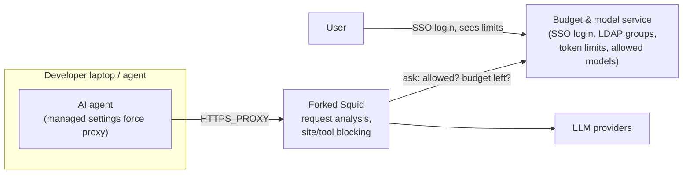
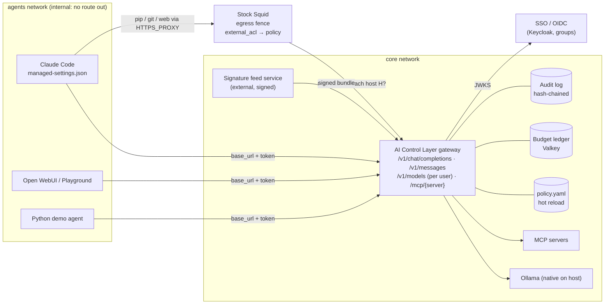

# 01 · Review of our first idea (forked Squid + SSO/LDAP budget service)

> TL;DR: **Keep the instincts, change the centre of gravity.** A forced chokepoint, identity-bound budgets and model allowlists from SSO/LDAP groups, managed agent settings and a self-service "my quota" view are all good, and they all survive. **Forking Squid does not.** It puts our 24 hours into C++ and TLS interception, and the judged features (guardrails 30%, reporting 20%, tests 15–20%) end up living in an ICAP side-service anyway. Make a **protocol-aware AI gateway** the core. Keep **stock Squid** (no fork) as the egress fence, driven by the same policy file.

## 1. The idea as proposed

## 2. What is genuinely good, and stays

| Element | Why it is good | Where it lives in the new design |
|---|---|---|
| **Single chokepoint** that agents are forced through | Without it nothing else is enforceable | Gateway is the only route to models. Agents run on an `internal` Docker network (K8s: NetworkPolicy). Squid fences everything else. |
| **SSO + LDAP groups → allowed models & budgets** | That's how a bank will actually run it, and it scores on *practical implementability* | `identities.groups` in `policy.yaml`. MVP uses virtual keys with group metadata. Stretch: Keycloak OIDC with a `groups` claim (LDAP federation). |
| **User sees their limit and allowed models** | Fewer surprised developers, fewer tickets | "My AI" page in the console + `GET /v1/models` filtered per user, so Claude Code's model picker shows only allowed models. |
| **Managed agent settings enforce the proxy** | Zero-code integration for developers | Config bundle: Claude Code `managed-settings.json` (`ANTHROPIC_BASE_URL`, `apiKeyHelper`), managed MCP config, Codex `config.toml`, Open WebUI env, Python `base_url`. |
| **Block non-allowed models and over-budget use** | Core requirement R1/R3 | Model allowlist control + hierarchical budget ledger (tokens, money, GPU-seconds), 429 with a readable reason. |
| **Docker now, Kubernetes later** | Credible scaling story | Stateless gateway pods + Valkey ledger + ConfigMap policy + HPA (kustomize manifests in the repo). |

## 3. What breaks with a forked Squid

1. **It can't see what we must judge.** On HTTPS a forward proxy sees `CONNECT host:443` and the SNI. Reading prompts needs **SslBump (TLS MITM)** and our CA installed in every OS store, every Node/Python/Java runtime and every container. Some clients pin certs or ignore the OS store.
2. **Streaming output is the hard part, and Squid makes it harder.** LLM answers arrive as SSE streams. Through ICAP you either **buffer the whole answer** (agents stall; Claude Code's own gateway docs warn about exactly this) or **let it through uninspected**. Output-side *Block vs Redact* is an explicit requirement.
3. **All the intelligence ends up in an ICAP server anyway.** Parsing OpenAI/Anthropic/MCP JSON, counting tokens, redacting, scanning tool calls: that *is* an AI gateway, just written behind an extra protocol hop with fewer libraries.
4. **No HTTP/2.** Squid's directive reference and v7 release notes don't mention HTTP/2. A small Squid+ICAP AI-DLP project had to ship a separate custom TLS proxy to see Anthropic traffic (`research/R5` §2.4).
5. **Blind to most agent risk.** Many MCP servers are **local stdio processes**. They never touch the network, so a network proxy never sees tool poisoning, rug pulls or dangerous tool arguments. These are mediated at the LLM boundary (tool_calls) and by an MCP proxy.
6. **24 h reality.** Forking means C++ in Squid's async core, autotools rebuilds and a GPLv2+ derivative we would have to publish. Estimate: days. Squid + ICAP gets to "works on curl" in 6–10 h, and streaming output is still unsolved (`research/R5` §2.7).
7. **Pitch optics for a bank.** "A GPL fork of a 30-year-old proxy with a public record of unpatched audit findings" is weak. "Stock Squid as a commodity egress fence" is strong.

## 4. Scoring the two shapes against the rubric (team judgment, 1–5)

| Shape | Guardrails 30% | Arch/perf 20% | Reporting 20% | Tests 15–20% | Practical 10–15% | Feasible in 24 h |
|---|---|---|---|---|---|---|
| Forked Squid + budget service | 2 | 2 | 2 | 2 | 3 | **1** |
| Stock Squid + ICAP server | 2 | 3 | 2 | 3 | 3 | 2 |
| **Own AI gateway + MCP proxy + stock Squid fence** | **5** | **5** | **5** | **5** | **5** | **4** |

*(Adapted from `research/R5-proxy-enforcement-identity.md` §3.6. Full option analysis: `docs/02-architecture-options.md`.)*

## 5. The upgraded idea

**The one-sentence pitch of the change:** *we kept your chokepoint and your identity-driven budgets, and moved inspection to the one place that understands prompts, tool calls and streams: a protocol-aware gateway. Squid stays as the network backstop, driven by the same policy file.*

## 6. Reality check: someone already ships the governance half

Anthropic documents a Claude gateway with OIDC device login, group-based model allowlists and per-user/group spend limits (the research found it under the name "Claude apps gateway". **Name, features and URL still need verifying**, see `research/FACT-CHECK.md`). That **validates** the original idea: identity + model allowlists + spend caps is what a vendor builds first. It also means our pitch can't stop there. Lead with what such a vendor gateway does not do:

- **vendor-neutral**: Anthropic + OpenAI dialects + local Ollama + MCP + (A2A),
- **hybrid guardrails** with visible decision traces,
- **historical-exploit signatures** from an external signed feed,
- **local-compute budgets** (GPU-seconds), not only dollars,
- **evidence-grade reporting** (hash-chained audit, OCSF export, posture score),
- a **self-testing** control layer that re-tests itself on every policy change.
