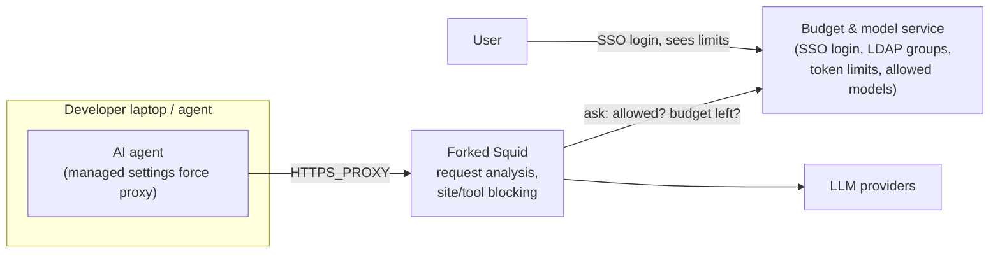
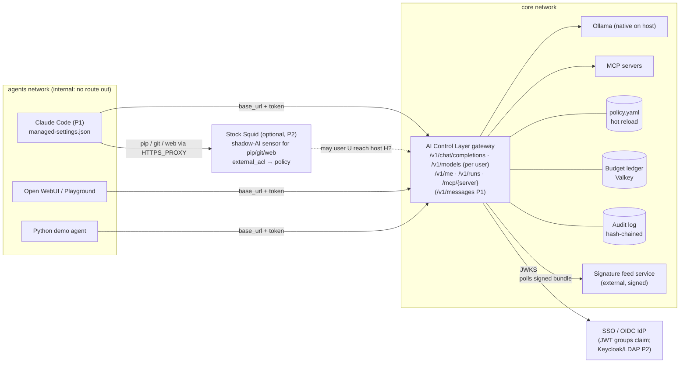

# 01 · Review of our first idea (forked Squid + SSO/LDAP budget service)

> TL;DR: **Keep the instincts, change the centre of gravity.** A forced chokepoint, identity-bound budgets and model allowlists from SSO/LDAP groups, managed agent settings and a self-service "my quota" view are all good, and they all survive. **Forking Squid does not.** It puts our 24 hours into C++ and TLS interception, and the judged features (guardrails 30%, reporting 20%, tests 15–20%) end up living in an ICAP side-service anyway. Make a **protocol-aware AI gateway** the core. The chokepoint becomes a **network property**: agents sit on an internal Docker network whose only route is the gateway. **Stock Squid** (no fork) survives only as an optional P2 shadow-AI sensor for non-LLM egress, driven by the same policy file.

## 1. The idea as proposed

## 2. What is genuinely good, and stays

| Element | Why it is good | Where it lives in the new design |
|---|---|---|
| **Single chokepoint** that agents are forced through | Without it nothing else is enforceable | Gateway is the only route to models. Agents run on an `internal` Docker network (K8s: NetworkPolicy), proven by a fence probe. Stock Squid for non-LLM egress is an optional P2 sensor. |
| **SSO + LDAP groups → allowed models & budgets** | That's how a bank will actually run it, and it scores on *practical implementability* | `identities.groups` in `policy.yaml`. P0: hashed virtual keys + JWT/JWKS validation (static demo issuer, `groups` claim → policy groups). P2: Keycloak/LDAP compose profile (spec D20). |
| **User sees their limit and allowed models** | Fewer surprised developers, fewer tickets | `GET /v1/me` + a per-caller filtered `GET /v1/models` (P0), so Claude Code's model picker shows only allowed models; the console "My AI" page is P2. |
| **Managed agent settings enforce the proxy** | Zero-code integration for developers | Config bundle: Claude Code `managed-settings.json` (`ANTHROPIC_BASE_URL`, `apiKeyHelper`), managed MCP config, Codex `config.toml`, Open WebUI env, Python `base_url`. |
| **Block non-allowed models and over-budget use** | Core requirement R1/R3 | Model allowlist control + hierarchical budget ledger (tokens, money, GPU-seconds), 429 with a readable reason. |
| **Docker now, Kubernetes later** | Credible scaling story | Stateless gateway pods + Valkey ledger + ConfigMap policy + HPA (kustomize manifests are P1 #16). |

## 3. What breaks with a forked Squid

1. **It can't see what we must judge.** On HTTPS a forward proxy sees `CONNECT host:443` and the SNI. Reading prompts needs **SslBump (TLS MITM)** and our CA installed in every OS store, every Node/Python/Java runtime and every container. Some clients pin certs or ignore the OS store.
2. **Streaming output is the hard part, and Squid makes it harder.** LLM answers arrive as SSE streams. Through ICAP you either **buffer the whole answer** (agents stall; Claude Code's own gateway docs warn about exactly this) or **let it through uninspected**. Output-side *Block vs Redact* is an explicit requirement.
3. **All the intelligence ends up in an ICAP server anyway.** Parsing OpenAI/Anthropic/MCP JSON, counting tokens, redacting, scanning tool calls: that *is* an AI gateway, just written behind an extra protocol hop with fewer libraries.
4. **No HTTP/2.** Squid's directive reference and v7 release notes don't mention HTTP/2. A small Squid+ICAP AI-DLP project had to ship a separate custom TLS proxy to see Anthropic traffic (`research/R5` §2.4).
5. **Blind to most agent risk.** Many MCP servers are **local stdio processes**. They never touch the network, so a network proxy never sees tool poisoning, rug pulls or dangerous tool arguments. These are mediated at the LLM boundary (tool_calls) and by an MCP proxy.
6. **24 h reality.** Forking means C++ in Squid's async core, autotools rebuilds and a GPLv2+ derivative we would have to publish. Estimate: days. Squid + ICAP gets to "works on curl" in 6–10 h, and streaming output is still unsolved (`research/R5` §2.7).
7. **Pitch optics for a bank.** "A GPL fork of a 30-year-old proxy with a public record of unpatched audit findings" is weak. "Network isolation as the fence, with stock Squid as an optional egress sensor" is strong.

## 4. Scoring the two shapes against the rubric (team judgment, 1–5)

| Shape | Guardrails 30% | Arch/perf 20% | Reporting 20% | Tests 15–20% | Practical 10–15% | Feasible in 24 h |
|---|---|---|---|---|---|---|
| Forked Squid + budget service | 2 | 2 | 2 | 2 | 3 | **1** |
| Stock Squid + ICAP server | 2 | 3 | 2 | 3 | 3 | 2 |
| **Own AI gateway + MCP proxy + network fence (stock Squid optional)** | **5** | **5** | **5** | **5** | **5** | **4** |

*(Adapted from `research/R5-proxy-enforcement-identity.md` §3.6. Full option analysis: [`docs/03-options-and-decision-record.md`](03-options-and-decision-record.md).)*

*These are team judgments, not measurements, and the 5s are scored for containerised agents. Laptop and host agents are residual T5 for our design; see §7 for where the original idea scores higher.*

## 5. The upgraded idea

> The canonical version of this picture is in `design/VISION-SPEC.md` §3.3. Squid is **not** in the P0 runtime; the fence is the `internal: true` agents network.

**The one-sentence pitch of the change:** *we kept your chokepoint and your identity-driven budgets, and moved inspection to the one place that understands prompts, tool calls and streams: a protocol-aware gateway. The network itself is the fence. Squid is an optional backstop for non-LLM traffic, driven by the same policy file.*

## 6. Reality check: someone already ships the governance half

Anthropic ships the **Claude apps gateway** (<https://code.claude.com/docs/en/claude-apps-gateway>, verified 2026-10-03, see `research/FACT-CHECK.md`). It is a self-hosted gateway built into the `claude` binary (`claude gateway --config gateway.yaml`, needs PostgreSQL). It offers OIDC login including device flow, IdP groups mapped to model allowlists and managed policies, per-user/group/org spend caps (daily/weekly/monthly), a `429 billing_error` + `x-should-retry: false` contract, warnings at 75%/95%, and fail-open by default. **It supports no SAML and no LDAP, has no service-token flow for CI, and has no Helm chart.**

That **validates** the original idea: identity + model allowlists + spend caps is what a vendor builds first, and we should **copy its error contract** (400 for an ungranted model, 429 `billing_error` for budgets). It also means our pitch can't stop there. Lead with what such a vendor gateway does not do:

- **vendor-neutral**: OpenAI dialect (Anthropic P1) + local Ollama + MCP + (A2A, P2),
- **hybrid guardrails** with visible decision traces,
- **historical-exploit signatures** from an external signed feed,
- **local-compute budgets** (GPU-seconds), not only dollars,
- **evidence-grade reporting** (hash-chained audit, posture score, OCSF-shaped export at P1),
- a **self-testing** control layer that re-tests itself on every policy change,
- **directory groups** via the JWT `groups` claim (LDAP federation P2) and **non-human principals** (agents/CI with their own identity and budgets), **fail-closed** option per control, and a K8s story.

## 7. Where the original idea is still the better answer

The critique above is about where *inspection* happens. On three points the original plan is stronger than our P0, and we should say so:

1. **Laptop and host agents.** Our fence is a Docker network, so it covers containerised agents only. A developer's Claude Code or IDE agent on a laptop is residual T5 (spec §14.2), and managed settings are config, not a boundary. In production the fence for laptops is a stock egress proxy or firewall whose CONNECT allowlist reaches only the gateway, with no SslBump: the original proxy, minus the inspection.
2. **Claude Code itself.** It speaks the Anthropic `/v1/messages` dialect, which is P1 #10 and frozen under plan (a). In a P0 build the original idea's main agent cannot go through our gateway at all; it is a recorded clip at best.
3. **Shadow AI and non-LLM egress.** A proxy sees every host an agent or developer reaches (pip, git, unsanctioned AI SaaS). Our gateway sees only the traffic sent to it. That visibility is the stock Squid sensor, which is P2.

So the honest pitch is "gateway for inspection, network or proxy for the fence", and for laptops the fence is the original idea.
