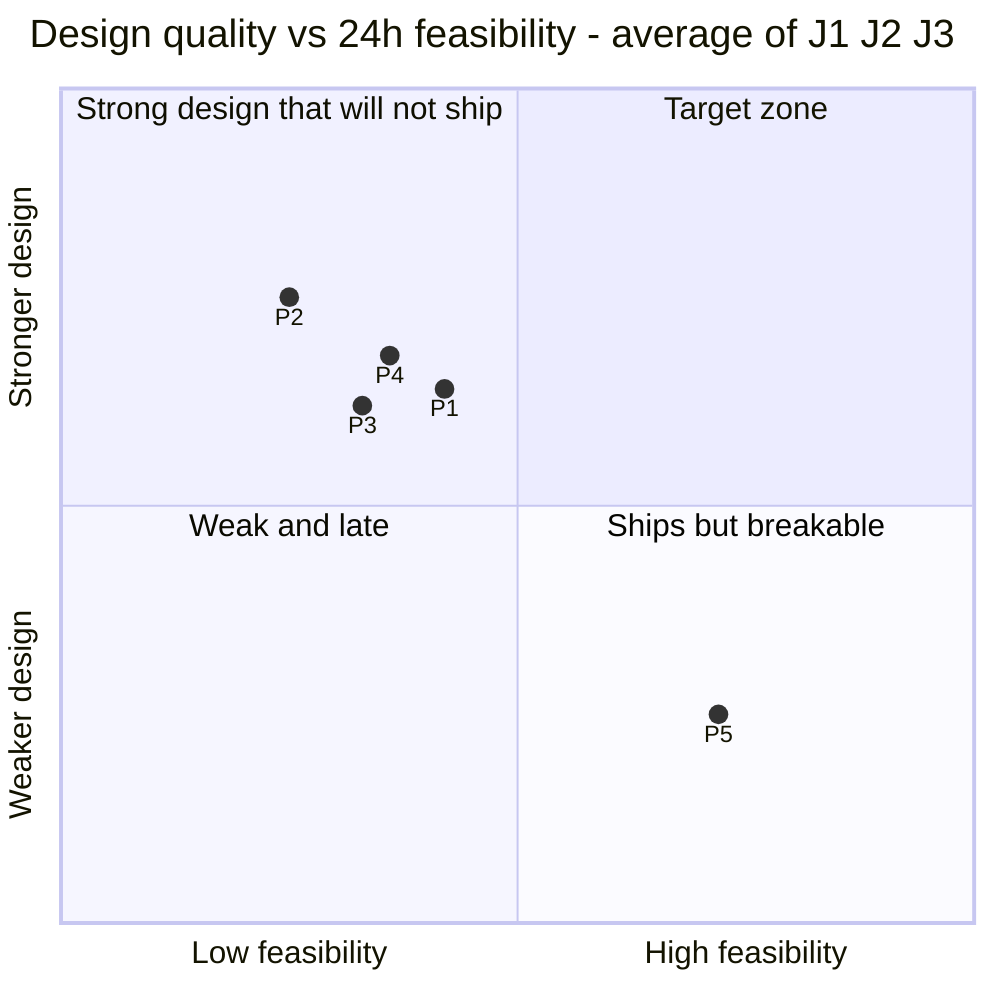

# 03 · Options explored and decision record

> **Why this page exists.** The lead asked us not to rubber-stamp his first idea (fork Squid + an SSO/LDAP budget service) and to look for something better. This page shows the options we explored, how five competing designs and three judge personas scored them, what we took from each, and the conditions under which we would change a decision during the hackathon.
> **Precedence.** `design/VISION-SPEC.md` (the spec) wins over this page. `research/FACT-CHECK.md` wins over `research/R*.md`. **Mandate** is a working name; the code namespace is `aicl`. Every 1-5 or 0-10 score below is team or panel *judgment*, not a measurement.

## TL;DR

- **What we chose.** Our own **protocol-aware Python L7 gateway** with an LLM edge and an MCP edge. Both edges share one policy brain (`aicl.core`). It runs behind **Docker trust-zone networks**, with **no Squid and no vendor gateway at the core**. The guarantee comes from **authority, not detection**: an agent may only send data to a destination that came from the user's authenticated task, the policy, or a `trusted_source` tool (C24 + C33). We build it on **P5's delivery chassis** (spec §0, D01, D02, D06).
- **Reason 1: it is the only interception point that sees everything the rubric judges.** That means prompts, streamed output, and tool calls, including stdio MCP tools (seen via the model's `tool_calls`). It needs no TLS MITM. R5 §3.6 scores the gateway 5/4/5/5/4 on its own and **5 on every criterion** once a fence and network isolation are added (feasibility 4). A Squid fork scores **2 on every criterion** (feasibility 1).
- **Reason 2: authority is the only framing that moves the 30% robustness criterion.** Detectors get bypassed. A regex baseline catches **0%** of InjecAgent indirect injections, and LLM01:2026 cites **>90%** adaptive-attack success against most of 12 published defences (Nasr et al. 2025; not yet re-verified, FACT-CHECK E2). P4 scored capability mandates **9/10** on guardrails, and no other framing scored above 7. "Detectors off, model hijacked, exfiltration still denied" is our **H12 gate**.
- **Reason 3: feasibility decided the ranking.** All three judges ranked the delivery plan (P5) **first** on weighted score (**50.1 / 56.4 / 47.5**), even though its design scored lowest. The best designs came last. So the spec is P5's machine with P2's locks, P4's definition of a trusted destination, P1's evidence loop and P3's fail-mode discipline. It is sized at **~79.5 person-hours against 81 h (about 98%; no lane above 13.5 h)**, so realistically there is no P1 in the base plan, and the default plan (a) has only ~54 h (spec §13.2-13.4).
- **What we rejected, and when we would revisit it.** The Squid fork is dropped completely. Squid itself becomes a P2 sensor. Vendor gateways become optional data planes that call our brain through `/v1/decide` (P1). Every risky choice has a fallback decided in advance, with a time and an owner (§6.2).

---

## 1. How we explored

- **Research first:** R1-R9 covered threats, attacks, OSS, local models, proxy/identity, MCP, budgets/performance, testing and reporting. `FACT-CHECK.md` then re-verified 26 load-bearing claims.
- **Three independent axes:** *where* to intercept (§2a), *build vs build-on* (§2b), and *what the product fundamentally is* (§2c). A choice on one axis does not force a choice on another.
- **A design panel (§3):** five proposals, each written through a different lens, then three judge personas scoring them with one formula: `weighted = (0.30·robustness + 0.20·architecture + 0.20·reporting + 0.15·testing + 0.15·practicality) × 10 × feasibility/10`.
- **Synthesis (§4):** the spec takes the judges' grafts and pays for each one with a named cut (spec Appendix A).

---

## 2. The solution space: three independent axes

### 2a. WHERE to intercept

R5 scores are on a 1-5 scale and P4 scores on 0-10. Score order: G (guardrails 30%) / A (architecture 20%) / R (reporting 20%) / T (tests 15-20%) / P (practicality 10-15%).

| Option | Sees prompts? | Sees streamed output? | Sees tool calls (LLM `tool_calls` · MCP · stdio MCP)? | Needs TLS MITM? | 24 h effort | Rubric fit | Role in Mandate |
|---|---|---|---|---|---|---|---|
| **Forked Squid** (C++ AI analysis) | Only after SslBump + a CA on every runtime | Through ICAP: buffer the whole answer (agents stall) or pass it uninspected | Only inside bumped bodies · stdio never | **Yes** | **Days** (C++ async core, autotools, GPLv2+ derivative) | R5: 2/2/2/2/2, feas **1** | **Not used** (dropped) |
| **Stock Squid + ICAP** | REQMOD works, after SslBump | RESPMOD is whole-message, so same problem | Same as the fork | **Yes** | 6-10 h to "works on curl"; streamed output still unsolved | R5: 2/3/2/3/3, feas 2 | **Not used** |
| **Stock Squid as egress fence** (`external_acl`, no bump) | No: only `CONNECT host:443` + SNI | No | No | No | 2-3 h | R5 §2.7: "medium" (bypass prevention, shadow-AI metrics) | **P2 only**: shadow-AI sensor tile. Not our fence (D35) |
| **mitmproxy** | Yes, with a CA | Reads the whole message by default; per-chunk modification is "tricky and brittle" | In bodies · stdio never | **Yes** | 1-2 h as a sensor add-on (R3) | R5 as core: 3/3/3/4/2, feas 4 | **Not used** (CA rollout breaks demos; P1 and P2 cut it) |
| **Envoy `ext_proc`** | Yes (reverse proxy behind `base_url`) | Yes: `FULL_DUPLEX_STREAMED` is the right primitive | `tool_calls` + HTTP MCP · stdio never | No | High: Envoy YAML + gRPC processor + xDS | R5: 4/5/3/3/5, feas **2** | **Pitch**; P1 `/v1/decide` lets it call our brain (spec §2.4, §3.8) |
| **Own L7 gateway + MCP edge** | **Yes** (clients point `base_url` at it) | **Yes**: parse SSE, trigger-aware holdback, clean `content_filter` stop | **Yes · yes · stdio too**, through the model's `tool_calls` at the LLM edge; one tool policy on both edges (C14) | **No** | 4-6 h for streaming passthrough, then guardrails (R3) | R5: 5/4/5/5/4, feas 4; **with fence: 5/5/5/5/5**, feas 4 | **Core** (D02) |
| **Network isolation** (`internal: true` networks; K8s NetworkPolicy) | Sees nothing; enforces reachability | — | Makes the gateway the only route | No | Included in L1 (2.0 h with repo + CI) | Part of the R5 "E + fence" row | **Fence** (C13, D04), proven by `fence-probe` at H1 |
| **SDK wrapper** | Yes, in process | Yes, in process | Only for that one app; cooperative, so the agent can bypass it | No | Small | Not scored | **Not used for enforcement**. Integration is just `base_url` + key |
| **Agent hooks** (Claude Code `PreToolUse`, OWASP ACS) | No (`PreToolUse` sees tool calls) | No | Yes, incl. local Bash and file edits that no proxy sees | No | ~2 h (P1 rank 15, bundled with `/v1/guard` + `/v1/decide`) | P4 F3: 5/6/5/6/7 → **5.65/10** | **P1 adapter + pitch**. Vendors say client config is not a security boundary (R5) |
| **eBPF sensors** (eCapture uprobes, mitmproxy local capture) | Observe only (eCapture needs no CA) | Observe only | Observe only · stdio never | eCapture no; mitmproxy local yes | Root; Linux only (kernel ≥ 4.18 for eCapture, ≥ 6.8 for local capture) | Not scored | **Not used**. Unmanaged host agents stay residual T5 |

**Pick:** the gateway is the enforcement point that judges score. Docker networks make it the only route (C13), and a fence test proves that from inside the agent container.
- R5's top row ("E + C-fence + net isolation") used **stock Squid** as the fence. The spec keeps the network isolation and drops Squid. Squid would add a GPL container and a reload loop to provide a fence we already get from the networks.
- That is why the Squid fence in `docs/01` §5 is gone from P0. Spec D35 wins over `docs/01`.
- The axes are independent. Choosing the gateway here does not decide build vs build-on (§2b) or the framing (§2c).

### 2b. BUILD vs BUILD-ON

| Project | Licence gotchas | Enterprise-gated | Live reload | Why not as our core | What we reuse |
|---|---|---|---|---|---|
| **LiteLLM** proxy | MIT, except `enterprise/` (commercial) | JWT/OIDC auth, SSO for > 5 users, hide-secrets, tag-based/dynamic guardrails (FACT-CHECK D2) | `config.yaml` is not watched, so edits need a restart. DB-stored settings reload every 30 s | The identity half of the team's idea is the gated half. Streaming post-call guardrails are audit-only. Needs Postgres for keys. PyPI compromise of 1.82.7/1.82.8 on 2026-03-24 (D1). Judges would score the vendor | Reserve + settle as prior art. The compromise story goes on the supply-chain slide (hash-locked deps) |
| **Portkey** gateway | MIT | Budgets/RBAC not in OSS 1.x. "Gateway 2.0" status unclear (README says pre-release, press release says fully open source) | Configs travel per request; file reload UNVERIFIED | TypeScript; governance half missing from OSS 1.x | Names from its plugin manifest (`regexMatch`, `jsonSchema`, `modelwhitelist`, `validUrls`) |
| **agentgateway** (LF) | Apache-2.0, Rust | No EE tier noted in R3, but its guard layers include SaaS moderation (hidden outbound calls) | File watched; hot except the top-level `config` block (D3) | Rust. v1.6.0 shipped 2 Oct 2026, the day before the event, so expect churn. Webhook schema UNVERIFIED. Two config sources unless we compile ours into theirs | Best optional adapter: its webhook guard → our `/v1/guard` / `/v1/decide` (P1) |
| **Agent Router** (formerly Envoy AI Gateway) | Apache-2.0; now an Agentic AI Foundation project | Nothing noted | K8s CRDs reconciled live (xDS); standalone `aigw run` | Needs Kubernetes + Envoy Gateway; our logic would sit behind gRPC `ext_proc` | Production story: "our brain behind Envoy `ext_proc`" |
| **Kong** AI Gateway | Apache-2.0 OSS core, but **OSS images stop at 3.9.1; no free mode from 3.10** | Advanced token rate limiting, semantic guard, sanitizer, MCP plugins, SSO | DB-less reload UNVERIFIED | Frozen OSS line, Lua/OpenResty (R3 fit 1/5) | Nothing. Kong callouts to `/v1/decide` are a pitch line |
| **Bifrost** (Maxim) | Apache-2.0, Go | Guardrails, SSO/OIDC, RBAC, clustering | UI/API dynamic; file reload UNVERIFIED | Go; guardrails and SSO are gated | Its budget hierarchy as a design reference (ours: org → pool → seat → agent → run) |
| **LLM Guard** | MIT; Python < 3.13 | — | — | **Archived 9 Jul 2026**; its HF models "no longer maintained" | Scanner ideas only. Protect AI's classifier `protectai/deberta-v3-base-prompt-injection-v2` (Apache-2.0) is our ungated default, used directly as ONNX without the library (D09). It is English-only and misses jailbreaks (A5) |
| **NeMo Guardrails** | Apache-2.0 | — | — | Colang is another language for judges; self-check rails add LLM calls | Inspiration only |
| **Presidio** | MIT; moving to the `data-privacy-stack` org | — | — | spaCy `pl` trap, image weight, CPU-bound NER on the async hot path (J2) | None. C07 uses our own checksum validators (PESEL, IBAN, PAN, NIP) |
| **LlamaFirewall** | Code MIT; models under Llama licences (PG2 repos gated) | — | — | Quiet since 1.0.3 (May 2025). AlignmentCheck defaults to the Together API (a hidden SaaS call) | Prompt Guard 2 86M directly, as an optional engine on demo laptops (D09). AlignmentCheck as an idea |
| **MCP gateways**: IBM ContextForge · Docker MCP GW · Microsoft MCP GW · Lasso | Apache-2.0 · MIT · MIT · MIT | Lasso's `lasso` plugin needs a SaaS key | — | ContextForge: Postgres/SQLite (55+ tables) + Redis, a second policy store. Docker GW: needs Docker. MS GW: K8s, MCP `2026-07-28` clients only | The sandbox idea (D05: no-egress MCP containers); ContextForge's plugin hook design as reading material |
| **FastMCP 4.0.10 / `mcp` SDK 2.3.0** (building blocks) | Apache-2.0 / MIT | — | — | n/a. These are libraries, not gateways | MCP edge (`create_proxy` + Middleware, or a thin JSON-RPC proxy; decided at H2.5). Demo servers on SDK 2.x `MCPServer` (B2) |

**Scoring (R3 §8.1, weighted 1-5):** own thin gateway + reused libraries **4.7** > agentgateway data plane + our brain 4.1 > Envoy `ext_proc` 4.0 > LiteLLM core 3.1 > Squid fork + ICAP 2.0.
**Pick:** *reuse libraries, not gateways* (D02). The six differentiators (hybrid guards, local-compute budgets, exploit-signature feed, artifact scanning, self-tests, audit export) are not in any gateway, so we would build them anyway. A thin passthrough costs about 4-6 person-hours (R3 §2.4). Reused libraries: FastAPI, httpx, pydantic v2, watchfiles, google-re2, pyahocorasick, rfc8785, PyJWT, cryptography, valkey-py, onnxruntime, Caddy 2, Valkey 8, ~30 gitleaks-derived patterns (spec §3.2).

### 2c. WHAT the product fundamentally is (framing)

Scores are from P4 §1.2 (0-10, CRITERIA weights 30/20/20/15/15; the RULES weights give the same ranking).

| # | Framing | G | A | R | T | P | **Weighted** | Where it ended up in the spec |
|---|---|---|---|---|---|---|---|---|
| F0 | Smart AI gateway (the obvious answer) | 7 | 7 | 7 | 7 | 7 | **7.00** | **Chassis**: the LLM/MCP gateway and the cascade. Detection is demoted to *evidence* |
| F1 | Policy compiler (one policy → many PEPs) | 6 | 8 | 6 | 7 | 9 | **7.00** | Only `/v1/decide` + `/v1/guard` (P1 rank 15). Emitters cut (§0 item 8) |
| F2 | Capability mandates (zero ambient authority) | **9** | 8 | 7 | 7 | 6 | **7.65** | **Core guarantee, lite version**: C24 positive-allowlist destinations + C33 run tokens. No Authority service, no call warrants (D06, D33) |
| F3 | Hooks-first, inside agents | 5 | 6 | 5 | 6 | 7 | **5.65** | `PreToolUse` hook script (P1). Managed settings are config, not a boundary |
| F4 | Agent runtime sandbox | 5 | 6 | 3 | 5 | 5 | **4.80** | No-egress sandbox containers for MCP servers (D05); agents on an `internal` network (C13) |
| F5 | Adversary twin (red team in the loop) | 5 | 6 | 9 | **10** | 6 | **6.90** | Live policy-aware self-test in `control`, showing "S4 EXPOSED since v19" (§10.4). Separate sparring service cut |
| F6 | Deception / honeypots | 4 | 5 | 6 | 6 | 6 | **5.20** | C31 honeypot → C26 kill switch, and the C27 canary, both at P0 |
| ★ | P4's hybrid: F2 + F1 + F5 + F6 on a gateway | 8.5 | 8 | 8.5 | 9 | 7.5 | **≈ 8.3** | Too big as written: judges gave P4 feasibility 4.5-5.5 |

**Pick:** **F0 chassis + F2-lite guarantee + F5 and F6 as cheap in-product features.** We keep the idea that moves the 30% criterion, F2. We drop the parts that made P4 three projects at once: the Authority service, warrants, emitters and sparring. The pitch keeps P4's line: **"Agents get mandates, not keys."**

---

## 3. The design panel

### 3.1 The five proposals

| | Name · lens | One-line thesis | Biggest strength (judges) | Fatal flaw as written (judges) |
|---|---|---|---|---|
| **P1** | **Proctor** · score maximiser | Judges score what they can poke. Every reaction carries its own proof: trace, OWASP/ATLAS IDs, auto self-test, posture delta | Best judge-facing evidence loop and global header strip (J2, J3); best "showroom" (J1) | Admin API reachable from the agent network with no auth; client-asserted run ID makes taint escapable (J1, J2); P0 is ~115-125% of capacity (J3) |
| **P2** | **Warden** · security architect | An AI reference monitor: nine invariants hold with a fully jailbroken model and 0% detector recall | Best security design. Top robustness from all three judges (8.5 / 8.5 / 9.0); classifier-off H12 gate; ingress anchoring; fail-to-taint | Scope: 36 controls, 10 pages, 6 networks, ~140-150% of capacity (J3). Control plane is a port inside each replica (J2). Gated PG2-86M in the default path (J3) |
| **P3** | **Gatehouse** · enterprise steelman of our first idea | One door for every agent, opened by the directory. Keep the operating model, replace the engine | Best operating model: practicality 9.0 from all three judges; the fail-mode table is "the best artefact in the whole panel" (J2) | Taint is P1, so indirect injection → external email gets through at P0 (J1). MCP servers share the `core` network with Valkey (J1). Keycloak + Squid + overlays + ~9 pages eat the robustness hours (J2, J3) |
| **P4** | **Mandate** · contrarian | Agents get mandates, not keys: zero ambient authority, and no LLM ever mints or widens authority | Best idea: positive-allowlist destinations, detector-independence as a metric, the most memorable sentence (J1, J3) | Authority store in the same container as spawned stdio MCP servers, so a malicious server can mint warrants (J1). Pub/sub policy with no versioned pull (J2). Warrants false-deny re-serialised args; 3 pillars + 7 services (J3) |
| **P5** | **Governor** · delivery lead | Win on reliability under poking: demoable from H5, works offline | The only plan all three judges believe ships: contracts at H1, skeleton at H5, storyline as a test (feasibility 7.5 / 8.0 / 6.5) | Malicious stdio MCP servers run inside the gateway; no fence at P0; admin routes on `:8080`; taint P1 (J1, J2). Monolith blocks scale-out (J2). The thesis is a delivery promise, not a product (J3) |

### 3.2 The three judges' scoreboards

Judges: **J1** = GS AppSec / AI red-team lead, **J2** = GS platform architect, **J3** = hackathon mentor. "Base" is the design score on 0-100 (J2 reports 0-10; ×10 here). "Feas." is feasibility on 0-10. "Wtd" is base × feasibility/10.

| Proposal | J1 base · feas · **wtd** | J2 base · feas · **wtd** | J3 base · feas · **wtd** | Avg base | Avg feas | **Avg wtd** | Self-score /10 | J1 probes that get through at P0 (of 12) |
|---|---|---|---|---|---|---|---|---|
| P1 Proctor | 75.50 · 6.0 · **45.3** | 78.5 · 5.5 · **43.2** | 79.5 · 5.0 · **39.8** | 77.8 | 5.50 | **42.8** | 8.05 | 5 |
| P2 Warden | 79.00 · 5.0 · **39.5** | 78.8 · 5.0 · **39.4** | 82.3 · 3.5 · **28.8** | **80.0** | 4.50 | 35.9 | 7.65 | **1** |
| P3 Gatehouse | 74.75 · 5.5 · **41.1** | 79.5 · 5.5 · **43.7** | 78.0 · 4.0 · **31.2** | 77.4 | 5.00 | 38.7 | 8.05 | 6 |
| P4 Mandate | 75.75 · 5.5 · **41.7** | 79.0 · 5.5 · **43.5** | 81.3 · 4.5 · **36.6** | 78.7 | 5.17 | 40.6 | 8.33 | 3 |
| P5 Governor | 66.75 · 7.5 · **50.1** | 70.5 · 8.0 · **56.4** | 73.0 · 6.5 · **47.5** | 70.1 | **7.33** | **51.3** | 7.8 | 7 |

What the panel told us:
- **Ranked by design quality, the order flips.** On base score P2 is first and P5 last. On weighted score P5 is first and P2 last. J2: "the best architectures are the least deliverable, and the most deliverable architecture is the weakest."
- **The self-scores ignore feasibility.** They are base scores with feasibility 10 (J3). J2 also found them inflated by about 0.5-1.0 on architecture and practicality.
- **The fixes are affordable if we pay for them with cuts.** J1 priced its must-fix list at about 18-22 person-hours and said it fits inside P5's plan if the cuts happen at H0, not H16. J2 put its core fixes at about 6-8 extra person-hours, paid for by cutting Squid, Keycloak-as-P0, the overlay lattice, A2A and a standalone sparring service.
- **Every judge had the same recommendation:** P5's plan as the backbone, plus grafts from the other four (§4).

### 3.3 Design quality vs 24 h feasibility

*How the chart is scaled:* the axes are zoomed so the five points spread out. **x = (avg feasibility − 3) / 6**, so the vertical midline is feasibility 6/10. **y = (avg base − 65) / 20**, so the horizontal midline is base 75/100. The raw averages are in §3.2. The final spec is not plotted because no judge scored it. J2's estimate for this hybrid was "about 8 on architecture and 8 on practicality … at a feasibility I would still rate about 7". That is the top-right quadrant we are aiming for.

---

## 4. What we took from each proposal (graft table)

Costs are the spec's P0 work-package estimates (§13.2) unless marked otherwise. "J3 est." means J3's capacity table.

| Idea | Source | Where in the spec | What it costs | What was cut to pay for it |
|---|---|---|---|---|
| Delivery chassis: contracts frozen at H1, walking skeleton at H5, IC gates, storyline as a test, offline-first, freeze at H16, submit at H21 | **P5** | §13.4-13.6, D01, D24 | L1 2.0 h + L8 1.5 h | It *is* the base. J3: P5's extras (≈ +6 h) are insurance, not features |
| Trigger-aware stream holdback + `stream_mode: buffer` fallback | **P5** | §5.5, D23 | Inside A5 (4.0 h streaming) | Fixed k = 128 holdback (P2/P3: ~0.6 s added TTFT) |
| Classifier-off hijack test as the **H12 gate** | **P2** (+ P4 detectors-off metric) | §10.2, §13.4 IC3, D41 | L4 1.0 h | P1's 16-exhibit museum UI (J3 est. 5 h) → 10 exhibits as cases (D34) |
| HMAC run tokens minted only with a user credential, sticky fallback run, ingress-anchored trusted text (C33) | **P2** | C33, §5.6, D07 | Inside A3 (2.5 h) | Live Keycloak + device flow (P3, J3 est. 7 h) → P2 profile (D20) |
| Positive-allowlist destinations from the authenticated task (C24) + "derived-trusted" from `trusted_source` tools | **P4** (+ J1's own idea) | C24, §5.6, D06 | D4 2.5 h (+ B4 extractor) | Call warrants, Authority service, mandate tree pages (J3 est. 3 + 3 + 8 h) (D33) |
| Trust-zone networks + H1 fence probe (C13); admin plane on its own service and network (C35) | **P2** | §3.4, D04, D31 | Inside L1 (2.0 h) + L3 2.0 h | Squid fence + lists + log ingest (P3, J3 est. 4 h) (D35) |
| MCP servers in no-egress sandbox containers; tokens stripped; Valkey `requirepass` + ACLs | **P2** | §3.1 #5, §3.2, D05, D32 | D2a 1.5 h | Stdio children inside the gateway (P5) or the MCP PEP (P4) |
| Fail-to-taint (C32) + sliding classifier windows, view dedup, batching (C10) | **P2** + J1 | §5.3, §5.4, D08, D11 | Inside A4 2.0 h + C3 3.0 h | Fail-open defaults (P1, P5) |
| Multi-view normaliser (C08) + an obfuscation subset in `make test` | **P2** | §5.3, cut line 5 | B4 2.5 h | The full 10-mutator matrix (trimmed first if we're behind) |
| Strict schema; controls opt-out, permissions opt-in; hard floors in code; `control_weakened` | **P2** | §6.6, D15 | Inside A2 2.5 h | — (cheap) |
| Separate `control` service + 2 stateless replicas + cross-replica race (200 → exactly 50) | **P1 / P3** (J2 must-fix 1, 3) | §3.1-3.2, D03, D12 | L3 2.0 h + A6 0.5 h + C6 1.5 h | P5 monolith; P1's second test harness (J3 est. 3 h) (D18) |
| Live-edit evidence loop: global header, posture from what replicas *loaded*, auto self-test GAP vs FAIL, "S4 EXPOSED" | **P1** (+ P4 exposure line) | §9.3, §10.4, D13 | L5 2.0 h + L6 1.5 h | P4's sparring service (J3 est. 7 h); P1's console writes to the policy file (D14 single writer) |
| Exploit Museum: each exhibit = feed rule + test case | **P1** | §8.5, D34 | Inside B3/B5 + cases | 16 exhibits → 10; cards + replay move to P1 rank 7 |
| Fail-mode table as a live health panel + one safe drill (stop `guard`) | **P3** | §5.4, D44 | `/api/health` + a panel | Live Valkey kill on stage → recorded clip |
| Real JWT/JWKS path (static demo issuer, `groups` claim) + hashed virtual keys | **P3** (J2 must-fix 11) | C01, §6.2, D20 | Inside A3 | Keycloak + `aictl` + overlay lattice (J3 est. 7 + 5 h) |
| Vendor error contract: 400 `model_not_allowed`, 429 `billing_error` + `x-should-retry: false` | **P3** (FACT-CHECK B4) | §5.7, C02, C03 | Trivial | — |
| "What survives of the Squid plan" table | **P3** | §2.3 | Slide | — |
| Honeypot tool → kill the run, quarantine the agent (C31 + C26) | **P4** | C31, C26 | Inside D5b (1.5 h) | — |
| Pitch frame "Agents get mandates, not keys" | **P4** | §1, D33 | 0 h | Building the full mandate machinery |
| `/v1/decide` PDP API + `/v1/guard` + `PreToolUse` hook | **P4** (+ P1 `/v1/guard`) | §11.2, P1 rank 15 | 2.0 h (P1) | Compiler emitters to Squid, managed settings and k8s |
| Canary token in system prompts (C27) at P0 | J1 must-fix 9 | C27 | A7 0.5 h | n-gram overlap → P1 |
| Held-out efficacy with Wilson CIs next to every self-graded number | J1 must-fix 13 (P2's Polish slice) | §10.5, D41 | 2.0 h (P1 rank 3) | — |
| Console scope: 4 P0 pages + header, spend as an Overview panel | J2, J3 must-fixes | §9.5, D19 | F lane 12.0 h | 9-11 pages (P2, P3; J3 est. +12 h for P2) |

---

## 5. Fate of the team's original idea

Full reasoning: [`docs/01-review-of-our-first-idea.md`](01-review-of-our-first-idea.md) and spec §2.3. Where the two disagree, the spec wins. `docs/01` and the spec agree: the fence is the internal network, and stock Squid is an optional P2 sensor (D35).

| Part of the plan | Verdict | Where it lives now |
|---|---|---|
| Fork Squid and add AI analysis in C++ | **Dies** | — (GPLv2+, no HTTP/2, bodies need SslBump, logic ends up in ICAP) |
| A proxy that reads prompts (SslBump + ICAP) | **Dies** | — (ICAP RESPMOD is whole-message; output Block/Redact is required) |
| Forced chokepoint | **Survives, stronger** | `internal: true` agent network + fence test at H1 and in `make test` (C13); K8s: default-deny NetworkPolicy + Cilium `toFQDNs` |
| Blocking unwanted tools | **Moves** | LLM `tool_calls` + MCP `tools/call`, one tool policy (C14). Squid never saw them |
| Blocking unwanted sites | **Moves** | Agents have no internet route at all (C13). Stock Squid shadow-AI sensor tile is P2 |
| SSO/LDAP groups → allowed models and budgets | **Survives as the spine** | `groups` in `policy.yaml`; JWT/JWKS + hashed virtual keys at P0; Keycloak/LDAP is a P2 profile + slide (D20) |
| User sees their limit and models | **Survives** | `GET /v1/me`, per-caller `GET /v1/models`; "My AI" page is P2 |
| Managed agent settings force the proxy | **Survives as config** | `examples/agent-config/` (Claude Code `managed-settings.json`, `managed-mcp.json`); recorded clip (P1), never live |
| Block non-allowed models and over-budget use | **Survives** | C02 (400 `model_not_allowed`), C03/C04 (429 `billing_error`), the Claude apps gateway contract |
| Docker now, Kubernetes later | **Survives** | 2 replicas + Valkey in compose now; kustomize + kubeconform (P1 rank 16); K8s mapping (§3.8) |

---

## 6. Key decisions and revisit triggers

### 6.1 The decisions that matter most (condensed from spec §16)

| # | Decision | Alternatives considered | Why (source) |
|---|---|---|---|
| D01 | **P5 is the chassis** | P1-P4 as the base | The only plan all three judges believed ships (J1 50.1, J2 56.4, J3 47.5) |
| D02 | **Own Python 3.12/FastAPI L7 gateway**; no Squid fork; no LiteLLM/Portkey/agentgateway core | Squid fork; vendor core; Go data plane | R3, R5, `docs/01`. Go was only ~1.5× cheaper (R7). Enterprise gating. Judges would score the vendor |
| D04 + D35 | **Fence = trust-zone Docker networks** + probe at H1; Squid absent from the P0 runtime | Squid fence at P0 (P3); fence at P1 (P5) | J1/J2/J3 must-fixes; Squid earns little on the rubric |
| D03 + D12 | **Stateless data plane ×2 + separate `control` service** | P5 monolith; P2 port-only split; one replica | J2 must-fix 1 and 3; J3 must-fix 1 |
| D05 | **MCP servers in sandbox containers** over Streamable HTTP; the gateway never runs tool code | Stdio children of the gateway (P5) or the PEP (P4) | J1 must-fix 3, J2 must-fix 6 |
| D06 + D07 | **C24 + C33 at P0**: positive-allowlist destinations; gateway-HMAC run tokens | Substring CaMeL-lite on `role:user` (P1/P5); mandates + warrants (P4) | J1 must-fix 4, J3 must-fix 1-2; warrants false-deny re-serialised args (J3) |
| D33 | **"Agents get mandates, not keys" as framing only** | Full P4 (Authority service, warrants) | J3 graft 14 |
| D08 | **Fail-to-taint** for semantic detectors on untrusted input | Fail-open (P1, P5) | J1 must-fix 6 |
| D09 + D11 | **Default classifier protectai-v2 INT8 (ungated)**; PG2-86M when present; multilingual MiniLM-L12 kNN always; sliding windows 512/448 | PG2-22M default (P5, J2); gated PG2-86M default (P2); a single 512-token pass | J3 must-fix 4 (mentor path), J1 must-fix 6-7 (padding bypass, multilingual) |
| D20 | **Identity = hashed virtual keys + JWT/JWKS static issuer**; Keycloak/LDAP P2 | Live Keycloak device flow (P3) | J2 must-fix 11; J1 and J3 cut Keycloak |
| D13 + D14 | **Policy truth via Valkey heartbeats; one writer** (judges edit the file) | Pub/sub IR (P4); console writes alongside editors (P1) | J2 must-fix 8 and 13, J3 must-fix 7 |
| D18 + D19 | **One test harness; 4 console pages + header** | + in-process `test-fast` (P1); 9-11 pages (P2, P3) | J3 must-fix 5-6, J2 must-fix 12 |

### 6.2 Revisit triggers during the hackathon (pre-decided; L makes the call, no debate)

| When | Trigger (what we observe) | What we change | Owner · spec |
|---|---|---|---|
| **H0** | PG2 HF access missing on a demo laptop | Keep the baked protectai-v2 default + multilingual kNN; the header shows the engine honestly | C · Q4, R23 |
| **H0** | OWASP MCP Top 10 (October 2026 release) renumbered anything | Update `frameworks.yaml` only; keep `MCPnn:2025` IDs until confirmed | L · Q15, R20 |
| **H0** | Deadline wording or rubric weights (15/15 vs 20/10) clarified | Plan (a) (P0 only, freeze H11, submit H15) runs until the deadline is confirmed in writing; on confirmation of 23:00 switch to plan (b) (+2 h P1, freeze H18, submit H23). Tests stay first-class either way | L · Q2, R18 |
| **CF H1** | **Fence probe leaks** (`host.docker.internal` reachable from `internal: true`) | Fallback ladder: (1) `extra_hosts` + `dns` → `0.0.0.0`, re-probe; (2) agent-lane Ollama on the hot-spare over a LAN cable; (3) **stop claiming the Ollama chokepoint**; residual T5 + probe output in the README | L · §3.4, R1 |
| **H2** | **Default classifier > 150 ms p95 for one window** on the demo Mac | Switch demo laptops to PG2-86M (faster in our bench); if still slow, `cascade.t2.window_tokens: 256` | C · §5.1, R6 |
| **H2** | Qwen3Guard-Gen-0.6B community GGUF spike fails | P1 guard lane uses `llama-guard3:1b` (official tag) | C · Q5 |
| **D1 H2.5** | **FastMCP 4 spike** can't forward `tools/call` to a sandbox HTTP server with our middleware | Switch to the **thin JSON-RPC proxy**; the middleware logic is framework-free | D · §13.4, R5 |
| **IC1 H5** | Walking skeleton red | L + A pair until green; Overview spend panel → KPI tiles; UI on fixtures until IC3 | L · §13.4 |
| **IC2 H8** | **Streaming unstable** | `output.stream_mode: buffer` (same safety, slower first token) | A · §5.5, R4 |
| **IC2 H8** | Guard won't load / feed signing broken | Stub guard + "semantic tier degraded" shown honestly / sha-pinned unsigned bundle, said openly | C, B · §13.4 |
| **H11:30 / IC3 H12** | **Detectors-off S4/S5 test**, fence, admin isolation or race red | **D + A + L swarm on C24; all P1 frozen**. C14 email allowlist is the deterministic backstop | D · §13.2, R3 |
| **IC4 H15** | Any P0 control still red | Flag it off in the demo policy and drop it from slides | L · §13.4 |
| **Any IC** | Behind schedule | Cut in the §13.6 order (P1 ranks 17 → 7 first). **Never cut** C13, C24, C33, C35, the detectors-off test, `make test`, offline mode, 2 replicas + race | L · §13.6, R2 |

### 6.3 Revisit triggers after the hackathon (team judgment)

- **`reports/perf.md` shows the Python data plane, not the classifier, dominates overhead,** or it misses the deterministic-path SLO (p95 ≤ 15 ms). → Revisit a Go/Envoy data plane, keeping `aicl.core` as the policy decision point behind `/v1/decide` (D02 alternative).
- **A target bank already runs Envoy, Apigee or Kong.** → Do not replace them. Integrate through `/v1/decide` and `/v1/guard` (spec §2.4, J2 stage question 7).
- **Vendor gates move,** for example LiteLLM JWT/OIDC or Bifrost guardrails go OSS, or agentgateway's webhook schema stabilises. → Re-run the R3 §8.1 scoring. Build-on may win for a team that isn't scored on owning the code.
- **Canonical argument hashing proves reliable for our own agent.** → Revisit P4's call warrants (already on the spec's P2 list).
- **The Docker Desktop fence can't be proven on target hardware.** → In production, Ollama runs on a separate host behind the network fence (T5 mitigation).

---

## 7. Sources

- `design/VISION-SPEC.md`: §0, §2.1-2.5, §3.1-3.4, §4, §5.1-5.5, §10.4, §13.2-13.6, §14, §15, §16, Appendix A (canonical)
- `design/proposals/P1-score-maximizer.md`, `P2-security-architect.md`, `P3-enterprise-steelman.md`, `P4-contrarian.md` (§1.2 framings F0-F6), `P5-delivery-lead.md` (thesis, cuts, self-assessments)
- `design/judging/J1-gs-appsec-lead.md`, `J2-gs-platform-architect.md`, `J3-hackathon-mentor.md` (scoreboards, fatal flaws, grafts, must-fixes, J3 capacity table)
- `research/R5-proxy-enforcement-identity.md` §1-3 (interception options, Squid evaluation, scoring §3.6)
- `research/R3-oss-landscape.md` §2-4, §8 (gateways, guardrail libraries, MCP gateways, build vs build-on)
- `research/FACT-CHECK.md` (A4, A5, B2, B4, B5, D1, D2, D3); wins over R3/R5 where they differ
- `docs/00-task-analysis.md` (rubric weights), `docs/01-review-of-our-first-idea.md` (original idea, team scoring §4)
