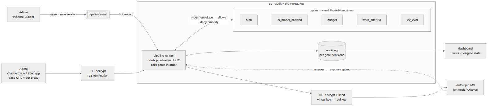
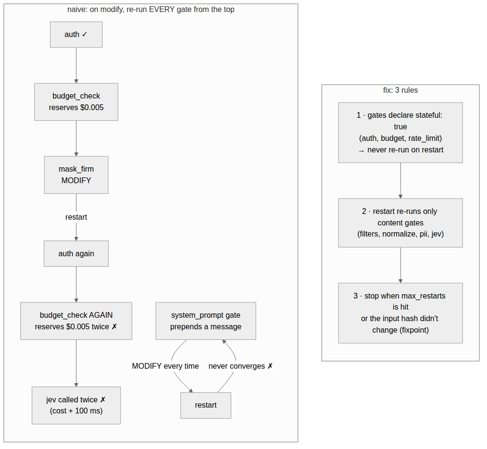
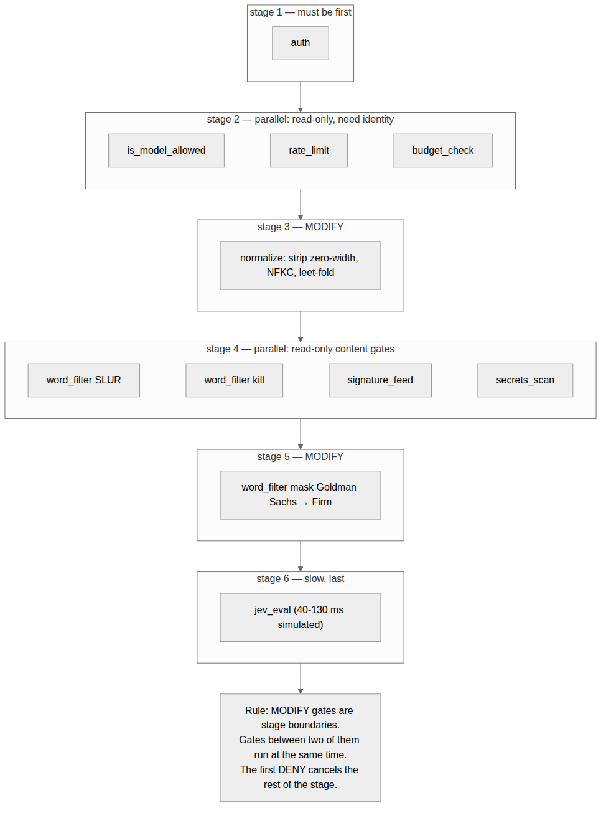

# Gate pipeline (L2 audit layer): review

> **One-liner:** *No AI request leaves the firm without clearance.* The pitch kit, with the judge summary, click path and Q&A, is in **[`PITCH.md`](PITCH.md)**.

> **Verdict: build it.** A line of gates that each answer allow / deny / modify is the right core. It's easy to explain,
> easy to test and easy to split across 6 people. It is also exactly the "audit layer" the judges asked about.
> It has about a dozen holes, but each has a small fix. The five that would actually bite in the demo:
> 1. **config in headers** (breaks on Polish characters),
> 2. **restart-on-modify** (double budget reservation, possible infinite loop),
> 3. **undefined behaviour when a gate is down**,
> 4. **no checks on the model's answer**,
> 5. **a new HTTP client per call** (~48 ms each; measured).
>
> Files in this folder:
> - [`contract.md`](contract.md): the gate API, 1 page.
> - [`pipeline.example.yaml`](pipeline.example.yaml): your word-filter example, written out.
> - [`mockups/pipeline-builder.html`](mockups/pipeline-builder.html): admin builder plus request simulator, published at https://claude.ai/artifact/LFZfw2beasERryqkeCcoyE (private; share it from the page's Share menu).
> - [`bench/RESULTS.md`](bench/RESULTS.md): latency numbers.
> - [`diagrams/`](diagrams/): the diagrams below.

## 1. What's strong (keep it)

- **Judges see the audit layer directly.** A request walks a line of gates, and each gate leaves a decision plus a reason. One trace table shows it all. That is what they asked about.
- **Admins compose policy without code.** The same gate type is reused with different configs (word_filter ×3), the way firewall or WAF rule chains work.
- **One small contract.** Each gate can be tested on its own (input + config → decision), and a new gate takes about an hour. Six people can build gates in parallel without touching each other's code.
- **Gates are services.**
  - A crashing JEV doesn't take the pipeline down.
  - Each scales on its own: JEV on GPU nodes, filters stay tiny.
  - Any vendor or open-source detector (Presidio, Llama Guard, a SaaS API) is "just another gate", which makes a vendor-neutral story.
- **Live config is the judges' favourite poke.** They edit the pipeline, and the next request follows it.
- **Cost ordering comes naturally.** Cheap deterministic gates run first and the expensive AI gate (JEV) last. That puts the "hybrid deterministic + semantic" requirement on screen.
- **It matches proven designs:** Envoy filter chains with ext_authz/ext_proc, ICAP adaptation, and the OWASP Agent Control Standard (allow / deny / modify / ask / defer). Say "we follow ACS's decision vocabulary" in the pitch.

## 2. Holes, ranked, each with a fix

| # | Hole | What goes wrong (concretely) | Fix | Effort |
|---|---|---|---|---|
| 1 | **Config in HTTP headers** | Tested: `"replacement": "Firma Ś"` in a header makes httpx raise `UnicodeEncodeError`. Sent as raw UTF-8 bytes, it arrives as `Firma Å\x9a`. Lists such as word lists get awkward. Headers end up in access logs, and nginx rejects header lines over 8 KB by default | Send one JSON **envelope** in the body: `input` + `config` + `context`. Keep only trace id, gate id, version and token in headers ([`contract.md`](contract.md)) | 15 min |
| 2 | **Gates can't see what earlier gates found** | budget_check and is_model_allowed need the user that auth identified. With "body = request, headers = config" there's no channel for that | Add `context` to the envelope. Only the pipeline writes it, and only from gates allowed to provide a field (auth → identity) | 30 min |
| 3 | **Restart-on-modify traps** | A restart re-runs auth and budget_check, so the budget is **reserved twice**. JEV is called twice (cost + ~100 ms). A non-idempotent gate (e.g. one that prepends a system prompt) **loops forever** | Gates declare `stateful`, and those never re-run. A restart re-runs only content gates. Stop at `max_restarts` or when the input hash stops changing. Diagram below | 30 min |
| 4 | **Gate down = undefined** | JEV times out: is that allow or deny? Today each gate would decide differently | Per gate: `timeout_ms` + `on_error: deny / allow / skip`, default **deny**. The audit records `error` and what was done. Judges will kill a service to test this | 20 min |
| 5 | **Only the request is checked** | The model can output PII, "Goldman Sachs", a markdown-image exfiltration link or a dangerous tool call, and nothing sees it. The budget can't be settled either | A `response:` gate list with the same contract (`phase: response`). For now, buffer streamed answers, as `claude-proxy` already does | 1 h |
| 6 | **Budget is check-then-charge** | `claude-proxy/l2_audit.py` checks `spent + worst > budget` and charges after the answer. Ten parallel requests all pass the check and overspend together | budget_check **reserves** with an atomic increment (a dict + `asyncio.Lock` for the demo, Redis/Valkey later); budget_settle fixes it to the real usage | 1 h |
| 6b | **A deny on the answer leaks the reservation** (found while building the mockup) | If a response gate (e.g. a leak filter) denies before `budget_settle` runs, that request's reservation is never released, and the user's budget shrinks by money that was never spent | The runner calls `budget_settle` (and writes the audit record) in a `finally` block, whatever happened before it: deny, gate error or upstream error | 15 min |
| 7 | **Admin can build a broken pipeline** | Remove auth: everything is anonymous. budget_check before auth: no user to charge. JEV before the cheap filters: you pay JEV for requests a regex would deny. A normalizer after the filters: `S​LUR` with a zero-width space walks through | `pinned` gates (auth first, budget_settle last). Gates declare `needs` / `provides` in `/describe`, and the builder validates the order and shows warnings. See the mockup | 1 h |
| 8 | **A modify can rewrite anything** | A buggy or compromised gate returns a body with another `model`, extra `tools`, a new `system` prompt, or invalid JSON that the upstream rejects | Validate `output` against the API schema and diff it against `input`. A gate may only change the paths it declares (`messages[*].content`). Store the diff in the audit record | 45 min |
| 9 | **Filters run on raw JSON** | A regex over the serialized body can match keys, tool schemas or the system prompt, can break JSON escaping when masking, and rescans the whole history every turn | Gates work on the **text segments** of the messages, with role and path; the pipeline writes changes back. Optional `scope: [user, tool]` | 1 h |
| 10 | **Regex pitfalls** | `kill` blocks "skills". `SLUR` misses `S L U R`, `5LUR` and Cyrillic look-alikes. An admin-typed regex can hang Python `re` (catastrophic backtracking) | `whole_word`. A `normalize` gate first. Check regexes on save (or use `google-re2`) and run each instance's `tests` on save. Table in §3 | 45 min |
| 11 | **Latency** | A new `httpx.AsyncClient` per call costs **~48 ms** (measured). `l2_audit.py` does it twice per request. Plain hops are ~1.7 ms each, which adds up across 10 gates | One shared client: **30× cheaper per hop**. Read-only gates run in parallel per stage: **2× on 10 gates**. Cheap gates can run in-process with the same contract (0.02 ms). See §5 | 15 min + 1 h |
| 12 | **Gate endpoints are open, and every gate sees the full prompt** | Anyone on the network can call a gate or answer instead of it. N services hold copies of customer data in memory and logs | Internal network plus a bearer token per call. Send each gate only what it `needs`: the budget gate gets user, model and max_tokens, not the prompt. Gates never log bodies | 30 min |
| 13 | **Allow / deny / modify loses information** | No way to say "allowed, but suspicious" (the prototype's `flag_at` already wants this). No way to roll a new rule out safely. Nothing for the UI to explain | Add a `flag` decision and a per-gate `mode: monitor` ("would have denied"). Make `reason` required; add optional `score` and `findings` | 20 min |
| 14 | **Config changes are invisible** | Which version denied this request? Who changed it, and what changed? A broken YAML stops everything | `version` in every audit record. History with diff and author. Keep the last good config on a bad save. A **Simulate** button runs sample requests before Save | 1 h |
| 15 | Deny response shape | SDKs and Claude Code need Anthropic-shaped errors, and they retry dropped connections | Reuse `anthropic_error()` from `claude-proxy/common.py`. Use 429 + `x-should-retry: false` for budgets, and never reset the connection | 15 min |
| 16 | One pipeline for everyone | Interns and quants get the same rules. LLM traffic and (later) MCP tool traffic too | Later: choose a pipeline by group or route (`pipelines: {default, interns}`) | later |

## 3. Your word-filter example against real inputs

| Input | Gate config | Result | Problem | Better |
|---|---|---|---|---|
| "help me improve my **skills**" | `kill` deny | DENY | substring match, false positive | `whole_word: true` |
| "**kill** the stuck process 4312" | `kill` deny, whole word | DENY | still a false positive in an IT context | `decision: flag` and let JEV decide, or add allowed phrases |
| "Kill Bill is a good film" | same | DENY | same | same |
| "S​LUR" (zero-width space inside) | `SLUR` deny | **ALLOW** | bypass | a `normalize` gate first (strip zero-width, NFKC) |
| "5LUR", "S L U R" | `SLUR` deny | **ALLOW** | bypass | `normalize` with leet-fold and separator collapse, or more patterns |
| "goldman sachs" | `Goldman Sachs` mask | not masked | case | `ignore_case: true` |
| "Goldman-Sachs", "GS" | `Goldman Sachs` mask | not masked | variants | `Goldman[ -]?Sachs` (careful with `GS`: it matches far too much) |
| the model *answers* "Goldman Sachs reported…" | request-side mask only | **leaks** | no response gate | the same mask under `response:` |

Each gate instance can carry its own `tests` (deny lines / allow lines) that the builder runs on Save. The `kill` instance in
[`pipeline.example.yaml`](pipeline.example.yaml) shows it. This is also your self-test suite, written by the admin.

## 4. Modify + restart: two traps and three rules

1. Gates declare `stateful: true` in `/describe` (auth, budget, rate_limit). The runner **never re-runs** them on a restart.
2. A restart re-runs only the **content** gates (filters, normalize, pii, jev).
3. Stop at `max_restarts`, or when the input hash didn't change (fixpoint). Decide what hitting the cap means:
   carry on with the latest input (the mockup does this), or deny under a strict policy. Recommended default: `on_modify: continue`, and put `normalize` early so restarts are rarely needed.

## 5. Latency: measured, not guessed

| Calling N gates over HTTP (4-vCPU sandbox) | 1 gate | 10 gates |
|---|---|---|
| new `httpx.AsyncClient` per call (what `l2_audit.py` does today) | 49.6 ms | 539 ms |
| one shared client, serial | 1.7 ms | 17–26 ms |
| shared client, parallel, separate gate processes | — | 13 ms |
| in-process function, same contract | 0.02 ms | 0.16 ms |

Rules:
- Use **one** client.
- Put cheap gates first and JEV last.
- Run read-only gates in parallel; modify gates are the stage boundaries.

Re-run [`bench/`](bench/RESULTS.md) on the demo Mac before quoting these numbers.

## 6. Easy improvements, in order

| # | Do this | Why | Effort |
|---|---|---|---|
| 1 | One shared `httpx.AsyncClient` (FastAPI lifespan) | −48 ms per hop, measured | 15 min |
| 2 | JSON envelope in the body (`input`, `config`, `context`) | fixes holes 1 and 2 | 15–30 min |
| 3 | `reason` required + `flag` decision + `mode: monitor` | an explainable audit trail and safe roll-out | 20 min |
| 4 | `timeout_ms` + `on_error` per gate, default deny | fail-closed story | 20 min |
| 5 | `id` per gate instance, written into the audit record with `pipeline.version` | per-instance stats and "which version decided" | 15 min |
| 6 | `response:` gate list (mask + budget_settle) | output checks and real budgets | 1 h |
| 7 | Restart guard: `stateful` gates skipped, `max_restarts`, fixpoint | no double reservation, no infinite loop | 30 min |
| 8 | `/describe` with `config_schema`, `needs`, `provides`, `modifies` | auto-generated builder forms and order validation | 1 h |
| 9 | `tests` per gate instance, run on Save; `POST /simulate` = run the pipeline without the upstream call | self-testing (15–20% of the score) and safe config edits | 1 h |
| 10 | Read-only gates in parallel per stage | 2× fewer ms on 10 gates | 1 h |

## 7. Gates to include

**MVP** = worth having for the demo. **Next** = if time allows. Several already exist inside `claude-proxy/l2_audit.py` and only need to be cut out into gates.

| Gate | Phase | Returns | Main config | Why (GS requirement) | Priority |
|---|---|---|---|---|---|
| `auth` | request | allow / deny (+ identity) | keys or JWT issuer | authentication, identity for the other gates | MVP (exists) |
| `is_model_allowed` | request | allow / deny | allowed models per team | "allowed LLM models" | MVP (exists) |
| `budget_check` / `budget_settle` | req / resp | allow / deny | price table, estimate | budgets (reserve, then real usage) | MVP (exists, fix the race) |
| `param_clamp` | request | modify | max_tokens cap, strip unknown params | runaway cost | MVP (10 min) |
| `normalize` | request | modify | strip zero-width / tag chars, NFKC, leet-fold | makes every filter harder to bypass | MVP |
| `word_filter` | both | deny / modify / flag | pattern, decision, replacement, whole_word, ignore_case | deterministic control, "block vs redact" | MVP |
| `pii_mask` | both | modify / deny | email, PESEL (checksum), IBAN, card (Luhn) | privacy, data leakage | MVP |
| `secrets_scan` | both | deny / modify | AWS / GitHub keys, private keys, entropy | data leakage | MVP |
| `signature_feed` | request | deny / flag | feed URL, min severity | **historical attacks fed from an external system** (explicit GS requirement). Reuse the word_filter engine with rules from [`examples/feed/signatures.yaml`](../examples/feed/signatures.yaml) | **MVP** (missing in your list) |
| `jev_eval` | both | deny / flag | block_at, flag_at | AI-based (semantic) control | MVP (exists) |
| `rate_limit` | request | deny | requests per minute per user | denial of wallet | next |
| `topic_policy` | request | deny | banned topics (e.g. investment advice) | business policy | next |
| `output_links` | response | modify | allowed hosts | markdown-image exfiltration (EchoLeak-style) | next |
| `tool_guard` | response | deny / modify | allowed tools, argument rules, destructive = deny | agentic risk: an agent calling tools it shouldn't | next (high judge value) |
| `system_prompt` | request | modify | text to prepend | governance instructions. Not idempotent: the restart trap | next |
| `artifact_scan` | own route | deny | pickle allowlist, fail closed | unsafe deserialization, model supply chain (GS requirement) | next |
| *audit* | built into the runner, **not a gate** | — | — | an admin must not be able to remove the log | MVP |

## 8. Does it cover what GS asks for?

| GS asks for | Pipeline answer | Still to do |
|---|---|---|
| One central policy (thresholds, block vs redact, models, budgets) | `pipeline.yaml` plus per-gate config (`decision: deny/mask/flag`, `block_at`) | strictness presets (e.g. a default `mode`) |
| Deterministic + AI controls | word_filter, pii, secrets, auth, allowlist + jev_eval | say that JEV is simulated today |
| Budgets for external APIs and local models | budget_check / budget_settle with a price table | reservation; a price per GPU-second for local models |
| Historical attacks from an external feed | `signature_feed` gate | add it |
| Reporting for security and management | one audit record per request with every gate's decision → dashboard | trace view, per-gate stats, spend, CSV/JSONL export |
| Self-testing suite (allowed + blocked cases) | per-gate tests + `/simulate` golden traces | write them as you build each gate |
| agent→LLM, agent→MCP, agent→agent | LLM: yes | tool_guard on answers. MCP is a second entry point using the same gates (later) |

## 9. What the judges will poke, and what they should see

| They… | They should see |
|---|---|
| type a slur variant or a jailbreak | the trace: which gate denied it, why, and in how many ms |
| change `kill` to `flag` in the builder | the next request follows it; the audit says `v13` |
| stop the JEV service | `on_error: deny` → "JEV unavailable, fail closed" in the trace |
| remove auth | the builder refuses (pinned) |
| ask for the overhead | per-gate ms in the trace + [`bench/RESULTS.md`](bench/RESULTS.md) |
| run the tests | per-gate tests + golden traces, all green |

## 10. Suggested build order

1. **Freeze the contract** (envelope + answer, [`contract.md`](contract.md)). 30 min, everyone.
2. **Runner:**
   - load the YAML, loop with one client, timeouts and `on_error`, short-circuit;
   - one audit record per request with the trail;
   - `POST /simulate`.

   1 person, ~2 h.
3. **Gates in parallel, one person each:**
   - auth + model (cut out of `l2_audit.py`);
   - budget (reserve/settle);
   - word_filter + normalize;
   - jev wrapper;
   - pii + secrets;
   - signature_feed.

   1–2 h each.
4. **Response phase** (mask + settle). 1 h.
5. **Builder UI** from the mockup: YAML out, Simulate, Save, version bump. ~3 h.
6. **Dashboard:** audit trail table + per-gate stats + trace waterfall. ~2 h.
7. **Tests** all along: a `tests:` block per gate instance + 10 golden traces through `/simulate`.

## 11. Decide now

1. Config in a JSON body instead of headers? **Recommended: yes.**
2. Default `on_modify`? **Recommended: `continue`**, with `restart` as an option that re-runs only content gates, max 2.
3. Default `on_error`? **Recommended: `deny`** (fail closed) for every gate.
4. Add `flag` and `mode: monitor`? **Recommended: yes.** JEV's `flag_at` already needs it.
5. Response gates in the demo? **Recommended: yes**, mask + budget_settle, with streaming buffered.
6. Remote gates only, or in-process too? **Recommended:** one contract, remote by default; cheap gates in-process if time allows.

The mockup shows most of this working on fake data: an Overview with clickable explainer pins and a guided tour, a builder with a health check and YAML out, a request simulator with per-gate traces, and an audit trail. Its tests are in `mockups/tests/`.

