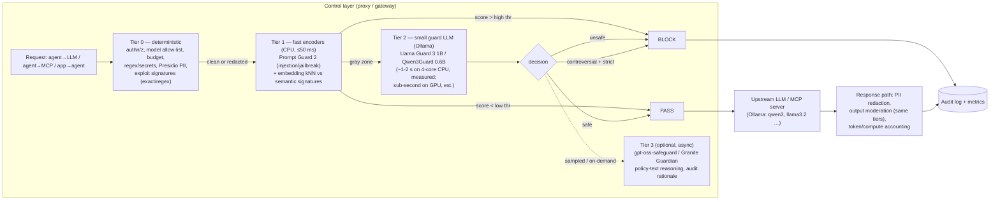
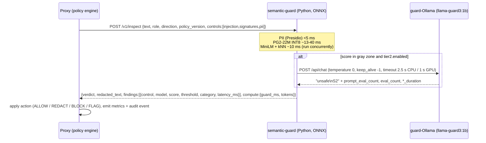

# R4 — Local models for the semantic (AI-based) guardrails, runnable on laptops

> **TL;DR**
> 1. Build a **cascade**, not "one guard model": deterministic rules → **tier-1 encoder classifier** (Prompt Guard 2 22M, ONNX INT8, ~10-40 ms on CPU) → **tier-2 small guard LLM** only for gray-zone cases (Llama Guard 3 1B via Ollama, or Qwen3Guard-Gen-0.6B for multilingual/Polish + "strict/loose" mode) → optional **tier-3 policy-reasoning LLM** (gpt-oss-safeguard:20b, only on the strongest laptop, async).
> 2. **Semantic signatures = embeddings + kNN** (all-MiniLM-L6-v2, 22M, Apache-2.0): a signature feed is just text → vectors, so judges can edit the feed live and see effect without retraining. **PII = Presidio (regex + checksums, incl. `PL_PESEL`) + optional GLiNER** — not an LLM.
> 3. **Ollama is the right runtime** for all generative models: OpenAI-compatible `/v1/chat/completions` + `/v1/embeddings`, **Anthropic-compatible `/v1/messages` since v0.14.0**, and native responses carry `prompt_eval_count`/`eval_count` + nanosecond durations → free compute accounting for the budget engine.
> 4. On a 4-vCPU box we **measured** (architecture-equivalent, random weights): Prompt-Guard-2-22M-class classifier 13 ms @64 tok / 40 ms @200 tok (INT8 ONNX); 86M-class 31 / 75 ms; **1B guard LLM ≈ 1.6-2.2 s per call** (prefill ~210-290 tok/s), **8B guard ≈ 20 s per call** → 8B guards (Llama Guard 3 8B, Granite Guardian 8B) are GPU/M-series-only; on CPU the LLM tier must be escalation-only.
> 5. Gotchas: HF repos for Meta models are **gated** (accept license + HF token *before* the event); **Llama Guard 4 is multimodal → Llama 4 AUP withholds rights from EU-domiciled individuals/companies** (we are in Poland — skip it); LLM Guard + ProtectAI models were **archived July 2026**; Ollama in Docker on macOS gets **no Metal GPU** → run Ollama natively on Macs.

---

## 0. Scope, method and verification caveats

- Scope: every local model we could use for the *semantic* controls (prompt-injection/jailbreak detection, content-safety moderation, policy reasoning, PII NER, semantic signature matching) plus the small LLMs we need for the *demo agent* and *LLM-as-judge*, and the runtimes that serve them.
- Verification: the research sandbox **blocks huggingface.co, ollama.com, docs.ollama.com, arxiv.org, ai.google.dev, llama.com, openai.com, nvidia.com docs** for direct fetching. I therefore used (a) primary documents mirrored on GitHub (Meta PurpleLlama model cards, Ollama `docs/` in the `ollama/ollama` repo, IBM `granite-guardian` README, `QwenLM/Qwen3Guard`, OpenAI cookbook, llama.cpp server README, Presidio docs), and (b) web-search result snippets of HF/Ollama pages. Anything that came only from a secondary snippet is marked *(via search snippet)*; anything I could not confirm at all is marked **UNVERIFIED**.
- Latency numbers in §9 were **measured in this sandbox** (Intel Xeon @2.8 GHz, 4 vCPU, 15 GB RAM, no GPU) using **architecture-equivalent random-weight models** (ONNX Runtime 1.30 for encoders; llama.cpp built from source for decoder LLMs). Speed is data-independent, so these are honest CPU-latency numbers; accuracy obviously is not. A typical 2024-2026 laptop (8-12 performance cores, or Apple M-series) should be roughly 1.5-3x faster than this box — re-measure on the team's laptops with the same scripts (see §9.4).

---

## 1. Where models sit in the control layer



Design rules that follow from the numbers below:
- **Every tier is optional and policy-driven** (`semantic.tier1.enabled`, thresholds, fail-open/fail-closed per tier). Judges will toggle these live; a model that is "disabled" must cost 0 ms.
- **Escalate, don't stack**: only gray-zone tier-1 scores go to tier 2. With good thresholds, >90% of traffic should never touch an LLM guard (design target, not measured).
- **Same tiers on the response path** (output moderation, PII in responses, tool-call arguments).
- **Models are services**: tier-1 encoders in-process (ONNX Runtime) inside a Python "semantic-guard" microservice; generative guards behind Ollama's HTTP API. The proxy (whatever language) calls them over HTTP/gRPC with a strict timeout.

### 1.1 Proposed `semantic-guard` service contract (one call per message)



Response shape (proposal) — each finding is directly a dashboard/audit row:
```json
{"verdict":"BLOCK","policy_version":"2026-10-03T14:02:11Z#a1b2",
 "findings":[
  {"control":"prompt_injection","tier":1,"model":"prompt-guard-2-22m@int8","score":0.97,"threshold":0.90,"action":"BLOCK","latency_ms":21},
  {"control":"semantic_signature","tier":1,"model":"all-minilm-l6-v2","match":"SIG-JB-0042","score":0.86,"threshold":0.80,"action":"FLAG","latency_ms":9},
  {"control":"pii","tier":0,"engine":"presidio","entities":[{"type":"PL_PESEL","action":"REDACT"}],"latency_ms":3}],
 "compute":{"guard_llm_ms":0,"guard_tokens_in":0,"guard_tokens_out":0}}
```

---

## 2. Tier-1 fast classifiers (prompt injection / jailbreak)

| Model | Params | License / restrictions | Where | Input | Output | Published accuracy | CPU latency (~200 tok) | Memory |
|---|---|---|---|---|---|---|---|---|
| **Llama Prompt Guard 2 22M** (`meta-llama/Llama-Prompt-Guard-2-22M`) | 22M backbone (DeBERTa-v3-xsmall) + ~48M embeddings (est.) | Llama 4 Community License (text-only → no EU multimodal clause); HF **gated** | HF (transformers); export to ONNX yourself | 512-token window; split longer input and scan segments in parallel | binary `BENIGN` / `MALICIOUS` + score | AUC (EN) .995; Recall@1%FPR (EN) 88.7%; APR@3% utility loss 78.4%; 19.3 ms on A100 @512 tok | **~40 ms INT8 / ~58 ms FP32 (4 vCPU, measured, arch-equivalent)**; ~13 ms @64 tok | ~75 MB INT8 / ~300 MB FP32 file |
| **Llama Prompt Guard 2 86M** (`…-86M`) | 86M backbone (mDeBERTa-base) + ~190M embeddings (est.) | same | HF | same; **multilingual** | same | AUC (EN) .998; Recall@1%FPR 97.5%; APR 81.2%; 92.4 ms on A100 @512 | **~75 ms INT8 / ~174 ms FP32** @200 tok; ~31 ms INT8 @64 tok (4 vCPU, measured, arch-equivalent) | ~280 MB INT8 / ~1.1 GB FP32 (est.) |
| **ProtectAI deberta-v3-base-prompt-injection-v2** | 184M | Apache-2.0; **unmaintained** (LLM Guard + ProtectAI HF models archived Jul 2026) | HF, ships an `onnx/` subfolder | 512 tok, English only | `SAFE`/`INJECTION` (0/1) | acc 95.25%, P 91.59%, R 99.74%, F1 95.49% on unseen data *(via search snippet)*; **does not detect jailbreaks, EN only** | LLM Guard benchmark: 104 ms avg on AWS m5.xlarge (4 vCPU) with ONNX, 213 ms without, "input length 384" (unit unstated) | ~740 MB FP32 |
| **NemoGuard JailbreakDetect** (`nvidia/NemoGuard-JailbreakDetect`) | Random forest on 768-d embeddings of `Snowflake/snowflake-arctic-embed-m-long` | NVIDIA model license (commercial use allowed per NIM card; exact license **UNVERIFIED**); arctic-embed needs `trust_remote_code` | HF (`snowflake.onnx`) + NeMo Guardrails jailbreak server (`/model`, port 1337, CPU default) | text up to 2048 tok (embedding) | bool + probability | "best known publicly available jailbreak detector at release" (vendor claim) | embedding-dominated: ~BERT-base class (~100+ ms @200 tok on 4 vCPU, est.) | ~0.5 GB |
| **Granite Guardian HAP 38M / 125M** (`ibm-granite/granite-guardian-hap-38m`) | 38M / 125M | Apache-2.0 | HF | short text | hate/abuse/profanity score | IBM positions them for "stricter cost, latency, or throughput requirements" | 38M ≈ MiniLM class: ~10-15 ms | <200 MB |

Key facts and interpretation:
- Prompt Guard 2 classifies a prompt as malicious "if the prompt explicitly attempts to override prior instructions"; unlike Prompt Guard 1 it **drops the separate "injection" label** for unintentional instruction-following. So it is a **jailbreak/direct-injection detector**, weaker on *indirect* injection hidden in tool output/RAG documents — we must still scan tool results, but expect lower recall there. Meta also warns about adaptive attacks. (PurpleLlama model card.)
- 22M vs 86M: 22M "reduces latency and compute costs by 75%, with minimal performance trade-offs" in English but has a "larger performance gap … on multilingual data". Evaluated languages: EN, FR, DE, HI, IT, PT, ES, TH — **Polish is not in the eval list** (judges in Kraków may type Polish!). Plan: 22M for English hot path, 86M when a cheap language-ID says non-English, or run 86M only as tier-1.5.
- The ProtectAI model is the classic Apache-2.0 fallback (no gating, ONNX included), but the repo now says "This project and its associated models on Hugging Face are no longer under active development or maintained" — fine for a hackathon, bad story for "production-grade" pitch. Mention as alternative only.
- NemoGuard JailbreakDetect's architecture (**frozen embedding + tiny classifier**) is exactly the pattern we can replicate for **our own trainable/updatable signature detector** (§6): embeddings + logistic regression/kNN, retrained in seconds from the signature feed.

**Output shaping for the policy engine**: all tier-1 models output a probability; map to policy knobs:
```yaml
semantic:
  prompt_injection:
    model: prompt-guard-2-22m
    block_threshold: 0.90      # ≥ → BLOCK (deterministic, explainable)
    escalate_threshold: 0.50   # [0.50, 0.90) → tier-2 guard LLM
    on_timeout: fail_closed    # or fail_open per environment
    max_latency_ms: 80
```

---

## 3. Tier-2 guard LLMs (content safety; used for gray-zone escalation)

### 3.1 Comparison table

| Model | Size | License | Ollama (exact tag, default quant, size) | Output | Categories | Published numbers | Notes |
|---|---|---|---|---|---|---|---|
| **Llama Guard 3 1B** | 1.12B (pruned: 12 layers, MLP 6400) | Llama 3.2 Community License | `llama-guard3:1b` (= `1b-q8_0`, **1.6 GB**); `1b-q4_K_M` 955 MB, `1b-q4_K_S` 923 MB, q3 variants 755-845 MB *(via search snippet)* | `safe` or `unsafe\nS1,S10` | S1-S13 (MLCommons hazards; 1B card lists 13) | EN response classification F1 0.899 / FPR 0.090 (vs 8B 0.939 / 0.040) | 8 languages (EN FR DE HI IT PT ES TH). Best "small + standard taxonomy" option on Ollama. |
| **Llama Guard 3 8B** | 8B | Llama 3.1 Community License | `llama-guard3:8b` (Q4_K_M, **4.9 GB**) | same | S1-S14 incl. **S14 Code Interpreter Abuse** | F1 0.939, AUPRC 0.985, FPR 0.040 (EN responses); INT8 F1 0.936 | Trained also on search-tool calls & code-interpreter abuse — relevant for agents. GPU/M-series only for interactive. |
| **Llama Guard 4 12B** | 12B dense (pruned from Llama 4 Scout, shared expert only) | Llama 4 Community License — **multimodal: rights not granted to EU-domiciled individuals or EU-HQ companies** | No official Ollama tag found (**UNVERIFIED**); HF transformers | `safe`/`unsafe` + codes | S1-S14, text + multi-image | EN: recall 69%, FPR 11%, F1 61% (+8 F1 vs LG3 on their set) | **Skip**: too big for laptops, EU restriction, no clear GGUF path. |
| **IBM Granite Guardian 3.0** (Ollama) | 2B / 8B | Apache-2.0 | `granite3-guardian:2b` (**2.7 GB**), `granite3-guardian:8b` (~5.8 GB default; q5_K_S 5.6, q8_0 8.7) *(via search snippet)* | single token `Yes`/`No` | harm, social bias, jailbreak, violence, profanity, sexual, unethical; RAG groundedness / context relevance / answer relevance | see IBM repo | Oldest generation but the **only Granite Guardian with an official Ollama tag** we found. |
| **Granite Guardian 3.1 / 3.2 / 3.3** | 3.1: 2B, 8B; 3.2: **5B** and **3B-A800M (MoE, 800M active)**; 3.3: 8B (hybrid think) | Apache-2.0 | HF; community GGUFs (e.g. `mrutkows/granite-guardian-3.3-8b-GGUF`) **UNVERIFIED quality** | 3.2 adds verbalized confidence; 3.3 `<think>`/`<score>yes\|no</score>` | + **function-calling hallucination** (agentic), 3.2 adds 2 new risks | 3.3: #3 LLM-AggreFact, #1 REVEAL (IBM claim) | 3.2-3B-A800M is the interesting CPU candidate (MoE, low active params) — GGUF availability **UNVERIFIED**. |
| **Granite Guardian 4.1 8B** (Apr 2026) | 8B | Apache-2.0 | Docker Model Runner `ai/granite4.1-guardian` (4.8 GB GGUF); Ollama tag **UNVERIFIED** | `<think>…</think><score>yes\|no</score>`; `<no-think>` mode for lowest latency | pre-baked harm/jailbreak/groundedness/**function-call hallucination** + **Bring-Your-Own-Criteria** | FC Reward Bench balanced acc 0.79 (no-think) vs 0.74 (3.3); JETTS 70.29 | English only. Best open model for **validating agent tool calls against tool schemas** (pass `available_tools=`). 8 B → GPU. |
| **ShieldGemma** | 2B / 9B / 27B (Gemma 2) | Gemma Terms of Use + Prohibited Use Policy | `shieldgemma:2b` **1.7 GB**, `:9b` 5.8 GB, `:27b` 17 GB (Q4_K_M) *(via search snippet)* | first token `Yes`/`No`; intended **scoring mode** = P(Yes) | only 4 harm types: sexually explicit, dangerous content, hate, harassment | SG-9B +10.8% avg AU-PRC vs LlamaGuard1; 9B/27B only +1.2/1.7% AU-PRC over 2B | One policy per call → N calls for N policies. Probability output pairs nicely with Ollama `logprobs`. |
| **ShieldGemma 2** | 4B (Gemma 3) | Gemma terms | HF | Yes/No probs | **image** safety (sexual, dangerous, violence/gore) | — | Only if we do image inputs. Out of scope. |
| **Qwen3Guard-Gen** (Sep/Oct 2025) | **0.6B**, 4B, 8B | Apache-2.0 *(via HF metadata snippets; GitHub repo shows no LICENSE file)* | No official Ollama tag found; community GGUFs (QuantFactory, Hayanie, …) e.g. `ollama run hf.co/Hayanie/Qwen3Guard-Gen-0.6B-GGUF:Q4_K_M` (**UNVERIFIED** template correctness) | `Safety: Safe\|Unsafe\|Controversial` + `Categories: …` (+ `Refusal: Yes\|No` for responses) | Violent, Non-violent Illegal Acts, Sexual Content, **PII**, Suicide & Self-Harm, Unethical Acts, Politically Sensitive, Copyright Violation, **Jailbreak** | Tech report: best on 8/14 public English benchmarks; 0.6B "rivals much larger models" | **119 languages incl. Polish**. Tri-class output maps 1:1 to a **strict/loose policy knob** (strict = Controversial→Unsafe). |
| **Qwen3Guard-Stream** | 0.6B, 4B, 8B | Apache-2.0 | transformers only (custom token-classification head) | per-token risk level + category | same 9 | — | **Streaming output moderation** (cut the stream mid-generation). Needs transformers + `trust_remote_code`; not Ollama. Stretch. |
| **AllenAI WildGuard** | 7B (Mistral-7B-v0.3) | Apache-2.0; HF gated (contact info) | no official Ollama tag (**UNVERIFIED**); `pip install wildguard` (vLLM default) | prompt harmful?, response harmful?, refusal? | 13 risk categories (paper) | beats open baselines by up to 26.4% F1 on refusal detection; matches GPT-4 | Too big for CPU; refusal detection is nice for "did the upstream comply?" metrics. Skip. |
| **NVIDIA Llama-3.1-Nemotron-Safety-Guard-8B-v3** | 8B (LoRA on Llama 3.1 8B) | NVIDIA Open Model License + Llama 3.1 license | HF / NIM; Ollama **UNVERIFIED** | JSON with user/response safety + categories | **23 categories** | multilingual: EN ES ZH DE FR HI JA AR TH | Skip (8B, no Polish). |
| **NVIDIA Nemotron-Content-Safety-Reasoning-4B** (Nov 2025) | 4B (Gemma-3-4B-it fine-tune) | NVIDIA Open Model License + Gemma terms | HF / NIM | safe/unsafe, reasoning on/off | **custom policies** | — | A smaller "bring-your-own-policy" alternative to gpt-oss-safeguard. GGUF **UNVERIFIED**. |

### 3.2 Prompt / output formats we must implement

**Llama Guard 3 (Ollama)** — Ollama's chat template wraps the conversation into Meta's format; we just send messages and parse:
```text
# request: POST /api/chat {"model":"llama-guard3:1b","messages":[{"role":"user","content":"<text>"}],"stream":false,"options":{"temperature":0}}
# response.message.content:
safe
# or
unsafe
S2,S7
```
Meta's raw format ("Task: Check if there is unsafe content in 'User'/'Agent' messages … BEGIN UNSAFE CONTENT CATEGORIES … BEGIN CONVERSATION … Provide your safety assessment for ONLY THE LAST User message … First line must read 'safe' or 'unsafe'. If unsafe, a second line must include a comma-separated list of violated categories.") allows **custom/removed categories** — to use a custom category list via Ollama, send the full raw prompt with `"raw": true` on `/api/generate`. Category map (S1-S14): Violent Crimes, Non-Violent Crimes, Sex-Related Crimes, Child Sexual Exploitation, Defamation, Specialized Advice, Privacy, Intellectual Property, Indiscriminate Weapons, Hate, Suicide & Self-Harm, Sexual Content, Elections, Code Interpreter Abuse.

**Qwen3Guard-Gen** — parse with the official regexes:
```python
safe_pattern = r"Safety: (Safe|Unsafe|Controversial)"
category_pattern = r"(Violent|Non-violent Illegal Acts|Sexual Content or Sexual Acts|PII|Suicide & Self-Harm|Unethical Acts|Politically Sensitive Topics|Copyright Violation|Jailbreak|None)"
```
Policy mapping: `strictness: strict` → Controversial ⇒ BLOCK; `loose` → Controversial ⇒ ALLOW (+ flag); a numeric "adherence %" can be implemented as: block if P(Unsafe)+α·P(Controversial) ≥ τ when logprobs are available.

**Granite Guardian 4.1 / 3.3** — final user message is a `<guardian>` block: mode selector (`<think>` or `<no-think>`), `### Criteria: <pre-baked or custom text>`, `### Scoring Schema: If the last assistant's text meets the criteria, return 'yes'; otherwise, return 'no'.` Output parsed from `<score>…</score>`. Tool schemas go into `apply_chat_template(..., available_tools=tools)`. IBM: "No-think mode is preferred on the hot path for low-latency yes/no gating." **Scope of use**: must be used strictly in this scoring mode; English only; reasoning traces may be unfaithful.

**ShieldGemma** — one policy per prompt, "Does the human question violate the above principle? Your answer must start with 'Yes' or 'No'." (template paraphrased from the model card — **verify exact text on-site**). Use P(Yes) from logprobs: Ollama's native API now exposes `logprobs` / `top_logprobs` (in `docs/openapi.yaml`), whereas the OpenAI-compat layer says logprobs are not supported — call the native `/api/generate` for scoring.

### 3.3 What to pick for tier 2

1. **Default: `llama-guard3:1b`** — official Ollama tag (no gating, pre-quantized), standard MLCommons taxonomy that judges recognize, small. Weakness: 8 languages (no Polish), F1 0.899.
2. **Multilingual / strictness demo: Qwen3Guard-Gen-0.6B** — Apache-2.0, 119 languages, Jailbreak + PII categories, tri-class output that *is* our "sensitivity threshold". Risk: not an official Ollama model → either a community GGUF (`hf.co/...`) whose chat template must be checked, or run via transformers on CPU (0.6B in FP32 ≈ 2.4 GB RAM). **Spike this in the first 2 hours**; keep LG3-1B as fallback.
3. **Agent tool-call validation (stretch)**: Granite Guardian (4.1 8B on the GPU laptop, or `granite3-guardian:2b` on CPU) for "function-call hallucination" + groundedness checks on agent→MCP traffic. This is a differentiator for the "agent→MCP" requirement.

---

## 4. Tier-3: policy-reasoning ("bring your own policy") models

| Option | Size / download | License | How it is driven | Fit |
|---|---|---|---|---|
| **gpt-oss-safeguard-20b** (Oct 29 2025, with ROOST) | 21B total / **3.6B active** (MoE, MXFP4); fits 16 GB VRAM; Ollama `gpt-oss-safeguard:20b` (≈14 GB, same as `gpt-oss:20b` — size **est.**) | Apache-2.0 | Policy text in the **system message**; 4 sections (Instruction, Definitions, Criteria, Examples); optimal **400-600 tokens**; output `0/1` or JSON `{"violation":1,"policy_category":"…","rule_ids":[…],"confidence":"high"}`; `reasoning_effort` low/medium/high; Harmony format | **Perfect live-config demo**: judge edits the policy text in YAML → next request is judged against the new text, with a rationale for the audit log. Too slow/heavy for hot path: OpenAI itself says it "may be more time and compute intensive" and to pre-filter with fast classifiers; "additional policies lead to small but meaningful degradations in accuracy". Run **async/sampled** on a 32 GB Apple-silicon or RTX laptop. |
| gpt-oss-safeguard-120b | 117B / 5.1B active; single H100 | Apache-2.0 | same | Not for laptops. Mention in pitch as the "enterprise tier". |
| Granite Guardian 4.1 8B BYOC | 4.8 GB GGUF | Apache-2.0 | `### Criteria:` free text | English-only; good for structured rules ("response must not contain account numbers"). |
| Nemotron-Content-Safety-Reasoning-4B | 4B | NVIDIA OML + Gemma terms | custom policy, reasoning on/off | Smaller BYOP option; GGUF/Ollama **UNVERIFIED**. |
| Small general LLM as judge (`qwen3:4b`, `phi4-mini`) + **JSON-schema structured output** (`format: <schema>` in Ollama) | 2.5 GB | Apache-2.0 / MIT | your own rubric prompt | Cheapest; weaker, but deterministic shape via schema. |
| **Ollama "System One" decision models** (`/v1/systemone`, Ollama ≥ **v0.35.0**, released ~Sep 28 2026) | e.g. `nimble` (9B, fine-tuned from Qwen3.5-9B per a search snippet) | **UNVERIFIED** | typed questions: `choice` (2-26 options → probabilities), `noul` (P(true)), `score` (ordinal expectation); returns `usage.input_tokens/output_tokens` | Calibrated probabilities are *exactly* what threshold knobs want. But it is 5 days old: **do not depend on it**; maybe a 1-slide "future work". llama.cpp's server README also lists `POST /v1/systemone`. |

Policy-file sketch that drives tier 3 (and stays judge-editable):
```yaml
semantic:
  policy_reasoner:
    enabled: false                 # judges flip this live
    model: gpt-oss-safeguard:20b
    reasoning_effort: low
    mode: async_audit              # async_audit | blocking_on_gray_zone
    policies:
      - id: GS-FIN-01
        title: "No disclosure of client positions"
        text: |                    # 400-600 tokens: instruction, definitions, criteria, 4-6 examples
          ...
```

---

## 5. PII detection (NER) — deterministic first, ML second

| Component | Size | License | What it detects | Latency | Notes |
|---|---|---|---|---|---|
| **Microsoft Presidio** (analyzer + anonymizer) | library | MIT | Pattern+checksum recognizers: `CREDIT_CARD` (checksum), `IBAN_CODE` (checksum), `EMAIL_ADDRESS`, `IP_ADDRESS`, `PHONE_NUMBER`, `CRYPTO`, US/UK/ES/IT/**PL (`PL_PESEL`, pattern+context+checksum)**/DE/SE/…; `PERSON`, `LOCATION`, `NRP` via NER | regex: sub-ms; NER: spaCy-dependent | Anonymizer supports replace/mask/hash/encrypt → "Redact" action. Docs reference a move to `data-privacy-stack/presidio` (repo links). |
| spaCy `en_core_web_sm` 3.8.0 | **12 MB** | MIT | PERSON/ORG/LOC… NER F 84.33 | few ms | Use this in hot path. |
| spaCy `en_core_web_lg` 3.8.0 | **382 MB** | MIT | NER F 85.54 | slower | Presidio's default model; barely better NER. Polish: `pl_core_news_*` exists (**size UNVERIFIED**). |
| **GLiNER** `urchade/gliner_multi_pii-v1` | mDeBERTa-base class (~0.2-0.3B, est.) | Apache-2.0 | zero-shot PII labels: person, organization, phone, address, passport, email, credit card, SSN, IBAN, DOB, … (50+ listed) | backbone ≈ mDeBERTa-base class: ~75 ms INT8 / ~174 ms FP32 @200 tok on 4 vCPU (measured class) + span head (est.) | **Built-in Presidio `GLiNERRecognizer`** (`pip install 'presidio-analyzer[gliner]'`); default chunking 250 chars / 50 overlap; multilingual. |
| `nvidia/gliner-PII` | 570M (GLiNER large-v2.1 base) | NVIDIA Open Model License *(conflicting snippet said Apache-2.0 — UNVERIFIED)* | 55+ PII/PHI categories | heavier (large) | Better recall, slower. Stretch. |
| `knowledgator/gliner-pii-*` (base 166M; edge/small variants) | 166M | **UNVERIFIED** (likely Apache-2.0) | 35 PII labels | — | A 2026 benchmark (RedactionBench) reports knowledgator `gliner-pii-large` best NER exact F1 = 0.712 *(via search snippet)* — i.e., ML PII is far from perfect → keep regex+checksum as the primary control. |

**Recommendation**: Tier 0 = Presidio pattern recognizers (+ our own secrets regexes: AWS keys, JWTs, private keys) with `en_core_web_sm`; Tier 1.5 (optional, per-policy) = GLiNER multi-PII on prompts > N chars or when `pii.mode: thorough`. Action per entity type from policy (`BLOCK` vs `REDACT` vs `ALLOW`), confidence threshold per type.

---

## 6. Embedding models for semantic-signature matching

Purpose: the task's "historical attack mitigation, signatures fed from an externally managed system". Exact/regex signatures catch literal payloads; **semantic signatures** catch paraphrases ("disregard prior directives…"). Mechanism: signature feed entries = `{id, text_examples[], threshold, action}` → embed once on feed load → cosine kNN against every prompt/tool-output chunk. **Hot reload = re-embed changed entries** (ms each) — no retraining, judge-editable, explainable ("matched SIG-2024-017 at 0.83").

| Model | Params / dim / ctx | License | Ollama tag (size) | CPU latency ~200 tok | Notes |
|---|---|---|---|---|---|
| **all-MiniLM-L6-v2** | 22.7M / 384 / 256 word-pieces | Apache-2.0 | `all-minilm` (**46 MB**; `all-minilm:33m` = L12 variant, size **UNVERIFIED**) | **~10 ms INT8, ~16 ms FP32 (measured, 4 vCPU, arch-equivalent)** | Default. English-centric. |
| bge-small-en-v1.5 | 33M / 384 / 512 | MIT | (not official; HF/ONNX) | ~21 ms INT8 / ~43 ms FP32 (measured class) | Better retrieval quality than MiniLM. |
| nomic-embed-text v1.5 | 137M / 768 (Matryoshka) / 8192 | Apache-2.0 | `nomic-embed-text` (**274 MB**) | BERT-base class ≈ 100+ ms | Long context (whole tool outputs). Needs `search_query:`/`search_document:` prefixes. |
| **EmbeddingGemma** (Sep 2025) | 308M / 768→128 (MRL) / 2048 | **Gemma terms** (not OSI) | `embeddinggemma` (**622 MB**) — Ollama's first "recommended" embedding model | heavier (~300M) | 100+ languages incl. Polish; <200 MB RAM quantized (Google claim). |
| granite-embedding (R1) | 30M English / 278M multilingual; 384 / 768; 512 ctx | Apache-2.0 | `granite-embedding:30m` (~63 MB), `:278m` (~563 MB) *(via secondary source)* | 30m ≈ MiniLM class | R2 (2025-2026): `small-english-r2` 47M/384-d/8192 ctx; `97m-multilingual-r2` 97M/384-d/32k ctx, 200+ languages (Apache-2.0) — R2 Ollama tags **UNVERIFIED**. |
| snowflake-arctic-embed-m-long | ~137M / 768 / 2048 (as used by NemoGuard) | Apache-2.0 (**UNVERIFIED**) | — | BERT-base class | Only if we reuse NemoGuard's RF. |

Implementation notes:
- Run embeddings **in-process via ONNX Runtime** (sentence-transformers export) for the hot path (no HTTP hop), or via Ollama `/api/embed` (returns L2-normalized vectors; `dimensions` and `truncate` params) for simplicity. Both fine at our scale.
- Store signature vectors in memory (numpy) — 10k signatures × 384-d × 4 B = 15 MB; brute-force cosine is < 1 ms. No vector DB needed (pitch: "pgvector/Qdrant at scale").
- Chunk long inputs (sliding window 256 tokens) and take max similarity — attackers bury injections inside long documents.
- Combine scores: `risk = max(PG2_score, sig_similarity_calibrated)`; record which signal fired.

---

## 7. Small general LLMs — LLM-as-judge and the "protected business LLM" for the demo agent

| Model | Ollama tag (default Q4_K_M) | Size | License | Tool calling | Role for us |
|---|---|---|---|---|---|
| Qwen3 0.6B | `qwen3:0.6b` | ~523 MB | Apache-2.0 | yes (Ollama docs' tool-calling examples use `qwen3`) | weak-laptop upstream; "thinking" toggle via `think` |
| Qwen3 1.7B | `qwen3:1.7b` | ~1.4 GB | Apache-2.0 | yes | CPU upstream default |
| **Qwen3 4B** | `qwen3:4b` | ~2.5 GB | Apache-2.0 | yes, good | **Recommended demo-agent model on CPU laptops**; also usable as JSON-schema judge |
| Qwen3.5 0.8B/2B/4B/9B (Mar 2026) | `qwen3.5:0.8b` … `:9b` (~1.0 / 2.7 / 3.4 / 6.6 GB) *(via search snippet)* | Apache-2.0 | native tools, thinking, vision | Newer alternative; verify tags on-site before relying on it |
| Llama 3.2 1B / 3B | `llama3.2:1b` (1.3 GB), `llama3.2:3b` (2.0 GB) | Llama 3.2 Community (text models fine in EU) | yes | Safe, well-known fallback |
| Gemma 3 1B / 4B | `gemma3:1b` (815 MB), `gemma3:4b` (~3.3 GB, **UNVERIFIED**) | Gemma terms | **no native tool support in Ollama** (prompt-engineered only) | avoid for the agent |
| Gemma 4 E2B / E4B (Apr 2026) | `gemma4:e2b` 7.2 GB, `gemma4:e4b` 9.6 GB; QAT ~4.3 / 6.1 GB *(via search snippet)* | **Apache-2.0** (first Gemma under Apache) | yes (needs newer Ollama) | big downloads for "edge" models (audio+vision) — skip on hackathon Wi-Fi |
| Phi-4-mini 3.8B | `phi4-mini` (2.5 GB) | MIT (not re-verified this session) | function calling per Microsoft's card (not re-verified) | CPU-friendly judge alternative; a 2026 roundup calls it "best CPU-only" *(secondary)* |
| Granite 4.0 Micro / H-Micro (3B), H-Tiny (7B/1B active) | `granite4` family (tags/sizes **UNVERIFIED**) | Apache-2.0 | H-Micro designed "to perform key tasks like function calling quickly within agentic workflows" | Good agent model; nice IBM-story pairing with Granite Guardian |
| gpt-oss 20B | `gpt-oss:20b` (~14 GB) | Apache-2.0 | yes | GPU/32 GB-Mac laptop only; makes the agent demo look "real" |

Demo-agent recommendation: **`qwen3:4b` on CPU laptops, `qwen3:8b`/`gpt-oss:20b` on the GPU/M-series laptop**, with `think: false` for latency. The agent's model is *not judged* — pick whatever does tool calls reliably on the demo machine; the control layer's model allow-list will make "switch to a forbidden model" a nice live demo.

---

## 8. Runtimes

### 8.1 Ollama (primary)

Verified from `ollama/ollama` `docs/`:

| Capability | Detail |
|---|---|
| Native API | `/api/chat`, `/api/generate`, `/api/embed`, `/api/tags`, `/api/ps`, `/api/show`, `/api/pull` … |
| OpenAI-compatible | `/v1/chat/completions` (streaming, JSON mode, vision, **tools**, reasoning control; **no logprobs**), `/v1/completions`, `/v1/models`, `/v1/models/{model}`, **`/v1/embeddings`** (`input` string/array, `encoding_format`, `dimensions`), **`/v1/responses`** (non-stateful, since **v0.13.3**) |
| **Anthropic-compatible** | **`/v1/messages`** — added in **v0.14.0** ("Anthropic API compatibility: support for the `/v1/messages` API"; GitHub release dated Jan 10 → 2026 by version chronology). Supports messages, streaming, system, multi-turn, base64 vision, tools + tool results, thinking. **Not supported**: `/v1/messages/count_tokens`, `tool_choice`, `metadata`, prompt caching, batches, URL images, PDFs, `budget_tokens` enforcement. Claude Code: `ANTHROPIC_AUTH_TOKEN=ollama ANTHROPIC_BASE_URL=http://localhost:11434`. "Token counts are approximations based on the underlying model's tokenizer." |
| Compute accounting fields (native responses) | `total_duration`, `load_duration`, `prompt_eval_count`, `prompt_eval_cached_count`, `prompt_eval_duration`, `eval_count`, `eval_duration` — **all durations in nanoseconds**; tokens/s = `eval_count / eval_duration * 1e9` |
| Concurrency | `OLLAMA_NUM_PARALLEL` (default **1**; RAM scales with `NUM_PARALLEL × CONTEXT_LENGTH`), `OLLAMA_MAX_LOADED_MODELS` (default **3 × #GPUs, or 3 on CPU**), `OLLAMA_MAX_QUEUE` (default **512**, then HTTP **503**), `OLLAMA_KEEP_ALIVE` (default **5 min**; `-1` = forever, `0` = unload; per-request `keep_alive` overrides) |
| Context | default by VRAM: <24 GiB → **4k**, 24-48 GiB → 32k, ≥48 GiB → 256k; override `OLLAMA_CONTEXT_LENGTH`. `ollama ps` shows CONTEXT and CPU/GPU split. |
| Memory knobs | `OLLAMA_FLASH_ATTENTION` (auto), `OLLAMA_KV_CACHE_TYPE` = `f16` (default) / `q8_0` (~½) / `q4_0` (~¼) |
| Other useful | structured outputs (`format`: `"json"` or a JSON schema), `think` (bool or `"low"\|"medium"\|"high"\|"max"`), native `logprobs`/`top_logprobs`, `/api/embed` returns L2-normalized vectors, `OLLAMA_MODELS` sets model dir, Docker image `ollama/ollama` (`-v ollama:/root/.ollama -p 11434:11434`), new `/v1/systemone` decision endpoint (v0.35.0+). |
| Latest version | v0.35.1 (Sep 29 2026) per GitHub releases page (a v0.40.0 pre-release also listed). |

Implications for the control layer:
- **Our proxy must speak three dialects** if it fronts arbitrary agents: OpenAI chat-completions, OpenAI responses, Anthropic messages. Ollama already implements all three upstream, so the proxy can **pass through** to Ollama while parsing `model`, `max_tokens`, `messages` for policy, and reading `usage` from responses (OpenAI: `usage.prompt_tokens/completion_tokens`; Anthropic: `usage.input_tokens/output_tokens`; native: `prompt_eval_count/eval_count`).
- **Budget for local models = tokens AND compute-seconds**: charge `prompt_eval_duration + eval_duration` (ns) per user/team; `load_duration` reveals cold starts (attribute to platform, not user). This directly answers "budget governance for locally hosted models (compute time)".
- **Streaming accounting**: for OpenAI-compat streaming, request `stream_options: {"include_usage": true}` — support in Ollama's compat layer is **UNVERIFIED**; the native API's final chunk always carries the counts. Fallback: count tokens ourselves (tokenizer) and reconcile.
- Set `OLLAMA_KEEP_ALIVE=-1` (or `keep_alive: -1` per request) for guard models so the first judge's request doesn't eat a multi-second load; pre-warm at startup.
- **Prefix caching is our biggest CPU win for tier 2**: keep the static part of every guard prompt (policy text, category list) *first* and identical byte-for-byte, the variable text *last*; then only the new tokens are prefilled (≈2x faster per §9.2). Check `prompt_eval_cached_count` in responses to prove it works; with `OLLAMA_NUM_PARALLEL=1` there is a single slot, so alternating different guard prompts on the same model will evict the cache.
- Guard models and the business model compete for RAM and CPU → put guards on a **different laptop/Ollama instance** than the upstream business LLM where possible (it also makes "control layer is separate infrastructure" architecturally honest).

### 8.2 Alternatives

| Runtime | Why consider | Facts |
|---|---|---|
| **llama.cpp `llama-server`** | Finer control, **Prometheus `/metrics`** (`llamacpp:prompt_tokens_total`, `llamacpp:tokens_predicted_total`, `llamacpp:prompt_seconds_total`, `llamacpp:requests_processing` …), `-np/--parallel` slots, `-hf user/model:quant` download, `/v1/chat/completions`, `/v1/embeddings`, `/rerank`, `/tokenize`, **`/v1/messages` + `/v1/messages/count_tokens`** (PR #17570, merged Nov 28 2025), response `timings` (`prompt_n`, `predicted_n`, `prompt_ms`, `predicted_ms`, per-second rates) | MIT. Good if we want a metrics-scrapable inference tier for the dashboard. |
| **vLLM** | Production story for K8s/GPU ("scale-out tier") | CPU backend exists (x86, FP32/BF16; AVX512 historically required, later "recommended") — not a laptop tool. Use only in the pitch's "production deployment" slide. |
| **LM Studio** | GUI, MLX on Macs, OpenAI-compat + **Anthropic-compatible `/v1/messages` since 0.4.1** | Free for work since Jul 8 2025 (proprietary app). Fine for an individual's demo machine, not for our Docker story. |
| **ONNX Runtime (+ HF Optimum)** | Tier-1 encoders and embeddings in-process | `ORTModelForSequenceClassification.from_pretrained(id, export=True)`; dynamic INT8 via `ORTQuantizer` + `AutoQuantizationConfig.avx512_vnni(is_static=False, per_channel=False)` (use `.arm64(...)` on Apple silicon). Optimum's ONNX support now lives in the `optimum-onnx` package. Our measurement: dynamic INT8 gives ~1.4-2.5x speedup on CPU (§9). |
| Docker Model Runner | `docker model run ai/<model>`; has e.g. `ai/granite4.1-guardian` (4.8 GB) | OpenAI-compatible; alternative packaging (**details UNVERIFIED**). |

**macOS caveat**: Ollama docs list GPU passthrough for Docker only for NVIDIA (`--gpus=all`) and AMD (ROCm/Vulkan); Metal acceleration is documented for native installs. ⇒ On Macs, **run Ollama natively** and point containers to `http://host.docker.internal:11434`; in Docker on a Mac you get CPU-only inference.

---

## 9. Latency & memory: measured (sandbox) + published

### 9.1 Encoder classifiers / embedders (ONNX Runtime 1.30, batch 1, 4 vCPU Xeon 2.8 GHz)

Method: random-weight ONNX graphs with the **same layer count / hidden size / heads / FFN / vocab** as the real models (DeBERTa variants include the two extra disentangled-attention score matmuls per layer); median of 30 runs after warm-up; INT8 = `onnxruntime.quantization.quantize_dynamic(QInt8)`. Scripts: see §9.4.

| Architecture class (≈ real model) | Params | FP32 / INT8 file | 4 threads: 64 tok | 200 tok | 512 tok | 1 thread: 200 tok |
|---|---|---|---|---|---|---|
| MiniLM-L6-384 (all-MiniLM-L6-v2) | 22.4M | 89 / 22 MB | 7.9 / **3.1** ms | 15.6 / **10.3** ms | 39.6 / 33.8 ms | 46.2 / 24.4 ms |
| BERT-12L-384 (bge-small-en-v1.5) | 33.0M | 132 / 33 MB | 14.9 / 6.7 ms | 43.4 / **20.9** ms | 103.5 / 54.7 ms | 92.6 / 54.7 ms |
| DeBERTa-v3-xsmall (**Prompt Guard 2 22M**) | 74.2M | 297 / 75 MB | 18.3 / **13.2** ms | 57.8 / **39.7** ms | 199.9 / 117.2 ms | 111.8 / 72.9 ms |
| DeBERTa-v3-base (ProtectAI v2; 128k vocab) | 198M | 792 / 199 MB | 62.2 / **28.9** ms | 161.6 / **100.4** ms | 472.0 / 278.7 ms | 376.7 / 197.9 ms |
| mDeBERTa-v3-base (**Prompt Guard 2 86M**; GLiNER multi-PII backbone) | ~278M (est., 250k vocab) | ~1.1 GB / ~0.28 GB (est.) | 57.6 / **31.0** ms | 173.7 / **75.2** ms | 451.0 / 244.1 ms | 395.5 / 195.3 ms |

(cells = FP32 / INT8 p50; p95 is typically 1.2-1.7x p50 on this shared VM — raw logs in `research/R4-bench/`.) Cross-checks with *published* numbers: LLM Guard measured the real ProtectAI DeBERTa-v3-base injection scanner at **104 ms avg** on AWS m5.xlarge (4 vCPU) with ONNX and 213 ms without, for "Input Length: 384" (unit not stated — probably characters, i.e. ~100 tokens), which is the same order of magnitude as our 64-200-token rows. Meta reports Prompt Guard 2 at 19.3 ms (22M) / 92.4 ms (86M) **on an A100** @512 tokens.

Takeaways:
- **Prompt Guard 2 22M meets a ≤50 ms tier-1 budget for typical prompts (≤200 tokens) only with INT8 ONNX** on a 4-core box; long inputs (512-token segments) cost 100-200 ms → segment and run segments in parallel, or only scan the last user turn + tool outputs.
- 86M / mDeBERTa-base-class models (PG2 86M, GLiNER multi-PII) are **~75-100 ms INT8 / ~160-175 ms FP32 @200 tokens** on 4 vCPU (≈200 ms single-threaded) → use for non-English input or escalation, not for every message on a weak laptop.
- Embedding with MiniLM is ~10 ms → the semantic-signature check is essentially free.

### 9.2 Generative guard models (llama.cpp CPU, 4 threads, random weights, same shapes)

Method: `make_random_gguf.py` writes F16 GGUFs with the exact tensor shapes of each model class (random weights, `tokenizer.ggml.model = none`), `llama-quantize` → Q8_0 / Q4_K_M, then `llama-bench -t 4 -p 128,512 -n 32 -r 2` (llama.cpp master, built with `GGML_NATIVE=ON`, cloned 2026-10-03). Ollama uses the same llama.cpp/ggml kernels for GGUF models, so expect similar numbers through Ollama (plus small HTTP/template overhead — **verify**).

| Model class (≈ real models) | Quant / file | Prefill tok/s (pp128 / pp512) | Decode tok/s (tg32) | Est. guard call: 450-token prompt¹ + output | Same with cached static prefix² |
|---|---|---|---|---|---|
| Qwen3-0.6B shapes (**Qwen3Guard-Gen-0.6B**, `qwen3:0.6b`) | Q4_K_M, 373 MiB | 298 / 279 | 41.6 | 1.6 s + ~10 tok ≈ **1.9 s** | ≈ 1.0 s |
| Llama-Guard-3-1B shapes³ | Q8_0, 872 MiB (≈ Ollama default `llama-guard3:1b`) | 187 / 211 | 29.0 | 2.1 s + ~3 tok ≈ **2.2 s** | ≈ 1.05 s |
| Llama-Guard-3-1B shapes³ | Q4_K_M, 547 MiB (≈ `llama-guard3:1b-q4_K_M`) | 278 / 291 | 37.3 | 1.55 s + ~3 tok ≈ **1.6 s** | ≈ 0.8 s |
| Qwen3-4B shapes (Qwen3Guard-Gen-4B, `qwen3:4b` judge/agent; Nemotron-CSR-4B ≈ similar size) | Q4_K_M, 2.32 GiB | 49 / 46.5 | 8.0 | 9.7 s + ~10 tok ≈ **11 s** | ≈ 5.5 s |
| Llama-3.1-8B shapes (**Llama Guard 3 8B**; Granite Guardian 8B ≈ similar) | Q4_K_M, 4.58 GiB | 22.3 / 23.5 | 4.8 | 19 s + ~3 tok ≈ **20 s** | ≈ 9 s |
| gpt-oss-safeguard-20b (21B MoE, 3.6B active, MXFP4) | ~14 GB | not measured | not measured | **extrapolated**: tens of seconds incl. reasoning tokens (UNVERIFIED) | — |

¹ ~250 tokens of guard template/categories + ~200 tokens of user text. ² If the static template (policy/categories) is a prompt *prefix*, llama.cpp/Ollama can reuse its KV cache (Ollama reports `prompt_eval_cached_count`), leaving only ~200 new tokens to prefill — **expected, verify on the real setup by reading `prompt_eval_cached_count`**. ³ Our 1B GGUF has a tied output layer (0.86B params); the real Llama Guard 3 1B has 1.12B (untied 2048×128k head), so real decode is somewhat slower.

What this means:
- On a 4-core CPU, a **1B-class guard costs ~1-2 s per escalated request** → acceptable *only* as gray-zone escalation; set the tier-2 timeout to ~2.5 s on CPU (≈1 s on GPU/M-series) and show the timeout counter in telemetry.
- **8B guards are ~20 s per call on CPU** → never on the CPU hot path; GPU/Apple-silicon only, or async/sampled audit.
- The **demo agent** on CPU: `qwen3:4b` decodes ~8 tok/s and prefills ~47 tok/s here → a 300-token answer ≈ 40 s, and a coding agent with a 10k-token system prompt (e.g. Claude Code) would need ~3.5 min of prefill per turn on this box. ⇒ Drive the demo with a **small custom agent with short prompts** on CPU, or run the agent's model on the GPU/M-series laptop. (Apple-silicon Metal / NVIDIA speedups are expected to be large but were **not measured** here.)

### 9.3 Memory footprint rules of thumb (estimates)

- GGUF model RAM ≈ file size + KV cache + ~0.3-0.5 GB runtime overhead. KV cache (f16) per context token = 2 × layers × kv_heads × head_dim × 2 B: Llama-3.2-1B-class ≈ 32 KB/token (≈130 MB @4k), Qwen3-0.6B ≈ 112 KB/token (≈460 MB @4k), Llama-3.1-8B ≈ 128 KB/token (≈0.5 GB @4k). Multiply by `OLLAMA_NUM_PARALLEL`.
- Guard prompts are short: set `num_ctx` 2048 for guard models to save RAM.
- ONNX encoders: RAM ≈ 1.2-2 × file size.
- Budget for a 16 GB laptop running the full CPU stack: PG2-22M INT8 (0.1 GB) + MiniLM (0.05) + Presidio/spaCy-sm (0.3) + Python services (~1) + `llama-guard3:1b` (~2) + `qwen3:4b` upstream (~3.5) + Docker/OS/browser (~5) ≈ **12 GB** → fits, but no room for an 8B model.

### 9.4 Reproduce on our laptops

Scripts and raw logs are committed next to this file in **`research/R4-bench/`**: `bench_encoders.py` (builds random-weight ONNX encoders with exact shapes and times FP32/INT8; `pip install onnxruntime onnx numpy`), `make_random_gguf.py` (writes random-weight GGUF with Llama/Qwen3 shapes; then `llama-quantize` + `llama-bench -m X.gguf -t <physical cores> -p 128,512 -n 32`), `raw_run1_encoders.txt`, `raw_run2_llamabench_and_base_encoders.txt`. Note: the 8B F16 intermediate needs ~16 GB free disk. Better still, once real models are downloaded, time the **real** pipeline with `ollama run --verbose` or the `*_duration` fields and put those numbers on the pitch slide.

---

## 10. Licensing & access matrix (what can bite us)

| Model | License | Gated download? | Restrictions that matter |
|---|---|---|---|
| Prompt Guard 2 22M/86M | Llama 4 Community License | **Yes (HF: accept license, use HF token)** | Attribution ("Built with Llama"), AUP; 700M MAU clause irrelevant; text-only → EU multimodal clause N/A |
| Llama Guard 3 1B / 8B | Llama 3.2 / 3.1 Community License | HF yes; **Ollama no** | AUP; text-only |
| Llama Guard 4 12B | Llama 4 Community License | yes | **Multimodal → rights not granted to individuals domiciled / companies HQ'd in the EU** (end-users of products are OK). We are an EU team → **don't use** |
| Granite Guardian (all), Granite embeddings, Granite 4 | Apache-2.0 | no | — |
| Qwen3Guard, Qwen3/3.5 | Apache-2.0 | no | — |
| gpt-oss-safeguard, gpt-oss | Apache-2.0 | no | — |
| ShieldGemma, EmbeddingGemma, Gemma 3 | Gemma Terms of Use + Prohibited Use Policy | HF yes | Not OSI; fine for hackathon, note in pitch |
| Gemma 4 | Apache-2.0 | — | — |
| NVIDIA Nemotron safety models, gliner-PII | NVIDIA Open Model License (+ Llama/Gemma terms for derivatives) | varies | commercial use allowed per cards |
| WildGuard | Apache-2.0 | HF gated (contact info) | — |
| ProtectAI DeBERTa v2 / LLM Guard | Apache-2.0 / MIT | no | **Archived / unmaintained (Jul 2026)** |
| Presidio / spaCy models / GLiNER lib / urchade multi-PII | MIT / MIT / Apache-2.0 / Apache-2.0 | no | — |
| all-MiniLM-L6-v2 / bge-small / nomic-embed-text | Apache-2.0 / MIT / Apache-2.0 | no | — |

---

## 11. Recommended MODEL STACK for the hackathon

| Slot | Primary | Fallback / alternative | Runtime | Download | Hot-path cost (CPU) |
|---|---|---|---|---|---|
| **Tier-1 injection/jailbreak classifier** | **Llama Prompt Guard 2 22M**, ONNX INT8, last-turn + tool outputs, 512-tok segments | ProtectAI v2 (Apache, ONNX shipped, EN only) ; PG2 86M for non-English | ONNX Runtime in Python `semantic-guard` service | ~0.3 GB (HF safetensors, est.) → 75 MB INT8 | ~13 ms @64 tok, ~40 ms @200 tok (4 vCPU) |
| **Semantic signatures** | **all-MiniLM-L6-v2** (ONNX or `ollama pull all-minilm`) + in-memory cosine kNN, hot-reloaded feed | multilingual: `embeddinggemma` or granite-embedding-97m-multilingual-r2 | same service | 46 MB (Ollama) / ~90 MB (HF) | ~10 ms |
| **PII** | **Presidio** pattern recognizers (+`PL_PESEL`, IBAN, cards) + spaCy `en_core_web_sm` | + GLiNER `urchade/gliner_multi_pii-v1` in "thorough" mode | same service | 12 MB (+ ~1.1 GB GLiNER, est.) | <5 ms (+~75-175 ms GLiNER @200 tok) |
| **Tier-2 guard LLM (gray zone only)** | **`llama-guard3:1b`** | **Qwen3Guard-Gen-0.6B** (multilingual, strict/loose) — spike early; `shieldgemma:2b` (P(Yes) scoring) | Ollama (dedicated instance) | 1.6 GB (or 955 MB q4_K_M) | ~1.6-2.2 s/call on 4 vCPU (§9.2); only for gray-zone traffic |
| Agent tool-call validation (stretch) | `granite3-guardian:2b` (CPU) | Granite Guardian 4.1 8B on GPU laptop | Ollama / llama.cpp | 2.7 GB / 4.8 GB | GPU only for 8B |
| **Tier-3 policy reasoner (optional, async)** | **`gpt-oss-safeguard:20b`** on the strongest laptop (≥32 GB unified memory or 16 GB VRAM) | small judge: `qwen3:4b` + JSON schema | Ollama | ~14 GB (est.) | async; seconds-tens of seconds |
| **Protected business LLM (demo agent)** | **`qwen3:4b`** (CPU) / `qwen3:8b` or `gpt-oss:20b` (GPU/Mac) | `llama3.2:3b`, `qwen3:1.7b`, `qwen3:0.6b` | Ollama (separate from guards) | 2.5 GB | not on our critical path |
| **Deterministic mock upstream** | Tiny FastAPI app speaking OpenAI + Anthropic dialects, returns canned text + **fake `usage`** | — | Docker | ~0 | ~0 ms — used by the test suite and budget tests |

Why this shape scores on the judging criteria:
- *Robustness (30%)*: three independent signals (classifier, signature similarity, guard LLM) + deterministic layer; fail-closed option; multilingual path.
- *Architecture & performance (20%)*: cascade with measured latencies; LLM only for gray zone; per-tier timing in telemetry.
- *Security reporting (20%)*: every decision carries `{tier, model, score, threshold, category, latency_ms}` → dashboards and audit.
- *Self-testing (15-20%)*: deterministic tiers + mock upstream make tests reproducible; semantic tests pin `temperature: 0`, `seed`.
- *Practicality (10-15%)*: all Apache/MIT/Llama-community, all runnable offline, Ollama → vLLM/K8s story.

### 11.1 Laptop roles (6 people, heterogeneous hardware)

| Machine | Runs |
|---|---|
| Strongest (Apple M-series ≥32 GB or RTX ≥12 GB) | Ollama native: upstream `qwen3:8b`/`gpt-oss:20b`, optional `gpt-oss-safeguard:20b`, Granite Guardian 8B |
| Demo/control-plane laptop | Docker compose: proxy, policy service, semantic-guard (ONNX), Presidio, dashboard, audit store; Ollama with `llama-guard3:1b` + `all-minilm` |
| Others | Dev with **mock upstream**; only pull the small models (`qwen3:0.6b`, `llama-guard3:1b`) |

### 11.2 Fallback plan if laptops are weak / Wi-Fi dies

1. **Mock upstream** for all functional + budget tests (deterministic usage numbers → budget tests are exact).
2. Tier-2 guard → `llama-guard3:1b-q4_K_M` (955 MB) or disable tier 2 and widen tier-1 thresholds (policy switch, demonstrable live).
3. Tier-1 → ProtectAI ONNX (no gating) if HF tokens/gating fail.
4. Guard-model timeout (e.g., 2500 ms on CPU) → policy-defined `fail_open`/`fail_closed`, logged as `guard_timeout` metric (judges asking for "performance telemetry" will love that it's visible).
5. Everything already pulled onto a **USB stick** (see checklist) and `OLLAMA_MODELS` pointed at it if disk is tight.

---

## 12. Pre-pull checklist (do this at home, before Wi-Fi gets busy)

Download-size estimates: Ollama sizes are from Ollama library listings (via search snippets); HF sizes are **estimates** from parameter counts (FP32 safetensors).

```bash
# 0) Accounts / gating (one person per gated model, then share files)
#    - HF account + token; accept licenses for meta-llama/Llama-Prompt-Guard-2-22M and -86M (gated)
huggingface-cli login     # or: hf auth login (newer CLI)

# 1) Ollama (native on macOS; Docker elsewhere) — core set ≈ 4.7 GB
ollama pull llama-guard3:1b          # 1.6 GB (q8_0)   tier-2 guard
ollama pull llama-guard3:1b-q4_K_M   # 955 MB          weak-laptop fallback
ollama pull all-minilm               # 46 MB           embeddings (if not using ONNX)
ollama pull qwen3:4b                 # 2.5 GB          demo agent (CPU)
ollama pull qwen3:0.6b               # 523 MB          tiny upstream / tests
# optional (≈ 25+ GB): only on the strong machine
ollama pull llama-guard3:8b          # 4.9 GB
ollama pull shieldgemma:2b           # 1.7 GB
ollama pull granite3-guardian:2b     # 2.7 GB
ollama pull nomic-embed-text         # 274 MB
ollama pull embeddinggemma           # 622 MB
ollama pull qwen3:8b                 # ~5.2 GB
ollama pull gpt-oss-safeguard:20b    # ~14 GB (est.)
ollama pull gpt-oss:20b              # ~14 GB

# 2) Hugging Face snapshots (≈ 2-3 GB) — then export ONNX + INT8 once, commit only the scripts
python - <<'EOF'
from huggingface_hub import snapshot_download as d
for r in ["meta-llama/Llama-Prompt-Guard-2-22M", "meta-llama/Llama-Prompt-Guard-2-86M",
          "protectai/deberta-v3-base-prompt-injection-v2",
          "sentence-transformers/all-MiniLM-L6-v2", "BAAI/bge-small-en-v1.5",
          "urchade/gliner_multi_pii-v1",
          "Qwen/Qwen3Guard-Gen-0.6B"]:   # + a GGUF repo of it if we go the Ollama route
    print(d(r))
EOF
optimum-cli export onnx --model meta-llama/Llama-Prompt-Guard-2-22M --task text-classification onnx/pg2-22m
#   then dynamic INT8 (ORTQuantizer / onnxruntime.quantization.quantize_dynamic)

# 3) Python wheels into a local wheelhouse (CPU torch is large: get it from the PyTorch CPU index)
pip download -d wheelhouse onnxruntime optimum-onnx transformers tokenizers huggingface_hub \
  presidio-analyzer presidio-anonymizer "presidio-analyzer[gliner]" gliner spacy fastapi uvicorn httpx numpy
pip download -d wheelhouse torch --index-url https://download.pytorch.org/whl/cpu
python -m spacy download en_core_web_sm    # 12 MB ; en_core_web_lg = 382 MB (optional)

# 4) Docker images → tarballs
docker pull ollama/ollama && docker save ollama/ollama -o ollama.tar
docker pull python:3.11-slim && docker save python:3.11-slim -o py311.tar
# (+ grafana/prometheus or whatever the dashboard team picked)

# 5) Copy to USB stick: ~/.ollama/models (or $OLLAMA_MODELS), ~/.cache/huggingface, wheelhouse/, *.tar, onnx/
# 6) Smoke test OFFLINE (Wi-Fi off): HF_HUB_OFFLINE=1 TRANSFORMERS_OFFLINE=1, ollama list, run tests
```

---

## 13. Integration snippets (copy-paste starting points)

**Tier-1 classifier (ONNX, CPU)**
```python
from optimum.onnxruntime import ORTModelForSequenceClassification
from transformers import AutoTokenizer, pipeline
tok = AutoTokenizer.from_pretrained("onnx/pg2-22m")
mdl = ORTModelForSequenceClassification.from_pretrained("onnx/pg2-22m", file_name="model_quantized.onnx")
clf = pipeline("text-classification", model=mdl, tokenizer=tok, truncation=True, max_length=512, top_k=None)
def injection_score(text: str) -> float:
    scores = {d["label"].upper(): d["score"] for d in clf(text)[0]}
    return scores.get("MALICIOUS", scores.get("LABEL_1", 0.0))   # verify label names on-site
```

**Tier-2 guard via Ollama + compute accounting**
```python
import httpx
def llama_guard(text: str, role="user") -> dict:
    r = httpx.post("http://guard-ollama:11434/api/chat", timeout=3.0, json={
        "model": "llama-guard3:1b", "stream": False, "keep_alive": -1,
        "options": {"temperature": 0, "num_ctx": 2048, "seed": 1},
        "messages": [{"role": role, "content": text}]})
    j = r.json(); lines = j["message"]["content"].strip().splitlines()
    return {"unsafe": lines[0] == "unsafe",
            "categories": lines[1].split(",") if len(lines) > 1 else [],
            "compute_ms": (j["prompt_eval_duration"] + j["eval_duration"]) / 1e6,
            "load_ms": j["load_duration"] / 1e6,
            "tokens_in": j["prompt_eval_count"], "tokens_out": j["eval_count"]}
```

**Semantic signature match**
```python
import numpy as np
def embed(texts): ...  # ONNX MiniLM or POST /api/embed {"model":"all-minilm","input":texts}
class SignatureIndex:
    def load(self, feed):            # feed: [{"id","examples":[...],"threshold","action"}]
        self.meta, vecs = [], []
        for s in feed:
            for ex in s["examples"]:
                self.meta.append(s); vecs.append(ex)
        self.M = np.asarray(embed(vecs))          # L2-normalized
    def match(self, text):
        sims = self.M @ np.asarray(embed([text]))[0]
        i = int(sims.argmax()); s = self.meta[i]
        return (s, float(sims[i])) if sims[i] >= s["threshold"] else (None, float(sims[i]))
```

**Budget accounting from three dialects** (normalize into one record)
```python
def usage_of(resp_json, dialect):
    if dialect == "openai":    u = resp_json.get("usage", {}); return u.get("prompt_tokens"), u.get("completion_tokens")
    if dialect == "anthropic": u = resp_json.get("usage", {}); return u.get("input_tokens"), u.get("output_tokens")
    if dialect == "ollama":    return resp_json.get("prompt_eval_count"), resp_json.get("eval_count")
```

---

## 14. Test-suite implications for the semantic tier

- **Determinism**: guard LLM calls with `temperature: 0`, fixed `seed`, fixed `num_ctx`; pin model tags by digest (`ollama show --modelfile` / `/api/tags` digest) and record it in the test report.
- **Two layers of tests**: (a) *contract tests* against a **stub guard** (returns scripted verdicts) to test policy logic, thresholds, fail-open/closed, timeouts — fast and 100% deterministic; (b) *model tests* with real models on a curated set (positives: known jailbreaks/injections, PII samples, signature paraphrases; negatives: benign finance questions, benign prompts containing trigger words like "ignore the noise in this data"). Report precision/recall per control, not just pass/fail.
- **Per-control latency assertions** (p95 budgets from policy) → doubles as "performance telemetry" for judges.
- **Live-config tests**: change threshold in policy file → same input flips verdict (tests the hot-reload path end-to-end).
- **Multilingual negative/positive pairs** (EN + PL) to show where 22M fails and 86M/Qwen3Guard catches it.

**Model telemetry the dashboard should expose** (cheap to collect, answers "performance telemetry" questions):
```
┌ Semantic guards ─────────────────────────────────────────────────────────────┐
│ control            model                    p50   p95   calls  esc→T2  blocks │
│ prompt_injection   prompt-guard-2-22m@int8  14ms  38ms  1,204   7.1%     41  │
│ semantic_sigs      all-minilm-l6-v2          9ms  15ms  1,204     -      12  │
│ pii                presidio+spacy-sm         3ms   6ms  1,204     -      88R │
│ tier2_guard        llama-guard3:1b          1.4s  2.3s     86  timeouts: 2   │
│ guard compute today: 121 s CPU · 38.2k tok in · 0.3k tok out · cache hit 71% │
└──────────────────────────────────────────────────────────────────────────────┘
```
(numbers illustrative, not measured; `R` = redactions.)

---

## 15. So what for our hackathon (prioritized)

**MVP (must have, hours 0-12)**
1. `semantic-guard` Python service (FastAPI) with: PG2-22M ONNX INT8 (`/classify/injection`), MiniLM signature index with hot-reload (`/signatures/reload`, file watcher), Presidio PII (`/pii/analyze`, `/pii/redact`). One HTTP call from the proxy returns all three results + per-check latency.
2. Ollama with `llama-guard3:1b`, called **only** when tier-1 is in the gray zone; timeout + fail-open/closed from policy.
3. Compute/token accounting from Ollama native fields and OpenAI/Anthropic `usage`; mock upstream for tests.
4. Policy knobs: per-control enable, `block_threshold`, `escalate_threshold`, `action: BLOCK|REDACT|FLAG`, `strictness`.
5. Pre-pulled models + offline smoke test (checklist §12) before arriving.

**Stretch (hours 12-20)**
6. Qwen3Guard-Gen-0.6B as multilingual tier-2 with strict/loose mapped to policy strictness (show a Polish jailbreak caught).
7. Granite Guardian function-call hallucination check on agent→MCP tool calls (schema-aware).
8. gpt-oss-safeguard async "policy reasoner" with rationale in the audit log, editable policy text.
9. Output-side streaming moderation (chunked re-check every N tokens; Qwen3Guard-Stream as true streaming stretch).

**Pitch-only**
10. "Model zoo is pluggable": vLLM/K8s tier for 8B+ guards; GPU pool; System One-style calibrated decision models; continuous evaluation of guards against new signatures.

---

## 16. Open questions for the team

1. What hardware do the 6 laptops have (CPU cores, RAM, GPU/Apple silicon)? Decides whether any 8B+ model is in the demo.
2. Do we accept Llama-licensed models (PG2, Llama Guard) given gating + attribution, or prefer an all-Apache stack (ProtectAI v2 + Qwen3Guard + Granite Guardian)?
3. Will the demo include Polish prompts? If yes, Qwen3Guard/PG2-86M become MVP, not stretch.
4. Language of the proxy (Go/Rust) vs Python for the semantic service — confirm the HTTP contract and timeout budget (proposal: 80 ms tier-1, 2.5 s tier-2 on CPU / 1 s on GPU).
5. Fail-open vs fail-closed default for guard timeouts in the demo policy?
6. Who owns the curated positive/negative dataset for model tests (and its licensing — e.g., public jailbreak sets)?

---

## 17. UNVERIFIED / could not confirm (do not state as fact in the pitch)

- Official Ollama tags for: Qwen3Guard, Llama Guard 4, Granite Guardian 3.1+/4.1, Nemotron safety models, WildGuard (none found; community GGUFs exist for some).
- Exact download size of `gpt-oss-safeguard:20b` on Ollama (assumed ≈ `gpt-oss:20b` 14 GB).
- `granite4` / `granite4.1` Ollama tag names and sizes; `gemma3:4b` size; `all-minilm:33m` size; Qwen3.5 tags (from secondary sources).
- License of `nvidia/NemoGuard-JailbreakDetect` and `nvidia/gliner-PII` (snippets conflict: NVIDIA Open Model License vs Apache-2.0).
- Qwen3Guard license (Apache-2.0 per HF metadata in secondary sources; GitHub repo has no LICENSE file).
- Whether Ollama's OpenAI-compat streaming honors `stream_options.include_usage`.
- Exact ShieldGemma prompt template wording (paraphrased).
- Ollama "System One" decision models (`nimble`, `tev1`, `clef`) — sizes, licenses, quality; feature is ~5 days old.
- ProtectAI v2 metrics: two sets circulate (95.25/91.59/99.74/95.49 vs 94.8/90.9/99.6/95.0).
- All CPU latencies for *real* weights on *our* laptops — §9 numbers are architecture-equivalent measurements on a 4-vCPU sandbox.

---

## Sources

- Meta Prompt Guard 2 model card (86M/22M): https://github.com/meta-llama/PurpleLlama/blob/main/Llama-Prompt-Guard-2/86M/MODEL_CARD.md
- Prompt Guard 2 HF page / license (via search snippet): https://huggingface.co/meta-llama/Llama-Prompt-Guard-2-22M
- Llama Guard 3 1B model card: https://github.com/meta-llama/PurpleLlama/blob/main/Llama-Guard3/1B/MODEL_CARD.md
- Llama Guard 3 8B model card: https://github.com/meta-llama/PurpleLlama/blob/main/Llama-Guard3/8B/MODEL_CARD.md
- Llama Guard 3 prompt format (via search snippet): https://www.llama.com/docs/model-cards-and-prompt-formats/llama-guard-3/
- Llama Guard 4 model card: https://github.com/meta-llama/PurpleLlama/blob/main/Llama-Guard4/12B/MODEL_CARD.md
- Llama 4 Acceptable Use Policy (EU multimodal clause): https://github.com/meta-llama/llama-models/blob/main/models/llama4/USE_POLICY.md
- Llama FAQ on EU restriction (via search snippet): https://www.llama.com/faq/
- Llama Guard 3 licenses (via search snippet): https://paddlenlp.readthedocs.io/zh/latest/website/meta-llama/Llama-Guard-3-1B/index.html
- Ollama llama-guard3 tags (via search snippet): https://ollama.com/library/llama-guard3
- ProtectAI DeBERTa v3 prompt injection v2 (via search snippet): https://huggingface.co/protectai/deberta-v3-base-prompt-injection-v2
- LLM Guard repo (archived notice): https://github.com/protectai/llm-guard
- LLM Guard prompt-injection scanner benchmark: https://github.com/protectai/llm-guard/blob/main/docs/input_scanners/prompt_injection.md
- NemoGuard JailbreakDetect model card (via search snippet): https://build.nvidia.com/nvidia/nemoguard-jailbreak-detect/modelcard
- NeMo Guardrails jailbreak detection server & model code: https://github.com/NVIDIA/NeMo-Guardrails/tree/develop/nemoguardrails/library/jailbreak_detection
- IBM Granite Guardian repo/README: https://github.com/ibm-granite/granite-guardian
- Ollama granite3-guardian (via search snippet): https://ollama.com/library/granite3-guardian
- Docker Hub ai/granite4.1-guardian: https://hub.docker.com/r/ai/granite4.1-guardian
- Granite Guardian 4.1 release (via search snippet): https://huggingface.co/ibm-granite/granite-guardian-4.1-8b
- ShieldGemma paper (via search snippet): https://arxiv.org/abs/2407.21772
- ShieldGemma model card (via search snippet): https://ai.google.dev/gemma/docs/shieldgemma/model_card
- Ollama shieldgemma tags (via search snippet): https://ollama.com/library/shieldgemma
- Qwen3Guard repo: https://github.com/QwenLM/Qwen3Guard
- Qwen3Guard technical report (via search snippet): https://arxiv.org/abs/2510.14276
- Qwen3Guard community GGUFs / licence (via search snippet): https://huggingface.co/QuantFactory/Qwen3Guard-Gen-0.6B-GGUF , https://huggingface.co/Hayanie/Qwen3Guard-Gen-0.6B-GGUF , https://dev.co/ai/llms/qwen3guard-gen-0-6b
- gpt-oss-safeguard user guide: https://github.com/openai/openai-cookbook/blob/main/articles/gpt-oss-safeguard-guide.md
- gpt-oss-safeguard announcement (via search snippet): https://openai.com/index/introducing-gpt-oss-safeguard/
- gpt-oss-safeguard technical report (via search snippet): https://cdn.openai.com/pdf/08b7dee4-8bc6-4955-a219-7793fb69090c/Technical_report__Research_Preview_of_gpt_oss_safeguard.pdf
- Ollama gpt-oss-safeguard (via search snippet): https://ollama.com/library/gpt-oss-safeguard
- WildGuard repo: https://github.com/allenai/wildguard ; paper (via search snippet): https://arxiv.org/abs/2406.18495
- Nemotron Safety Guard 8B v3 (via search snippet): https://huggingface.co/nvidia/Llama-3.1-Nemotron-Safety-Guard-8B-v3
- Nemotron Content Safety Reasoning 4B (via search snippet): https://huggingface.co/nvidia/Nemotron-Content-Safety-Reasoning-4B
- GLiNER library: https://github.com/urchade/GLiNER
- Presidio + GLiNER doc: https://github.com/microsoft/presidio/blob/main/docs/samples/python/gliner.md
- Presidio supported entities: https://github.com/microsoft/presidio/blob/main/docs/supported_entities.md
- Presidio NLP model customization: https://github.com/microsoft/presidio/blob/main/docs/analyzer/customizing_nlp_models.md
- Presidio license: https://github.com/microsoft/presidio/blob/main/LICENSE
- NVIDIA gliner-PII (via search snippet): https://huggingface.co/nvidia/gliner-PII
- RedactionBench (via search snippet): https://arxiv.org/abs/2606.18782
- spaCy en_core_web_lg 3.8.0: https://github.com/explosion/spacy-models/releases/tag/en_core_web_lg-3.8.0
- spaCy en_core_web_sm 3.8.0: https://github.com/explosion/spacy-models/releases/tag/en_core_web_sm-3.8.0
- Ollama embeddings doc: https://github.com/ollama/ollama/blob/main/docs/capabilities/embeddings.mdx
- Ollama embedding model sizes (secondary): https://www.morphllm.com/ollama-embedding-models
- EmbeddingGemma (via search snippet): https://ai.google.dev/gemma/docs/embeddinggemma
- Granite embedding models: https://github.com/ibm-granite/granite-embedding-models
- FlagEmbedding (bge) license: https://github.com/FlagOpen/FlagEmbedding
- Qwen3 Ollama sizes (secondary): https://www.spheron.network/blog/run-qwen3-locally-gpu-requirements-2026/
- Llama 3.2 / Gemma 3 / Phi-4-mini Ollama sizes (Ollama README mirror, via search snippet): https://github.com/vincentkoc/ollama
- Qwen3.5 small models (via search snippet): https://gigazine.net/gsc_news/en/20260303-qwen-3-5-small
- Gemma 4 Apache-2.0 (via search snippet): https://the-decoder.com/googles-gemma-4-is-now-available-with-apache-2-0-licensing-for-the-first-time/
- Gemma 4 Ollama sizes (via search snippet): https://jacar.es/en/gemma-4-locally-with-ollama/
- Gemma 3 function calling via prompting: https://simonwillison.net/2025/Mar/26/function-calling-with-gemma
- IBM Granite 4.0 family (via search snippet): https://unsloth.ai/docs/models/tutorials/ibm-granite-4.0
- Ollama OpenAI compatibility: https://github.com/ollama/ollama/blob/main/docs/api/openai-compatibility.mdx
- Ollama Anthropic compatibility: https://github.com/ollama/ollama/blob/main/docs/api/anthropic-compatibility.mdx
- Ollama usage/timing fields: https://github.com/ollama/ollama/blob/main/docs/api/usage.mdx and https://github.com/ollama/ollama/blob/main/docs/api.md
- Ollama FAQ (concurrency, keep-alive): https://github.com/ollama/ollama/blob/main/docs/faq.mdx
- Ollama context length: https://github.com/ollama/ollama/blob/main/docs/context-length.mdx
- Ollama OpenAPI spec (logprobs, systemone): https://github.com/ollama/ollama/blob/main/docs/openapi.yaml
- Ollama decision models guide: https://github.com/ollama/ollama/blob/main/docs/capabilities/decision.mdx
- Ollama tool calling: https://github.com/ollama/ollama/blob/main/docs/capabilities/tool-calling.mdx
- Ollama structured outputs: https://github.com/ollama/ollama/blob/main/docs/capabilities/structured-outputs.mdx
- Ollama Docker / GPU docs: https://github.com/ollama/ollama/blob/main/docs/docker.mdx , https://github.com/ollama/ollama/blob/main/docs/gpu.mdx
- Ollama v0.14.0 release (Anthropic API): https://github.com/ollama/ollama/releases/tag/v0.14.0
- Ollama releases (v0.35.1): https://github.com/ollama/ollama/releases
- llama.cpp server README: https://github.com/ggml-org/llama.cpp/blob/master/tools/server/README.md
- llama.cpp Anthropic Messages API PR #17570: https://github.com/ggml-org/llama.cpp/pull/17570
- LM Studio Anthropic compat (via search snippet): https://lmstudio.ai/docs/developer/anthropic-compat ; free for work: https://lmstudio.ai/blog/free-for-work
- vLLM CPU installation (via search snippet): https://docs.vllm.ai/en/latest/getting_started/cpu-installation.html
- Optimum ONNX quantization (via search snippet): https://huggingface.co/docs/optimum-onnx/onnxruntime/usage_guides/quantization
- Measured benchmarks: this sandbox, scripts `bench_encoders.py`, `make_random_gguf.py`, llama.cpp `llama-bench` (commit from `ggml-org/llama.cpp` master, cloned 2026-10-03)
