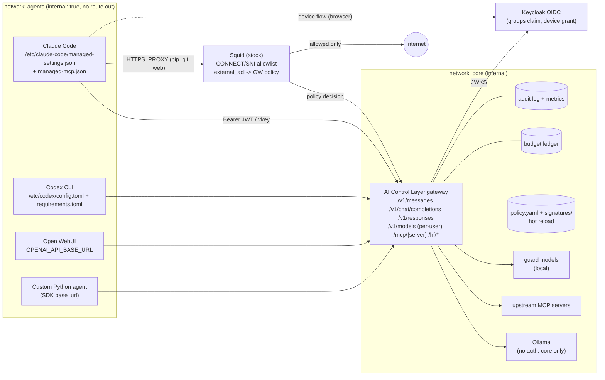

# R5: Interception architecture, agent enforcement, and identity

> **TL;DR**
> 1. **Don't fork Squid.** It is C++ under GPLv2+. Its config reference and 7.x release notes contain no HTTP/2 support. It sees HTTPS bodies only through SslBump, which needs a CA on every client. All content logic would live in an ICAP server anyway, and ICAP works per message, so streamed LLM tokens are either buffered (agents stall) or pass uninspected.
> 2. **Make the core an explicit, protocol-aware L7 AI gateway** (a reverse proxy behind `base_url`) that speaks Anthropic Messages, OpenAI Chat, OpenAI Responses and MCP Streamable HTTP. Ollama can serve all three LLM formats natively, so no protocol translation is needed. There is no MITM, no CA, we control streaming fully, and every request carries an identity.
> 3. **Keep Squid unmodified, as the egress fence.** It allowlists CONNECT/SNI and denies shadow-AI domains. Its decisions come from **our** policy engine through an `external_acl_type` helper, so there is still one policy source. Docker `internal: true` networks or K8s NetworkPolicy make bypass a network fact, not a config wish.
> 4. **Enforce clients through managed settings.** For Claude Code that means `managed-settings.json` with `ANTHROPIC_BASE_URL` + `apiKeyHelper` + `allowedProviders:["customEndpoint"]` + `availableModels`, plus `managed-mcp.json` pointing at our MCP proxy. Codex gets `/etc/codex/config.toml` + `requirements.toml`, Gemini CLI its system settings, VS Code `policy.json`. The vendors themselves say client config is **not** a security boundary, so the network fence is mandatory.
> 5. **Identity.** MVP: virtual keys mapped to user + groups in `policy.yaml`. Then Keycloak 26.8 (Apache-2.0) via realm import, with a `groups` claim and a device-flow `apiKeyHelper` for CLIs. Pitch: RFC 8693 token exchange with `act`/`may_act` (Keycloak 26.8 has a preview "delegation for AI agents"), the MCP spec's "no token passthrough" rule, SPIFFE for workloads.

---

## 0. Method, conventions, caveats

- **Verified on 2026-10-03.** This sandbox's egress proxy blocks most vendor doc sites: squid-cache.org, rfc-editor.org, ietf.org, developers.openai.com, docs.github.com, cursor.com, kubernetes.io, keycloak.org and others. I therefore read the **source repositories of the docs** on `raw.githubusercontent.com` and `github.com`, which are the same primary content: Squid's `src/cf.data.pre` (the source of squid.conf.documented), Keycloak's `docs/` tree, `github/docs`, `microsoft/vscode-docs`, `kubernetes/website`, the MCP spec repo, and so on. Claude Code docs came straight from `code.claude.com/docs/en/*.md`. CLI versions came from the npm registry and PyPI.
- **Session web-search budget was exhausted**, so discovery used GitHub code/repo search plus direct fetches. A few items could not be checked and are marked **UNVERIFIED** (collected in §10).
- RFC 3507 (ICAP) and RFC 8693 (token exchange) could not be fetched here. Statements about them are cross-checked against Squid's own docs and Keycloak's RFC 8693 guide, and say so.
- Hour estimates and 1-5 scores are **our judgment**, not measurements.
- Related notes: **R1** (threat frameworks, interception points), **R2** (historical attacks, signature-feed schema), **R3** (OSS landscape, gateway licenses, a short Squid assessment). This file goes deeper on the proxy, enforcement and identity questions and doesn't repeat R3's gateway tables.

---

## 1. The decision in one picture

### 1.1 Two ways to put a chokepoint in front of AI traffic

| | **Forward proxy (implicit)**: team's Squid idea | **Reverse proxy / AI gateway (explicit)**: recommended core |
|---|---|---|
| How clients reach it | `HTTPS_PROXY=...`, or transparent redirect (iptables/eBPF) | `ANTHROPIC_BASE_URL` / `OPENAI_BASE_URL` / `base_url` / MCP server URL points at us |
| What it sees on HTTPS | Only `CONNECT host:443` + TLS SNI. **Bodies need TLS MITM (SslBump) and a CA trusted by every client** | Everything, in clear text: it **is** the TLS endpoint the client chose |
| Protocol awareness | Generic HTTP. LLM/MCP semantics must be rebuilt in ICAP/addon code | Native: route per API (`/v1/messages`, `/v1/chat/completions`, `/v1/responses`, `/mcp/...`) |
| Identity | Proxy auth (Basic/NTLM/Kerberos), client IP | Per-request bearer token / virtual key / JWT, mapped to user + groups |
| Streaming (SSE) | Through ICAP: buffer or pass blind (§2.3) | Parse SSE events, inspect incrementally, cut cleanly with a protocol-correct error |
| Model routing / aliasing | Impossible without rewriting bodies | Trivial (e.g. "sonnet" → `qwen3-coder` on Ollama) |
| Breaks | Cert-pinned clients, clients ignoring OS trust store, HTTP/2-only (gRPC) clients | Clients that can't set a base URL (they can only be **blocked**, not governed) |
| Catches shadow AI? | **Yes**: sees every destination | No, unless combined with an egress fence |
| 24h build risk | High (C++/ICAP/CA distribution) | Low-medium (FastAPI/httpx or Go) |

**Conclusion:** use **both, each for what it is good at**. The reverse-proxy gateway is the enforcement and guardrail point that judges score. A stock forward proxy (Squid) plus network isolation is the **bypass-prevention backstop** and the shadow-AI sensor.

### 1.2 Recommended topology (docker-compose today, Kubernetes in the pitch)



ASCII version for slides and terminals:

```
 [agents net: internal=true]          [core net: internal]                      [egress net]
  Claude Code ─┐                        ┌──────────────────────────────┐
  Codex CLI ───┼── base_url + token ──▶ │  AI Control Layer gateway    │──▶ Ollama (no auth!)
  Open WebUI ──┤                        │  LLM + MCP + HF mirror       │──▶ MCP servers
  Py agent ────┘                        │  policy.yaml (hot reload)    │──▶ (optional) paid APIs
       │                                └───────────▲──────────────────┘
       └── HTTPS_PROXY (pip/git/web) ──▶ Squid ─────┘ external_acl "may user U reach host H?"
                                          │  allow → Internet        deny → logged as "shadow AI"
```

---

## 2. Forking Squid: an honest evaluation

### 2.1 What Squid actually offers (no fork needed for any of it)

All rows come from Squid's own directive docs (`src/cf.data.pre` on master; that file generates `squid.conf.documented`) [squid-cfdata].

| Extension point | What it is | What it can see | Relevance to us |
|---|---|---|---|
| **ICAP client** (`icap_service id vectoring_point icap://host:1344/path`) | Sends HTTP messages to an external ICAP server for adaptation. Vectoring points `reqmod_precache` / `respmod_precache`. "`*_postcache` vectoring points are not yet supported". Options: `bypass=on/off` (default **off** = essential, so ICAP errors become error pages), `on-overload=block/bypass/wait/force`, `max-conn`, `icaps://` TLS [squid-cfdata] | Full HTTP request/response **only if Squid has the plaintext**: plain HTTP or SslBump-decrypted HTTPS [R3 §2.3 / squid-icap] | This is where any "AI analysis" would live: an ICAP server we write (e.g. `pyicap`, BSD; `c-icap`, **LGPL-2.1** [c-icap-lic]) |
| **ICAP preview / 204 / 206** | `icap_preview_enable` (default on, used only if the server asks in OPTIONS), `icap_preview_size`, `icap_206_enable` (partial content: combine adapted + original), persistent connections. `adaptation_send_username` forwards the authenticated user as `X-Client-Username` [squid-cfdata] | First N bytes of body (preview) | Preview helps for "decide early, then pass through". That is exactly what makes **output** inspection of streams weak (§2.3) |
| **eCAP** (`ecap_service`) | In-process adapter **library loaded into Squid** [squid-cfdata] | Same as ICAP, no network hop | Faster, but it's C++ in Squid's address space: a crash takes the proxy down, and it raises the derivative-work question (§2.6) |
| **`external_acl_type`** | Helper process, line protocol: Squid sends `FORMAT` values (logformat macros such as `%>a` client IP, `%un` user, `%>rd` request domain, `%ssl::>sni`). Helper answers `OK` / `ERR` / `BH` with `message=`, `tag=`, `user=`, `log=`. Has `ttl` (**default 3600 s**), `negative_ttl`, `children-max` (default 5), `concurrency`, `queue-size` [squid-cfdata] | Metadata only (no bodies) | **Best hook for us.** Squid asks our policy engine "may user U reach host H?", keeping one policy source. Set `ttl=5 negative_ttl=5` or live policy edits will wait an hour |
| **`url_rewrite_program` / `store_id_program`** | Helpers that rewrite URLs / cache keys [squid-cfdata] | URL | Could redirect `api.openai.com` → our gateway, but only for plaintext/bumped requests. Not worth it |
| **SslBump** (`ssl_bump peek/stare/splice/bump/terminate`, steps `SslBump1..3`, `acl at_step`) | `splice` = TCP tunnel, the default. `peek` = read client hello (SNI) or server cert while keeping splice possible. `bump` = MITM with a mimicked cert. `terminate` = close [squid-cfdata] | SNI at step 1 **without decrypting** | SNI-based allow/deny without MITM. Plaintext bodies only with `bump` + CA on clients |
| **`acl ssl::server_name` / `ssl::server_name_regex`** | Matches the server name from CONNECT URI, then SNI, then the server cert. "Unlike dstdomain, this ACL does not perform DNS lookups" [squid-cfdata] | Hostname | Shadow-AI deny lists |
| **`acl dstdomain`** + `http_access deny CONNECT ...` | Classic domain ACL [squid-cfdata] | CONNECT host | **Enough for explicit-proxy clients.** No SslBump needed at all |

**Current version:** Squid **7.7 (17 Aug 2026)**. Earlier 7.x: 7.6 (8 Jun 2026), 7.5 (12 Mar 2026) [squid-changelog-v7]. `master` is `8.0.0-VCS` [squid-configure]. Squid 7.0 removed ESI, Ident, cachemgr.cgi and squidclient [squid-changelog-master].

### 2.2 What it takes to see HTTPS bodies

1. Build or install Squid **with OpenSSL** and the certificate generator (`security_file_certgen`, listed in the 7.4 changelog [squid-changelog-v7]). Debian/Ubuntu ship this as a separate `squid-openssl` package (**UNVERIFIED**, packages site blocked).
2. Generate a CA. Configure `http_port 3128 ssl-bump tls-cert=/etc/squid/ca.pem generate-host-certificates=on` (Squid requires the first `tls-cert=` to be a CA when `generate-host-certificates=on` [squid-cfdata]).
3. **Distribute the CA to every client and every runtime trust store**: OS store, Node (`NODE_EXTRA_CA_CERTS`), Python (`SSL_CERT_FILE`/`REQUESTS_CA_BUNDLE`), Java truststores, container images. Claude Code trusts bundled Mozilla CAs plus the OS store, `NODE_EXTRA_CA_CERTS` adds more, and it **does not retry** TLS-validation failures [cc-netcfg][cc-errors]. Ollama needs the CA baked into its image to pull through a TLS-inspecting proxy [ollama-faq].
4. Accept breakage: cert-pinned clients, mTLS-to-upstream clients, and HTTP/2-only clients (§2.4).
5. Accept the privacy and legal weight of decrypting *all* employee TLS (a real concern for a bank; good to say out loud in Q&A).

Contrast: with `ANTHROPIC_BASE_URL=http(s)://gateway`, steps 1-5 vanish. The client *chose* our gateway as its endpoint.

> Fun fact for the pitch: this very research session runs behind a policy-enforcing, TLS re-terminating egress proxy with a distributed CA bundle. It blocked a dozen doc sites during this work. The pattern is real, and so are its costs (one CA config per tool).

### 2.3 ICAP RESPMOD vs. streaming LLM responses (SSE)

LLM APIs stream `text/event-stream` chunks for seconds to minutes. Agents depend on that stream:

- Claude Code: "if your gateway buffers complete responses before relaying them, Claude Code stalls." Gateways must relay every event in order through `message_delta`/`message_stop` and **forward keep-alive pings**. Claude Code aborts a stream with no bytes for 5 min (default watchdog) [cc-gwproto][cc-netcfg].
- A connection dropped mid-stream before any content block completes is **retried** by Claude Code (up to 10 attempts with backoff) [cc-errors]. So a proxy that kills a "bad" stream by resetting the connection triggers a retry loop, not a clean block.

What an ICAP server can do with a streamed response (protocol reasoning from Squid's ICAP options [squid-cfdata]; RFC 3507 text not fetchable here):

| Strategy | Result |
|---|---|
| Decide from the **preview**, reply "no modification" | Rest of the stream flows **uninspected**. Output guardrails (PII/secret leakage in completions, unsafe code) are blind |
| Wait for **end of body**, then allow or replace | Client sees **nothing** until generation ends, so agents stall and watchdogs fire. Long generations hit timeouts |
| Return adapted body **incrementally** | Possible in principle (ICAP bodies are chunked), but the ICAP server must parse SSE, track Anthropic/OpenAI event state, scan with a sliding window, and synthesize a protocol-correct `error` event. That *is* an AI gateway, written inside a protocol with fewer libraries and an extra hop. Whether Squid relays adapted chunks immediately is **UNVERIFIED** (Squid wiki blocked) |
| Block by **aborting** the ICAP transaction (`bypass=off`) | Client gets an error page or reset mid-stream, and Claude Code retries (see above) |

→ **ICAP is fine for request-side (REQMOD) prompt scanning and for file-download scanning** (a classic AV use). It is a poor fit for **output-side** guardrails on streamed tokens, which the task requires ("Block vs Redact").

### 2.4 HTTP/2, gRPC, WebSockets

- Searching Squid's full directive reference (`cf.data.pre`, master) and the Squid 7 release notes for `HTTP/2`, `http2`, `h2c`, `ALPN` returns **no hits** [squid-cfdata][squid-rn7]. **Inference:** Squid proxies HTTP/1.1. A bumped client is negotiated down to HTTP/1.1. REST LLM APIs accept that. **gRPC-only clients break** (which concrete AI clients are gRPC-only: **UNVERIFIED**).
- Community evidence: an open-source Squid+ICAP "AI prompt DLP gateway" (`mshirakawa-ssp/ai-scan-interceptor`, Go, AGPL-3.0) ships a **separate custom TLS proxy** advertised as "Anthropic direct interception (uTLS): HTTP/2 + uTLS fingerprint countermeasures so Claude API traffic isn't missed". It also requires importing `certs/squid-ca.pem` into every OS/browser [aisi]. Squid alone was not enough for modern AI API traffic, even for people who chose Squid on purpose.
- mitmproxy supports HTTP/1, **HTTP/2** (hyper-h2, with h1 fallback upstream), HTTP/3 (reverse/local/WireGuard modes) and WebSockets [mitm-protocols]. Envoy is natively HTTP/2.

### 2.5 Performance

- No trustworthy benchmark data could be fetched. Our reasoning: Squid's C++ core is fast, but **every inspected message adds an ICAP round trip**, and the dominant cost in *any* design is **guardrail inference** (local classifier/LLM). Proxy language barely matters next to that.
- What judges can see ("Architecture & performance 20%") is **per-stage latency telemetry**: auth → deterministic checks → semantic checks → upstream TTFB → stream duration. That is easy in our own gateway, awkward across Squid + ICAP + helper logs.

### 2.6 GPLv2 implications of a fork

- Squid is **GPLv2-or-later** ("Squid software is distributed under GPLv2+ license") [squid-readme][squid-copying].
- GPLv2 §0: "Activities other than copying, distribution and modification are not covered by this License … The act of running the Program is not restricted" [squid-copying]. Running a modified Squid **internally** triggers no source obligation. **Distributing** it (public hackathon repo, Docker images handed to Goldman Sachs) means the modified source must be offered under GPL.
- An **ICAP server** talks to Squid over a network protocol, so it is a separate program and can carry any license. Common interpretation, **not legal advice**. An **eCAP** adapter is loaded into Squid's process, so its derivative-work status needs legal review (**UNVERIFIED**).
- For a bank, "our product is a GPL fork of a 30-year-old C++ proxy with a public record of unpatched audit findings (R3 §2.3: 55 flaws found, 35 unpatched at disclosure in Oct 2023)" is a weak pitch line. "We use stock Squid as a commodity egress fence" is a strong one.

### 2.7 Build complexity and 24h estimate (our judgment)

| Variant | What we'd write | Estimate | Judging upside |
|---|---|---|---|
| **A. Fork Squid** (C++ changes for AI inspection) | C++ in Squid's async core, autotools rebuilds, SslBump + CA, plus all guardrail logic | **Days.** Nobody on a 6-person/24h team will productively patch Squid internals | Negative: risk eats guardrail/test/dashboard time |
| **B. Stock Squid + ICAP server** (Python `pyicap`) | REQMOD prompt scanning, SslBump + CA distribution, RESPMOD gaps | 6-10 h to "works on curl". Streaming output inspection still unsolved | Low-medium |
| **C. Stock Squid + `external_acl_type` helper** (egress fence only) | ~60-line Python helper calling the gateway's `/policy/egress-decision`; `dstdomain` lists from the signature feed | **2-3 h** | Medium: bypass prevention, shadow-AI metrics, one policy source |
| **D. Our L7 AI gateway** (core) | FastAPI/httpx (or Go) passthrough with SSE handling for 3 LLM APIs + MCP proxy | 4-6 h for streaming passthrough (R3 estimate), then guardrails on top | **High**: every judged behaviour is ours |

### 2.8 Community evidence that the split architecture works

- `garland3/agent-sandbox-1`: runs Claude Code / Codex / opencode / cline in a container on an `--internal` network. Its **only** egress is a dual-homed proxy pod: **Squid allowlist** for general HTTPS plus an **nginx LLM key-injection proxy** behind `base_url`. Its README: "The guarantee does **not** come from `HTTP_PROXY` env vars … It comes from **network topology** … DNS for the agent is resolved by the proxy" [agent-sandbox]. That is our recommended shape, minus the guardrails we add.
- `mshirakawa-ssp/ai-scan-interceptor`: Squid + ICAP DLP with YAML rules (`log/alert/block/mask`), hot-reloading policy. Needed a custom HTTP/2 TLS proxy and CA distribution (§2.4) [aisi]. Small project (3 stars), useful as a cautionary data point.
- A GitHub repository search for "squid llm proxy" returned only 2 small repos (2026-10-03). We found **no widely adopted Squid-based LLM governance project**. Absence of evidence, given limited search tools.

### 2.9 Verdict on Squid, and its sensible role

**Drop the fork. Keep stock Squid in one well-defined job: the egress fence.**

1. **Egress allowlist** for everything agents need that is *not* LLM traffic (pip, npm, GitHub, docs). Agent containers have no other route out.
2. **Shadow-AI blocking without decryption**: `http_access deny CONNECT` to known AI API/app domains (from our signature feed). For intercepted (non-proxy-aware) traffic, `ssl_bump peek` at step 1 + `terminate` on `ssl::server_name`.
3. **One policy source**: `external_acl_type` calls the gateway, which evaluates `policy.yaml` (e.g. group `interns` may not reach `*.huggingface.co`; the `research` group may). Short TTL keeps live edits live.
4. **Audit feed**: Squid `access.log` (custom `logformat`) → our audit pipeline → dashboard tile "shadow-AI attempts blocked".
5. **Account restriction headers (pitch/stretch)**: Gemini CLI's enterprise guide tells admins to have a web proxy intercept `google.com` and inject `X-GoogApps-Allowed-Domains` so only corporate accounts can log in [gemini-ent]. That legitimately needs a bumping forward proxy, so it is a real "why Squid" example.
6. **Copilot plan routing**: GitHub documents per-plan API hosts (`*.individual.githubcopilot.com`, `*.business…`, `*.enterprise…`) so a proxy can block personal Copilot plans on the corporate network [gh-allowlist]. That is a pure `dstdomain`/SNI rule.

### 2.10 `squid.conf` sketch (egress fence, no MITM)

```squid
# squid.conf — egress fence for the agents network (no TLS interception)
http_port 3128

# Domain lists generated from signatures/egress.yaml by the gateway (single source)
acl shadow_ai dstdomain "/etc/squid/lists/shadow_ai.txt"   # .openai.com .anthropic.com .chatgpt.com .individual.githubcopilot.com ...
acl dev_allow dstdomain "/etc/squid/lists/dev_allow.txt"   # .pypi.org .files.pythonhosted.org .github.com ...
acl CONNECT method CONNECT
acl SSL_ports port 443

# Ask the control layer for per-user / per-group decisions (policy.yaml stays the only truth)
external_acl_type ai_policy ttl=5 negative_ttl=5 children-max=10 concurrency=50 %>a %un %>rd /usr/local/bin/egress_policy_helper.py
acl policy_ok external ai_policy

http_access deny CONNECT !SSL_ports
http_access deny shadow_ai          # message shows up in access.log; the gateway counts it as "shadow AI"
http_access allow dev_allow policy_ok
http_access deny all

logformat aijson {"ts":"%tl","client":"%>a","user":"%un","method":"%rm","host":"%>rd","status":%>Hs,"squid":"%Ss","ext":"%ea"}
access_log stdio:/var/log/squid/access.jsonl aijson
```

*(Syntax per [squid-cfdata]. `%ea` = external ACL log string. Test before demo; Squid's quoted-filename ACL form and helper protocol details should be validated on 7.7.)*

---

## 3. Alternatives compared

### 3.1 mitmproxy

- **License MIT**; **12.2.3** (12 May 2026), Python ≥3.12 [mitm-lic][pypi-mitm].
- Python **addons** with hooks per flow. **HTTP/2** and **HTTP/3** support, WebSockets [mitm-protocols].
- **Streaming:** by default it reads the *entire* message before forwarding. With `stream_large_bodies` or `flow.response.stream = True`, bodies stream but "will not be accessible within mitmproxy". Setting `flow.response.stream` to a **callable** lets you modify chunk-by-chunk. The official example warns this is "tricky and brittle" (chunk boundaries split matches) [mitm-features][mitm-stream-modify].
- **Modes:** regular, transparent, **local capture** (`--mode local:<process>`; eBPF on Linux ≥6.8, needs sudo, containers need host network, egress only), WireGuard, reverse proxy, upstream, SOCKS [mitm-modes].
- **Fit:** the best **forward-proxy/MITM** tool for a Python team. Use it for a **stretch "endpoint shadow-AI sensor" demo**: `mitmproxy --mode local:claude` shows every host the agent talks to. Not the core: its flow model fights incremental SSE guardrails.

### 3.2 Envoy + `ext_proc`

- Apache-2.0. The `ext_proc` HTTP filter sends headers, body and trailers over gRPC to an external processor. `BodySendMode`: `NONE`, `STREAMED`, `BUFFERED` (error if over buffer limit), `BUFFERED_PARTIAL`, **`FULL_DUPLEX_STREAMED`** (the processor may buffer any number of chunks, process them and stream adapted chunks back; requires trailer mode `SEND`; recommended ≤64 KB per response chunk), `GRPC` (not implemented) [envoy-pm].
- `FULL_DUPLEX_STREAMED` is the **right primitive for SSE output scanning**. Envoy AI Gateway and agentgateway build on Envoy/Rust data planes (R3 §2, §4).
- **Fit:** production-grade data plane and a credible K8s story. Cost: Envoy YAML + protobuf/gRPC processor + xDS for hot reload. **Stretch/pitch** ("our policy brain plugs into Envoy via ext_proc"). Not the 24h core.

### 3.3 Purpose-built L7 AI gateway (recommended core)

Explicit `base_url`; we implement exactly the protocols our demo agents speak:

| Route | Who calls it | Upstream (no paid APIs) | Notes |
|---|---|---|---|
| `POST /v1/messages` (+ `?beta=true`) | Claude Code, Anthropic SDK | **Ollama `/v1/messages`** (Anthropic-compatible) | Ollama supports messages, streaming, tools, thinking. **Not** `count_tokens`, `tool_choice`, `metadata`, prompt caching, **server-sent `error` events** [ollama-anthropic] |
| `POST /v1/messages/count_tokens` | Claude Code (optional) | none: return 404, or estimate | Absent: Claude Code falls back to a character estimate [cc-gwproto] |
| `POST /v1/chat/completions` | Open WebUI, Continue, goose, Copilot CLI BYOK, custom agents | Ollama OpenAI-compat | [ollama-openai] |
| `POST /v1/responses` | **Codex CLI** (Responses is its *only* wire API; `wire_api="chat"` is rejected) | Ollama `/v1/responses`, since v0.13.3, **stateless only** (no `previous_response_id`) | [codex-mpi][ollama-openai] |
| `GET /v1/models` | Claude Code gateway model discovery, OpenAI clients | policy | **Return only the models the caller's groups may use**, so the user *sees* their allowed models in `/model` (§5.2) |
| `POST /mcp/{server}` | Claude Code via `managed-mcp.json`, VS Code, Gemini CLI | stdio or HTTP MCP servers | Route on `Mcp-Method`/`Mcp-Name` headers, **validate against the body** (§6.5) |
| `GET /hf/{repo}/resolve/{rev}/{file}` | `HF_ENDPOINT` clients | huggingface.co (via fence) | Quarantine → scan → serve or 403 (§5.14) |
| `GET /policy/egress-decision` | Squid helper | policy | One policy source (§2.9) |
| `HEAD /api/hello` | Claude Code startup probe | none: 200 | "best-effort startup traffic it can reject without breaking anything" [cc-gwproto] |

### 3.4 SDK wrapper / middleware

- An in-process wrapper (`controllayer.wrap(OpenAI())`) is easy to unit-test and adds no network hop. But it is **cooperative only** (the agent can bypass it), per-language, and needs a central call-home for budgets anyway.
- **Fit:** provide a tiny Python helper for the "app → agent" story and for the test suite. Enforcement must live in the gateway. Most of the time the "SDK integration" is just `base_url=` plus our key.

### 3.5 Transparent and eBPF interception

| Technique | What it gives | Limits | Use |
|---|---|---|---|
| iptables REDIRECT/TPROXY → Squid intercept / mitmproxy transparent | Catches proxy-unaware clients | Still needs the CA for bodies; root on host/gateway | Pitch |
| **mitmproxy local capture** (eBPF redirect) | Per-process interception on a laptop | Linux ≥6.8, sudo, container host-net only [mitm-modes] | Stretch demo ("shadow-AI sensor") |
| **eBPF uprobes on TLS libraries** (eCapture, Apache-2.0) | Plaintext from OpenSSL/LibreSSL/BoringSSL/GnuTLS/NSS and Go TLS **without a CA** | Root/capabilities, Linux kernel ≥4.18 (x86_64), **observe-only** (can't block/redact), Linux-only [ecapture]. Statically linked TLS in single-binary agents may not be hookable (**UNVERIFIED** for Claude Code) | Pitch: "detective control for endpoints we don't manage" |

### 3.6 Scoring against the judging weights (our judgment, 1-5)

| Option | Guardrails 30% | Arch/perf 20% | Reporting 20% | Tests 15-20% | Practical/scale 10-15% | 24h feasibility | Live policy edits |
|---|---|---|---|---|---|---|---|
| A. Squid fork | 2 | 2 | 2 | 2 | 2 | **1** | 2 (`squid -k reconfigure`) |
| B. Squid + ICAP | 2 | 3 | 2 | 3 | 3 | 2 | 3 |
| C. mitmproxy as core | 3 | 3 | 3 | 4 | 2 | 4 | 4 |
| D. Envoy + ext_proc | 4 | 5 | 3 | 3 | 5 | 2 | 3 (xDS) |
| **E. Own L7 gateway** | **5** | 4 | **5** | **5** | 4 | **4** | **5** |
| **E + C-fence (stock Squid) + net isolation** | **5** | **5** | **5** | **5** | **5** | **4** | **5** |

### 3.7 Recommended combination

1. **Core: our L7 gateway** (E), behind explicit base URLs, with an **MCP proxy** in the same process or service.
2. **Fence:** Docker `internal: true` agent network + **stock Squid** with an `external_acl_type` → gateway policy (C).
3. **Client config:** managed settings per tool (§5) so the *happy path* is zero-config.
4. **Pitch extensions:** Envoy `ext_proc` adapter (D) for "scale-out data plane"; mitmproxy/eBPF sensor for unmanaged endpoints.

---

## 4. Streaming-safe enforcement (design notes for the gateway)

1. **Pre-flight first.** Run identity, model allowlist, budget pre-check (estimate input tokens + `max_tokens` × price) and request-side guardrails **before** opening the upstream stream. Most blocks happen here with a clean HTTP error.
2. **Pass-through with taps.** Forward each SSE event as soon as it arrives (flush per event). Feed text deltas into an **incremental scanner** with a sliding window that holds back the last *k* characters for regex/secret patterns spanning chunk boundaries (the bug class mitmproxy's own example warns about [mitm-stream-modify]).
3. **Redact vs. block mid-stream.** *Redact*: rewrite the held-back window before releasing it, which costs latency of only *k* characters. *Block*: stop forwarding, then emit a **protocol-correct terminal event**. For Anthropic: `event: error` with `{"type":"error","error":{"type":"permission_error","message":"Blocked by policy rule SEC-007"}}`. For OpenAI Chat: a final chunk with an error/`finish_reason` and `[DONE]`. Then close. Ollama can't send server-sent errors itself [ollama-anthropic]; our gateway can.
4. **Never reset the TCP connection to block.** Claude Code retries dropped connections that haven't completed a content block [cc-errors].
5. **Forward pings / emit our own** during long semantic checks so client watchdogs (5 min default, byte-level) don't fire [cc-gwproto][cc-netcfg].
6. **Budget exceeded → `429` + `x-should-retry: false`.** Anthropic's own gateway does exactly this, with the message `spend limit reached (daily; resets 2026-08-09 00:00 UTC)`, and Claude Code then shows it **without retrying**. Ordinary 429 throttles *are* retried. If the ledger can't be read, the vendor gateway fails closed with `spend limit unavailable` [cc-errors]. **Copy both behaviours.**
7. **Settle post-hoc.** Read `usage` from the final event (`message_delta` / last chunk) and debit the ledger. For local models also record wall time (Ollama native responses carry durations; R-budget notes).
8. **Telemetry per stage** (auth, deterministic, semantic, upstream TTFB, stream) as Prometheus histograms, for the perf question judges may ask.
9. **Attribution for agent→agent:** Claude Code sends `x-claude-code-session-id`, `x-claude-code-agent-id`, `x-claude-code-parent-agent-id`, `x-claude-code-request-class` (`main`/`subagent`/`workflow`/`compaction`/`auxiliary`), `x-claude-code-agent-type` and `x-claude-code-prompt-id` (v2.1.283+) [cc-gwproto]. Log them and you get an **agent tree with cost and blocks per sub-agent** for free. Very demoable for "agent → agent" governance.

---

## 5. Enforcing that agents use the control layer

### 5.1 Layered enforcement model (say this in the pitch)

| Layer | Mechanism | Bypassable by | Our demo |
|---|---|---|---|
| L0 Convenience | env vars / `base_url` in user config | anyone | Quick-start for judges |
| L1 **Managed config** | `/etc/claude-code/managed-settings.json`, `/etc/codex/requirements.toml`, `/etc/gemini-cli/settings.json`, `/etc/vscode/policy.json`, MDM/registry | **local admins** (vendors say so) | Baked into the agent container image |
| L2 **Credential custody** | No provider keys on endpoints. Gateway holds upstream keys. Ollama/HF reachable only from the gateway network | someone who steals the gateway's secrets | Ollama only on `core` network |
| L3 **Network fence** | Default-deny egress; only gateway + Squid reachable | nobody without infra access | `internal: true` network; "try `curl api.openai.com`" demo |
| L4 **Detection** | Squid logs, gateway anomaly metrics, eBPF/mitmproxy sensor | n/a | Dashboard "shadow-AI attempts" |

Vendors confirm L1 is not enough: Gemini CLI's enterprise guide says its controls "should not be considered a foolproof security boundary. A determined user with sufficient privileges on their local machine may still be able to circumvent these configurations" [gemini-ent]. Claude Code notes a local admin "can edit the managed source itself" [cc-managed]. Istio says it "*cannot securely enforce* that all egress traffic actually flows through the egress gateways" without external mechanisms [istio-egw]. → **L3 is the real control; L1 is UX.**

### 5.2 Claude Code (latest npm: **2.1.288** [npm-cc])

**Where managed settings live** [cc-managed]:

| OS | File-based (plus optional `managed-settings.d/*.json` drop-ins and `managed-mcp.json`) | MDM / registry |
|---|---|---|
| macOS | `/Library/Application Support/ClaudeCode/managed-settings.json` | config profile, domain `com.anthropic.claudecode` |
| Linux/WSL | `/etc/claude-code/managed-settings.json` | n/a |
| Windows | `C:\Program Files\ClaudeCode\managed-settings.json` (legacy `C:\ProgramData\…` **not** read) | `HKLM\SOFTWARE\Policies\ClaudeCode` value `Settings` (REG_SZ JSON). HKCU is a user-writable fallback |

- Precedence: managed > CLI `--settings` > project local > project shared > user. A few security keys honour a *stricter* lower value [cc-settings].
- File-based settings are **watched and reloaded** mid-session (incl. `permissions`, hooks, `apiKeyHelper`). MDM is checked every 30 min, server-managed settings hourly [cc-settings][cc-managed].
- A managed file that isn't valid JSON → **Claude Code refuses to start** [cc-managed]. Good fail-closed property; validate before shipping.

**Keys that matter for us** (all from [cc-settings-ref] unless noted):

| Key | What it does | Version |
|---|---|---|
| `env.ANTHROPIC_BASE_URL` | Points Claude Code at our gateway | |
| `apiKeyHelper` | Shell command whose stdout is sent as **both `X-Api-Key` and `Authorization: Bearer`**. Cached 5 min by default (`CLAUDE_CODE_API_KEY_HELPER_TTL_MS`), re-run on **401/403** and before sending an **expired JWT** | JWT-expiry check v2.1.246+ |
| `allowedProviders: ["customEndpoint"]` | **Pins the gateway**: refuses sessions pointed anywhere else, including Anthropic directly or a developer's own proxy. Accepts `ANTHROPIC_BASE_URL` only with the value pinned in the managed `env` [cc-llmgw] | **v2.1.285+** |
| `availableModels` (+ `availableModelsMatch:"exact"`, `deniedModels`) | Constrains `/model`, `--model`, `model` keys. `deniedModels` is managed-only | match/deny v2.1.283+ |
| `allowedMcpServers` / `deniedMcpServers` / `allowManagedMcpServersOnly` | Allow/deny by `serverName`, `serverCommand` (exact argv) or `serverUrl` (wildcards); deny wins; `allowManagedMcpServersOnly` ignores user/project allowlists | cross-source v2.1.273+ |
| **`managed-mcp.json`** (same dir) | **Exclusive control**: only these MCP servers load (no plugin servers, no `--mcp-config`). Can't hold secrets (world-readable). Use `${VAR}`, OAuth or `headersHelper` for per-user creds [cc-managed-mcp] | |
| `permissions.disableBypassPermissionsMode: "disable"` | Rejects `--dangerously-skip-permissions` | |
| `allowManagedPermissionRulesOnly`, `allowManagedHooksOnly` | Lock permission rules / hooks to managed ones | |
| `statusLine` (`type:"command"`, `refreshInterval`) | Runs our command, which can print **"budget 41% used · models: qwen3-coder, llama3.2"** in the agent UI | |
| `env.CLAUDE_CODE_ENABLE_GATEWAY_MODEL_DISCOVERY=1` | Claude Code calls our `GET /v1/models?limit=1000` (3 s timeout, **no redirects**) with the user's credential and adds the results to `/model` [cc-gwproto] | |
| `skipWebFetchPreflight: true` + `CLAUDE_CODE_DISABLE_NONESSENTIAL_TRAFFIC=1` | Stop direct calls to `api.anthropic.com` (WebFetch domain check, telemetry) that a fence would block [cc-netcfg] | |
| `env.CLAUDE_CODE_MAX_CONTEXT_TOKENS` | **Required for local models**: Claude Code assumes 200K context for unknown model IDs [cc-model-config] | |
| `env.ANTHROPIC_DEFAULT_{OPUS,SONNET,HAIKU}_MODEL`, `ANTHROPIC_MODEL` | Map aliases to our model names [cc-env] | |
| `forceLoginMethod` / `forceLoginOrgUUID` | **Do NOT set with a gateway credential.** They block `ANTHROPIC_AUTH_TOKEN` / `apiKeyHelper` at startup [cc-auth] | |
| `HTTPS_PROXY`, `NO_PROXY`, `NODE_EXTRA_CA_CERTS`, `CLAUDE_CODE_CLIENT_CERT/KEY` | Standard proxy (no SOCKS), extra CAs, mTLS with hot rotation [cc-netcfg] | |

**Sample for our agent container** (`/etc/claude-code/managed-settings.json`):

```json
{
  "env": {
    "ANTHROPIC_BASE_URL": "http://gateway.core:8080",
    "CLAUDE_CODE_ENABLE_GATEWAY_MODEL_DISCOVERY": "1",
    "CLAUDE_CODE_API_KEY_HELPER_TTL_MS": "240000",
    "CLAUDE_CODE_DISABLE_NONESSENTIAL_TRAFFIC": "1",
    "CLAUDE_CODE_MAX_CONTEXT_TOKENS": "32768",
    "ANTHROPIC_DEFAULT_SONNET_MODEL": "qwen3-coder",
    "ANTHROPIC_DEFAULT_HAIKU_MODEL": "llama3.2",
    "HTTPS_PROXY": "http://squid.agents:3128",
    "NO_PROXY": "gateway.core,keycloak.core,localhost,127.0.0.1"
  },
  "apiKeyHelper": "/usr/local/bin/aictl token",
  "allowedProviders": ["customEndpoint"],
  "availableModels": ["qwen3-coder", "llama3.2"],
  "allowManagedMcpServersOnly": true,
  "allowedMcpServers": [{ "serverUrl": "http://gateway.core:8080/mcp/*" }],
  "permissions": { "disableBypassPermissionsMode": "disable" },
  "skipWebFetchPreflight": true,
  "statusLine": { "type": "command", "command": "/usr/local/bin/aictl status --short", "refreshInterval": 30 }
}
```

And `/etc/claude-code/managed-mcp.json`: every MCP server **is a route on our MCP proxy**, so all agent→MCP traffic is governed:

```json
{
  "mcpServers": {
    "filesystem": { "type": "http", "url": "http://gateway.core:8080/mcp/filesystem" },
    "git":        { "type": "http", "url": "http://gateway.core:8080/mcp/git" }
  }
}
```

*Caveats:* model names are examples (local-model researcher picks the real ones). `availableModels` with non-Claude IDs is expected to work as plain ID matching (**UNVERIFIED** in practice). Anthropic states it "doesn't support routing Claude Code to non-Claude models through any gateway" [cc-llmgw], while Ollama documents exactly that setup [ollama-anthropic][ollama-cc]. Works in practice, unsupported by the vendor, so **keep Open WebUI / a Python agent as backup demo clients**.

**Reference point for the pitch:** Anthropic ships a self-hosted **"Claude apps gateway"** (inside the `claude` binary). It does OIDC SSO with a **device sign-in flow**, **IdP-group → model allowlists**, per-user/per-group **spend limits**, group-specific managed settings and OTLP telemetry, backed by Postgres. It is OIDC-only (no SAML/LDAP) and **Claude-only** [cc-appsgw]. The team's original "SSO + group-based models + budgets" idea is therefore **validated and already productized by a vendor**. Our differentiation has to be **vendor-neutral** coverage (Anthropic + OpenAI + Responses + local Ollama + MCP + A2A) plus **guardrails, exploit signatures, local-compute budgets and a self-test suite**.

### 5.3 OpenAI Codex CLI (latest npm **0.160.0** [npm-codex])

- **Providers:** `model_provider = "<id>"` plus `[model_providers.<id>]` with `name`, `base_url`, `env_key`, `wire_api`, `http_headers`, `env_http_headers`, `query_params`, `request_max_retries`, `stream_idle_timeout_ms`, and a command-backed `auth` bearer-token config (an `apiKeyHelper` analogue, exact TOML shape **UNVERIFIED**). **`wire_api` accepts only `"responses"`**: "`wire_api = "chat"` is no longer supported". Built-in OSS providers: `ollama` (port 11434) and `lmstudio` (1234) [codex-mpi].
- **Managed layers** [codex-loader]: config is built from package → admin (macOS managed prefs) → **system `/etc/codex/config.toml`** (Windows `%ProgramData%\OpenAI\Codex\config.toml`) → cloud → user `${CODEX_HOME}/config.toml` → profile → cwd/tree/repo `.codex/config.toml` (disabled when untrusted) → runtime flags. **Admin-enforced constraints** come from `/etc/codex/requirements.toml` (Windows `%ProgramData%\OpenAI\Codex\requirements.toml`), cloud requirements, legacy `/etc/codex/managed_config.toml`, and macOS managed preferences.
- `requirements.toml` can constrain `model_provider`, `model_providers`, `allowed_login_methods`, `mcp_servers`, `network`, `approval_policy`, `permission_profile`, `allow_managed_hooks_only`, `exec_policy`, … [codex-req][codex-config-md].

```toml
# /etc/codex/config.toml  (pair with requirements.toml pinning model_provider)
model_provider = "controllayer"
model = "qwen3-coder"

[model_providers.controllayer]
name = "AI Control Layer"
base_url = "http://gateway.core:8080/v1"
env_key = "CONTROL_LAYER_KEY"
wire_api = "responses"
```

→ **Our gateway must implement `/v1/responses` (stateless)** if Codex is in the demo. Ollama ≥0.13.3 serves it upstream [ollama-openai].

### 5.4 GitHub Copilot

- **Default traffic goes to GitHub's service** (`copilot-proxy.githubusercontent.com`, `*.githubcopilot.com`). Our gateway can't sit in that path without MITM.
- **Network control:** GitHub documents per-plan hosts (`*.individual.githubcopilot.com`, `*.business.githubcopilot.com`, `*.enterprise.githubcopilot.com`) for "subscription-based network routing" (block personal plans on corp network) [gh-allowlist]. That's a Squid `dstdomain` rule. IDE proxy support: HTTP proxy with basic auth in the URL, custom certificates, `COPILOT_USE_DEFAULTPROXY` for Visual Studio [gh-net].
- **Local BYOK** (VS Code, JetBrains, Xcode, **Copilot CLI**, Copilot app, SDK): keys stay client-side and "removes dependency on GitHub's Copilot API". **Can be disabled by enterprise/org policy** for Business/Enterprise users [gh-byok]. Copilot CLI BYOK env: `COPILOT_PROVIDER_BASE_URL` (required), `COPILOT_PROVIDER_TYPE` (`openai` default, `azure`, `anthropic`), `COPILOT_PROVIDER_API_KEY` / `COPILOT_PROVIDER_BEARER_TOKEN`, `COPILOT_MODEL`. Ollama is explicitly supported. Models need tool calling + streaming, ideally ≥128k context [gh-cli-byok]. → **Copilot CLI can be pointed at our gateway.**
- **Enterprise BYOK** (preview): admins add provider keys (Anthropic, Bedrock, Google AI Studio, Foundry, OpenAI, **OpenAI-compatible**, xAI). "Handled server-side … users must have a Copilot license and internet access" [gh-byok-ent][gh-byok]. GitHub's cloud calls the endpoint, so a gateway would need to be internet-reachable (**UNVERIFIED** whether arbitrary base URLs are accepted).

### 5.5 VS Code enterprise policies

Windows registry (`Software\Policies\Microsoft\VSCode`, ADMX), macOS configuration profiles, **Linux `/etc/vscode/policy.json` (VS Code ≥1.106)** [vscode-policies]. Relevant policies: `ChatAllowedMcpServers` / `ChatDeniedMcpServers` (1.130), `ChatAllowManagedMcpServersOnly` (1.132), `ChatMCP`, `McpGalleryServiceUrl`, **`McpEnterpriseManagedAuthIdp`** (1.122, OAuth/OIDC IdP for enterprise-managed MCP auth), `ChatToolsAutoApprove` (disable "YOLO mode"), `ChatAgentMode`, `ChatDefaultModel`, `AllowedExtensions`, `ChatStrictPluginOnlyCustomization` (1.132) [vscode-policies].

### 5.6 Cursor

Docs site blocked from this sandbox. Our understanding is that Cursor's "override OpenAI base URL" requests are relayed through Cursor's backend, so a **localhost/private gateway is not reachable** and enterprise model controls live in Cursor's admin console (**UNVERIFIED**, check on a laptop). Plan: treat Cursor as **block-or-allow at the fence** (SNI) unless verified otherwise.

### 5.7 Continue.dev

`config.yaml` models take `apiBase` and `requestOptions` (`caBundlePath`, `proxy`, `headers`, `noProxy`). MCP servers (`sse`/`streamable-http`) take the same `requestOptions` [continue-ref]. Point `apiBase` at the gateway.

### 5.8 Open WebUI

- `OPENAI_API_BASE_URL(S)` → gateway. OIDC via `OPENID_PROVIDER_URL`, `OAUTH_GROUP_CLAIM`, `ENABLE_OAUTH_GROUP_MANAGEMENT` [owui-env].
- **`ENABLE_FORWARD_USER_INFO_HEADERS=true`** attaches `X-OpenWebUI-User-Name/-Id/-Email/-Role` (+ `X-OpenWebUI-Chat-Id`) to model and tool-server calls, "for per-user authorization, auditing, rate limiting" [owui-env]. **These headers are unsigned.** The gateway must honour them **only** when the request carries Open WebUI's own service key ("trusted front-end"), and must ignore them otherwise.
- License: custom "Open WebUI License" (BSD-style plus **branding-preservation clauses**) [owui-lic]. Fine to *use* as a demo client; don't rebrand it.

### 5.9 goose

`GOOSE_PROVIDER`, plus custom provider `GOOSE_PROVIDER__TYPE/__HOST/__API_KEY`. Built-ins: `ANTHROPIC_HOST`, `OPENAI_HOST` (+ `OPENAI_CUSTOM_HEADERS`), `OLLAMA_HOST`. **`GOOSE_ALLOWLIST`** = URL of an allowed-extensions list (MCP extensions) [goose-env][goose-providers]. Our gateway could serve that allowlist from `policy.yaml`.

### 5.10 Gemini CLI (latest npm **0.62.0** [npm-gemini])

- System settings with highest precedence: Linux `/etc/gemini-cli/settings.json`, Windows `C:\ProgramData\gemini-cli\settings.json`, macOS `/Library/Application Support/GeminiCli/settings.json`; overridable by `GEMINI_CLI_SYSTEM_SETTINGS_PATH`. The docs note a user could repoint that variable and recommend a wrapper script [gemini-ent].
- MCP lock-down: define servers in system `mcpServers` **and** list names in `mcp.allowed`. Proxy via settings `HTTP(S)_PROXY`. OTLP telemetry [gemini-ent].
- `GOOGLE_GEMINI_BASE_URL` / `GOOGLE_VERTEX_BASE_URL` override API base URLs (HTTPS required except localhost) [gemini-conf]. Our gateway would have to speak the **Gemini API format** to govern it, which we won't build. So: **block at fence, or stretch.**

### 5.11 Enforcement matrix (what we can actually do in 24h)

| Client | Point at gateway? | Admin-pinned? | MCP lock-down | Wire format we must serve | Demo priority |
|---|---|---|---|---|---|
| Claude Code | `ANTHROPIC_BASE_URL` | **Yes**: `allowedProviders:["customEndpoint"]` | `managed-mcp.json` (exclusive) | Anthropic Messages | **MVP** |
| Open WebUI | `OPENAI_API_BASE_URL` | server-side env | tool servers | OpenAI Chat | **MVP** (judges type here) |
| Custom Python agent | SDK `base_url` | n/a | our MCP proxy | OpenAI Chat / Anthropic | **MVP** (test suite driver) |
| Codex CLI | `[model_providers]` | `requirements.toml` | `mcp_servers` requirement | **OpenAI Responses** | Stretch |
| Copilot CLI | `COPILOT_PROVIDER_BASE_URL` | org policy can disable local BYOK | n/a | OpenAI Chat / Anthropic | Stretch |
| VS Code Copilot Chat | local BYOK provider | `policy.json` | `ChatAllowedMcpServers` | OpenAI-compat | Pitch |
| Continue / goose | `apiBase` / `*_HOST` | config files | goose allowlist URL | OpenAI / Anthropic | Pitch |
| Gemini CLI | `GOOGLE_GEMINI_BASE_URL` | system settings | `mcp.allowed` | Gemini API (not built) | Fence only |
| Cursor | (relay via vendor, UNVERIFIED) | vendor console | n/a | n/a | Fence only |

### 5.12 Can Claude Code run against a local model? Yes, through the gateway

- Ollama documents `ANTHROPIC_AUTH_TOKEN=ollama` + `ANTHROPIC_BASE_URL=http://localhost:11434` for Claude Code, and an `ollama launch claude` helper. It recommends **≥64k context** for repo work [ollama-anthropic][ollama-cc].
- Our chain: Claude Code → `http://gateway.core:8080/v1/messages` → (policy, guardrails, budget) → `http://ollama.core:11434/v1/messages`. **No translation needed.** Forward `anthropic-version`/`anthropic-beta` (Ollama ignores what it doesn't support). Strip or answer `count_tokens`.
- Set `CLAUDE_CODE_MAX_CONTEXT_TOKENS` to the local model's real window, otherwise auto-compaction triggers too late [cc-model-config].
- **CPU-only laptops**: a coding agent's first request carries a large system prompt plus tool definitions. Expect slow first tokens on small models (**UNVERIFIED** numbers, measure early). Keep Open WebUI and the Python agent as the primary interactive demo, and Claude Code as the "real agent" showcase.

### 5.13 Network-level enforcement (prevent bypass)

**Docker (hackathon):** Compose `internal: true` "lets you create an externally isolated network" [docker-networks].

```yaml
networks:
  agents:  { internal: true }     # agent containers: no route to the internet
  core:    { internal: true }     # gateway <-> ollama/guards/mcp/keycloak
  egress:  {}                     # only gateway + squid attach here
services:
  claude-agent: { networks: [agents] }                 # HTTPS_PROXY=squid, ANTHROPIC_BASE_URL=gateway
  gateway:      { networks: [agents, core, egress] }   # the only LLM path
  squid:        { networks: [agents, egress] }         # the only non-LLM path
  ollama:       { networks: [core] }                   # NO auth on Ollama -> must never be on 'agents'
  keycloak:     { networks: [agents, core], ports: ["8081:8080"] }  # browser login from host
```

Demo beat: inside the agent container, `curl https://api.openai.com` → fails (no route); `curl -x squid:3128 https://api.openai.com` → **403 from Squid, logged as shadow AI**; Claude Code works through the gateway.

**Ollama has no authentication.** It binds `127.0.0.1:11434` by default and `OLLAMA_HOST` changes the bind address [ollama-faq]. Anyone who can reach it bypasses budgets, so it lives on `core` only. Set `OLLAMA_NO_CLOUD=1` / `disable_ollama_cloud` to disable Ollama's cloud models and web search [ollama-faq].

**Kubernetes (pitch):**
- `NetworkPolicy` default-deny egress for agent namespaces; allow only the gateway Service and the egress proxy. Vanilla NetworkPolicy **cannot** force traffic through a gateway, do anything TLS-related, target services by name, log blocked connections, or express explicit deny rules ("What you can't do with network policies") [k8s-netpol]. **No FQDN rules**.
- **Cilium** adds DNS-aware egress (`toFQDNs` with `matchName`/`matchPattern`) via its DNS proxy [cilium-dns]. Allow `*.svc` plus nothing else.
- **Istio egress gateway** centralizes exit but Istio "cannot securely enforce" it. Pair it with NetworkPolicy/firewall/NAT rules so only gateway pods have public IPs [istio-egw].
- **DNS:** resolve external names only at the proxy (agent-sandbox pattern [agent-sandbox]). This closes DNS exfiltration and makes "no route" plus "no name" double protection.

### 5.14 Model supply chain: `HF_ENDPOINT` mirror and Ollama pulls

**Hugging Face** (`huggingface_hub` 2.1.1 [pypi-hfhub]):
- `ENDPOINT = os.getenv("HF_ENDPOINT", "https://huggingface.co")`, and file URLs follow `ENDPOINT + "/{repo_id}/resolve/{revision}/{filename}"`. The library forwards the auth header only to trusted hosts (`hf.co`, the default host, staging, and **the configured `HF_ENDPOINT` host**) [hf-const].
- So: `HF_ENDPOINT=http://gateway.core:8080/hf` sends `transformers`/`huggingface_hub` downloads through our **scanning mirror**. It fetches upstream (via the fence), quarantines, runs ModelAudit/picklescan + signature-feed checks (R2/R3), then serves the file or returns **403 with a JSON reason**. That covers the task's "supply-chain exploits targeting model repositories" control live.
- Set `HF_HUB_DISABLE_XET=1` so downloads use the plain resolve path. `hf-xet` "will be used automatically if it is found" [hf-env], and whether Xet transfers honour `HF_ENDPOINT` for all hops is **UNVERIFIED**. Also block `huggingface.co` / `*.hf.co` at the fence so the mirror is the only path. `HF_HUB_OFFLINE=1` forces cache-only (good for air-gapped demo) [hf-env].

**Ollama:**
- Default registry host `registry.ollama.ai` [ollama-name]. Pulls use **HTTPS only** and honour `HTTPS_PROXY`; a TLS-inspecting proxy needs its CA in the image [ollama-faq].
- Simplest governance: clients never talk to Ollama directly, so **`/api/pull` and `/api/create` only exist behind our gateway**. Enforce `policy.yaml` model-source allowlists there (`registry.ollama.ai/library/qwen3*` allowed; anything else blocked; signature feed can ban digests). Point Ollama's own egress at Squid with a registry-only allowlist. Pulling GGUF from `hf.co/...` via Ollama is a known feature but **UNVERIFIED** in the docs fetched; if it exists, it's another source to allow or deny in the same rule.

---

## 6. Identity

### 6.1 What identity must achieve for the judged features

1. **Attribute** every LLM/MCP call to a user, their groups and the agent (session/sub-agent) → budgets, audit, dashboard.
2. **Authorize** models, tools and MCP servers per group → policy rules judges can edit.
3. **Not hand credentials to agents** that could leak them → short-lived tokens, gateway-held upstream keys, no token passthrough.
4. **Work headless** for CLIs (device flow / helper) and **interactively** for a self-service portal (OIDC code + PKCE).

### 6.2 Keycloak: the "real SSO + LDAP" option

| Fact | Detail | Source |
|---|---|---|
| License | **Apache-2.0** | [kc-lic] |
| Version | **26.8.0 (1 Oct 2026, "Latest")**; 26.7.5 (30 Sep 2026) | [kc-releases] |
| Container | `quay.io/keycloak/keycloak`, `start-dev` with `KC_BOOTSTRAP_ADMIN_USERNAME/PASSWORD`. Dev mode "has insecure defaults" (fine for demo) | [kc-containers] |
| Realm import | `--import-realm` reads every `*.json` in `/opt/keycloak/data/import` at startup. Realm JSON supports `${ENV}` placeholders | [kc-import][kc-containers] |
| LDAP federation | LDAP/AD provider with edit modes `READ_ONLY`/`WRITABLE`/`UNSYNCED`, optional import, failover URLs. **Group Mapper** "maps LDAP groups from a branch of an LDAP tree into groups within Keycloak" and propagates memberships | [kc-ldap] |
| Groups → JWT | Protocol mapper `oidc-group-membership-mapper`, options `full.path` (false = plain names) and claim name | [kc-groupmapper] |
| CLI login | **Device Authorization Grant** (RFC 8628) per client (`oauth2.device.authorization.grant.enabled`). Endpoint `/realms/{realm}/protocol/openid-connect/auth/device`. JWKS at `/realms/{realm}/protocol/openid-connect/certs`. ROPC "MUST NOT be used" per RFC 9700 | [kc-grants][kc-endpoints][kc-gh-device] |
| Token exchange | **Standard token exchange V2** (RFC 8693) enabled by default server-wide; per-client switch (`standard.token.exchange.enabled`). Supports internal client-to-client exchange with `audience` downscoping and `requested_token_type` access/id/refresh | [kc-te][kc-gh-ste] |
| **Delegation for AI agents** | **26.8.0 (preview):** "Token exchange delegation for AI agents and automation with consent and FGAP authorization". `delegation:client:<client-id>` scope → `may_act` claim; exchanged token carries `act`. Requires `--features=token-exchange-delegation,parameterized-scopes`, consent-required client, FGAP v2 `delegate` permission. Consent isn't stored (asked every login) | [kc-rn-268][kc-te] |
| MCP | 26.6 added **experimental CIMD** (Client ID Metadata Documents) so Keycloak "can serve as an authorization server for MCP version 2025-11-25 or later" | [kc-rn-266] |
| Other | 26.6: RFC 7523 JWT Authorization Grant supported. 26.7: SCIM API preview, ID-JAG experimental | [kc-rn-266][kc-rn-267] |

**Effort (our estimate):** Keycloak + realm JSON with 3 users, 3 groups, 2 clients and a group mapper = **1.5-2.5 h** including one round of debugging. Adding LDAP federation = **+1-2 h**. Memory footprint on laptops is **UNVERIFIED**; measure against the guard-model budget.

**OpenLDAP container reality check:** `osixia/openldap`'s README says "The v1 branch is now officially deprecated", latest 1.5.0 (OpenLDAP 2.4.57) [osixia]. Bitnami moved its catalog to "Bitnami Secure Images", with the old Debian images in a `bitnamilegacy` registry [bitnami]. **`lldap`** is a lightweight LDAP server that "integrates with … KeyCloak" (**GPL-3.0**; we'd only *run* it, which is fine) [lldap]. → If we show LDAP at all, use **lldap**. MVP can skip LDAP and define groups in the realm JSON. Say "LDAP federation is one Keycloak toggle" in the pitch.

### 6.3 Lighter alternatives

| Option | License | What it gives | Fit |
|---|---|---|---|
| **Dex** | Apache-2.0 [dex-lic] | OIDC federating LDAP (`groupSearch`, nested groups) etc. Groups via `groups` scope [dex-ldap]. Releases page shows **v2.45.1 (3 Mar 2025)** as Latest [dex-releases]: slow cadence | Lighter than Keycloak, but no token exchange/device-flow story to sell. **Unverified** device-flow support |
| **Authelia** | Apache-2.0 [authelia-lic] | Forward-auth portal + "OpenID Certified" OIDC provider (README still calls OIDC beta-roadmap) [authelia] | Good for protecting the dashboard. Weaker for API tokens |
| **Zitadel** | **AGPL-3.0** [zitadel-lic] | Full IdP | License friction for a bank pitch. Skip |
| **navikt/mock-oauth2-server** | MIT [mock-oauth2] | Docker `ghcr.io/navikt/mock-oauth2-server`. Signed JWTs + JWKS/discovery. Claims via `JSON_CONFIG`/callbacks. Grants: auth code, client credentials, JWT bearer (OBO), **token exchange**, refresh. Device code not mentioned | **Best for tests/CI**: deterministic tokens for every group. JVM-heavy image (UNVERIFIED size) |
| **Our own JWT mint** (PyJWT + a key in the gateway) | ours | `/auth/dev-token?user=alice` in dev mode only | **Fastest MVP**; also our internal STS for MCP downstream tokens |

### 6.4 OAuth 2.0 Token Exchange (RFC 8693) and the `act` claim, for agent on-behalf-of

*RFC text not fetchable here; content cross-checked with Keycloak's RFC 8693 guide [kc-te] (RFC link: [rfc8693]).*

- Request: `grant_type=urn:ietf:params:oauth:grant-type:token-exchange`, `subject_token` (+ `subject_token_type=urn:ietf:params:oauth:token-type:access_token`), optional `actor_token`, `audience`, `resource`, `scope`, `requested_token_type` [kc-te].
- **Impersonation vs delegation:** impersonation yields a token that "simply says Alice". Delegation yields "the calendar app, acting for Alice", so "the service sees both names, and can log or restrict what the app does on her behalf". Delegation is expressed with **`may_act`** (who is allowed to act) and **`act`** (who is acting) claims [kc-te]. Example of the delegated shape we want in audit logs:

```json
{ "sub": "alice", "aud": "mcp-git", "scope": "git.read",
  "act": { "sub": "agent:claude-code:session-7f3c", "client_id": "ai-gateway" } }
```

- **Our use:** when the gateway calls an upstream MCP server or another agent (A2A) for Alice, it mints (or exchanges for) a **new, audience-bound, downscoped** token with `act` = the agent identity (from `x-claude-code-session-id` / `x-claude-code-agent-id`). It **never forwards Alice's token** (§6.5). Audit rows then read "agent X acting for Alice called tool Y". That is a strong answer to "agent → agent" and "agent → MCP" governance.

### 6.5 MCP authorization: what the spec forces on our MCP proxy

Latest spec revision **2026-07-28** (others: 2024-11-05, 2025-03-26, 2025-06-18, 2025-11-25) [mcp-spec-dir].

- Authorization is **optional**. HTTP transports **SHOULD** conform. **STDIO SHOULD NOT** follow it and should read credentials from the environment [mcp-auth].
- Built on **OAuth 2.1 (draft-13)**, **RFC 8707 resource indicators** (clients MUST send `resource` = canonical MCP server URI), **RFC 9728 Protected Resource Metadata** (servers MUST implement) [mcp-auth].
- **Audience binding / no passthrough:** "MCP servers MUST validate that access tokens were issued specifically for them". "MCP clients MUST NOT send tokens to the MCP server other than ones issued by the MCP server's authorization server". "MCP servers MUST NOT accept or transit any other tokens". If the server calls upstream APIs, "The MCP server MUST NOT pass through the token it received from the MCP client" [mcp-auth][mcp-sec].
- 2026-07-28 changes that help a proxy: protocol is **stateless** (no `initialize`, no `Mcp-Session-Id`). **`Mcp-Method` and `Mcp-Name` headers are REQUIRED** on Streamable HTTP POSTs "so that intermediaries (load balancers, gateways, observability tooling) can route and inspect requests without parsing the body". Servers must reject header/body mismatches (`HeaderMismatch`, 400). Non-ASCII names use a `=?base64?…?=` sentinel. DCR deprecated in favour of **CIMD**. Roots/Sampling/Logging deprecated. OTel trace context in `_meta` [mcp-changelog][mcp-shttp].
- **Design consequences for us:**
  1. Our MCP proxy is an **OAuth resource server** towards agents (validates *our* gateway tokens, audience `mcp-gateway`) and an **OAuth client** towards each upstream (its own credentials or exchanged `act` tokens). No passthrough.
  2. Fast-path policy on `Mcp-Method`/`Mcp-Name` headers (deny `tools/call` + `execute_sql` without parsing JSON), **but re-validate against the body**. Older upstream servers may not check mismatches, so a lying header would bypass a header-only policy.
  3. Clients on older protocol versions (2025-06-18/11-25) still send `initialize` and sessions. Our proxy should support both, or pin one version for the demo (FastMCP/SDK versions per R3).

### 6.6 SPIFFE/SPIRE (pitch talking point)

SPIFFE and SPIRE are **CNCF graduated**. SPIRE attests workloads and issues SPIFFE IDs as **X.509-SVIDs or JWT-SVIDs** via the Workload API, for mTLS or JWT auth between services [spire][spiffe]. Pitch: "On Kubernetes, each agent pod gets a SPIFFE ID (`spiffe://bank/ns/research/sa/agent-x`). The gateway authorizes the *workload* and the *user* (`act` chain) together, so no static API keys exist anywhere." Not for the 24h build.

### 6.7 A2A authentication and Agent Cards

A2A **1.0.0** is the latest released version [a2a-spec]. Agent Cards are served at `/.well-known/agent-card.json` and declare `securitySchemes` (API key, HTTP auth, **OAuth2** incl. **device code** and client-credentials flows, **OpenID Connect**, **mutual TLS**). Clients obtain credentials **out-of-band** and send them on every request. Servers MUST authenticate every request; authorization is implementation-specific (skills, actions, scopes). `TASK_STATE_AUTH_REQUIRED` handles in-task authorization. Cards can carry **signatures** (`AgentCardSignature`, canonical JSON) and an authenticated **extended Agent Card** [a2a-spec]. → Stretch: our gateway as an A2A proxy that **verifies Agent Card signatures against an allowlist** in `policy.yaml` and swaps credentials (no passthrough, same as MCP).

### 6.8 Recommended hackathon identity design

**Principle:** the gateway's identity layer resolves *any* credential to the same internal principal `{user, groups[], agent{session, sub_agent, parent}, client_app}`. Policy only ever sees that principal.

| Tier | Credential | How it's issued | Who uses it | Build |
|---|---|---|---|---|
| **MVP** | **Virtual key** `ak_live_…` | Listed in `policy.yaml` (hashed) → user + groups + per-key budget. Hot reload | Open WebUI service key, test suite, judges' quick-start | 1-2 h |
| **MVP** | **Trusted front-end headers** | Open WebUI service key + `X-OpenWebUI-User-*` → principal = that user | Judges typing in Open WebUI | 0.5 h |
| **MVP+** | **Keycloak JWT** (RS256, `groups` claim) | Device flow via `aictl token` (Claude Code `apiKeyHelper`), or browser login on the portal | Claude Code, Codex, portal | 2-3 h (incl. Keycloak) |
| Stretch | **Gateway-minted downstream tokens** with `act` | Gateway as mini-STS (or Keycloak token exchange) | MCP upstreams, A2A peers | 1-2 h (own STS) |
| Pitch | SPIFFE SVIDs, Keycloak delegation consent, SCIM provisioning | | | |

**Flow: CLI agent (Claude Code) with device flow + `apiKeyHelper`**

```mermaid
sequenceDiagram
  participant U as Dev (browser)
  participant CC as Claude Code
  participant H as aictl (apiKeyHelper)
  participant KC as Keycloak
  participant GW as Gateway
  participant OL as Ollama
  CC->>H: run helper (no cached token)
  H->>KC: POST /protocol/openid-connect/auth/device (client_id=ai-cli)
  KC-->>H: user_code + verification_uri
  H-->>U: "Open http://localhost:8081/... code WDJB-MJHT"
  U->>KC: login (alice) + approve
  H->>KC: poll /token (device_code grant)
  KC-->>H: access JWT (groups=[engineering]) + refresh
  H-->>CC: prints JWT (cached; refreshed on 401/403/expiry)
  CC->>GW: POST /v1/messages (Authorization: Bearer JWT, x-claude-code-session-id)
  GW->>GW: verify JWKS, map groups→policy, budget, guardrails
  GW->>OL: /v1/messages (gateway's own access)
  OL-->>GW: SSE stream
  GW-->>CC: SSE stream (inspected) or 429 x-should-retry:false
```

*Gotcha:* the first `apiKeyHelper` run blocks Claude Code until the device flow completes. Claude Code shows a "slow helper" notice after 10 s [cc-auth]. For the live demo, **log in once beforehand** (`aictl login`) so the helper just prints a cached/refreshed token.

**`aictl token` sketch** (bash; the real one can be Python):

```bash
#!/usr/bin/env bash
# aictl token — print a valid access token for the gateway (used as Claude Code apiKeyHelper)
set -euo pipefail
KC=${KC_URL:-http://keycloak.core:8080}/realms/ai/protocol/openid-connect
CACHE=${XDG_CACHE_HOME:-$HOME/.cache}/aictl.json
if [[ -f $CACHE ]]; then
  RT=$(jq -r .refresh_token "$CACHE")
  if R=$(curl -fsS "$KC/token" -d grant_type=refresh_token -d client_id=ai-cli -d refresh_token="$RT"); then
    echo "$R" > "$CACHE"; jq -r .access_token <<<"$R"; exit 0
  fi
fi
echo "Not logged in: run 'aictl login' (device flow)" >&2; exit 1
```

**Self-service portal** (dashboard tab, OIDC code + PKCE against Keycloak): shows *my* groups, allowed models (same function that serves `/v1/models`), budget used/remaining per period, recent blocks with rule IDs, and "mint personal virtual key (expires in 8 h)".

**Policy snippet** (the identity part of the single policy file; full schema lives in the design doc / R3 §6):

```yaml
identity:
  issuers:
    - name: keycloak
      jwks_url: http://keycloak.core:8080/realms/ai/protocol/openid-connect/certs
      audience: ai-gateway
      groups_claim: groups
  virtual_keys:                       # sha256 of key; hot-reloaded
    - id: vk-openwebui
      sha256: "9f2c…"
      trusted_frontend: { user_headers: "X-OpenWebUI-User-Email" }   # only this key may assert users
    - id: vk-judge
      sha256: "1ab4…"
      user: judge@hackyeah
      groups: [engineering]
groups:
  engineering: { models: [qwen3-coder, llama3.2], mcp: [filesystem, git], budget: { tokens_per_day: 200000 } }
  interns:     { models: [llama3.2],              mcp: [filesystem],      budget: { tokens_per_day: 20000 } }
  finance:     { models: [llama3.2],              mcp: [],                 egress_deny: ["*.huggingface.co"] }
```

**Keycloak realm JSON skeleton** (import at startup; keys verified against Keycloak source/docs, layout to be tested):

```json
{
  "realm": "ai", "enabled": true,
  "groups": [{ "name": "engineering" }, { "name": "interns" }, { "name": "finance" }],
  "users": [
    { "username": "alice", "enabled": true, "groups": ["/engineering"],
      "credentials": [{ "type": "password", "value": "alice", "temporary": false }] },
    { "username": "ivan", "enabled": true, "groups": ["/interns"],
      "credentials": [{ "type": "password", "value": "ivan", "temporary": false }] }
  ],
  "clients": [
    { "clientId": "ai-cli", "publicClient": true, "standardFlowEnabled": false,
      "attributes": { "oauth2.device.authorization.grant.enabled": "true" },
      "protocolMappers": [{ "name": "groups", "protocol": "openid-connect",
        "protocolMapper": "oidc-group-membership-mapper",
        "config": { "full.path": "false", "claim.name": "groups",
                    "access.token.claim": "true", "id.token.claim": "true" } }] },
    { "clientId": "ai-portal", "publicClient": true, "standardFlowEnabled": true,
      "redirectUris": ["http://localhost:3000/*"], "webOrigins": ["+"],
      "attributes": { "pkce.code.challenge.method": "S256" } }
  ]
}
```

*(The `audience` mapper for `aud=ai-gateway` is omitted here; add an "Audience" mapper or validate `azp` instead. Test the import early.)*

### 6.9 Trust-boundary rules (put these in the threat model slide)

1. **Upstream secrets live only in the gateway** (or none at all, with local Ollama). Agents hold short-lived, audience-bound tokens.
2. **No token passthrough** to MCP/A2A/upstream APIs. Mint or exchange per audience, with `act` [mcp-sec][kc-te].
3. **Unsigned identity headers** (Open WebUI, `x-claude-code-*`) are **attribution hints**, honoured only from authenticated trusted clients. They are never authorization by themselves.
4. **Fail closed** when the identity provider or budget ledger is unavailable (`spend limit unavailable` pattern [cc-errors]), with a policy switch `on_ledger_error: deny|allow` that judges can flip.
5. **Every decision is logged with the principal, rule ID and policy version hash**, so the audit export answers "who, which agent, which rule, which policy revision".

---

## 7. So what for our hackathon (prioritized)

**MVP (must demo; ~R5 scope ≈ 14-18 person-hours, our estimate)**
1. **Gateway core** (FastAPI/httpx or Go): `/v1/messages`, `/v1/chat/completions`, `/v1/models` (per-user), `HEAD /api/hello`; SSE pass-through with per-event flush, incremental scan hook, protocol-correct block events, `429 + x-should-retry:false` for budget, fail-closed ledger. *(4-6 h)*
2. **MCP proxy route** `/mcp/{server}` with header fast-path + body validation, per-group tool allowlist, no passthrough. *(3-4 h; shares guardrail engine)*
3. **Compose topology with `internal: true` networks**: Ollama on `core` only, gateway dual-homed, scripted "bypass attempt fails" check in the test suite (`curl` from the agent container must fail). *(1-2 h)*
4. **Stock Squid fence** with `dstdomain` shadow-AI list generated from the signature feed, plus an `external_acl_type` helper → gateway policy (`ttl=5`). JSON access log → audit/dashboard tile "shadow-AI attempts". *(2-3 h)*
5. **Identity MVP**: virtual keys in `policy.yaml` (hot reload) + trusted-front-end headers for Open WebUI. *(1-2 h)*
6. **Agent config bundle** in the repo: `managed-settings.json`, `managed-mcp.json` for the Claude Code container; Open WebUI env; Python agent `base_url`. *(1 h)*

**MVP+ (high value, do if on track)**
7. **Keycloak** realm import (groups claim, device grant) + `aictl login/token/status` + JWT validation in the gateway. *(2-3 h)*
8. **Claude Code UX wins**: gateway model discovery (`CLAUDE_CODE_ENABLE_GATEWAY_MODEL_DISCOVERY=1`) so users see allowed models; `statusLine` showing budget; `allowedProviders:["customEndpoint"]` pinning. *(1 h)*
9. **Agent-tree attribution** from `x-claude-code-*` headers → dashboard view "cost and blocks per sub-agent". *(1-2 h)*

**Stretch**
10. `/v1/responses` for **Codex** (stateless passthrough to Ollama). *(1-2 h)*
11. **HF mirror** at `/hf/...` with quarantine + scanner + signature feed; Ollama `/api/pull` model-source allowlist. *(3-4 h, overlaps R2/R3 scanner work)*
12. Gateway-minted downstream tokens with `act` for MCP upstreams (mini-STS). *(1-2 h)*
13. mitmproxy `--mode local` "endpoint shadow-AI sensor" demo. *(1-2 h)*
14. lldap + Keycloak LDAP federation (only if someone asks "where's LDAP?"). *(1-2 h)*

**Pitch-only**
15. Kubernetes: stateless gateway Deployment + HPA, Valkey ledger, NetworkPolicy default-deny + Cilium `toFQDNs`, Squid/Istio egress with the "cannot securely enforce" caveat, guard-model pool as a separate Deployment.
16. Envoy `ext_proc` (`FULL_DUPLEX_STREAMED`) adapter: "our policy brain on any data plane".
17. SPIFFE IDs for agent workloads; Keycloak 26.8 **delegation for AI agents** (`may_act`/`act`); A2A Agent Card signature allowlist; eBPF plaintext sensors for unmanaged endpoints.

**Pitch line on the original idea:** "We kept the chokepoint idea and the SSO/LDAP/budget model, but moved enforcement from a decrypting forward proxy to a protocol-aware gateway agents opt into by config and can't route around by network. Squid stays as the fence, unmodified."

---

## 8. Risks and gotchas

- **Unsupported-but-working path**: Claude Code → non-Claude models is documented by Ollama, not supported by Anthropic [cc-llmgw][ollama-cc]. Keep backup clients.
- **`forceLoginMethod`/`forceLoginOrgUUID` block `apiKeyHelper`/`ANTHROPIC_AUTH_TOKEN`** at startup. Don't set them [cc-auth].
- **Fenced Claude Code still calls `api.anthropic.com`** for the WebFetch domain check and fast-mode check. Use `skipWebFetchPreflight` + `CLAUDE_CODE_DISABLE_NONESSENTIAL_TRAFFIC` and expect harmless errors [cc-netcfg][cc-gwproto].
- **Buffering kills agents**. Blocking by connection reset causes **retries**. Budget 429 without `x-should-retry:false` causes **up to 10 retries** [cc-gwproto][cc-errors].
- **Unknown model IDs** make Claude Code assume 200K context. Set `CLAUDE_CODE_MAX_CONTEXT_TOKENS` [cc-model-config].
- **Codex speaks only `/v1/responses`**. Ollama's version is stateless only [codex-mpi][ollama-openai].
- **Ollama has no auth**. If it is exposed on the agents network, budgets are bypassable [ollama-faq].
- **Squid `external_acl_type` default `ttl=3600`** silently defeats live policy edits. Set `ttl=5`. Default `children-max=5` can queue under load [squid-cfdata].
- **SslBump** (if anyone insists) requires CA distribution into every runtime. Claude Code doesn't retry cert failures, so one missing CA is a hard demo failure [cc-errors].
- **MCP header/body mismatch**: route on headers, but validate bodies. Decode the base64 sentinel [mcp-shttp].
- **Open WebUI user headers are unsigned** [owui-env].
- **Keycloak**: `start-dev` is insecure-by-design, `--import-realm` is dev-oriented, the delegation feature is **preview** with feature flags + FGAP v2 + per-login consent (not for an unattended demo) [kc-containers][kc-te].
- **LDAP images**: osixia deprecated, Bitnami catalog changed [osixia][bitnami]. Use lldap or skip.
- **Licenses**: Squid GPLv2+ (fine unmodified), c-icap LGPL-2.1, lldap GPL-3.0 (run as-is), Zitadel AGPL-3.0 (avoid), Open WebUI custom license with branding clauses, ai-scan-interceptor AGPL-3.0 (read, don't copy).
- **Client config is not a security boundary** (Gemini CLI, Claude Code docs) [gemini-ent][cc-managed]. The network fence must be in the demo, not just on a slide.
- **Vendor overlap**: Anthropic's Claude apps gateway already does SSO + group models + spend limits for Claude [cc-appsgw]. A judge may know it, so lead with vendor-neutral guardrails.

---

## 9. Open questions for the team

1. **Which clients do we demo live?** Proposal: Open WebUI (judges type), a Python agent (test-suite driver), Claude Code (showcase). Codex/Copilot CLI only if time allows. This decides which wire formats we implement.
2. **Do we want any TLS-intercepting component?** (Recommendation: no for MVP; SNI/CONNECT blocking only. mitmproxy sensor as stretch.)
3. **Keycloak or not?** RAM budget on laptops vs. guard models; virtual keys + own JWT mint may be enough for MVP. Who owns it?
4. **Gateway language:** Python/FastAPI (team speed, shared guardrail libs) vs Go (perf story)?
5. **Do judges bring their own client?** If yes, prepare a one-page quick-start with a judge virtual key and base URLs for the OpenAI and Anthropic formats.
6. **Should Squid's domain lists be generated from the same `policy.yaml`/signature feed** (single source), or is the `external_acl` helper alone enough?
7. **Where does a user see their budget?** Portal, Claude Code `statusLine`, `/v1/models` descriptions, all three?
8. **LDAP visibility:** the task doesn't require it, but the original idea does. Show lldap federation, or mention only?
9. **MCP protocol version** to target for the proxy (2026-07-28 stateless vs 2025-11-25 sessions), given which SDK/FastMCP versions R3 pinned.
10. **TLS on the gateway in the demo?** Plain `http://` to a non-loopback gateway host from Claude Code is expected to work but is **UNVERIFIED**. Decide early.

---

## 10. UNVERIFIED items

- Squid: whether its ICAP client relays adapted RESPMOD chunks immediately (streaming adaptation) and exact 204-outside-preview buffering behaviour (Squid wiki blocked). Absence of HTTP/2 is **inferred** from no hits in `cf.data.pre` and Squid 7 release notes. Debian/Ubuntu `squid-openssl` package name. Legal status of eCAP adapters under GPL.
- Which mainstream AI clients are gRPC-only (would break behind Squid SslBump).
- eCapture compatibility with statically linked TLS in Claude Code's native binary.
- Cursor's custom base URL routing through its backend and its enterprise model/MCP controls.
- Copilot Enterprise BYOK: whether arbitrary OpenAI-compatible base URLs are accepted and must be internet-reachable.
- Codex: exact TOML shape of the command-backed `auth` provider config. Exact `requirements.toml` layout for pinning `model_provider`.
- Claude Code: `availableModels` behaviour with non-Claude IDs. Plain-HTTP non-loopback `ANTHROPIC_BASE_URL`.
- `hf-xet` honouring `HF_ENDPOINT` for all transfer hops. Ollama `hf.co/...` pulls (not in the docs fetched).
- Keycloak/mock-oauth2-server memory footprints on laptops. Dex device-flow support and release cadence beyond the releases page snapshot.
- RFC 3507 / RFC 8693 / RFC 8628 texts were not fetched directly (blocked). Statements rely on Squid's and Keycloak's documentation of them.
- Performance numbers for any proxy (none cited on purpose).

---

## Sources

**Claude Code (Anthropic)**
- [cc-settings] https://code.claude.com/docs/en/settings
- [cc-managed] https://code.claude.com/docs/en/managed-settings
- [cc-settings-ref] https://code.claude.com/docs/en/settings-reference
- [cc-auth] https://code.claude.com/docs/en/authentication
- [cc-netcfg] https://code.claude.com/docs/en/network-config
- [cc-llmgw] https://code.claude.com/docs/en/llm-gateway
- [cc-gwproto] https://code.claude.com/docs/en/llm-gateway-protocol
- [cc-managed-mcp] https://code.claude.com/docs/en/managed-mcp
- [cc-model-config] https://code.claude.com/docs/en/model-config
- [cc-env] https://code.claude.com/docs/en/env-vars
- [cc-errors] https://code.claude.com/docs/en/errors
- [cc-appsgw] https://code.claude.com/docs/en/claude-apps-gateway
- [npm-cc] https://registry.npmjs.org/@anthropic-ai/claude-code/latest (2.1.288)

**Squid / ICAP**
- [squid-cfdata] https://github.com/squid-cache/squid/blob/master/src/cf.data.pre
- [squid-copying] https://github.com/squid-cache/squid/blob/master/COPYING
- [squid-readme] https://github.com/squid-cache/squid/blob/master/README
- [squid-changelog-v7] https://github.com/squid-cache/squid/blob/v7/ChangeLog
- [squid-changelog-master] https://github.com/squid-cache/squid/blob/master/ChangeLog
- [squid-configure] https://github.com/squid-cache/squid/blob/master/configure.ac
- [squid-rn7] https://github.com/squid-cache/squid/blob/v7/doc/release-notes/release-7.sgml.in
- [squid-icap] https://wiki.squid-cache.org/Features/ICAP (blocked here; cited via R3)
- [c-icap-lic] https://github.com/c-icap/c-icap-server/blob/master/COPYING
- [aisi] https://github.com/mshirakawa-ssp/ai-scan-interceptor
- [agent-sandbox] https://github.com/garland3/agent-sandbox-1
- RFC 3507 (ICAP): https://www.rfc-editor.org/rfc/rfc3507 (not fetched)

**Other interception options**
- [mitm-lic] https://github.com/mitmproxy/mitmproxy/blob/main/LICENSE
- [pypi-mitm] https://pypi.org/project/mitmproxy/ (12.2.3, 2026-05-12)
- [mitm-features] https://github.com/mitmproxy/mitmproxy/blob/main/docs/src/content/overview/features.md
- [mitm-protocols] https://github.com/mitmproxy/mitmproxy/blob/main/docs/src/content/concepts/protocols.md
- [mitm-modes] https://github.com/mitmproxy/mitmproxy/blob/main/docs/src/content/concepts/modes.md
- [mitm-stream-modify] https://github.com/mitmproxy/mitmproxy/blob/main/examples/addons/http-stream-modify.py
- [envoy-pm] https://github.com/envoyproxy/envoy/blob/main/api/envoy/extensions/filters/http/ext_proc/v3/processing_mode.proto
- [ecapture] https://github.com/gojue/ecapture

**Agent clients**
- [ollama-anthropic] https://github.com/ollama/ollama/blob/main/docs/api/anthropic-compatibility.mdx
- [ollama-openai] https://github.com/ollama/ollama/blob/main/docs/api/openai-compatibility.mdx
- [ollama-cc] https://github.com/ollama/ollama/blob/main/docs/integrations/claude-code.mdx
- [ollama-faq] https://github.com/ollama/ollama/blob/main/docs/faq.mdx
- [ollama-name] https://github.com/ollama/ollama/blob/main/types/model/name.go
- [codex-mpi] https://github.com/openai/codex/blob/main/codex-rs/model-provider-info/src/lib.rs
- [codex-loader] https://github.com/openai/codex/blob/main/codex-rs/config/src/loader/mod.rs
- [codex-req] https://github.com/openai/codex/blob/main/codex-rs/config/src/config_requirements.rs
- [codex-config-md] https://github.com/openai/codex/blob/main/docs/config.md
- [npm-codex] https://registry.npmjs.org/@openai/codex/latest (0.160.0)
- [gh-allowlist] https://github.com/github/docs/blob/main/content/copilot/reference/copilot-allowlist-reference.md
- [gh-net] https://github.com/github/docs/blob/main/content/copilot/how-tos/copilot-in-your-ide/set-up-copilot/configure-network-settings.md
- [gh-byok] https://github.com/github/docs/blob/main/content/copilot/concepts/models/bring-your-own-key.md
- [gh-byok-ent] https://github.com/github/docs/blob/main/content/copilot/how-tos/administer-copilot/manage-for-enterprise/enable-custom-models.md
- [gh-cli-byok] https://github.com/github/docs/blob/main/content/copilot/how-tos/copilot-cli/customize-copilot/use-byok-models.md
- [vscode-policies] https://github.com/microsoft/vscode-docs/blob/main/docs/enterprise/policies.md
- [continue-ref] https://github.com/continuedev/continue/blob/main/docs/reference.mdx
- [owui-env] https://github.com/open-webui/docs/blob/main/docs/reference/env-configuration.mdx
- [owui-lic] https://github.com/open-webui/open-webui/blob/main/LICENSE
- [goose-env] https://github.com/block/goose/blob/main/documentation/docs/guides/environment-variables.md
- [goose-providers] https://github.com/block/goose/blob/main/documentation/docs/getting-started/providers.md
- [gemini-ent] https://github.com/google-gemini/gemini-cli/blob/main/docs/cli/enterprise.md
- [gemini-conf] https://github.com/google-gemini/gemini-cli/blob/main/docs/reference/configuration.md
- [npm-gemini] https://registry.npmjs.org/@google/gemini-cli/latest (0.62.0)

**Network enforcement and supply chain**
- [docker-networks] https://github.com/docker/docs/blob/main/content/reference/compose-file/networks.md
- [k8s-netpol] https://github.com/kubernetes/website/blob/main/content/en/docs/concepts/services-networking/network-policies.md
- [cilium-dns] https://github.com/cilium/cilium/blob/main/Documentation/security/dns.rst
- [istio-egw] https://github.com/istio/istio.io/blob/master/content/en/docs/tasks/traffic-management/egress/egress-gateway/index.md
- [hf-const] https://github.com/huggingface/huggingface_hub/blob/main/src/huggingface_hub/constants.py
- [hf-env] https://github.com/huggingface/huggingface_hub/blob/main/docs/source/en/package_reference/environment_variables.md
- [pypi-hfhub] https://pypi.org/project/huggingface-hub/ (2.1.1)

**Identity**
- [kc-lic] https://github.com/keycloak/keycloak/blob/main/LICENSE.txt
- [kc-releases] https://github.com/keycloak/keycloak/releases
- [kc-rn-268] https://github.com/keycloak/keycloak/blob/main/docs/documentation/release_notes/topics/26_8_0.adoc
- [kc-rn-267] https://github.com/keycloak/keycloak/blob/main/docs/documentation/release_notes/topics/26_7_0.adoc
- [kc-rn-266] https://github.com/keycloak/keycloak/blob/main/docs/documentation/release_notes/topics/26_6_0.adoc
- [kc-te] https://github.com/keycloak/keycloak/blob/main/docs/guides/securing-apps/token-exchange.adoc
- [kc-import] https://github.com/keycloak/keycloak/blob/main/docs/guides/server/importExport.adoc
- [kc-containers] https://github.com/keycloak/keycloak/blob/main/docs/guides/server/containers.adoc
- [kc-ldap] https://github.com/keycloak/keycloak/blob/main/docs/documentation/server_admin/topics/user-federation/ldap.adoc
- [kc-grants] https://github.com/keycloak/keycloak/blob/main/docs/guides/securing-apps/partials/oidc/supported-grant-types.adoc
- [kc-endpoints] https://github.com/keycloak/keycloak/blob/main/docs/documentation/server_admin/topics/sso-protocols/con-server-oidc-uri-endpoints.adoc
- [kc-groupmapper] https://github.com/keycloak/keycloak/blob/main/services/src/main/java/org/keycloak/protocol/oidc/mappers/GroupMembershipMapper.java
- [kc-gh-device] https://github.com/keycloak/keycloak/blob/main/server-spi/src/main/java/org/keycloak/models/OAuth2DeviceConfig.java (attribute `oauth2.device.authorization.grant.enabled`)
- [kc-gh-ste] https://github.com/keycloak/keycloak/blob/main/server-spi-private/src/main/java/org/keycloak/protocol/oidc/OIDCConfigAttributes.java (attribute `standard.token.exchange.enabled`)
- [dex-lic] https://github.com/dexidp/dex/blob/master/LICENSE
- [dex-releases] https://github.com/dexidp/dex/releases
- [dex-ldap] https://github.com/dexidp/website/blob/main/content/docs/connectors/ldap.md
- [authelia-lic] https://github.com/authelia/authelia/blob/master/LICENSE ; [authelia] https://github.com/authelia/authelia/blob/master/README.md
- [zitadel-lic] https://github.com/zitadel/zitadel/blob/main/LICENSE
- [mock-oauth2] https://github.com/navikt/mock-oauth2-server
- [lldap] https://github.com/lldap/lldap
- [osixia] https://github.com/osixia/docker-openldap
- [bitnami] https://github.com/bitnami/containers
- [rfc8693] https://www.rfc-editor.org/rfc/rfc8693 (not fetched; via [kc-te])
- [mcp-spec-dir] https://github.com/modelcontextprotocol/modelcontextprotocol/tree/main/docs/specification
- [mcp-auth] https://github.com/modelcontextprotocol/modelcontextprotocol/blob/main/docs/specification/2026-07-28/basic/authorization/index.mdx
- [mcp-sec] https://github.com/modelcontextprotocol/modelcontextprotocol/blob/main/docs/specification/2026-07-28/basic/authorization/security-considerations.mdx
- [mcp-shttp] https://github.com/modelcontextprotocol/modelcontextprotocol/blob/main/docs/specification/2026-07-28/basic/transports/streamable-http.mdx
- [mcp-changelog] https://github.com/modelcontextprotocol/modelcontextprotocol/blob/main/docs/specification/2026-07-28/changelog.mdx
- [spiffe] https://github.com/spiffe/spiffe ; [spire] https://github.com/spiffe/spire
- [a2a-spec] https://github.com/a2aproject/A2A/blob/main/docs/specification.md

**Internal**
- R1, R2, R3 in `/home/user/HackYeah26/research/`
