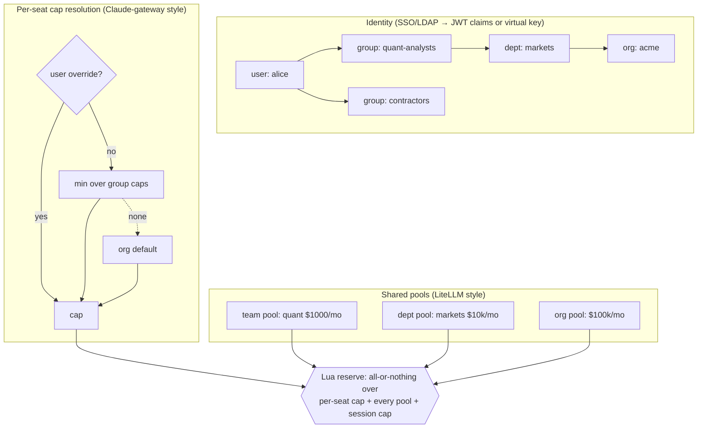
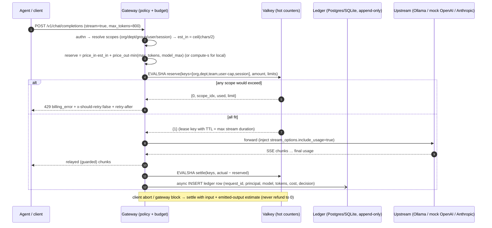
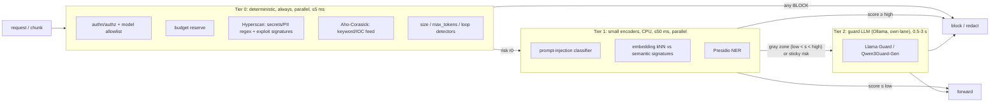
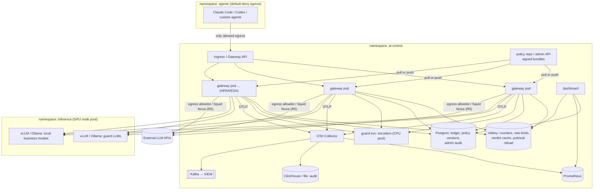

# R7: Budgets, streaming guardrails, performance engineering and Kubernetes scale

> **TL;DR**
> 1. **Budgets have to reserve before the call and settle after it.** Post-hoc charging, as in Envoy AI Gateway (now "Agent Router") and Kong, lets an admitted stream overshoot the cap ("1,000-token limit → a 1,200-token stream succeeds") [eaig-rl][kong-airl]. Reserve `input_est + min(max_tokens, model_max)` × price atomically across org → group → user → session with a Valkey Lua script, then settle on real `usage`. We measured **0.30 ms p50 per reserve+settle pair** and **exact enforcement under a 200-way race** (§1.7).
> 2. **Copy the vendor gateways' wire behaviour.** Over budget → `429` + `x-should-retry: false` + `retry-after: <s to reset>` with a readable message. Both official SDKs and Claude Code then **stop retrying** [cc-spend][oai-retry][anth-retry]. Warn at 75/95 %. Price unknown models at a non-zero default tier [cc-spend].
> 3. **Streaming output guard = holdback window + protocol-correct termination.** Deterministic detectors scan a sliding buffer that withholds the last *k* chars. On a hit they redact in place or cut the stream with `finish_reason:"content_filter"` / `event: error` and never reset TCP. Measured cost in Python: about **11 ms CPU per 200-chunk stream (+4.5 ms vs a plain relay)** and **+~200 ms time-to-first-visible-token at k=64 chars**, with zero effect on total latency (§2.4). Semantic checks run per sentence chunk, NeMo-style `stream_first` [nemo-stream].
> 4. **Performance:** cheap→expensive cascade, parallel fan-out with per-control timeouts and a fail mode per control. Use **Hyperscan/Vectorscan or RE2, never Python `re`, for judge-editable regexes**: `^(a|a)*$` on 23 chars stalls `re` for 380 ms (and the whole asyncio loop with it), while RE2 takes 0.2 ms. 20k-keyword feeds go through Aho-Corasick in **0.34 ms vs 174 ms** (§3.5). **Python is fine for a 24 h build.** Our Go clone of the same stream guard used only ~1.5× less CPU (§3.8).
> 5. **K8s story:** a stateless gateway with HPA/KEDA, Valkey for hot counters, Postgres/ClickHouse for the ledger and audit, a separate GPU pool (vLLM) for guard models, signed policy bundles with last-known-good, and default-deny egress NetworkPolicy so agents can only reach the gateway. **Ship** docker-compose plus kustomize manifests. **Demo** live policy edits through a file watcher, not ConfigMap propagation, which takes up to about a minute [k8s-cm][k8s-kubelet].

---

## 0. Method, conventions, caveats

- **Verified on 2026-10-03.** The session's web-search quota was used up, and the egress proxy blocks most vendor doc sites (docs.litellm.ai, aigateway.envoyproxy.io, genai.owasp.org, opentelemetry.io, kubernetes.io…). Primary content was therefore read from the **docs' source repositories** (`raw.githubusercontent.com`, blobless `git clone`), from **SDK source code** (openai-python, anthropic-sdk-python), from **vendor `.md` doc endpoints** that were reachable (platform.claude.com, code.claude.com), and from **PyPI JSON** for versions and licenses. Each source is listed in the Sources section at the end.
- **Own measurements** live in `research/R7-bench/` (scripts plus raw outputs). Box: Intel Xeon 4 vCPU, 15 GB RAM, no GPU, Python 3.11.15, Go 1.24.7, Redis 7.0.15. The load driver and mock upstream share those 4 cores, so the absolute numbers are **pessimistic**. Relative numbers (A vs B on the same box) are the ones to quote.
- Related notes: **R1** (threat frameworks, ATLAS `AML.M0036 Limit AI Workload Resource Consumption`), **R3** (OSS landscape, licenses, Python/FastAPI recommendation), **R4** (local guard models and their CPU latencies), **R5** (proxy vs gateway, Claude Code gateway protocol, egress fence). This file goes deeper on budgets, streaming, performance and K8s. It does not repeat the others.
- Tags: **[MVP]** build in the 24 h; **[STRETCH]** if time allows; **[PITCH]** slide/talk only. Anything not verified is marked **UNVERIFIED** and collected in §7.

---

## 1. Budget and resource governance

### 1.1 What to meter: units

| Unit | Source of truth | Pre-flight estimate | Good for | Notes |
|---|---|---|---|---|
| **Input tokens** | Provider `usage` (OpenAI `prompt_tokens`, Anthropic `input_tokens`, Ollama `prompt_eval_count`) [oai-chunk][anth-stream][ollama-usage] | Tokenizer, or chars÷k with a safety factor (§1.5) | TPM limits, cost | Cached input is priced differently. Anthropic reports `cache_read_input_tokens`/`cache_creation_input_tokens` [anth-usage-type]; Ollama reports `prompt_eval_cached_count` [ollama-usage] |
| **Output tokens** | Provider `usage` (final chunk / `message_delta`) | `min(max_tokens, model max_output)` | Cost, runaway generations | Reasoning tokens are included in billed output (Anthropic: "`output_tokens` remains the inclusive, authoritative total used for billing") [anth-usage-type] |
| **Money** (USD, or internal credits) | tokens × price table (§1.9) | reservation from the estimate | Management dashboards, per-dept budgets | Store **integer micro-USD** in counters to avoid float drift |
| **Requests** | gateway count | 1 | RPM, abuse | Cheap and a good first line |
| **Concurrency** (in-flight) | gateway semaphore/lease | n/a | Protects shared local GPU/CPU, stops fan-out bombs | Lease with TTL so crashed requests release it |
| **Compute-seconds** (local models) | Ollama `prompt_eval_duration + eval_duration` (ns) [ollama-api] | measured tok/s per model × tokens | Local-model "cost" when $ = 0 | §1.10 |
| **Tool calls / MCP invocations** | gateway (tool_use blocks, MCP `tools/call`) | n/a | Agent→MCP governance, expensive tools | Per tool and per session |
| **Agent steps / iterations** | LLM calls per session/trace id | n/a | Runaway loops | LiteLLM has exactly this: `max_iterations` + `max_budget_per_session` keyed by `x-litellm-trace-id` [ll-iter]. Claude Code sends `x-claude-code-session-id`, `-agent-id`, `-parent-agent-id`, `-request-class` [cc-gwproto] |
| **Wall-clock** | gateway timers | n/a | Long-running sessions, stuck streams | Max stream duration per request; max session age |

### 1.2 Hierarchy and how limits combine

Scopes: **org → department → team/LDAP group → user → API key / agent / app → session**. Two vendor semantics exist, and we should support both explicitly in `policy.yaml`:

| Semantics | Who does it | Meaning | Use when |
|---|---|---|---|
| **Per-seat inherited cap** | Claude apps gateway: "A group or organization cap is a per-seat default that each member inherits, not a shared pool." Resolution: **per-user override → most restrictive of their group caps → org default → unlimited**. A `group_limit_mode: max` option flips the multi-group tie-break to least restrictive [cc-spend] | Every member of `quant-analysts` gets $20/day | LDAP-group-driven entitlements (team's original idea) |
| **Shared pool, hierarchical AND** | LiteLLM: key, user, team, team-member, end-user, org, tag, project each carry `max_budget`, and every applicable counter must have room. Reservation is atomic across all of them [ll-matrix][ll-reserve] | Team `quant` has $1,000/month total. Alice also has a $50/day personal cap | Department budgets, cost centres |

Both can coexist. The effective decision is **allow iff every applicable counter (pools *and* the resolved per-seat cap) has room**. Our Lua reserve (§1.7) takes N keys and N limits and is all-or-nothing.



### 1.3 Periods and resets

| Option | Who | Pros | Cons |
|---|---|---|---|
| **Calendar periods (UTC)** | Claude apps gateway: daily 00:00 UTC, **weekly Monday**, monthly on the 1st [cc-spend]. Portkey: **weekly Sunday 00:00 UTC**, monthly on the 1st [pk-budget] | Matches finance; easy `retry-after` = seconds to reset | Burst at period start; "week" differs between vendors, so **state it in the policy** |
| **Rolling/sliding windows** | Envoy AI Gateway/Agent Router QuotaPolicy: window must be exactly 1s/1m/1h/1d [eaig-quota]. Kong sliding windows [kong-windows] | Smooth, no boundary burst | Harder to explain to managers; reset time is fuzzy |
| **Duration from creation** | LiteLLM `budget_duration` + reset job; multi-window `budget_limits` list [ll-matrix] | Flexible | Each key resets at a different time |

**Recommendation [MVP]:** calendar periods for money budgets (`daily`, `monthly`, with a `timezone` field defaulting to UTC), and a token bucket/GCRA for rate limits (TPM/RPM). Counter key = `{tenant}:spend:<scope>:<id>:<period-start>` with TTL slightly longer than the period. A "reset" is then just a new key, so no reset job is needed.

### 1.4 Soft vs hard limits and actions on breach

| Action | When | Wire behaviour | Prior art |
|---|---|---|---|
| **Notify (soft)** | 75 % / 80 % / 95 % of a cap | Request proceeds. Emit an audit event and a header (`x-aicl-budget-remaining`, utilisation %) | Claude Code warns at 75 % and 95 % based on gateway headers [cc-spend]. LiteLLM alerts at `soft_budget` or 80 % [ll-matrix]. Portkey `alert_threshold` (email "work in progress") [pk-policies] |
| **Block (hard)** | cap reached | **`429`**, body `{"type":"error","error":{"type":"billing_error","message":"spend limit reached (daily; resets 2026-10-04 00:00 UTC)"}}` (Anthropic shape) or the OpenAI error shape. Headers **`x-should-retry: false`** and **`retry-after: <seconds to reset>`** | Exactly the Claude apps gateway [cc-spend]. openai-python and anthropic-sdk-python both obey `x-should-retry: false` [oai-retry][anth-retry]. Claude Code shows a spend-limit 429 without retrying, while it *does* retry ordinary throttles [cc-errors]. `retry-after` > 60 s makes Claude Code stop retrying and show the error [cc-gwproto] |
| **Downgrade / reroute** | model-specific cap reached | Rewrite `model` to a cheaper or local model, add header `x-aicl-downgraded-from` | LiteLLM `budget_fallbacks`: per-model fallback chain applied when `model_max_budget` is exceeded [ll-fallbacks] |
| **Clamp** | remaining budget < reservation | Lower `max_tokens` to what is affordable | LiteLLM resizes the reservation down to the remaining budget unless strict mode is on [ll-reserve] |
| **Queue** | local GPU/CPU saturated (not a money breach) | Hold in a weighted fair queue up to N s, then 503/429 | Ollama itself queues FIFO up to `OLLAMA_MAX_QUEUE` (default 512), then answers 503 [ollama-faq] |
| **Require approval** | over cap but business-critical | 403 + approval link. Admin grants a temporary increase (audited) | LiteLLM has a "budget temp increase" migration (feature details **UNVERIFIED**) |
| **Kill switch** | incident | Global/per-model/per-user freeze (§1.12) | Envoy QuotaPolicy `shadowMode` is the inverse: evaluate without enforcing, useful for rollout [eaig-quota] |

**Design note:** "unavailable ledger" is its own outcome. Claude apps gateway **fails open** by default (2 s Postgres timeout). With `fail_closed_on_error: true` it returns the same 429 with message `spend limit unavailable` [cc-spend]. Agent Router quota checks also fail open by default (`quotaRateLimitFailureModeDeny: false`) [eaig-quota]. For a bank, the policy should make this explicit per upstream class (§3.7).

### 1.5 Pre-flight token estimation (and how wrong it can be)

- **Exact counters exist only per tokenizer.** Anthropic: "Claude 4.7 and later models … use a newer tokenizer. The same input text produces approximately 30 percent more tokens than on earlier models" [anth-tc]. So even one vendor's counts move by about 30 % between model generations. Anthropic's `count_tokens` endpoint is free but rate-limited, and is itself "an estimate" [anth-tc]. We have no paid keys, so it is irrelevant for the demo.
- **tiktoken** 0.14.0 (MIT) [pypi-tiktoken] downloads its BPE files at first use from `openaipublic.blob.core.windows.net`. In this sandbox that host is blocked, so `get_encoding("o200k_base")` fails. **Gotcha:** pre-bake the files into the Docker image and set `TIKTOKEN_CACHE_DIR` (read in `tiktoken/load.py`) [tiktoken-src].
- **HF `tokenizers`** 0.23.2 (Apache-2.0) [pypi-tokenizers] loads `tokenizer.json`. The files come from the HF Hub, which is gated or blocked here. For local models the **exact** count arrives anyway in Ollama's `prompt_eval_count` after the call [ollama-usage].
- **Large prompts are expensive to count in Python.** LiteLLM measured admission token counting for 50K/75K/100K-token prompts at **46/53/100 ms**, cut to **4.9/6.8/10.2 ms** with Rust [ll-bench]. For pre-flight we only need an **upper bound**, so use chars-based bounding and count exactly off the hot path.

**Measured divergence** (our run, `R7-bench/tokenizer_divergence.py`). Tokenizers that ship inside PyPI wheels: the legacy Claude tokenizer from `anthropic==0.18.1` (**not** today's Claude tokenizer), and Mistral SentencePiece v1 (32k) plus Tekken (~131k) from `mistral-common` 1.12.0:

| Text | chars | chars/4 | legacy-Claude | Mistral SP-32k | Tekken-131k | max/min across tokenizers | chars/4 error vs Tekken |
|---|---|---|---|---|---|---|---|
| English business prompt | 247 | 62 | 54 | 58 | 54 | 1.07 | +15 % |
| **Polish** business prompt | 258 | 64 | 115 | 107 | 82 | **1.40** | **−22 %** (−44 % vs legacy) |
| Python code | 232 | 58 | 61 | 75 | 59 | 1.27 | −2 % |
| JSON tool call | 173 | 43 | 68 | 88 | 82 | 1.29 | **−48 %** |
| PII-heavy (PESEL, IBAN, phone) | 103 | 26 | 38 | 79 | 77 | **2.08** | **−66 %** |

**So what:** `chars/4` **underestimates** exactly the traffic a Polish bank cares about (Polish text, JSON tool calls, numeric identifiers) by 20-66 %. **No single chars-per-token ratio is safe.** The divisor needed for an upper bound ranges from about 4.6 (English) to about 1.3 (digit-heavy PII) in our sample. For reservations use the target model's tokenizer × 1.2 when we have it. Otherwise use `ceil(chars / 2)`, which covers prose, Polish and JSON in our sample and still underestimates digit-heavy text by about 34 %. The output side (`max_tokens`) usually dominates the reservation anyway. Always **settle on provider-reported usage**. Claude apps gateway uses "about four characters per output token" only as a *floor* when billing aborted streams [cc-spend]. A floor is the right use for chars/4. An admission bound is the wrong one.

### 1.6 Reservation-then-settle (the core algorithm)



**Where real usage comes from:**

| Protocol | Usage location | Gotcha |
|---|---|---|
| OpenAI Chat Completions (stream) | Only if `stream_options: {"include_usage": true}`. Then an extra chunk arrives before `data: [DONE]` with `usage` and `choices: []`. "**If the stream is interrupted, you may not receive the final usage chunk**" [oai-streamopts][oai-chunk] | **Inject `include_usage=true` upstream** even if the client did not ask, and strip that chunk if the client did not request it. Ollama's OpenAI-compatible API supports `stream_options.include_usage` [ollama-openai] |
| OpenAI Responses (stream) | `response.completed` event carries the full `Response` (incl. usage) [oai-resp-completed] | Same abort caveat |
| Anthropic Messages (stream) | `message_start.message.usage.input_tokens`. Then `message_delta.usage` whose "token counts … are **cumulative**" [anth-stream][anth-usage-type] | Partial output usage is visible on any `message_delta` before the end |
| Ollama native `/api/chat` (NDJSON) | Final object with `done: true` carries `prompt_eval_count`, `eval_count`, `total_duration`, `load_duration`, `prompt_eval_duration`, `eval_duration` (ns) [ollama-api][ollama-usage] | Abort means no counts. Each streamed object carries one text fragment, so counting objects approximates output tokens (approximation, our inference) |
| Ollama Anthropic-compat `/v1/messages` | `usage` (input_tokens, output_tokens), events incl. `message_delta` [ollama-anthropic] | — |

**Abort and block accounting rules [MVP]:**
1. Once the upstream request is dispatched, **input is spent**. LiteLLM reconciles a cancelled reservation to the input cost, "instead of being refunded to zero" [ll-reserve]. Anthropic bills mid-stream refusals for input plus output already streamed [anth-refusal]. Azure bills prompt plus completion generated before a `content_filter` stop [azure-async].
2. On our own mid-stream block: **close the upstream connection immediately** to stop spend. Settle with `input_est + max(usage_seen, ceil(emitted_chars/3))`.
3. On client disconnect: Starlette cancels the streaming task on `http.disconnect` (or raises `ClientDisconnect` with ASGI ≥ 2.4) [starlette-src]. Run settlement in `finally:` via `asyncio.shield(...)` or a fire-and-forget task, otherwise the cancellation also cancels the settle `await`.
4. Leases: if the gateway pod dies mid-stream, the reservation must not leak forever. Use a lease TTL plus a sweeper (LiteLLM renews reservation leases for the same reason [ll-reserve]).
5. Reconciliation job [STRETCH]: recompute counters from the ledger hourly and alert on drift.

### 1.7 Atomic counters: Valkey/Redis Lua vs in-memory

- Lua scripts execute atomically: "While executing the script, all server activities are blocked during its entire runtime" [valkey-eval]. All keys must be passed as `KEYS` for cluster correctness [valkey-eval]. Put them in one slot with a **hash tag** (`{acme}:spend:...`) [valkey-cluster]. Default max script time is 5 s (`busy-reply-threshold`) [valkey-prog], so keep scripts O(#scopes).
- License: **Valkey is BSD-3** [valkey-lic]. **Redis ≥ 8 is RSALv2/SSPLv1/AGPLv3 tri-licensed**, while ≤ 7.2 is BSD [redis-lic]. Use the `valkey/valkey` image or Redis 7.2 (R3 agrees).
- **Single node / docker-compose demo:** an in-process `asyncio.Lock` + dict is fine and faster. But two gateway replicas then double-spend. Run Valkey even in the demo so the "horizontally scalable" claim is real.

Our script (`R7-bench/budget_lua.py`, abbreviated):

```lua
-- RESERVE: KEYS = scope counters; ARGV[1]=amount (micro-USD or tokens), ARGV[2]=ttl, ARGV[3..]=limits (-1 = unlimited)
local amt = tonumber(ARGV[1])
for i, k in ipairs(KEYS) do
  local cur = tonumber(redis.call('GET', k) or '0'); local lim = tonumber(ARGV[i+2])
  if lim >= 0 and cur + amt > lim then return {0, i, cur, lim} end   -- which scope breached
end
for i, k in ipairs(KEYS) do
  redis.call('INCRBY', k, amt)
  if redis.call('TTL', k) < 0 then redis.call('EXPIRE', k, tonumber(ARGV[2])) end
end
return {1, 0, 0, 0}
-- SETTLE: INCRBY every key by (actual - reserved); negative = refund of unused reservation
```

**Measured** (local Redis 7.0.15, redis-py asyncio, 3 hierarchical keys):

| Concurrency | Reserve+settle pairs/s | p50 per pair | p99 per pair |
|---|---|---|---|
| 1 | 2,660 | **0.30 ms** | 1.24 ms |
| 16 | 4,009 | 3.09 ms | 7.03 ms |
| 64 | 4,293 | 11.3 ms | 22.9 ms |

Throughput flattens at about 4k pairs/s because **the single Python client process** saturates, not Redis. At c=1 the cost is about 0.3 ms per request, which is noise next to LLM latency. **Race test:** 200 concurrent $1 reservations against a $50 cap allowed **exactly 50**.

### 1.8 Rate-limit algorithms (for TPM/RPM, distinct from money budgets)

| Algorithm | State | Accuracy | Burst behaviour | Notes |
|---|---|---|---|---|
| Fixed window (`INCRBY` + `EXPIRE`) | 1 counter | Allows 2× burst at window edges | Kong's example: 10 requests at second 59 + 10 at second 60 all pass [kong-windows] | Simplest. Fine for daily money caps |
| Sliding log (ZSET of timestamps) | O(requests) | Exact | Smooth | Memory-heavy for TPM |
| Sliding window counter (current + weighted previous window) | 2 counters | Approximate | Smooth | Kong's default "sliding" type [kong-windows] |
| Token bucket | tokens + last refill ts | Exact rate + burst size | Explicit burst | Natural for "tokens per minute" |
| **GCRA** | 1 timestamp (TAT) | Equivalent to leaky bucket | Explicit burst | `redis-cell` `CL.THROTTLE <key> <max_burst> <count> <period> [<quantity>]`, roughly 0.1 ms per command. **`quantity` = token count of the request** [redis-cell]. The module is in "best effort" maintenance, so reimplement GCRA in Lua (~15 lines) |

**Recommendation [MVP]:** GCRA or token bucket in Lua for RPM/TPM per user and model. Calendar counters for money. Both come from the same `policy.yaml`.

### 1.9 Price tables

- **LiteLLM's `model_prices_and_context_window.json`** (MIT, inside the LiteLLM repo) has **4,460 entries** today, with fields like `input_cost_per_token`, `output_cost_per_token`, cache/reasoning costs, `tiered_pricing`, `max_input_tokens`/`max_output_tokens`, `litellm_provider` and `mode` [ll-prices]. Example entries: `gpt-4o` 2.5e-06 / 1e-05 per token; `ollama/*` 0.0.
- LiteLLM **fetches this file from GitHub `main` at import time by default**. It validates it (minimum model count, max shrink ratio vs the bundled backup) and falls back to the bundled copy. You disable the fetch with `LITELLM_LOCAL_MODEL_COST_MAP=True` [ll-costmap]. For a bank that means **runtime pricing from the internet**, which is a supply-chain and integrity concern. We **vendor a pinned subset** with a SHA in the policy.
- Claude apps gateway: price lookup order is override → list price for the upstream ID → list price for the mapped ID → an **unknown-model tier of $5/$25 per M input/output tokens "so an ID the meter can't place is never free"**, then × `pricing.multiplier` [cc-spend]. **Copy the unknown-model default.**

Our schema [MVP], in `policy.yaml` or `prices.yaml`:

```yaml
pricing:
  currency: USD            # counters store integer micro-USD
  source: "litellm model_prices_and_context_window.json @ <commit-sha> (subset, MIT)"
  unknown_model: { input_per_mtok: 5.00, output_per_mtok: 25.00 }   # never free
  models:
    gpt-4o:            { input_per_mtok: 2.50, output_per_mtok: 10.00 }   # demo via mock upstream
    claude-sonnet-x:   { input_per_mtok: 3.00, output_per_mtok: 15.00 }   # illustrative
    ollama/llama3.2:3b:{ input_per_mtok: 0, output_per_mtok: 0, compute_rate_per_gpu_s: 0.0007 }  # internal chargeback
```

### 1.10 Compute-time accounting for local models

Ollama returns durations in **nanoseconds**: `total_duration`, `load_duration`, `prompt_eval_duration`, `eval_duration`, plus `prompt_eval_count`, `prompt_eval_cached_count` and `eval_count`. Throughput is `eval_count / eval_duration × 10^9` [ollama-api][ollama-usage]. The doc's example: 26 prompt tokens in 0.13 s, 259 output tokens in 4.23 s (≈ 61 tok/s), with a **6.3 s model load** inside a 10.7 s total [ollama-api].

```
compute_s(request)   = (prompt_eval_duration + eval_duration) / 1e9      # charge to the caller
platform_s(request)  = load_duration / 1e9                               # cold start: charge to platform, not user
internal_cost        = compute_s × rate_per_compute_s(model, device)     # e.g. GPU-hour $2.50 → $0.000694/s (illustrative)
reservation (pre)    = est_in / prefill_tps(model) + min(max_tokens, cap) / decode_tps(model)   # EWMA of measured tps
```

Caveats (our reasoning):
- With `OLLAMA_NUM_PARALLEL > 1`, concurrent requests share the device and their durations overlap. Charging the sum of durations over-counts device time. Either divide by observed parallelism, or charge **tokens × model-size weight** (simpler and fairer to explain).
- On CPU-only laptops call it **"compute-seconds"**, not GPU-seconds. The budget unit is still meaningful: it is the scarce resource that guard models and agents compete for.

### 1.11 Fair share for a shared local GPU/CPU

- Ollama: `OLLAMA_NUM_PARALLEL` defaults to **1**. RAM scales with `NUM_PARALLEL × CONTEXT_LENGTH`. `OLLAMA_MAX_LOADED_MODELS` defaults to 3 × #GPUs (3 on CPU). `OLLAMA_MAX_QUEUE` defaults to **512**, and beyond it Ollama returns **503**. Queued model-load requests "are processed in order" [ollama-faq]. **No per-tenant fairness**, so a single noisy agent starves everyone, **including our own guard model** if it runs on the same Ollama.
- **Gateway-side fairness [MVP-lite]:** a per-principal concurrency cap (e.g. 2 in-flight per user, 1 per session), plus a **weighted fair queue** (deficit round robin over tenants) in front of each local model. **Reserve a separate lane for guard-model calls** (separate Ollama instance or priority queue) so guards never queue behind generations.
- Prior art: LiteLLM's v3 limiter is **saturation-aware**. Below 80 % capacity it is "generous" (borrowing allowed, FCFS). At ≥ 80 % it enforces normalized priority weights [ll-dynrl]. That is a good pitch line: "Priorities only bite when the GPU is contended."
- K8s analogue: GPU **time-slicing** gives no memory or fault isolation ("if one workload crashes, they all do"), while **MPS** partitions memory and compute per workload [nvidia-dp].

### 1.12 Denial of wallet, runaway loops, kill switches

OWASP **LLM10:2025 Unbounded Consumption** lists Variable-Length Input Flood, **Denial of Wallet**, Continuous Input Overflow, Resource-Intensive Queries, Model Extraction, Functional Model Replication and Side-Channel attacks. Its mitigations include input validation (size limits), rate limiting and quotas, resource allocation management, timeouts and throttling, logging/monitoring/anomaly detection, graceful degradation, and **limiting queued actions and total actions** [owasp-llm10]. MITRE ATLAS `AML.M0036` says "limit iterations, retries, tool calls, parallel tasks, delegation depth, and downstream spending" (see R1).

| Detector / control | Signal | Default action | Test case (negative → blocked) |
|---|---|---|---|
| Max input size | bytes/chars/est tokens > N | 413/400 before upstream | 2 MB prompt → 413 |
| `max_tokens` ceiling | requested > policy cap | clamp (or 400) | `max_tokens: 999999` → clamped to 4096 (LiteLLM clamps reservations for the same DoS reason [ll-reserve]) |
| Session step cap | LLM calls per session > N | 429 `agent_step_limit` | 51st call in a session with cap 50 |
| Session $ cap | spend per session > X | 429 | loop script hits $1 cap |
| Repeat-loop detector | same normalized prompt hash ≥ K times in M min per session; same `tool+args` hash repeated | warn → block | 10 identical tool calls in 60 s |
| **Token-velocity anomaly** | tokens/min per principal vs EWMA baseline: z > 4 **and** absolute > floor | alert, then auto-throttle to a low TPM | burst of 20 parallel max-length requests |
| Fan-out cap | in-flight per principal > N | 429 `concurrency` | 30 parallel streams from one key |
| Upstream circuit breaker | error rate / latency per upstream over a window | open → fail over to local or 503 | mock upstream returns 500s |
| **Kill switches** | admin action or policy flag | `enforcement: off\|shadow\|enforce` globally, per model `enabled: false`, per user `frozen: true`, "**external models off**" panic button | judge flips `external_models: off` → next request rerouted to local or blocked |

### 1.13 How existing gateways model budgets

| Gateway | Units | Scopes | Timing | Streaming overshoot | Tier |
|---|---|---|---|---|---|
| **LiteLLM** | $ (via price map), TPM/RPM, iterations | key, user, team, team-member, end-user, org, tag, project, provider, global, model-access-group | **Pre-call reservation** (Redis `INCRBYFLOAT` pipeline) + post-call reconcile. End-user budgets lag until a batch flush [ll-matrix][ll-reserve] | Bounded by reservation (max_tokens clamped to model max, default 16,384) [ll-reserve] | OSS (enterprise for SSO/JWT per R3) |
| **Portkey** (its docs now also refer to "Prisma AIRS AI Gateway") | USD (min $1) or tokens (min 100) | Integration → workspace; policies by user/key/model/provider/config with `group_by` | "Applied only to requests made after the limit is set". Limits "cannot be edited" once set. Periodic weekly/monthly reset [pk-budget][pk-policies] | **UNVERIFIED** | Policy-based budgets documented under "enterprise offering" [pk-policies] |
| **Kong AI Rate Limiting Advanced** | prompt/completion/total tokens or **cost** = `(prompt×in + completion×out)/1e6` | consumer, group, header, model, provider (`partition_by`) | **"The cost … is only reflected during the next request"** [kong-airl] | Yes (post-hoc) | `ai_gateway_enterprise` [kong-airl] |
| **Envoy AI Gateway / Agent Router** | `InputToken`, `CachedInputToken`, `OutputToken`, `TotalToken`, **CEL** custom cost | Envoy Gateway global rate-limit descriptors (headers: tenant, model) + `QuotaPolicy` per backend | "Token usage is charged after the response completes" [eaig-rl] | **Yes: "a 1,000-token hourly limit … can stream 1,200 tokens"** [eaig-rl] | Apache-2.0. The project was renamed "Agent Router", "Formerly Envoy AI Gateway" [eaig-readme] |
| **Claude apps gateway** (Anthropic) | USD cents | user (OIDC `sub`), `rbac_group` (IdP group), organization | Pre-check against period-to-date spend (Postgres), then post-response metering; "a circuit breaker rather than an invoice" [cc-spend] | Admitted request completes; next is blocked. **Aborts billed with a chars/4 floor** [cc-spend] | Product feature |

**Takeaway for the pitch:** most gateways charge post-hoc. A reservation makes our hard caps **actually hard**, and it is cheap (§1.7). That's a concrete robustness point for the 30 % "robustness" criterion.

### 1.14 Sample `policy.yaml` budget section [MVP]

```yaml
budgets:
  enforcement: enforce            # enforce | shadow (evaluate+log, never block) | off
  on_ledger_unavailable:          # fail mode per upstream class (§3.7)
    external: fail_closed         # paid APIs: no unmetered spend
    local: fail_open              # local models: availability first
  periods: { timezone: UTC, week_starts: monday }
  estimation: { input_chars_per_token: 2, abort_output_chars_per_token: 3 }   # see §1.5
  warn_at: [0.75, 0.95]
  scopes:
    org:   { id: acme, monthly_usd: 100000 }
    pools:                                   # shared pools (hierarchical AND)
      - { dept: markets, monthly_usd: 10000 }
      - { team: quant,   monthly_usd: 1000 }
    seats:                                   # per-seat caps inherited from LDAP groups
      resolve: most_restrictive              # or: least_restrictive
      groups:
        quant-analysts: { daily_usd: 20, daily_compute_s: 1800, models: [gpt-4o, ollama/*] }
        contractors:    { daily_usd: 5,  daily_compute_s: 300,  models: [ollama/llama3.2:3b] }
      users:
        alice@acme.com: { daily_usd: 50 }    # override
    session: { max_usd: 2.0, max_llm_calls: 50, max_tool_calls: 100, max_wall_s: 1800 }
  rate_limits:                               # GCRA / token bucket
    - { per: user, model: "*",  tpm: 60000, rpm: 60, burst: 10 }
    - { per: user, concurrency: 3 }
  on_breach:
    - { when: "model_cap",  action: downgrade, to: ollama/llama3.2:3b }
    - { when: "seat_cap",   action: block, message: "Ask your manager for a temporary increase: https://..." }
    - { when: "session_cap",action: block }
```

---

## 2. Streaming guardrails

### 2.1 Why this is the hard part

Agents need streaming. Claude Code stalls if a gateway buffers complete responses. It needs events relayed in order, keep-alive pings forwarded (5-minute byte-level idle watchdog), and streams that end with `message_delta` + `message_stop` [cc-gwproto]. A body that ends cleanly early, after a content block has started, is treated like a dropped connection [cc-gwproto]. Dropped connections and `overloaded`/server errors before any content are **retried up to 10 times** [cc-errors]. So **never block by resetting the connection** (R5 §4). Output-side "Block vs Redact" is an explicit task requirement.

### 2.2 Strategy menu

| # | Strategy | How | Time to first visible token | Leak window | Use for |
|---|---|---|---|---|---|
| S1 | **Buffer-all** | Generate fully, scan, then release (or switch the client to non-stream) | = full generation (seconds) | none | Non-streaming clients, tool-call arguments (must be complete JSON anyway) |
| S2 | **Pass-through + async scan** | Forward immediately, scan in parallel, kill the stream on violation | ≈ 0 | everything up to the detection point | "Monitor" mode, low-risk controls. Azure "Asynchronous Filter": signal "guaranteed within a ~1,000-character window of the policy-violating content" [azure-async]. NeMo `stream_first: True` [nemo-stream] |
| S3 | **Chunked pre-release** | Buffer N tokens, run rails, release the chunk if clean | + chunk fill time + rail latency **per chunk** | none | Semantic checks with strict mode. NeMo `stream_first: False`, `chunk_size` 200, `context_size` 50 overlap [nemo-stream]. Azure default mode ("content chunks") [azure-stream] |
| S4 | **Holdback sliding window** | Release everything except the last *k* chars, scan buffer + new delta, redact or stop | + k chars ÷ stream rate (measured §2.4) | none for patterns ≤ k chars | **Deterministic detectors** (secrets, PII regex, exploit signatures). Our default |
| S5 | **Sentence/paragraph-boundary semantic** | Accumulate to `.`/`\n` boundary (≥ M chars), classify with overlap context, async or held | S2-like if async, S3-like if held | ≤ 1 sentence if async | Prompt-guard / content-safety classifier on output (R4 tier-1/2) |
| S6 | **Token-level stream guard** | Feed each token into a classifier with streaming state | ≈ per-token model cost | ≈ 1 token | **Qwen3Guard-Stream** (0.6B/4B/8B): token-level head, Safe/Controversial/Unsafe + category per token, `stream_moderate_from_ids(...)` with `stream_state` [qwen3guard]. **Needs Qwen3 token IDs** (re-tokenize otherwise). transformers + `trust_remote_code` only; "working on adding support … to vLLM and SGLang" [qwen3guard]. **STRETCH** |

**Recommended composition [MVP]:** S4 for every deterministic output control (k = longest pattern + margin, default 128 chars), plus S5 in **async** mode for semantic output checks (fast, but can retroactively kill), with a per-control `stream_mode: hold | async` knob in the policy. The knob maps straight onto judges' "sensitivity threshold" demo: strict = hold, lenient = async. Tool-call argument deltas (`input_json_delta` / `tool_calls[].function.arguments`) are **always S1**. We need complete arguments to authorize the call (R1 §tool mediation).

### 2.3 Holdback window: algorithm

```python
class HoldbackScanner:                     # one per stream (and per content block / choice index)
    def __init__(self, detectors, k):      # k >= max pattern length; detectors compiled with Hyperscan/RE2
        self.buf, self.k = "", k
    def feed(self, delta) -> tuple[str, Verdict|None]:
        self.buf += delta
        hit = self.detectors.first_match(self.buf)              # RE2/Hyperscan: linear time
        if hit and hit.action == "redact":
            self.buf = self.buf[:hit.start] + f"[REDACTED:{hit.label}]" + self.buf[hit.end:]
        elif hit and hit.action == "block":
            safe, self.buf = self.buf[:hit.start], ""
            return safe, hit                                      # caller terminates protocol-correctly
        if len(self.buf) > self.k:                                # release all but the last k chars
            out, self.buf = self.buf[:-self.k], self.buf[-self.k:]
            return out, None
        return "", None
    def flush(self): out, self.buf = self.buf, ""; return out     # on finish_reason / content_block_stop
```

Rules:
- One scanner **per content block / choice index**. Flush on `content_block_stop` / `finish_reason`, and re-scan on flush.
- Re-emit **protocol-native events** with our text, keeping ids, indices and order. Never drop, duplicate or reorder events (Claude Code stops reading on an orphan `content_block_*` event [cc-gwproto]).
- Redaction must not break a stream's structure. Replace text inside `text_delta` only. For **request-side** redaction, mutate JSON in place. Claude Code warns that a gateway which "rewrites or redacts request bodies … breaks the pairing" of beta headers and body fields [cc-gwproto]: re-serializing through a strict schema drops unknown fields.
- During long held checks, **emit keep-alives**: Anthropic `event: ping`, and SSE comment lines (`: keep-alive`) for OpenAI-style clients. Comments are ignored by SSE parsers and are a documented keep-alive mechanism [mdn-sse].

### 2.4 Measured cost (our harness, `R7-bench/stream/`)

Setup: Python mock OpenAI upstream (200 chunks/response, or 50 chunks at 20 ms/chunk ≈ 50 tok/s), our FastAPI gateway (`pass` = byte relay, `scan` = SSE parse + holdback(64) + 6 secret regexes + re-serialize), and an equivalent Go gateway. One uvicorn worker each, c=1 unless noted.

| Scenario | TTFB p50 | Total p50 | Overhead vs direct |
|---|---|---|---|
| Direct to mock (200 chunks, no delay) | 1.4-1.7 ms | 4.9-5.7 ms | — |
| Python gateway `pass` | 3.0 ms | 7.6-7.9 ms | +2.2-2.7 ms total |
| Python gateway `scan` | 4.3-4.4 ms | 13.9-14.3 ms | **+8.6-9 ms total** (≈ 45 µs/chunk) |
| Go gateway `pass` | 2.1 ms | 6.9 ms | +1.2 ms |
| Go gateway `scan` | 3.3 ms | 8.7 ms | +3.0 ms |
| Direct, **realistic 20 ms/token** (50 chunks) | 2.1 ms | 1,026 ms | — |
| Python `pass`, realistic | 4.0 ms | 1,026 ms | ≈ 0 |
| Python `scan` (holdback 64 chars), realistic | **208.7 ms** | 1,026 ms | **TTFT +~205 ms, total +0** |

**Gateway CPU per streamed response** (200 chunks, measured from `/proc/<pid>/stat` over 1,001 streams at c=16): Python pass **6.7 ms**, Python scan **11.2 ms**; Go pass **3.8 ms**, Go scan **7.3 ms**. On one core the Python scan path sustains about 89 such responses/s. At 50 tok/s, a 200-token response lasts ~4 s, so that is **~350 concurrent streams per core** (back-of-envelope).

**So what:**
- Holdback costs **time-to-first-visible-token ≈ k / (chars per token × tokens/s)**, not throughput or total latency. At k = 128 and ~4 chars/token at 50 tok/s that is ~0.6 s. Expose `k` per control and show the trade-off on a dashboard slider.
- Deterministic scanning is cheap in either language. **Semantic checks dominate** (R4: Prompt-Guard-2-22M-class INT8 ONNX ≈ 13 ms @64 tokens / 40 ms @200 tokens on 4 vCPU; a 1B guard LLM ≈ 1.6-2.2 s per call on CPU). So the semantic output tier must be async/sentence-level, not per token, on laptops.

### 2.5 Early termination: how to say "blocked" to each client type

| API | Before any content (pre-flight block) | Mid-stream block (graceful) | Mid-stream block (hard) | Client behaviour (verified) |
|---|---|---|---|---|
| **OpenAI Chat Completions** | HTTP 400/403 JSON `{"error":{"message","type","code"}}` | final chunk `delta:{}` + **`finish_reason: "content_filter"`** ("content was omitted due to a flag from our content filters" [oai-chunk]), usage chunk, `data: [DONE]` | `data: {"error":{...}}`: openai-python raises `APIError` when a data payload has an `error` key [oai-sse] | SDK obeys `x-should-retry` on HTTP errors [oai-retry]. Mid-stream errors raise during iteration |
| **OpenAI Responses** | as above | `response.completed`/incomplete event (shape **UNVERIFIED** for content-filter) | `event: error` (openai-python raises on a data payload with an `error` key, and on `error` events only for Assistants `thread.*` streams [oai-sse]. How the SDK surfaces a Responses `error` event is **UNVERIFIED**) | — |
| **Anthropic Messages** | HTTP 403 `{"type":"error","error":{"type":"permission_error",...}}` (error types listed in [anth-errors]) | close the open block (`content_block_stop`), then `message_delta` with a stop reason + `message_stop`. `stop_reason: "refusal"` exists [anth-stop], but Claude Code renders it as an **Anthropic Usage Policy refusal** ("…can't help with this. Start a new session") [cc-errors], which misattributes **our** policy. Prefer `end_turn` plus an appended `[blocked by policy SEC-007]` text, or the hard path | `event: error` + `data: {"type":"error","error":{"type":"permission_error","message":"Blocked by policy SEC-007"}}` [anth-stream]. anthropic-sdk-python raises a status error on SSE `error` events [anth-sse] | Claude Code retries **server/overloaded** errors and dropped connections before content. After a completed block it keeps the partial output [cc-errors]. **Never use `overloaded_error`/`api_error` for policy blocks**: they invite retries |
| **Ollama native** (NDJSON) | HTTP 4xx `{"error":"..."}` [ollama-errors] | final `{"done":true,"done_reason":"..."}` | `{"error":"..."}` line. Mid-stream errors are documented in exactly this form, status code unchanged [ollama-errors] | — |

**Recommendation [MVP]:** `block` → hard path (error event) with a stable machine-readable code (`policy_violation`, rule id, audit id). `redact` → graceful, stream continues. Pre-flight blocks → HTTP 4xx/429 with `x-should-retry: false`. Test all three paths against **both SDKs and Claude Code** on day 1 (§5).

### 2.6 Keeping usage accounting correct under streaming guards

- **Force `include_usage`** upstream (§1.6). Otherwise an aborted or blocked OpenAI-style stream has no usage at all [oai-streamopts].
- Count **emitted characters per stream** in the guard (we already have them) for the abort fallback.
- Library gotcha: NeMo Guardrails' output-rail streaming buffer "yields plain strings and **drops `provider_metadata` and `usage`**" [nemo-pyapi]. If we embed any third-party streaming guard, check that usage survives.
- Azure's annotation design is worth copying in our audit events: `check_offset` = "how much text is fully moderated … never decreases", plus `start_offset`/`end_offset` per verdict [azure-async]. Our audit record for a stream can carry the same three numbers. Security can then say "the user saw chars 0-1,143; violation at 1,120-1,160; blocked".

---

## 3. Performance engineering of the guardrail pipeline

### 3.1 Where time goes (orders of magnitude)

| Stage | Typical cost | Source |
|---|---|---|
| Gateway forwarding (no guards) | Python ~2 ms, Go ~1 ms on our box (c=1). Vendor numbers: LiteLLM "8 ms P95 at 1k RPS" (4 instances) [ll-bench]. Bifrost "11 µs" overhead at 5k RPS on t3.xlarge [bifrost]. LiteLLM's own cross-gateway bench: p99 added latency Rust 0.7 ms, Portkey 2.3 ms, Bifrost 4.5 ms, LiteLLM Python v1 **257.7 ms** (vendor-run, forwarding only, no spend tracking) [ll-rustbench] | measured / vendor |
| Budget reserve+settle (Valkey Lua) | 0.3 ms p50 at c=1 | §1.7 |
| Deterministic tier (48 regexes, 2k-char prompt) | Hyperscan < 0.01 ms; RE2 0.2 ms; Python `re` 0.56 ms | §3.5 |
| PII (Presidio) | tens of ms (see R4) | R4 |
| Tier-1 encoder classifier (INT8 ONNX, CPU) | 13-40 ms | R4 §9 |
| Tier-2 guard LLM 1B (CPU) | 1.6-2.2 s | R4 §9 |
| The LLM itself | 1-30 s per turn | — |

LiteLLM's honest framing applies to us: "For a single chat turn, gateway overhead is noise next to model latency". It matters for high-rate fast calls and multi-turn agent loops [ll-rustbench]. **Our latency budget target:** request-side guards p95 < 50 ms without the LLM judge. The LLM judge runs only on escalation.

### 3.2 Cascade with risk-score escalation



- Risk score `r = max(control scores)` or a weighted sum. Thresholds `low`/`high` per control come from the policy. These are the judges' "sensitivity / adherence %" knobs.
- **Early exit:** the first tier-0 BLOCK cancels pending checks.
- **Escalate selectively:** tier-2 runs only on the gray zone, or when the session already has prior flags (sticky risk).

### 3.3 Parallel fan-out with timeouts and early exit (asyncio sketch)

```python
async def run_tier(controls, ctx, deadline_s):
    # each control has its own timeout; the tier has an overall deadline; first BLOCK wins
    tasks = {asyncio.create_task(asyncio.wait_for(c.check(ctx), c.timeout_s)): c for c in controls}
    loop, verdicts, pending = asyncio.get_running_loop(), [], set(tasks)
    end = loop.time() + deadline_s
    try:
        while pending:
            done, pending = await asyncio.wait(pending, timeout=max(0.0, end - loop.time()),
                                               return_when=asyncio.FIRST_COMPLETED)
            if not done:                                  # tier deadline hit
                verdicts += [Verdict.timeout(tasks[t]) for t in pending]   # -> control.fail_mode
                break
            for t in done:
                c = tasks[t]
                v = Verdict.error(c, t.exception()) if t.exception() else t.result()  # error -> fail_mode
                verdicts.append(v)
                if v.action == "block":
                    return verdicts                       # early exit; finally cancels the rest
    finally:
        for t in pending:
            t.cancel()
    return verdicts
```

- **CPU-bound checks must not run on the event loop.** A 380 ms Python `re` backtrack (§3.5) or a 40 ms ONNX inference blocks **all** in-flight streams in that worker. Use `asyncio.to_thread` for short calls, a process pool, or a separate guard service (HTTP/gRPC) for model inference. Whether ONNX Runtime / google-re2 / hyperscan release the GIL is **UNVERIFIED**. Measure, or isolate in processes.
- Run several uvicorn workers (`--workers N`), or gunicorn with uvicorn workers. Keep all state in Valkey so workers and pods are interchangeable.

### 3.4 Verdict caching

- Key = `sha256(policy_version ‖ feed_version ‖ control_id ‖ normalize(text))`. Normalization: Unicode NFKC, casefold, strip zero-width/bidi chars, collapse whitespace. The **same normalization must feed the detectors**, otherwise the cache becomes a bypass oracle.
- Cache **block** verdicts longer than **allow** verdicts. Include policy and feed versions in the key so a live policy edit by judges invalidates everything automatically.
- Agent loops resend the whole conversation every turn, so **cache per message**, not per request. Only the new tail needs scanning. This is the biggest practical win for multi-turn agents (our reasoning). Request-side scanning cost then stays O(new content) per turn.

### 3.5 Regex engines, ReDoS, and large keyword sets (measured)

`R7-bench/bench_regex.py`, Python 3.11, google-re2 1.1.20251105 (BSD), hyperscan 0.8.2 (MIT bindings, statically linked **Vectorscan**), pyahocorasick 2.3.1 (BSD-3), regex 2026.9.29 (Apache-2.0 AND CNRI-Python) [pypi-*][pyhs]:

| Test | Python `re` | google-re2 | `regex` (PyPI) w/ timeout | Hyperscan/Vectorscan |
|---|---|---|---|---|
| ReDoS `^(a+)+$`, n=18/20/22/24 + `!` | 12 / 49 / 202 / **737 ms** (×4 per +2 chars) | 0.13-0.19 ms | optimises this one away | n/a |
| ReDoS `^(a\|a)*$`, n=22 | **380 ms** | 0.20 ms | n=40 with `timeout=0.05` → `TimeoutError` after **50.8 ms** | n/a |
| 48 secret/PII patterns, 2k chars | 0.56 ms (loop) / 0.69 ms (union `findall`) | 0.20 ms | — | **< 0.01 ms** |
| same, 20k chars | 5.5 ms / 7.5 ms | 1.1 ms | — | 0.01 ms |
| same, 200k chars | 55.7 ms / 69.5 ms | 10.7 ms | — | 0.06 ms |
| 20,000 keywords over 20k chars | 174 ms (`in` loop) | — | — | **pyahocorasick 0.34 ms** |

(Hyperscan numbers come from synthetic text with few partial matches. Realistic text will be slower but still orders faster.)

Facts behind the choice:
- RE2 guarantees "match time is linear in the length of the input string" and **does not support backreferences or look-around** [re2]. Go's `regexp` uses the same syntax family (our inference: the same linear-time design).
- Hyperscan ≤ 5.4 is BSD-3. Per Intel, later versions ship under the **Intel Proprietary License**. **Vectorscan** is the BSD fork with ARM support [vectorscan]. The `hyperscan` PyPI wheel bundles Vectorscan statically [pyhs].
- Gotcha we hit: Hyperscan compile failed with "Pattern is too large" when `HS_FLAG_SOM_LEFTMOST` (start-of-match) was set on patterns with large bounded repeats. **Compile without SOM for detection**, then re-run RE2 on the hit region to get exact offsets for redaction.

**Policy-file implication [MVP]:** judges will edit regexes live. **Validate every regex at load time with RE2/Hyperscan.** Reject constructs that need backtracking, reject compile errors, and reject absurd sizes, with a clear error in the dashboard and audit log. **Keep the last-known-good policy active** (same pattern as OPA bundle activation, §4.6). A judge's catastrophic regex then becomes a demoable *feature* ("we refused it and told you why") instead of a stalled gateway.

### 3.6 Classifiers on CPU

- Use ONNX Runtime 1.30.0 (MIT) [pypi-onnxruntime] with INT8 dynamic quantization for encoder classifiers. R4 measured architecture-equivalent latencies (see R4 §9). Batch only across concurrent requests (micro-batching window ≤ 5-10 ms). On a laptop with low concurrency, batching mostly adds latency.
- Truncate classifier input to the model's window (e.g. 512 tokens) using **head + tail** (attacks hide at the end). For long contexts, score only new turns (§3.4).
- Separate process or container for models (`guard-svc`). The gateway calls it with a per-call timeout, and the guard service owns its own concurrency limit and queue.

### 3.7 Fail-open vs fail-closed: per control, in the policy

| Control class | Default on error/timeout | Rationale |
|---|---|---|
| Authn/authz, model allowlist | **closed** | Security boundary |
| Secrets/PII deterministic, exploit signatures | **closed** | Cheap and local. Errors mean a bug, so block and alert |
| Budget ledger (external paid models) | **closed** (`spend limit unavailable`) | No unmetered spend. Claude apps gateway offers `fail_closed_on_error` [cc-spend] |
| Budget ledger (local models) | open (+ degraded flag) | Availability first. This is Claude apps gateway's and Agent Router's default for all traffic [cc-spend][eaig-quota] |
| Semantic classifiers (tier 1) | configurable: `closed` for strict profiles, `open` + audit "degraded" for lenient | Judges can flip it |
| LLM judge (tier 2) | open + async re-check | Too slow to gate on CPU |

Envoy's `ext_proc` has the same knob: by default a processor failure or timeout returns 504/500. With `failure_mode_allow: true` processing "continues without error" [envoy-extproc]. Every "degraded" decision is an **audit event** and a Prometheus counter (`aicl_guard_failopen_total{control}`), so the security team can see fail-open happening.

### 3.8 Python vs Go for the data plane: honest trade-off for 24 h

| | Python (FastAPI 0.142.2 / Starlette 1.7.0 / uvicorn 0.54.0 + uvloop/httptools) | Go (stdlib `net/http`) |
|---|---|---|
| Our measured CPU per 200-chunk stream (pass / scan) | 6.7 / 11.2 ms | 3.8 / 7.3 ms |
| Our measured added total latency, c=1 (pass / scan) | +2.5 / +9 ms | +1.2 / +3 ms |
| Guard ecosystem | Presidio, ONNX Runtime, transformers, Hyperscan/RE2/Aho-Corasick bindings, Ollama client, MCP SDKs: **all first-class** | Regex (RE2-style) native. ML via onnxruntime-go/cgo (maturity **UNVERIFIED**). Presidio etc. would need sidecar services |
| Footgun | GIL + single event loop: any CPU-bound check stalls all streams in that worker | goroutine leaks on unclosed bodies. JSON re-serialization cost |
| Team velocity (6 people, mixed skills) | Highest | Lower unless 2+ Go devs |
| Scale story | Multi-worker + horizontal pods. LiteLLM shows how heavy Python gets at 1k-3k RPS (Rust token counting, sidecars, PgBouncer) [ll-bench] | Better per-core efficiency |

**Verdict [MVP]: Python.** The gap we measured is about 1.5-2× CPU on the I/O path, and it is irrelevant next to 1-30 s LLM turns and 10-2,000 ms semantic checks. Isolate CPU-heavy checks in a `guard-svc` process. **[PITCH]** "The data plane is swappable: the same policy brain can sit behind Envoy `ext_proc` (body modes `STREAMED`/`FULL_DUPLEX_STREAMED` [envoy-extproc]) or Agent Router (Envoy, Apache-2.0) when an org needs 10k+ RPS."

### 3.9 Telemetry

**Prometheus [MVP]** (prometheus-client 0.26.0, Apache-2.0 AND BSD-2-Clause [pypi-prom]). Follow the naming rules: base units (`_seconds`), `_total` for counters [prom-naming]. Prefer native histograms where available [prom-hist]. **Keep label cardinality low.** Prometheus's guideline is to keep a metric's cardinality below 10, keep most metrics label-free, and investigate alternatives for anything over 100 [prom-instr]. **Never use `user_id` as a label.** Per-user spend lives in Valkey/ledger and the dashboard reads it from the API.

```
aicl_requests_total{route,upstream_class,decision}            # decision: allow|block|redact|downgrade|error
aicl_guard_duration_seconds_bucket{control,tier}               # histogram per guardrail
aicl_guard_verdicts_total{control,action}
aicl_guard_failopen_total{control}
aicl_upstream_ttfb_seconds_bucket{model}
aicl_stream_aborts_total{reason}                               # client_disconnect|policy_block|upstream_error|timeout
aicl_tokens_total{direction,model,team}                        # team only if #teams small
aicl_spend_microusd_total{team,model}
aicl_compute_seconds_total{model}
aicl_budget_blocks_total{scope_type}                           # org|dept|team|seat|session
aicl_policy_info{version,sha}  1                               # + aicl_policy_reloads_total{result}
```

**OpenTelemetry [STRETCH]:** one span per request, child span per tier and per guardrail (`guardrail.<id>` with attributes `aicl.verdict`, `aicl.score`, `aicl.fail_mode`), plus the upstream call span.
- GenAI semantic conventions now live in a **separate repo** (`open-telemetry/semantic-conventions-genai`) [semconv-moved] and are still **Status: Development** [semconv-genai].
- An unreleased breaking change **replaces `gen_ai.client.token.usage`** with per-direction counters (`gen_ai.client.inference.usage.input_tokens`, `…output_tokens`, cache/reasoning variants) plus per-operation histograms [semconv-genai].
- **Pin a version and say so.** Useful stable-ish pieces: `gen_ai.request.model`, `gen_ai.usage.input_tokens`/`output_tokens`, `gen_ai.response.finish_reasons`, and the **`gen_ai.evaluation.result` event** (`gen_ai.evaluation.name`, `score.label`, `score.value`, `explanation`). That event is a natural fit for guardrail verdicts [semconv-genai]. There is no guardrail-specific attribute except `aws.bedrock.guardrail.id`, so use our own `aicl.*` namespace.

**W3C `Server-Timing` [MVP]:** `Server-Timing: auth;dur=0.4, budget;dur=0.3, det;dur=1.8, pii;dur=12.3, inj;dur=18.0, upstream;dur=412.5`. Browsers show it in dev tools and `PerformanceServerTiming` [mdn-st]. **Streams work too:** pre-flight timings are known before the first byte, so they go in the response header. Stream-end timings can go in an HTTP trailer (MDN shows `Server-Timing` as a trailer [mdn-st]; client support varies) or in a final SSE comment line `: aicl-timing ...` (comments are ignored by SSE parsers [mdn-sse]). MDN warns the header can leak infra details, so only emit it to authenticated callers [mdn-st].

### 3.10 Benchmarking and presenting overhead to judges

**Method [MVP]** (borrowed from LiteLLM's AIGatewayBench): `overhead = latency(client→gateway→mock) − latency(client→mock directly)`. Use a deterministic mock upstream so provider variance drops out [ll-rustbench]. Our `R7-bench/stream/` harness already does this. Report:
1. Added p50/p95/p99 **per tier** (Server-Timing / histograms), with semantic tiers on and off.
2. **TTFT vs total** for stream modes (pass / holdback k=64/128/256 / held semantic).
3. Max sustained streams per gateway worker at a fixed p95 SLO, and CPU per stream.
4. Budget path: reserve+settle latency, and the race test (200 parallel → exactly N allowed).

| Tool | License | Fit |
|---|---|---|
| **oha** (Rust) | MIT [oha-lic] | Quick HTTP latency histograms, QPS/burst flags. Good for non-stream endpoints |
| **vegeta** (Go) | MIT [vegeta-lic] | Constant-rate attacks, HDR plots |
| **hey** (Go) | Apache-2.0 [hey-lic] | Simplest |
| **Locust** (Python) 2.46.6 | MIT [locust-lic][pypi-locust] | **Scriptable SSE/streaming + TTFT**, same language as the gateway. LiteLLM uses distributed Locust [ll-bench] |
| **k6** (Go/JS) | **AGPL-3.0** [k6-lic] | Fine to *run* internally. Don't vendor or modify it into our product |
| Our `driver.py` | ours | TTFB/total per request for SSE, A/B direct vs gateway |

**Present it as:** one slide with a stacked bar "where the 1.2 s went" (guards ms vs LLM s), one TTFT-vs-k chart, and a live `Server-Timing` view in the dashboard per request.

---

## 4. Scalability on Kubernetes

### 4.1 Reference architecture (what we claim)



### 4.2 What we ship vs what we pitch

| Item | Ship (24 h) | Pitch only |
|---|---|---|
| `docker-compose.yml`: gateway (2 replicas behind a tiny LB, or `--scale gateway=2`), valkey, postgres (or SQLite file), ollama (native on Macs, see R4), guard-svc, prometheus, dashboard, mock-openai upstream, squid fence (R5) | **[MVP]** | — |
| Demo that 2 gateway replicas share one budget (race test across replicas) | **[MVP]**, cheap and convincing | — |
| `deploy/k8s/` **kustomize** base + overlays: Deployment, Service, HPA, PDB, ConfigMap (policy), NetworkPolicy, Valkey StatefulSet | **[MVP-lite]** written + `kubectl apply --dry-run=server` or `kubeconform` in CI | Run on `kind` **[STRETCH]** |
| Helm chart | [STRETCH] (kustomize is enough) | — |
| KEDA ScaledObject on in-flight streams | write YAML **[STRETCH]** | yes |
| GPU pool with vLLM + Gateway API Inference Extension | — | **[PITCH]** |
| Signed policy bundles | sign with a key + verify on load **[STRETCH]** | yes |
| Kafka → SIEM | OTel Collector config file **[STRETCH]** | yes |

### 4.3 Stateless gateway + state stores

- Gateway pods hold **no durable state**. Counters, verdict cache and reload pub/sub live in **Valkey** (BSD-3 [valkey-lic]). Ledger, policy versions and admin audit go to **Postgres**. High-volume audit/analytics can go to **ClickHouse** (Apache-2.0 [clickhouse-lic]) or Parquet files. R3 suggests DuckDB for the demo.
- Writes to the ledger are **async and batched**. LiteLLM moved spend processing into a sidecar for exactly this reason. At 700 RPS p99 fell from 1.8 s to 830 ms, and PgBouncer per pod kept Postgres connections bounded [ll-bench].
- Budget counters must not be per-pod. That is why Valkey sits in the critical path (0.3 ms) and the ledger does not.

### 4.4 Autoscaling

- **HPA** on CPU is the baseline. HPA can also consume `custom.metrics.k8s.io` / `external.metrics.k8s.io` (e.g. via prometheus-adapter) and has `behavior.scaleDown.stabilizationWindowSeconds` (example 300) [k8s-hpa].
- **KEDA** (Apache-2.0) `prometheus` trigger scales on any PromQL that returns a single value, with `threshold` and `activationThreshold` [keda-prom]. Scale gateways on **in-flight streams per pod** (`sum(aicl_inflight_streams)/count(up{job="gateway"})`). For streaming workloads CPU lags behind concurrency. LiteLLM reports "RPS and TPS autoscaling … reacts to traffic before CPU becomes saturated" (~48 s to a new replica) [ll-bench].
- **Guard model pool:** scale vLLM on `vllm:num_requests_waiting` / `vllm:kv_cache_usage_perc` [vllm-metrics]. vLLM's own design doc calls saturation detection "a non-trivial topic" [vllm-metrics]. Keep it on the pitch slide, not in the demo.

```yaml
# KEDA ScaledObject sketch [STRETCH]
apiVersion: keda.sh/v1alpha1
kind: ScaledObject
metadata: { name: aicl-gateway, namespace: ai-control }
spec:
  scaleTargetRef: { name: aicl-gateway }
  minReplicaCount: 2
  maxReplicaCount: 20
  triggers:
    - type: prometheus
      metadata:
        serverAddress: http://prometheus.monitoring:9090
        query: sum(aicl_inflight_streams{namespace="ai-control"})
        threshold: "200"          # target in-flight streams per replica
        activationThreshold: "5"
```

### 4.5 GPU pool for guard models

- Run guard LLMs on a **separate pool** from business models, so a spike in agent traffic can't starve the security checks (same reasoning as §1.11).
- Serving options: **vLLM** (Apache-2.0, exposes Prometheus metrics [vllm-metrics]); Qwen3Guard-Gen documents `vllm serve` / SGLang deployment [qwen3guard]; KServe / Triton (licenses **UNVERIFIED** here).
- **Gateway API Inference Extension** turns an ext_proc-capable gateway into an "inference gateway" with an endpoint picker. Its EPP and body-based router moved to `llm-d` repos, while the `InferencePool` API stays [gie]. Pitch line: "Model-aware load balancing is a solved K8s-native problem. We plug in above it."
- GPU sharing: time-slicing (no isolation) vs MPS (partitioned) [nvidia-dp].

### 4.6 Policy distribution and live reload

| Mechanism | Latency to take effect | Safety | Notes |
|---|---|---|---|
| **ConfigMap mounted as a volume** + in-app file watcher | up to kubelet sync period + cache TTL; `syncFrequency` default **1m** [k8s-cm][k8s-kubelet] | as good as our validation | **Env-var ConfigMaps don't update** (pod restart needed). **`subPath` mounts never update** [k8s-cm] |
| ConfigMap + **Stakater Reloader** (`reloader.stakater.com/auto: "true"`) | rolling restart | safe, slow | Apache-2.0 [reloader] |
| **GitOps** (Argo CD / Flux) → ConfigMap | Git push + sync interval | PR review, history | Good enterprise story |
| **Signed bundles pulled from a policy server** (OPA model) | poll or long-poll (e.g. `min_delay_seconds: 10`, `long_polling_timeout_seconds`) with `ETag`/`If-None-Match` | `.signatures.json` with JWT (e.g. RS256) per file hash. "Only if that verification succeeds does OPA activate the new bundle; otherwise, OPA continues using its existing bundle" [opa-bundles] | **Copy this activation semantics** |
| **Admin API → Postgres version → Valkey pub/sub** | ~ms to all pods | validated centrally, versioned | Best for the live demo inside K8s |

**Demo path [MVP]:** policy files on a **bind-mounted directory**, watched by the gateway (watchdog/inotify, or 1 s polling as fallback). On change: parse → schema-validate → compile regexes (RE2/Hyperscan) → dry-run the self-test subset → **atomic swap**, or keep last-known-good and surface the error. Each reload writes an audit event `{old_sha, new_sha, diff summary, result}` and bumps `aicl_policy_info`. The dashboard shows the active version and the time since reload. Judges see their edit take effect within ~1 s, or get told exactly why it was rejected.

### 4.7 Topology: central vs sidecar vs per-namespace

| Topology | Pros | Cons | When |
|---|---|---|---|
| **Central gateway** (shared Deployment) | One policy brain, shared budget state, simplest ops, one audit stream | Extra network hop. Blast radius is shared (mitigate with replicas + PDB) | **Default.** Our build |
| **Per-namespace / per-tenant gateway** | Isolation, tenant-specific policies and quotas, noisy-neighbour containment | More deployments, cross-tenant budgets need a shared store | Regulated business units |
| **Sidecar per agent pod** | No extra hop, can see localhost/stdio-adjacent traffic, identity = pod (SPIFFE) | N copies of guard models (RAM!), policy fan-out, harder to update | Only a thin enforcement sidecar that calls the central policy/guard service |
| **Mesh egress gateway** (Istio/Envoy) + our ext_proc | Network-enforced, transparent to apps | Complexity, mTLS/TLS-origination setup | Pitch: "enterprise rollout path" |

### 4.8 Multi-tenancy

- Tenant id comes from token claims. All Valkey keys carry `{tenant}` hash tags, so one tenant = one cluster slot for atomic scripts [valkey-cluster]. Policies are **base + tenant overlay** (kustomize-like merge with "tenant may only tighten" validation). Metrics carry a `tenant` label only if the number of tenants is small [prom-instr]. Audit is partitioned per tenant.

### 4.9 Forcing all AI egress through the gateway

- NetworkPolicy: a pod becomes egress-isolated once any policy with `Egress` selects it, and then only listed egress is allowed [k8s-np]. **Default-deny egress in `agents`, allow only DNS + the gateway Service pods.** The agent physically can't reach `api.openai.com`.
- Limits: NetworkPolicy can't "force traffic through a common gateway", can't do anything TLS-related, can't target services by name, and can't log blocked connections [k8s-np]. Also, **FQDN egress rules are not in the core API.** Cilium adds `toFQDNs` (`matchName`/`matchPattern`) via a DNS proxy [cilium-dns]. Enforcement needs a CNI that supports NetworkPolicy [k8s-np].
- The gateway's own egress to external LLM APIs then goes through Cilium FQDN policy or the Squid fence (R5).

```yaml
apiVersion: networking.k8s.io/v1
kind: NetworkPolicy
metadata: { name: agents-egress-only-to-aicl, namespace: agents }
spec:
  podSelector: {}                       # every agent pod
  policyTypes: [Egress]
  egress:
    - to:
        - namespaceSelector: { matchLabels: { kubernetes.io/metadata.name: ai-control } }
          podSelector: { matchLabels: { app: aicl-gateway } }
      ports: [{ protocol: TCP, port: 8080 }]
    - to:
        - namespaceSelector: { matchLabels: { kubernetes.io/metadata.name: kube-system } }
          podSelector: { matchLabels: { k8s-app: kube-dns } }
      ports: [{ protocol: UDP, port: 53 }, { protocol: TCP, port: 53 }]
```

### 4.10 Telemetry to SIEM

- Gateway → OTLP → **OTel Collector**. The `kafka` exporter is **beta** for traces, metrics and logs [otel-kafka]. Alternatively a file exporter (JSONL) for the demo's "exportable audit log". Audit events are **logs**, not spans: one JSON per decision with request id, principal, groups, model, controls fired, verdicts, scores, offsets (§2.6), tokens, cost, policy sha and latency.
- **[MVP]** JSONL audit file + `/audit/export?from=&to=&format=csv|jsonl` endpoint. **[PITCH]** the Collector → Kafka → Splunk/Sentinel path.

---

## 5. So what for our hackathon

### 5.1 Prioritized build list

| # | Item | Tag | Est. effort | Owner suggestion |
|---|---|---|---|---|
| 1 | Valkey Lua **reserve/settle** across org/group/user/session + calendar periods + 429 billing semantics (`x-should-retry:false`, `retry-after`) + 75/95 % warnings | **MVP** | 4-5 h | budget dev |
| 2 | Price table (vendored LiteLLM subset + `unknown_model` tier) + **compute-seconds** from Ollama durations | **MVP** | 1.5 h | budget dev |
| 3 | Force `include_usage` upstream, settle from usage, **abort/block settlement** with emitted-chars fallback, shielded `finally` | **MVP** | 2 h | gateway dev |
| 4 | Stream guard: **HoldbackScanner** per block + protocol-correct terminations for OpenAI Chat, Anthropic Messages, Ollama native | **MVP** | 4-6 h | gateway dev |
| 5 | Deterministic tier on **Hyperscan (fallback RE2)** + **Aho-Corasick** for signature/keyword feeds. **Validate judge-edited regexes, keep last-known-good** | **MVP** | 3 h | guard dev |
| 6 | Cascade runner: parallel fan-out, per-control timeout, `fail_mode` per control, early exit, verdict cache keyed by policy+feed version | **MVP** | 3 h | guard dev |
| 7 | Policy hot reload (bind mount + watcher + validate + atomic swap + audit event + version in dashboard) | **MVP** | 2 h | platform dev |
| 8 | Prometheus metrics (§3.9) + `Server-Timing` + per-request timing in the audit log | **MVP** | 2 h | platform dev |
| 9 | Overhead benchmark script (A−B with mock upstream) + 2 charts for the pitch | **MVP** | 1.5 h | anyone (reuse `R7-bench/stream`) |
| 10 | Runaway-loop detectors (session step cap, repeat-hash, fan-out cap) + kill switches (`enforcement: shadow/off`, `external_models: off`) | **MVP** | 2 h | budget dev |
| 11 | docker-compose with 2 gateway replicas + cross-replica budget race demo | **MVP** | 1.5 h | platform dev |
| 12 | kustomize manifests (Deployment, Service, HPA, PDB, NetworkPolicy, ConfigMap) validated with dry-run/kubeconform | **MVP-lite** | 1.5 h | platform dev |
| 13 | Semantic output check per sentence (async, retroactive kill) with tier-1 classifier from R4 | STRETCH | 3 h | ML dev |
| 14 | Downgrade action (`budget_fallbacks`-style) + `max_tokens` clamp to remaining budget | STRETCH | 1.5 h | budget dev |
| 15 | Weighted fair queue per local model + separate guard lane | STRETCH | 2-3 h | gateway dev |
| 16 | Token-velocity anomaly (EWMA z-score) with dashboard alert | STRETCH | 2 h | dashboard dev |
| 17 | OTel spans per guardrail (`gen_ai.evaluation.result`-style events) | STRETCH | 2 h | platform dev |
| 18 | KEDA ScaledObject, signed policy bundles, Collector→Kafka config | STRETCH/PITCH | 1-2 h each | — |
| 19 | Qwen3Guard-Stream token-level guard | STRETCH (likely skip on CPU) | 4 h+ | ML dev |

### 5.2 Test cases to add to the self-test suite (budgets + streaming + perf)

| Control | Positive (allowed) | Negative (blocked/redacted) |
|---|---|---|
| Seat cap | alice at $19.99 of $20 sends a small request → 200 | next request → 429 `billing_error`, `x-should-retry: false`, `retry-after` = seconds to 00:00 UTC |
| Pool cap | team pool has room → 200 | pool exhausted while the seat has room → 429 naming the **team** scope |
| Race | 200 parallel $1 requests vs $50 cap → exactly 50 succeed (across **2 gateway replicas**) | — |
| Model allowlist via group | contractor → `ollama/llama3.2:3b` → 200 | contractor → `gpt-4o` → 403 |
| Downgrade | over `gpt-4o` model cap with fallback configured → 200, `x-aicl-downgraded-from: gpt-4o` | — |
| max_tokens clamp | `max_tokens: 999999` → clamped, 200 | input > size cap → 413 |
| Session loop | 50 calls in a session → 200 | 51st → 429 `agent_step_limit`; 10× identical tool call → blocked |
| Abort accounting | client disconnects at chunk 20 → ledger row with input + emitted estimate (> 0) | — |
| Stream redact | output containing `AKIA…` split across two chunks → `[REDACTED:aws_key]`, stream completes | — |
| Stream block | — | output containing a private key header → `content_filter` / `event: error`, no secret bytes reach the client, upstream closed, usage settled |
| Fail mode | guard-svc down + control `fail_mode: open` → 200 + `aicl_guard_failopen_total`++ | guard-svc down + `fail_mode: closed` → 503/403 |
| Policy reload | valid edit → effect < 2 s, audit event with new sha | edit with `(a+)+$`-style or invalid regex → rejected, last-known-good stays, error visible |
| Ledger down | local model → allowed (fail_open, degraded flag) | external model → 429 `spend limit unavailable` |
| Perf guard | p95 added latency of tier 0 < 5 ms at c=8 (assert in CI with mock upstream) | — |

### 5.3 Demo script fragments for judges

1. Live-edit `policy.yaml`: lower `quant-analysts.daily_usd` from 20 to 0.01. The next agent turn shows Claude Code's own spend-limit message. The dashboard budget bar turns red and the audit row names the scope.
2. Flip a secret control from `redact` to `block` and `stream_mode: hold → async`. Re-run the same prompt and show the TTFT difference via `Server-Timing` and the stream outcome.
3. Paste a catastrophic regex into the signature feed. The gateway refuses it with an explanation while traffic keeps flowing (show p95 unchanged).
4. Run the race test across two replicas: exactly N allowed.
5. Show the overhead slide: guards in ms, LLM in s, measured A−B.

---

## 6. Open questions for the team

1. **Money or compute?** We have no paid APIs. Do we show USD budgets against a **mock OpenAI-compatible upstream** with list prices (realistic for GS), compute-seconds for Ollama, or both? (Recommend both. USD is what management dashboards speak.)
2. **LDAP group semantics:** per-seat inherited caps (Claude-gateway style), shared team pools (LiteLLM style), or both (recommended)?
3. **Default fail mode** when Valkey is down: closed for external, open for local (recommended)? Or closed everywhere for the "bank" persona?
4. **Default stream mode** for output controls: `hold` (safe, +TTFT) or `async` (fast, leak window)? Recommend `hold` for deterministic, `async` for semantic.
5. **Regex dialect** for judge-editable rules: enforce RE2/Hyperscan syntax (no backrefs/look-around) and say so in the policy docs?
6. **Timezone for resets:** UTC (vendor convention) or Europe/Warsaw (local business)?
7. **Python-only**, or does someone want to own an optional Go/Envoy data-plane adapter as a pitch extra?
8. Do we **run** K8s (kind) in the demo, or only ship validated manifests plus the docker-compose multi-replica demo?
9. Which agent clients do we test end-to-end on day 1 (Claude Code, Codex CLI, an OpenAI SDK script, an Anthropic SDK script)? Each has different retry and termination behaviour (§2.5).

## 7. Unverified / caveats

- **Claude Code's exact behaviour** on a mid-stream `event: error` with `permission_error` *before* any content block. Our reading of [cc-errors] says only server/overloaded errors and dropped connections are retried, but this is **UNVERIFIED**. Test on day 1.
- Exact names of the `anthropic-ratelimit-unified-*` headers Claude Code reads for spend-limit display (the docs point to the gateway's `/protocol` page) are **UNVERIFIED**.
- Whether **Ollama stops generating** when the client (our gateway) closes the connection is **UNVERIFIED**. It matters for local compute accounting on blocks.
- Commercial providers' billing for **client-side aborts** (tokens generated after disconnect) is **UNVERIFIED** for OpenAI. Anthropic bills streamed output up to a mid-stream refusal [anth-refusal]. Azure bills up to a content-filter stop [azure-async].
- Token-count divergence was measured with **legacy/open tokenizers only** (legacy Claude from `anthropic==0.18.1`, Mistral SP/Tekken), not current GPT/Claude/Llama-3/Qwen tokenizers (blocked downloads). The direction of the conclusion (chars/4 underestimates Polish, JSON and numbers) is robust. Exact percentages for current models are **UNVERIFIED**.
- Hyperscan numbers come from synthetic text with few partial matches. Realistic adversarial text will be slower.
- GIL release behaviour of google-re2, hyperscan and ONNX Runtime Python bindings is **UNVERIFIED**.
- Portkey budget features' licensing tier is only partly verified (policy budgets are documented under "enterprise offering").
- KServe/Triton licenses and onnxruntime-go maturity were not checked.
- OpenAI Responses API content-filter termination event shape: **UNVERIFIED**.
- All our latency numbers come from a 4-vCPU sandbox with the load driver and mock on the same cores. Re-run on team laptops before quoting them in the pitch.

## 8. Appendix: running `R7-bench`

```bash
python -m venv .venv && . .venv/bin/activate
pip install google-re2 hyperscan pyahocorasick regex redis fastapi uvicorn uvloop httptools httpx tokenizers sentencepiece mistral-common
python R7-bench/bench_regex.py                             # §3.5
redis-server --port 6390 --save "" --daemonize yes && python R7-bench/budget_lua.py   # §1.7
# tokenizer divergence: unzip anthropic==0.18.1 wheel → anthropic/tokenizer.json, then
CLAUDE_LEGACY_TOKENIZER=anthropic/tokenizer.json python R7-bench/tokenizer_divergence.py   # §1.5
cd R7-bench/stream
uvicorn mock_upstream:app --port 9101 --loop uvloop --http httptools &
uvicorn gateway:app       --port 9100 --loop uvloop --http httptools &
(cd gogw && go build -o gogw . && ./gogw &)                # Go clone on :9102
python driver.py http://127.0.0.1:9101 pass 300 1          # direct
python driver.py http://127.0.0.1:9100 scan 300 1          # via Python guard
python driver.py http://127.0.0.1:9100 scan 40 1 '{"max_tokens":50,"delay":0.02}'   # realistic TTFT
```

---

## Sources

**Our measurements**
- [r7-bench] `research/R7-bench/` (scripts + raw outputs: `bench_regex_out.txt`, `budget_lua_out.txt`, `tokenizer_divergence_out.txt`, `stream/results_*.jsonl`, `stream/results_cpu.txt`)

**LLM APIs and SDKs**
- [oai-streamopts] https://raw.githubusercontent.com/openai/openai-python/main/src/openai/types/chat/chat_completion_stream_options_param.py
- [oai-chunk] https://raw.githubusercontent.com/openai/openai-python/main/src/openai/types/chat/chat_completion_chunk.py
- [oai-params] https://raw.githubusercontent.com/openai/openai-python/main/src/openai/types/chat/completion_create_params.py
- [oai-sse] https://raw.githubusercontent.com/openai/openai-python/main/src/openai/_streaming.py
- [oai-retry] https://raw.githubusercontent.com/openai/openai-python/main/src/openai/_base_client.py
- [oai-resp-completed] https://raw.githubusercontent.com/openai/openai-python/main/src/openai/types/responses/response_completed_event.py
- [anth-stream] https://platform.claude.com/docs/en/build-with-claude/streaming
- [anth-errors] https://platform.claude.com/docs/en/api/errors
- [anth-refusal] https://platform.claude.com/docs/en/build-with-claude/refusals-and-fallback
- [anth-tc] https://platform.claude.com/docs/en/build-with-claude/token-counting
- [anth-usage-type] https://raw.githubusercontent.com/anthropics/anthropic-sdk-python/main/src/anthropic/types/message_delta_usage.py
- [anth-stop] https://raw.githubusercontent.com/anthropics/anthropic-sdk-python/main/src/anthropic/types/stop_reason.py
- [anth-sse] https://raw.githubusercontent.com/anthropics/anthropic-sdk-python/main/src/anthropic/_streaming.py
- [anth-retry] https://raw.githubusercontent.com/anthropics/anthropic-sdk-python/main/src/anthropic/_base_client.py
- [cc-gwproto] https://code.claude.com/docs/en/llm-gateway-protocol
- [cc-errors] https://code.claude.com/docs/en/errors
- [cc-spend] https://code.claude.com/docs/en/claude-apps-gateway-spend-limits
- [ollama-api] https://raw.githubusercontent.com/ollama/ollama/main/docs/api.md
- [ollama-usage] https://raw.githubusercontent.com/ollama/ollama/main/docs/api/usage.mdx
- [ollama-errors] https://raw.githubusercontent.com/ollama/ollama/main/docs/api/errors.mdx
- [ollama-openai] https://raw.githubusercontent.com/ollama/ollama/main/docs/api/openai-compatibility.mdx
- [ollama-anthropic] https://raw.githubusercontent.com/ollama/ollama/main/docs/api/anthropic-compatibility.mdx
- [ollama-faq] https://raw.githubusercontent.com/ollama/ollama/main/docs/faq.mdx
- [tiktoken-src] https://github.com/openai/tiktoken/blob/main/tiktoken/load.py (read from the installed 0.14.0 wheel)
- [starlette-src] https://github.com/encode/starlette/blob/master/starlette/responses.py (read from the installed 1.7.0 wheel)

**Gateways, budgets, rate limits**
- [ll-matrix] https://github.com/BerriAI/litellm/blob/main/tests/e2e/quota_management/budgets/BUDGET_CODE_MATRIX.md
- [ll-reserve] https://github.com/BerriAI/litellm/blob/main/litellm/proxy/spend_tracking/budget_reservation.py
- [ll-dynrl] https://github.com/BerriAI/litellm/blob/main/litellm/proxy/hooks/README.dynamic_rate_limiter_v3.md
- [ll-prices] https://github.com/BerriAI/litellm/blob/main/model_prices_and_context_window.json
- [ll-costmap] https://github.com/BerriAI/litellm/blob/main/litellm/litellm_core_utils/get_model_cost_map.py
- [ll-bench] https://github.com/BerriAI/litellm-docs/blob/main/docs/benchmarks.md
- [ll-rustbench] https://github.com/BerriAI/litellm-docs/blob/main/blog/rust_ai_gateway_benchmarks/index.md
- [ll-fallbacks] https://github.com/BerriAI/litellm-docs/blob/main/docs/proxy/budget_fallbacks.md
- [ll-iter] https://github.com/BerriAI/litellm-docs/blob/main/docs/a2a_iteration_budgets.md
- [pk-budget] https://github.com/Portkey-AI/docs-core/blob/main/aigw/product/policies/budget-limits.mdx
- [pk-policies] https://github.com/Portkey-AI/docs-core/blob/main/aigw/product/enterprise-offering/budget-policies.mdx
- [kong-airl] https://github.com/Kong/developer.konghq.com/blob/main/app/_kong_plugins/ai-rate-limiting-advanced/index.md
- [kong-windows] https://github.com/Kong/developer.konghq.com/blob/main/app/gateway/rate-limiting/window-types.md
- [eaig-rl] https://raw.githubusercontent.com/envoyproxy/ai-gateway/main/site/docs/capabilities/traffic/usage-based-ratelimiting.md
- [eaig-quota] https://raw.githubusercontent.com/envoyproxy/ai-gateway/main/site/docs/capabilities/traffic/quota-policy.md
- [eaig-readme] https://raw.githubusercontent.com/envoyproxy/ai-gateway/main/README.md
- [bifrost] https://raw.githubusercontent.com/maximhq/bifrost/main/README.md
- [redis-cell] https://raw.githubusercontent.com/brandur/redis-cell/master/README.md
- [envoy-extproc] https://raw.githubusercontent.com/envoyproxy/envoy/main/api/envoy/extensions/filters/http/ext_proc/v3/ext_proc.proto and …/processing_mode.proto

**State stores**
- [valkey-eval] https://raw.githubusercontent.com/valkey-io/valkey-doc/main/topics/eval-intro.md
- [valkey-prog] https://raw.githubusercontent.com/valkey-io/valkey-doc/main/topics/programmability.md
- [valkey-cluster] https://raw.githubusercontent.com/valkey-io/valkey-doc/main/topics/cluster-spec.md
- [valkey-lic] https://raw.githubusercontent.com/valkey-io/valkey/unstable/COPYING
- [redis-lic] https://raw.githubusercontent.com/redis/redis/unstable/LICENSE.txt
- [clickhouse-lic] https://raw.githubusercontent.com/ClickHouse/ClickHouse/master/LICENSE

**Threats**
- [owasp-llm10] https://raw.githubusercontent.com/OWASP/www-project-top-10-for-large-language-model-applications/main/2_0_vulns/LLM10_UnboundedConsumption.md

**Streaming guardrails**
- [qwen3guard] https://raw.githubusercontent.com/QwenLM/Qwen3Guard/main/README.md
- [nemo-stream] https://raw.githubusercontent.com/NVIDIA/NeMo-Guardrails/develop/docs/configure-rails/yaml-schema/streaming/output-rail-streaming.mdx
- [nemo-pyapi] https://raw.githubusercontent.com/NVIDIA/NeMo-Guardrails/develop/docs/run-rails/using-python-apis/streaming.mdx
- [azure-stream] https://raw.githubusercontent.com/MicrosoftDocs/azure-ai-docs/main/articles/foundry/openai/concepts/content-streaming.md
- [azure-async] https://raw.githubusercontent.com/MicrosoftDocs/azure-ai-docs/main/articles/foundry/openai/includes/concepts-content-streaming-2.md
- [mdn-sse] https://raw.githubusercontent.com/mdn/content/main/files/en-us/web/api/server-sent_events/using_server-sent_events/index.md

**Regex / matching**
- [re2] https://raw.githubusercontent.com/google/re2/main/README.md
- [vectorscan] https://raw.githubusercontent.com/VectorCamp/vectorscan/develop/README.md
- [pyhs] https://pypi.org/project/hyperscan/ (python-hyperscan 0.8.2 description)
- [pypi-*] PyPI JSON API, e.g. https://pypi.org/pypi/google-re2/json, …/pyahocorasick/json, …/regex/json, …/onnxruntime/json (1.30.0, MIT), …/tiktoken/json (0.14.0, MIT), …/tokenizers/json (0.23.2, Apache-2.0), …/prometheus-client/json (0.26.0), …/opentelemetry-sdk/json (1.45.0), …/locust/json (2.46.6, MIT), …/fastapi/json (0.142.2, MIT), …/uvicorn/json (0.54.0, BSD-3), …/valkey/json (6.1.1, MIT), …/mistral-common/json (1.12.0), https://pypi.org/project/anthropic/0.18.1/

**Telemetry and benchmarking**
- [semconv-genai] https://github.com/open-telemetry/semantic-conventions-genai (docs/gen-ai/README.md, gen-ai-metrics.md, gen-ai-token-metrics.md, gen-ai-events.md, changelog.d/374.breaking.md)
- [semconv-moved] https://raw.githubusercontent.com/open-telemetry/semantic-conventions/main/docs/gen-ai/README.md
- [mdn-st] https://raw.githubusercontent.com/mdn/content/main/files/en-us/web/http/reference/headers/server-timing/index.md
- [prom-instr] https://raw.githubusercontent.com/prometheus/docs/main/docs/practices/instrumentation.md
- [prom-hist] https://raw.githubusercontent.com/prometheus/docs/main/docs/practices/histograms.md
- [prom-naming] https://raw.githubusercontent.com/prometheus/docs/main/docs/practices/naming.md
- [k6-lic] https://raw.githubusercontent.com/grafana/k6/master/LICENSE.md
- [vegeta-lic] https://raw.githubusercontent.com/tsenart/vegeta/master/LICENSE
- [oha-lic] https://raw.githubusercontent.com/hatoo/oha/master/LICENSE
- [locust-lic] https://raw.githubusercontent.com/locustio/locust/master/LICENSE
- [hey-lic] https://raw.githubusercontent.com/rakyll/hey/master/LICENSE

**Kubernetes and infra**
- [k8s-cm] https://raw.githubusercontent.com/kubernetes/website/main/content/en/docs/concepts/configuration/configmap.md
- [k8s-kubelet] https://raw.githubusercontent.com/kubernetes/website/main/content/en/docs/reference/config-api/kubelet-config.v1beta1.md
- [k8s-np] https://raw.githubusercontent.com/kubernetes/website/main/content/en/docs/concepts/services-networking/network-policies.md
- [k8s-hpa] https://raw.githubusercontent.com/kubernetes/website/main/content/en/docs/concepts/workloads/autoscaling/horizontal-pod-autoscale.md
- [keda-prom] https://raw.githubusercontent.com/kedacore/keda-docs/main/content/docs/2.22/scalers/prometheus.md
- [cilium-dns] https://raw.githubusercontent.com/cilium/cilium/main/Documentation/security/dns.rst
- [opa-bundles] https://raw.githubusercontent.com/open-policy-agent/opa/main/docs/docs/management-bundles/index.md
- [reloader] https://raw.githubusercontent.com/stakater/Reloader/master/README.md
- [otel-kafka] https://raw.githubusercontent.com/open-telemetry/opentelemetry-collector-contrib/main/exporter/kafkaexporter/README.md
- [vllm-metrics] https://raw.githubusercontent.com/vllm-project/vllm/main/docs/design/metrics.md
- [gie] https://raw.githubusercontent.com/kubernetes-sigs/gateway-api-inference-extension/main/README.md
- [nvidia-dp] https://raw.githubusercontent.com/NVIDIA/k8s-device-plugin/main/README.md
